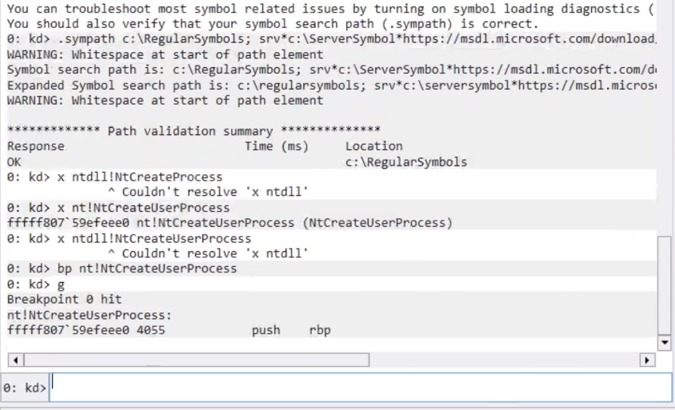

# Windows Internals

# Day 1: Setup & Essentials

## 1. Setting Up the Target Machine (Debug Mode)

To enable kernel debugging on the target Windows machine, use the Boot Configuration Data (BCD) editor.

**Enable Debug Mode:**

```cmd
bcdedit /debug on

```

**Configure Network Debugging:**
Set up the debug settings using the network transport. You need the Host IP address and a specific port (must be > 50000).

```cmd
bcdedit /dbgsettings net hostip:XX.XX.XX.XX port:55000

```

* **Copy Key:** After running this, copy the generated **Key**.
* **Verify Settings:**
```cmd
bcdedit /dbgsettings

```


* **Restart:** You must restart the target machine for changes to take effect.

## 2. Setting Up WinDbg (Host Machine)

1. Open **WinDbg**.
2. Select **File** > **Attach to Kernel**.
3. Select the **Net** tab.
4. **Paste Key:** Paste the key generated from the target machine.
5. **Port:** Enter the same port used in the `bcdedit` command.
6. Click **OK** (or Go).
7. Wait for the target machine to reboot and connect.

## 3. Symbol & Module Management

Proper symbol loading is critical. You cannot debug effectively without symbols.

**Set Symbol Path:**

* Go to **Settings** > **Debug Settings** > **Symbol Path**.
* Standard syntax: `srv*`
* *Tip: You can specify a local cache: srv*c:\symbols*https://msdl.microsoft.com/download/symbols*


**Essential Commands:**

* **Reload Symbols:**
```text
.reload /f

```


* Forces the debugger to immediately reload symbols.


* **List Modules:**
```text
lm

```


* Lists all loaded modules (drivers, kernel, DLLs).


```text
lm t n

```


* Lists modules with timestamp and name (helps verify if symbols are loaded; look for "pdb" extension).




## 4. Execution Control

* **Break:** Pause execution to input commands (press the "Break" icon or Ctrl+Break).
* **Go:**
```text
g

```


* Resumes execution of the target (Run the view).


## 5. Analysis & Inspection Commands

### Stack Analysis

* **Basic Stack:**
```text
k

```


* **Verbose Stack:**
```text
kv

```


* Dumps the stack with FPO (Frame Pointer Omission) information.


* **Stack with Parameters:**
```text
kp

```


* Displays the stack trace and attempts to show the parameters passed to each function (requires full symbols).


### Process & Thread Context

* **Inspect Current Thread:**
```text
!thread

```


* Shows the `ETHREAD` structure of the current thread.


* **List All Processes:**
```text
!process 0 0

```


* Lists all running processes (CID, Image Name, PEB).
* *Usage: `!process 0 0 explorer.exe` (Finds specifically explorer).*


* **Change Process Context:**
```text
.process /i <EPROCESS_Address>

```


* Switches the debugger's view to a specific process (useful for inspecting user-mode memory from kernel debugger).


### Code & Registers

* **Disassembly:**
```text
u <Address or API_Name>

```


* **Unassemble:** Shows the assembly instructions for a function.


```text
uf <Function_Name>

```


* **Unassemble Function:** Disassembles the *entire* function, not just the first few lines.


* **Registers:**
```text
r

```


* Displays the current state of CPU registers (RAX, RBX, RIP, etc.).


### Memory Inspection (Dumping Data)

* **Dump Bytes (Hex/ASCII):**
```text
db <Address>

```


* **Dump Double Word (32-bit):**
```text
dd <Address>

```


* **Dump Pointers (64-bit):**
```text
dp <Address>

```


* **Display Type (Structures):**
```text
dt nt!_EPROCESS

```


* Displays the layout of a kernel structure (e.g., the EPROCESS block). Extremely useful for Windows Internals study.


## 6. Quality of Life

* **Clear Screen:**
```text
.cls

```


* **Evaluate Expression:**
```text
? <Expression>

```


* Example: `? 0x10 + 0x20` (Does hex math).

# Day 2: Windows Architecture

## 1. High-Level Overview (Ring Model)

Windows uses a simplified protection ring model to isolate system components from user applications.

* **Ring 3 (User Mode):** Untrusted. Applications run here. They have restricted access to memory and cannot access hardware directly. If a program crashes here, only that program dies.
* **Ring 0 (Kernel Mode):** Trusted. The OS Kernel and drivers run here. They have access to all system memory and hardware instructions. If code crashes here, the entire system halts (**BSOD**) to protect data integrity.


## 2. User Mode Components

User mode is where your code and standard Windows processes live.

* **Environment Subsystems:** Expose the native OS services to users.
* *Win32 Subsystem (csrss.exe):* Handles GUI, windows, and console.


* **Subsystem DLLs:** The "face" of the OS APIs.
* `Kernel32.dll`, `User32.dll`, `Gdi32.dll`.
* These convert your function calls (e.g., `CreateFile`) into calls that `Ntdll.dll` can understand.


* **Ntdll.dll (The Bridge):**
* System-wide native library.
* Contains the transition code (Stub) to switch from User Mode to Kernel Mode using the `syscall` or `sysenter` instruction.


## 3. Kernel Mode Components

Everything here runs with high privilege.

* **The Executive (Ntoskrnl.exe):** The "brain" of the OS.
* **Object Manager:** Manages resources (files, ports, processes) as objects.
* **Memory Manager:** Handles virtual memory and paging.
* **Process Manager:** Creates and terminates processes/threads.
* **Security Reference Monitor (SRM):** Enforces access control (ACLs).


* **The Kernel (Microkernel):**
* Lower level than the Executive.
* Handles **Thread Scheduling** (dispatcher).
* Handles **Interrupts** and Exception dispatching.
* Performs multiprocessor synchronization.


* **Device Drivers:**
* Loadable kernel modules (e.g., `.sys` files) that translate OS commands into hardware signals.


* **HAL (Hardware Abstraction Layer):**
* `Hal.dll`
* Hides the differences between different motherboard/chipset architectures from the rest of the OS.


## 4. Practical Architecture Inspection (WinDbg)

Verify the architecture components on your live system.

**Check the Kernel & HAL:**

```text
lm m nt      ; List Module 'nt' (The Kernel Executive - ntoskrnl.exe)
lm m hal     ; List Module 'hal' (Hardware Abstraction Layer)

```

**Check the User/Kernel Bridge (Ntdll):**

```text
lm m ntdll   ; The native DLL loaded in every user process

```

**Compare User vs Kernel Structures:**

* **EPROCESS (Kernel View):** The kernel's massive structure for a process.
```text
dt nt!_EPROCESS

```


* **PEB (User View):** The "Process Environment Block" that lives in user mode (contains environment variables, loaded modules, etc.).
```text
!peb

```

