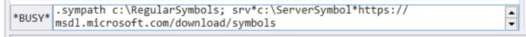
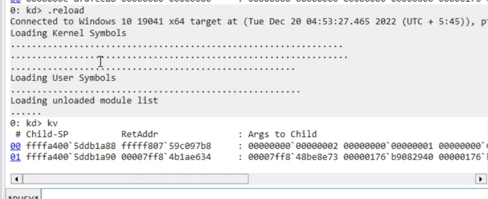
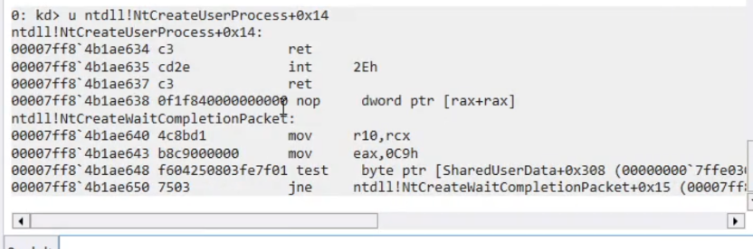
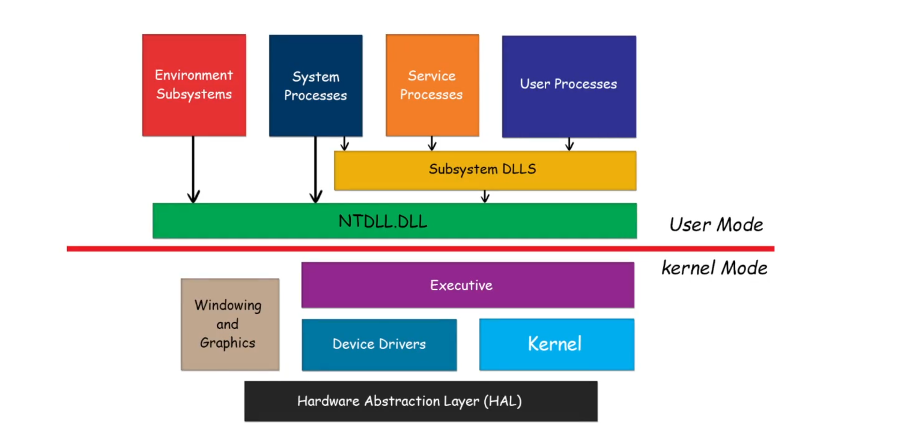

# Windows Internals

# Day 1: Setup & Essentials

## 1. Setting Up the Target Machine (Debug Mode)

To enable kernel debugging on the target Windows machine, use the Boot Configuration Data (BCD) editor.

**Enable Debug Mode:**

```cmd
bcdedit /debug on

```

**Configure Network Debugging:**
Set up the debug settings using the network transport. You need the Host IP address and a specific port (must be > 50000).

```cmd
bcdedit /dbgsettings net hostip:XX.XX.XX.XX port:55000

```

* **Copy Key:** After running this, copy the generated **Key**.
* **Verify Settings:**
```cmd
bcdedit /dbgsettings

```


* **Restart:** You must restart the target machine for changes to take effect.

## 2. Setting Up WinDbg (Host Machine)

1. Open **WinDbg**.
2. Select **File** > **Attach to Kernel**.
3. Select the **Net** tab.
4. **Paste Key:** Paste the key generated from the target machine.
5. **Port:** Enter the same port used in the `bcdedit` command.
6. Click **OK** (or Go).
7. Wait for the target machine to reboot and connect.

## 3. Symbol & Module Management

Proper symbol loading is critical. You cannot debug effectively without symbols.

**Set Symbol Path:**

* Go to **Settings** > **Debug Settings** > **Symbol Path**.
* Standard syntax: `srv*`
* *Tip: You can specify a local cache: srv*c:\symbols*https://msdl.microsoft.com/download/symbols*




**Essential Commands:**

* **Reload Symbols:**
```text
.reload /f

```


* Forces the debugger to immediately reload symbols.




* **List Modules:**
```text
lm

```


* Lists all loaded modules (drivers, kernel, DLLs).


```text
lm t n

```


* Lists modules with timestamp and name (helps verify if symbols are loaded; look for "pdb" extension).


## 4. Execution Control

* **Break:** Pause execution to input commands (press the "Break" icon or Ctrl+Break).
* **Go:**
```text
g

```


* Resumes execution of the target (Run the view).


## 5. Analysis & Inspection Commands

### Stack Analysis

* **Basic Stack:**
```text
k

```


* **Verbose Stack:**
```text
kv

```


* Dumps the stack with FPO (Frame Pointer Omission) information.


* **Stack with Parameters:**
```text
kp

```


* Displays the stack trace and attempts to show the parameters passed to each function (requires full symbols).


### Process & Thread Context

* **Inspect Current Thread:**
```text
!thread

```


* Shows the `ETHREAD` structure of the current thread.


* **List All Processes:**
```text
!process 0 0

```


* Lists all running processes (CID, Image Name, PEB).
* *Usage: `!process 0 0 explorer.exe` (Finds specifically explorer).*


* **Change Process Context:**
```text
.process /i <EPROCESS_Address>

```


* Switches the debugger's view to a specific process (useful for inspecting user-mode memory from kernel debugger).


### Code & Registers

* **Disassembly:**
```text
u <Address or API_Name>

```


* **Unassemble:** Shows the assembly instructions for a function.


```text
uf <Function_Name>

```


* **Unassemble Function:** Disassembles the *entire* function, not just the first few lines.




* **Registers:**
```text
r

```


* Displays the current state of CPU registers (RAX, RBX, RIP, etc.).


### Memory Inspection (Dumping Data)

* **Dump Bytes (Hex/ASCII):**
```text
db <Address>

```


* **Dump Double Word (32-bit):**
```text
dd <Address>

```


* **Dump Pointers (64-bit):**
```text
dp <Address>

```


* **Display Type (Structures):**
```text
dt nt!_EPROCESS

```


* Displays the layout of a kernel structure (e.g., the EPROCESS block). Extremely useful for Windows Internals study.


## 6. Quality of Life

* **Clear Screen:**
```text
.cls

```


* **Evaluate Expression:**
```text
? <Expression>

```


* Example: `? 0x10 + 0x20` (Does hex math).

# Day 2: Windows Architecture

## 1. High-Level Overview (Ring Model)

Windows uses a simplified protection ring model to isolate system components from user applications.

* **Ring 3 (User Mode):** Untrusted. Applications run here. They have restricted access to memory and cannot access hardware directly. If a program crashes here, only that program dies.
* **Ring 0 (Kernel Mode):** Trusted. The OS Kernel and drivers run here. They have access to all system memory and hardware instructions. If code crashes here, the entire system halts (**BSOD**) to protect data integrity.



## 2. User Mode Components

User mode is where your code and standard Windows processes live.

* **Environment Subsystems:** Expose the native OS services to users.
* *Win32 Subsystem (csrss.exe):* Handles GUI, windows, and console.


* **Subsystem DLLs:** The "face" of the OS APIs.
* `Kernel32.dll`, `User32.dll`, `Gdi32.dll`.
* These convert your function calls (e.g., `CreateFile`) into calls that `Ntdll.dll` can understand.


* **Ntdll.dll (The Bridge):**
* System-wide native library.
* Contains the transition code (Stub) to switch from User Mode to Kernel Mode using the `syscall` or `sysenter` instruction.


## 3. Kernel Mode Components

Everything here runs with high privilege.

* **The Executive (Ntoskrnl.exe):** The "brain" of the OS.
* **Object Manager:** Manages resources (files, ports, processes) as objects.
* **Memory Manager:** Handles virtual memory and paging.
* **Process Manager:** Creates and terminates processes/threads.
* **Security Reference Monitor (SRM):** Enforces access control (ACLs).


* **The Kernel (Microkernel):**
* Lower level than the Executive.
* Handles **Thread Scheduling** (dispatcher).
* Handles **Interrupts** and Exception dispatching.
* Performs multiprocessor synchronization.


* **Device Drivers:**
* Loadable kernel modules (e.g., `.sys` files) that translate OS commands into hardware signals.


* **HAL (Hardware Abstraction Layer):**
* `Hal.dll`
* Hides the differences between different motherboard/chipset architectures from the rest of the OS.


## 4. Practical Architecture Inspection (WinDbg)

Verify the architecture components on your live system.

**Check the Kernel & HAL:**

```text
lm m nt      ; List Module 'nt' (The Kernel Executive - ntoskrnl.exe)
lm m hal     ; List Module 'hal' (Hardware Abstraction Layer)

```

**Check the User/Kernel Bridge (Ntdll):**

```text
lm m ntdll   ; The native DLL loaded in every user process

```

**Compare User vs Kernel Structures:**

* **EPROCESS (Kernel View):** The kernel's massive structure for a process.
```text
dt nt!_EPROCESS

```


* **PEB (User View):** The "Process Environment Block" that lives in user mode (contains environment variables, loaded modules, etc.).
```text
!peb

```

# Day 3: Interrupts & Exceptions

## 1. Interrupts vs. Exceptions

While often grouped together, they are distinct:

* **Interrupts:** Asynchronous events generated by **hardware** (keyboard, mouse, network card, timer). They can happen at any time.
* **Exceptions:** Synchronous events generated by **software** execution (divide by zero, access violation, breakpoint). They happen specifically when a bad instruction executes.

## 2. IRQL (Interrupt Request Level)

The most important concept in kernel driver development and debugging. Do not confuse this with *Thread Priority*. IRQL determines hardware priority.

* **Rule:** A processor can only be interrupted by an IRQL *higher* than the one it is currently running.
* **The Levels (Simplified x64):**
* **Level 0 (PASSIVE_LEVEL):** User mode code and most kernel operations. Pageable memory is safe to access here.
* **Level 1 (APC_LEVEL):** Asynchronous Procedure Calls (special kernel callbacks).
* **Level 2 (DISPATCH_LEVEL):** Thread scheduler runs here. **Blocking is illegal here** (cannot wait for events/mutexes). Page faults are fatal here (BSOD).
* **Level 3+ (DIRQL):** Device Interrupt Request Levels. Hardware drivers running their ISR (Interrupt Service Routine).


*(Suggested Image Placeholder: Insert a diagram of the IRQL pyramid here)*

**Check IRQL in WinDbg:**

```text
!irql

```

* *Note: In a crash dump, this usually shows the IRQL at the time of the crash.*

## 3. The IDT (Interrupt Descriptor Table)

The CPU uses a table to know which function to run when an interrupt occurs. This is the **IDT**. It maps an interrupt "vector" (a number) to an ISR (function address).

**Inspect the IDT:**

```text
!idt

```

* Lists all ISRs registered on the system.
* *Usage:* `!idt -a` (Shows all entries, including empty ones).

**Common Vectors:**

* **0x3:** Breakpoint (`int 3`)
* **0xE:** Page Fault (Memory management)
* **0xD:** General Protection Fault

## 4. Trap Frames

When an interrupt/exception occurs, the CPU must save the state of the registers (RIP, RSP, RBP, etc.) before jumping to the handler. This saved block of data is called a **Trap Frame**.

**View Trap Frame:**
If you see a function like `KiTrap0E` (Page Fault) on the stack, you can inspect the registers *at the moment of the crash*.

1. **Find the Trap Frame address:**
Look at the stack (`kv`). If you see `KiPageFault`, the arg usually points to a trap frame, or use `.trap`.
2. **Set Context:**
```text
.trap <Address_of_Trap_Frame>

```


3. **View Registers:**
After running `.trap`, running `r` (registers) will show you the registers *restored from that frame*, not the current debugger registers.

## 5. DPCs (Deferred Procedure Calls)

Hardware ISRs (Interrupt Service Routines) must be extremely fast. They cannot spend time processing data.

* **Problem:** A network card interrupts. You can't process the whole packet at DIRQL (High Level) because you block everything else (mouse, keyboard).
* **Solution:** The ISR does the minimum work (ack hardware), then queues a **DPC** to finish the work later at `DISPATCH_LEVEL`.

**Inspect DPCs:**

```text
!dpcs

```

# Day 4: Exception Dispatching

## 1. What is an Exception?

Unlike an Interrupt (hardware/asynchronous), an **Exception** is a synchronous event generated by the CPU executing an instruction.

* **Examples:** Access Violation (`0xC0000005`), Divide by Zero, Breakpoint (`int 3`), Stack Overflow.

## 2. The Exception Dispatching Flow

When an exception occurs, Windows tries to find someone to handle it before killing the process.

1. **Hardware Trap:** CPU hits error  looks up IDT  jumps to Kernel Trap Handler (e.g., `KiTrap0E`).
2. **Trap Handler:** Creates a **Trap Frame** and calls `KiDispatchException`.
3. **Debugger Notification (First Chance):** Windows checks: *Is a debugger attached?*
* **Yes:** Send the exception to the debugger. (This is "First Chance"). The debugger can say "I handled it" or "Not me, pass it on."
* **No:** Move to step 4.


4. **Frame-Based Handlers (SEH):** Windows walks the stack looking for `__try / __except` blocks in the code.
5. **Debugger Notification (Second Chance):** If NO handler is found in the code, Windows asks the debugger *again*.
* **This is the "Crash".** The application is about to die.


6. **Termination:** If no debugger is present, Windows Error Reporting (WER) kicks in (App kills itself).

## 3. First Chance vs. Second Chance

This is the most misunderstood concept in debugging.

* **First Chance:** "Information only." The application has **not** crashed yet. The OS is letting the debugger know "Hey, this just happened, do you want to stop here?"
* *Example:* A program might intentionally cause an Access Violation to check if memory is readable, then catch it. You usually ignore these unless you are hunting a specific bug.


* **Second Chance:** "Fatal." The application tried to handle it (or didn't have code to handle it) and failed. Execution cannot proceed.

## 4. Key Data Structures

When debugging crashes, you deal with two main structures.

### Exception Record (.exr)

Describes *what* happened.

* **Exception Code:** The error ID (e.g., `0xC0000005`).
* **Exception Address:** Where the instruction failed.
* **NumberParameters:** Extra details (e.g., for Access Violation: *Write* vs *Read*, and *Target Address*).

### Context Record (.cxr)

Describes the *CPU State* at the moment of the crash.

* Contains all registers (RIP, RSP, RAX, etc.) exactly as they were when the error triggered.

## 5. WinDbg Analysis Commands

Once the debugger breaks on an exception:

### 1. Automatic Analysis

```text
!analyze -v

```

* The "Magic Button." It gathers the exception record, context, and stack trace to give you a summary of the crash (Bucket ID, probable cause).

### 2. Manual Inspection

* **View Exception Record:**
```text
.exr -1

```


* Displays the most recent exception record.


* **View Context Record:**
```text
.cxr -1

```


* **Critical:** This switches the debugger's context to the crash moment. Running `k` (stack) or `r` (registers) *after* this command shows the crash state, not the current state.
* *To reset context back to normal: `.cxr` (no arguments).*


### 3. Configuring Event Handling (sx)

You can tell WinDbg when to break.

* **List Settings:**
```text
sx

```


* **Break on First Chance (Enabled):**
```text
sxe <Event_Code>

```


* Example: `sxe ld` (Break immediately when a module **L**oa**D**s).
* Example: `sxe av` (Break immediately on **A**ccess **V**iolation).


* **Ignore First Chance (Disabled):**
```text
sxd <Event_Code>

```


* Let the app try to handle it first; only break if it crashes (Second Chance).


## 6. Common Exception Codes

* **0x80000003:** Breakpoint (Hardcoded `int 3` in code).
* **0xC0000005:** Access Violation (The most common crash).
* *Tip:* Check the parameters. Parameter 0: 0=Read, 1=Write. Parameter 1: The address being accessed.


* **0xC00000FD:** Stack Overflow.


# Windows Internals - Day 5: Object Manager & Handles

## 1. What is a Handle?

In User Mode, applications cannot access kernel data structures directly. Instead, Windows uses an indirect reference called a **Handle**.

* **User Mode View:** An opaque integer (e.g., `0x80`, `0x44`). It is essentially an index into a table.
* **Kernel Mode View:** A pointer to an entry in the process's **Handle Table**, which ultimately points to the real object in kernel memory.

## 2. The Object Manager

The **Object Manager (Ob)** is the kernel subsystem responsible for creating, deleting, and managing these resources. It provides a uniform way to manage diverse resources (Files, Mutexes, Semaphores, Processes).

### Key Responsibilities:

* **Naming:** Manages the global namespace (like a file system, visible in WinObj).
* **Security:** Checks ACLs (Access Control Lists) when a handle is opened.
* **Reference Counting:** Keeps the object alive as long as someone is using it.
* **Quotas:** Limits how much memory a user can consume.

## 3. The Object Structure

Every object in the kernel (e.g., an `EPROCESS` or `FILE_OBJECT`) has two parts:

1. **Object Header:**
* Metadata *managed by the Object Manager*.
* Contains: Name, Reference Count, Type, Security Descriptor.
* Located at a *negative offset* from the Object Body.


2. **Object Body:**
* The actual data used by the component (e.g., the `EPROCESS` structure itself).
* This is what the "Object Pointer" usually points to.


## 4. WinDbg Commands for Handles

### Inspecting Process Handles

To see what handles a specific process has open (useful for malware analysis or finding locked files):

1. **Switch to Process Context:**
```text
!process 0 0 explorer.exe
.process /i <EPROCESS_Address>
g

```


2. **Dump Handles:**
```text
!handle

```


* Lists all handles in the current process with basic info.


3. **Detailed Handle Dump:**
```text
!handle <Handle_Value> ff

```


* `ff` = Full Flag. Shows the object type, name, and access mask.
* *Example:* `!handle 0x1c ff`


### Inspecting Objects

If you have the address of an object (from the `!handle` output):

* **Dump Object Header Info:**
```text
!object <Object_Address>

```


* Shows the Name, Path, and Type of the object.


* **Inspect Object Header Structure:**
```text
dt nt!_OBJECT_HEADER <Object_Address> - 0x30

```


* *Note:* You must subtract the size of the header (usually `0x30` on x64, but varies) to see the start of the header. WinDbg's `!object` does this automatically, but `dt` requires the exact address.


## 5. Reference Counting (Life & Death)

Windows uses two counters to decide when to delete an object:

1. **Pointer Count:** How many kernel components have a pointer to this object.
2. **Handle Count:** How many user-mode applications have an open handle to this object.

**Rule:** The object is deleted only when **both** counts reach zero.

## 6. Practical Exercise: Finding a "Mutant" (Mutex)

1. Run `!process 0 0` to find a target process.
2. `.process /i <EPROCESS>` and `g`.
3. `!handle 0 0 Mutant` -> Lists only handles of type "Mutant".
4. Pick a handle value (e.g., `0x24`) and run `!handle 0x24 ff`.
5. Copy the **Object** address.
6. Run `!mutant <Object_Address>` to see the specific details of that synchronization object.


# Day 6: Object Structure & Namespace

## 1. The Anatomy of an Object

Every kernel object (Process, Thread, File, Mutex) consists of two distinct parts in memory: the **Header** (managed by the Object Manager) and the **Body** (used by the kernel component).

### A. The Object Header (`_OBJECT_HEADER`)

Located at a **negative offset** from the Object Body. It stores metadata that is common to *all* objects, regardless of type.

* **PointerCount:** Number of kernel references.
* **HandleCount:** Number of open user handles.
* **TypeIndex:** Identifies what kind of object this is (Process, File, etc.).
* **SecurityDescriptor:** Who can touch this object (ACLs).
* **Flags:** e.g., `OBJ_KERNEL_HANDLE`.

**Inspect the Header in WinDbg:**

```text
dt nt!_OBJECT_HEADER

```

### B. The Object Body

This is what the "Object Pointer" actually points to. Its structure depends on the object type.

* **Example:** For a process, the body is the `_EPROCESS` structure.
* **Example:** For a thread, the body is the `_ETHREAD` structure.

## 2. Object Types

Windows defines specific "Types" (classes) for objects.

### Dispatcher vs. Control Objects

* **Dispatcher Objects (Waitable):**
* These objects have a **Signal State** (Signaled vs. Nonsignaled).
* Threads can *wait* on them (synchronization).
* *Examples:* `Mutex` (Mutant), `Semaphore`, `Event`, `Timer`, `Thread`, `Process`.


* **Control Objects (Non-Waitable):**
* Used to control OS functions, but you cannot "wait" on them.
* *Examples:* `Driver`, `Device`, `SymbolicLink`, `Profile`.


## 3. The Object Namespace (Directory)

The Object Manager maintains a hierarchical namespace, similar to a file system, but it lives entirely in memory.

* **Root (`\`):** The top of the tree.
* **`\Device`:** Contains device objects created by drivers (e.g., `\Device\HarddiskVolume1`).
* **`\Global??` (or `\DosDevices`):** Contains symbolic links visible to user mode (e.g., `C:` maps to `\Device\HarddiskVolume1`).
* **`\KnownDlls`:** Optimizes DLL loading.

## 4. WinDbg Commands: Exploring the Namespace

You can browse the object directory tree directly from the debugger.

### Browsing Directories

* **List Root Directory:**
```text
!object \

```


* Shows the top-level folders (`Device`, `KernelObjects`, `GLOBAL??`).


* **List Specific Directory:**
```text
!object \Device

```


* Lists all devices (drivers often put their "files" here).


### Investigating "DosDevices" (Symbolic Links)

* **Check where C: points:**
```text
!object \Global??

```


* Look for `C:` in the output. It will be a `SymbolicLink`.


* **Resolve the Link:**
```text
!object \Global??\C:

```


* Output will show the "Target String" (e.g., `\Device\HarddiskVolume2`).


## 5. Kernel Structures (Deep Dive)

### The Type Object (`_OBJECT_TYPE`)

Every object points to a "Type Object" that defines how that object behaves (e.g., "This is a Process type").

**Inspect a Type:**

```text
dt nt!_OBJECT_TYPE

```

**List All Types:**

```text
!object \ObjectTypes

```

* This lists every valid object type in the OS (Token, Job, DebugObject, IoCompletion, etc.).

## 6. Practical Exercise: Manual Header Inspection

To truly understand the memory layout, let's manually find an object header.

1. **Get an Object Address:**
* Use `!process 0 0` to get an `EPROCESS` address (e.g., `ffffaa014050`).


2. **Calculate Header Address:**
* The header is *before* the body. On x64, the `InfoMask` is usually at offset `-0x30`.


3. **Overlay the Structure:**
```text
dt nt!_OBJECT_HEADER (ffffaa014050 - 0x30)

```


* *Note: Replaced with your actual address.*
* Check the `TypeIndex` and `PointerCount`.


# Day 6: Advanced Handles (The Handle Table)

## 1. The Handle Table Structure

Every process has a private table that maps its handle integers (e.g., `0x4`) to Kernel Object Pointers.

* **The Structure:** `_HANDLE_TABLE`
* **Location:** Pointed to by `_EPROCESS.ObjectTable`.

The table is hierarchical (1, 2, or 3 levels deep) depending on how many handles the process has open. This is similar to how memory paging works.

### The Handle Table Entry (`_HANDLE_TABLE_ENTRY`)

This is the critical data structure that actually holds the pointer.

* **Object:** A pointer to the Object Header (masked).
* **GrantedAccess:** The permissions this handle has (e.g., Read, Write, Terminate).

**Decoding the Pointer (x64):**
The `Object` field in the entry isn't a raw pointer. The bottom bits are used for locking/attributes. You must mask the bottom 4 bits (usually `& 0xFFFFFFFFFFFFFFF0`) to get the real address.

## 2. The Special Table: PspCidTable

While most handles are private to a process, Process IDs (PIDs) and Thread IDs (TIDs) are actually just handles in a **global** handle table called the `PspCidTable`.

* **Concept:** When you say "PID 1234", the kernel treats `1234` as a handle index into the `PspCidTable` to find the `EPROCESS`.
* **Implication:** This is why PIDs are always multiples of 4! They are byte offsets into a table.

**Inspect PspCidTable in WinDbg:**

```text
!handle 0 3 <PID> 

```

Or manually:

```text
dt nt!_HANDLE_TABLE nt!PspCidTable

```

## 3. Handle Inheritance & Security

When a process creates a child (e.g., `cmd.exe` spawns `whoami.exe`), handles can be **Inherited**.

* **bInheritHandle:** A flag in the `_HANDLE_TABLE_ENTRY`.
* **Use Case:** This is how "Pipes" work. The parent creates a pipe, holds one end, and passes the other end to the child via inheritance.
* **Security Risk:** If a high-privilege process carelessly inherits handles to a low-privilege child, the child might gain access to sensitive resources.

## 4. Advanced Debugging Commands

### !htrace (Handle Trace)

The best tool for finding **Handle Leaks** (when a program forgets to close handles). It records the stack trace every time a handle is opened or closed.

1. **Enable Tracing:**
```text
!htrace -enable

```


2. **Run the target:** Let the process run for a while (`g`).
3. **Snapshot:**
```text
!htrace -diff

```


* Shows all handles opened *since you enabled trace* that haven't been closed yet, along with the stack trace of *who* opened them.


### Manual Table Inspection

If `!handle` is failing, you can walk the table manually.

1. **Get the Table Address:**
```text
dt nt!_EPROCESS <Address> ObjectTable

```


2. **Dump the Table:**
```text
dt nt!_HANDLE_TABLE <Table_Address>

```


3. **View Entries (using command):**
```text
!handle <Handle_Value> 0 <Process_Address>

```


## 5. Practical Application: "Unlocking" a File

If malware or a system process has a file locked and you can't delete it:

1. Find the process holding the handle.
2. Break into the debugger.
3. Find the handle value (e.g., `0x44`).
4. **Force Close (DANGEROUS):**
```text
!handle 0x44 f 0 <Process_Address>

```


* *Note:* While you can close handles from the debugger, doing so can crash the application if it tries to use that handle later.


# Day 7: Process Internals

## 1. What is a Process?

In Windows, a "Process" does not execute code. It is a static container that provides the resources required for threads to run.

**A Process consists of:**

* **Private Virtual Address Space:** The memory layout (Code, Data, Heap).
* **Handle Table:** Pointers to system resources (Files, Events).
* **Access Token:** Security context (User, Groups, Privileges).
* **At least one Thread:** The actual entity that the CPU schedules.

*If a process loses all its threads, the process object remains, but it is "useless" and usually cleaned up by the OS.*

## 2. Key Data Structures

Understanding where process data lives is vital for rootkits and forensic analysis.

### A. EPROCESS (Executive Process Block)

* **Location:** Kernel Mode (Non-paged pool).
* **Role:** The "God Structure" for a process. It tracks everything the kernel needs to know.
* **Key Fields:**
* `Pcb` (KPROCESS): Low-level scheduling data (Page directory base - CR3).
* `UniqueProcessId`: The PID.
* `ActiveProcessLinks`: A doubly linked list connecting *all* processes (This is how Task Manager lists processes).
* `Token`: The security token (Refers to `_EX_FAST_REF`).
* `Peb`: Pointer to the User Mode PEB.


### B. PEB (Process Environment Block)

* **Location:** User Mode.
* **Role:** Data the application needs to function without calling the kernel constantly.
* **Key Fields:**
* `ImageBaseAddress`: Where the .exe is loaded in memory.
* `Ldr`: List of loaded modules (DLLs). *Malware often modifies this to hide injected DLLs.*
* `ProcessParameters`: Command line arguments, Environment variables.


## 3. WinDbg Commands: Process Analysis

### Basic Listing

* **List All Processes:**
```text
!process 0 0

```


* Format: `!process <Flags> <ImageName>`
* `0 0` means "Minimal info" for "All processes".


* **Detailed View of Current Process:**
```text
!process -1 1

```


* `-1` refers to the "Current Process" context.
* `1` adds details like Token, File Object, and Threads.


### Structure Inspection

To see the actual memory layout of the current process:

1. **Get EPROCESS Address:**
Run `!process 0 0 calc.exe` and copy the `PROCESS` address (e.g., `ffff9d014050`).
2. **Dump EPROCESS:**
```text
dt nt!_EPROCESS ffff9d014050

```


* *Pro Tip:* Filter for specific fields: `dt nt!_EPROCESS ffff9d014050 Token ActiveProcessLinks ImageFileName`


### Inspecting the PEB (User Mode)

Since the PEB is in user mode, you must switch contexts first.

1. **Switch Context:**
```text
.process /i ffff9d014050
g

```


2. **Dump PEB:**
```text
!peb

```


* Shows the command line, current working directory, and environment variables.
* *Manual method:* `dt nt!_PEB <Address>`


## 4. The "ActiveProcessLinks" & DKOM Attacks

The kernel tracks processes using a generic circular doubly linked list called `ActiveProcessLinks` inside the `EPROCESS` structure.

* **Normal Behavior:** Tools like Task Manager walk this list to show you running programs.
* **DKOM (Direct Kernel Object Manipulation):** A rootkit technique where an attacker unlinks a malicious process from this list (modifies `Flink` and `Blink`).
* **Result:** The process continues to run (the scheduler uses a different list called threads), but it becomes **invisible** to Task Manager and `!process 0 0`.


**Detecting Hidden Processes:**
Since `!process 0 0` relies on this list, it might be fooled.

* **Alternative:** Scan the `PspCidTable` (Handle Table) or thread lists (`!ready`, `!running`), as threads must still be scheduled.

## 5. Process Lifecycle (Simplified)

When you double-click an EXE (`CreateProcess`):

1. **Map Image:** The kernel opens the `.exe` file and creates a "Section" object (memory mapping).
2. **Create Structures:** `EPROCESS` and `KPROCESS` are allocated.
3. **Create Initial Thread:** The main thread is created (but suspended).
4. **Notify Subsystem:** The Windows Subsystem (Csrss.exe) is told about the new process.
5. **Start Execution:** The thread is resumed, and execution begins at the Image Entry Point.


# Day 7: Process Internals

## 1. What is a Process?

In Windows, a "Process" does not execute code. It is a static container that provides the resources required for threads to run.

**A Process consists of:**

* **Private Virtual Address Space:** The memory layout (Code, Data, Heap).
* **Handle Table:** Pointers to system resources (Files, Events).
* **Access Token:** Security context (User, Groups, Privileges).
* **At least one Thread:** The actual entity that the CPU schedules.

*Note: If a process loses all its threads, the process object remains (as a "zombie"), but it does nothing and is usually cleaned up by the OS.*

## 2. Key Data Structures

Understanding where process data lives is vital for rootkits and forensic analysis.

### A. EPROCESS (Executive Process Block)

* **Location:** Kernel Mode (Non-paged pool).
* **Role:** The "God Structure" for a process. It tracks everything the kernel needs to know.
* **Key Fields:**
* `Pcb` (KPROCESS): Low-level scheduling data (Directory Table Base / CR3).
* `UniqueProcessId`: The PID.
* `ActiveProcessLinks`: A doubly linked list connecting *all* processes (This is how Task Manager lists processes).
* `Token`: The security token (Refers to `_EX_FAST_REF`).
* `Peb`: Pointer to the User Mode PEB.


### B. PEB (Process Environment Block)

* **Location:** User Mode.
* **Role:** Data the application needs to function without calling the kernel constantly.
* **Key Fields:**
* `ImageBaseAddress`: Where the .exe is loaded in memory.
* `Ldr`: List of loaded modules (DLLs). *Malware often modifies this to hide injected DLLs.*
* `ProcessParameters`: Command line arguments, Environment variables.


## 3. WinDbg Commands: Process Analysis

### Basic Listing

* **List All Processes:**
```text
!process 0 0

```


* Format: `!process <Flags> <ImageName>`
* `0 0` means "Minimal info" for "All processes".


* **Detailed View of Current Process:**
```text
!process -1 1

```


* `-1` refers to the "Current Process" context.
* `1` adds details like Token, File Object, and Threads.


### Structure Inspection

To see the actual memory layout of the current process:

1. **Get EPROCESS Address:**
Run `!process 0 0 calc.exe` and copy the `PROCESS` address (e.g., `ffff9d014050`).
2. **Dump EPROCESS:**
```text
dt nt!_EPROCESS ffff9d014050

```


* *Pro Tip:* Filter for specific fields to save screen space:


```text
dt nt!_EPROCESS ffff9d014050 Token ActiveProcessLinks ImageFileName

```


### Inspecting the PEB (User Mode)

Since the PEB is in user mode, you must switch contexts first.

1. **Switch Context:**
```text
.process /i ffff9d014050
g

```


*(You might need to reload user symbols: `.reload /user`)*
2. **Dump PEB:**
```text
!peb

```


* Shows the command line, current working directory, and environment variables.
* *Manual method:* `dt nt!_PEB <Address>`


## 4. The "ActiveProcessLinks" & DKOM Attacks

The kernel tracks processes using a generic circular doubly linked list called `ActiveProcessLinks` inside the `EPROCESS` structure.

* **Normal Behavior:** Tools like Task Manager walk this list to show you running programs.
* **DKOM (Direct Kernel Object Manipulation):** A rootkit technique where an attacker unlinks a malicious process from this list (modifies `Flink` and `Blink`).
* **Result:** The process continues to run (the scheduler uses a different list called threads), but it becomes **invisible** to Task Manager and `!process 0 0`.


**Detecting Hidden Processes:**
Since `!process 0 0` relies on this list, it might be fooled.

* **Alternative:** Scan the `PspCidTable` (Handle Table) or thread lists (`!ready`, `!running`), as threads must still be scheduled.

## 5. Process Lifecycle (Simplified)

When you double-click an EXE (`CreateProcess`):

1. **Map Image:** The kernel opens the `.exe` file and creates a "Section" object (memory mapping).
2. **Create Structures:** `EPROCESS` and `KPROCESS` are allocated.
3. **Create Initial Thread:** The main thread is created (but suspended).
4. **Notify Subsystem:** The Windows Subsystem (Csrss.exe) is told about the new process.
5. **Start Execution:** The thread is resumed, and execution begins at the Image Entry Point.


# Day 8: Threads & Scheduling

## 1. What is a Thread?

A **Thread** is the entity that the Windows Kernel actually schedules for execution on the CPU.

* **Process:** The "House" (Owns memory, handles, token).
* **Thread:** The "Occupant" (Executes code, has a stack, registers, and priority).

**Every thread has:**

* **Context:** The state of CPU registers (RIP, RSP, etc.).
* **Stack:** Two stacks, actually (one for User Mode, one for Kernel Mode).
* **TLS:** Thread Local Storage (private data area).
* **Priority:** Determines when it runs relative to others.

## 2. Key Data Structures

Just like processes have `EPROCESS` (Kernel) and `PEB` (User), threads have a parallel structure.

### A. ETHREAD (Executive Thread Block)

* **Location:** Kernel Mode (Non-paged pool).
* **Role:** The main kernel object representing a thread.
* **Key Fields:**
* `Tcb` (`KTHREAD`): The Kernel Thread Block. Contains the low-level scheduling data (stacks, priority, quantum).
* `Cid`: The Client ID (Unique Process ID + Unique Thread ID).
* `StartAddress`: Where execution began.
* `Win32StartAddress`: The function passed to `CreateThread`.


### B. TEB (Thread Environment Block)

* **Location:** User Mode.
* **Role:** Stores data that user-mode code accesses frequently without transitioning to the kernel (speed optimization).
* **Key Fields:**
* `ExceptionList`: The head of the SEH (Structured Exception Handling) chain.
* `StackBase` / `StackLimit`: The boundaries of the user stack.
* `LastErrorValue`: Where `GetLastError()` reads from.
* `TlsSlots`: Thread Local Storage array.


## 3. Thread States

A thread is always in one of several states. The scheduler moves threads between these states.

1. **Running:** Currently executing on a logical processor.
2. **Ready:** Wants to run, but is waiting for a CPU to become free (or a higher priority thread is blocking it).
3. **Waiting:** Sleeping or waiting for an object (File I/O, Mutex, Event).
4. **Standby:** Selected to run next on a specific processor.
5. **Terminated:** Finished execution, waiting for cleanup.

## 4. Scheduling & Priorities

Windows uses a **preemptive, priority-driven** scheduler.

* **Priority Levels (0-31):**
* **0:** Zero Page Thread (Idle).
* **1-15:** Variable (Dynamic). Most user apps run at 8. Windows can boost this temporarily (e.g., when you focus a window).
* **16-31:** Real-time (Static). High priority (Audio drivers, critical system tasks).


* **Quantum:** The amount of time a thread is allowed to run before the OS checks if another thread needs the CPU. (Client Windows ≈ 2 quantums; Server Windows ≈ 12 quantums).

## 5. WinDbg Commands: Thread Analysis

### Analyzing the Current Thread

* **Basic Info:**
```text
!thread

```


* Shows the current thread's `ETHREAD` address, State, Priority, and Stack Trace.


* **Dump Structure:**
```text
dt nt!_ETHREAD <Address>

```


### Analyzing User Mode Info (TEB)

* **Dump TEB:**
```text
!teb

```


* Shows the stack limits and Last Error status.
* *Tip:* If you see a weird error in an app, check `!teb` to see the "LastErrorValue".


### Inspecting Scheduling

* **List Ready Threads:**
```text
!ready

```


* Shows threads that *want* to run but are waiting for a CPU. If this list is long, the system is CPU-starved.


* **List Running Threads:**
```text
!running

```


* Shows what is currently executing on all cores.


### Context Switching

To debug a specific thread, you must switch the debugger's focus to it.

1. **List Threads in Process:**
```text
!process <EPROCESS_Addr> 2

```


2. **Switch to Thread:**
```text
.thread <ETHREAD_Address>

```


3. **Set Context:**
```text
.cxr

```


* Ensures your register view (`r`) matches that thread's saved state.


## 6. Practical Exercise: "Frozen" Application

If an application is unresponsive (Frozen):

1. Attach WinDbg.
2. `!process 0 0 myapp.exe` (Find the process).
3. `.process /i <EPROCESS>` then `g` (Switch context).
4. `!process` (List threads).
5. Look for the main thread (usually the oldest one).
6. `!thread <ETHREAD>`.
7. Check the **Wait Reason**. Is it `UserRequest` (Waiting for input)? Is it waiting on a `Mutant` (Deadlock)?


# Day 9: Asynchronous Procedure Calls (APC)

## 1. What is an APC?

An **APC** is a mechanism for the kernel to execute a function within the context of a **specific thread**.

* **Analogy:** If an Interrupt is a "message to the CPU" (Hardware), an APC is a "message to a Thread" (Software).
* **The Concept:** The OS says, "Hey Thread A, stop what you are doing and run this function right now (or as soon as possible)."

## 2. The Three Types of APCs

Not all APCs are created equal. They differ by *who* creates them and *when* they run.

### A. Special Kernel APC

* **Privilege:** Highest.
* **When it runs:** Immediately (as long as IRQL < APC_LEVEL).
* **Usage:** Used by the kernel to report I/O completion (copying data from hardware buffer to thread buffer) or to suspend/terminate a thread.
* **Blocking:** A thread *cannot* block these. They run whether the thread likes it or not.

### B. Normal Kernel APC

* **Privilege:** Medium.
* **When it runs:** Immediately (at PASSIVE_LEVEL), but only if special kernel APCs are finished and the thread isn't in a "Critical Region."
* **Usage:** Filesystem housekeeping.

### C. User Mode APC

* **Privilege:** Lowest.
* **When it runs:** **ONLY** when the thread is in an **"Alertable Wait"** state.
* **The Catch:** If a thread is busy calculating Pi, a User APC will sit in the queue forever. The thread must explicitly say, "I have nothing to do, I'm checking my APC queue now" (e.g., calling `SleepEx(..., bAlertable=TRUE)`).
* **Usage:** Native Windows APIs (Read/WriteFileEx), and **Malware Injection**.

## 3. The APC Queue & Data Structures

Every thread (`KTHREAD`) has an APC environment.

* **Location:** `_KTHREAD.ApcState`.
* **The Queues:** The thread maintains two linked lists of pending APCs:
1. **Kernel Queue:** (Contains Special and Normal Kernel APCs).
2. **User Queue:** (Contains User APCs).


### The KAPC Structure

The APC itself is a kernel object.

```text
dt nt!_KAPC

```

* `Thread`: The target thread.
* `KernelRoutine`: Function to run in Kernel Mode (always runs first).
* `NormalRoutine`: Function to run in User Mode (if applicable).
* `ApcMode`: KernelMode (0) or UserMode (1).

## 4. APC_LEVEL (IRQL 1)

As discussed on **Day 3**, APCs run at `IRQL 1` (`APC_LEVEL`).

* When a thread is running at `PASSIVE_LEVEL` (0) and an APC arrives, the kernel raises the IRQL to `APC_LEVEL` (1) to execute the APC.
* This prevents the thread from being swapped out or interrupted by other low-priority tasks while handling the APC.

## 5. Security Context: APC Injection

This is a favorite technique for Red Teamers.

1. **Attacker:** Allocates memory in a victim process (`VirtualAllocEx`).
2. **Attacker:** Writes shellcode to that memory (`WriteProcessMemory`).
3. **Attacker:** Creates a thread (or hijacks an existing one) in the victim process.
4. **Attacker:** Queues a **User APC** to that thread pointing to the shellcode (`QueueUserAPC`).
5. **Trigger:** When that victim thread enters an "Alertable State" (or if the attacker forces it), the shellcode executes.
* *Early Bird Injection:* Queues an APC to the main thread of a suspended process before it ever starts running.


## 6. WinDbg Commands

### Inspecting Pending APCs

To see if a thread has APCs waiting to fire (e.g., if a process is "stuck" trying to terminate):

1. **Get the Thread Address:**
```text
!thread

```


2. **Check the APC State:**
```text
dt nt!_KTHREAD <Address> ApcState

```


* Look at `UserApcPending` (1 or 0).


3. **List APCs in the System:**
```text
!apc

```


* **Note:** This command dumps the contents of *all* APC queues. It can be noisy.
* *Usage:* `!apc` while in the context of the specific process helps narrow it down.


# Day 10: The Portable Executable (PE) Format

## 1. What is the PE Format?

The PE format is a data structure that tells the Windows OS Loader exactly how to map a file from disk into memory (Virtual Address Space).

* **Key Concept:** A file on disk looks different than it does in memory. The PE header explains how to "stretch" the compressed file on disk into the aligned layout required in memory.

## 2. High-Level Structure

A PE file is essentially a sequence of headers followed by data sections.

1. **DOS Header:** Legacy header for backward compatibility.
2. **PE Header (NT Headers):** The "Real" header containing critical OS instructions.
3. **Section Headers:** The "Table of Contents" for the code and data.
4. **Sections:** The actual content (`.text`, `.data`, `.rsrc`).

## 3. The Headers (Deep Dive)

### A. DOS Header (`IMAGE_DOS_HEADER`)

Every PE file starts with this to prevent MS-DOS from crashing if it tries to run the file.

* **Magic Number (`e_magic`):** Always **`MZ`** (0x5A4D) (Mark Zbikowski).
* **Address of New Exe Header (`e_lfanew`):** The last field. It contains the offset (address) of the actual PE Header. *The OS Loader skips everything else and jumps here.*

### B. NT Headers (`IMAGE_NT_HEADERS`)

This structure is where the action is. It contains the **File Header** and the **Optional Header**.

* **Signature:** Always **`PE\0\0`** (0x00004550).

#### **File Header:**

* **Machine:** Architecture (x86 vs x64).
* **NumberOfSections:** How many sections (text, data, etc.) follow.
* **TimeDateStamp:** When the file was compiled. *Useful for identifying Delphi malware (often fake dates) or finding the original compile time.*
* **Characteristics:** Is it a DLL? Is it an EXE? Is it a System file?

#### **Optional Header (The Most Important Part):**

Despite the name, it is **mandatory**.

* **Magic:** `0x10B` (PE32 / 32-bit) or `0x20B` (PE32+ / 64-bit).
* **AddressOfEntryPoint (OEP):** The RVA (Relative Virtual Address) where execution begins. *Malware often modifies this to point to their packer code.*
* **ImageBase:** The preferred virtual memory address to load the file (usually `0x00400000` for EXEs).
* **SectionAlignment:** How sections are aligned in memory (usually 4KB / Page size).
* **FileAlignment:** How sections are aligned on disk (usually 512 bytes).

## 4. Data Directories

Located at the end of the Optional Header. This is an array of 16 entries pointing to critical tables.

* **Export Table:** Functions this DLL offers to others.
* **Import Table (IAT):** Functions this file needs from other DLLs (e.g., `kernel32!CreateFile`). *Inspecting Imports is the first step in malware triage.*
* **Resource Table:** Icons, manifests, embedded binaries.
* **Relocation Table (.reloc):** Instructions on how to update addresses if the file isn't loaded at its preferred `ImageBase`.

## 5. Sections

The actual code and data are divided into "Sections".

### Common Section Names:

* **`.text`**: Executable Code (The CPU instructions).
* *Permissions:* Execute, Read.


* **`.data`**: Global/Static variables (Initialized).
* *Permissions:* Read, Write.


* **`.rdata`**: Read-only data (Strings, Import tables).
* *Permissions:* Read.


* **`.bss`**: Uninitialized data (Variables that are zeroed out).
* **`.pdata`**: Exception handling table (Used heavily in x64).

**Malware Tip:** If you see weird section names (e.g., `.upx0`, `.bxy7`) or a `.text` section that is "Writeable", it is highly suspicious (likely packed or self-modifying code).

## 6. WinDbg Commands: Inspecting Headers

WinDbg has a powerful built-in command to parse PE headers in memory.

### Display Headers (!dh)

* **Basic Header Info:**
```text
!dh <Image_Base_Address>

```


* *How to get Address:* Use `lm` (List Modules) to find the start address of `calc` or `ntdll`.


* **Detailed Header Info (Flags):**
```text
!dh -f <Image_Base_Address>

```


* Shows the File Header and Optional Header fields (Entry Point, Image Base, Subsystem).


* **Show Sections:**
```text
!dh -s <Image_Base_Address>

```


* Lists all section headers (Name, Virtual Size, Virtual Address).
* *Critical Check:* Compare `VirtualSize` vs `SizeOfRawData`. If `VirtualSize` is huge but `RawData` is small, it's likely a **Packed Executable** (expands in memory).


### Parsing the DOS Header (Manual)

Since the module starts at the base address:

```text
db <Image_Base_Address>

```

* You should see `4d 5a` ("MZ") in the ASCII dump.


# Day 11: System Calls (Syscalls)

## 1. The Concept: Crossing the Boundary

User applications cannot directly touch hardware or kernel memory. They must ask the OS to do it for them.

* **The Problem:** CPU mode switches (Ring 3  Ring 0) are expensive and dangerous.
* **The Solution:** A strictly controlled "gate" called the System Call.

## 2. The Flow of a Syscall

When you call a standard Windows API (e.g., `CreateFile` in `Kernel32.dll`), the following chain occurs:

1. **Application:** Calls `CreateFile`.
2. **Subsystem DLL:** `Kernel32.dll` validates parameters and calls `NtCreateFile` in `Ntdll.dll`.
3. **Native DLL (`Ntdll.dll`):** This is the last stop in User Mode.
* It puts the **System Service Number (SSN)** into the `EAX` register.
* It executes the **`syscall`** instruction (x64) or `sysenter` (x86).


4. **CPU Transition:** The CPU switches to Ring 0 and jumps to a predefined handler in the kernel (`KiSystemCall64`).
5. **Kernel Handler (`KiSystemCall64`):**
* Reads the SSN from `EAX`.
* Looks up the function address in the **SSDT (System Service Descriptor Table)**.
* Executes the actual kernel function (e.g., `nt!NtCreateFile`).


6. **Return:** The kernel executes `sysret`, switching back to Ring 3.

## 3. The SSN (System Service Number)

Every kernel function exposed to user mode has a unique ID number.

* **Example (Windows 10 x64):**
* `NtUserYield` = `0x0000`
* `NtOpenProcess` = `0x0026`


* **Volatility:** These numbers **change** between Windows versions (e.g., Windows 7 vs Windows 10 vs Windows 11).
* **Direct Syscalls:** Advanced malware bypasses `Ntdll.dll` hooks by hardcoding these numbers and executing the `syscall` instruction directly (Hell's Gate / Halo's Gate technique).

## 4. The SSDT (System Service Descriptor Table)

The **SSDT** is an array in kernel memory that maps SSNs to actual function addresses.

* **Structure:** `KeServiceDescriptorTable`.
* **Rootkits:** Historically, rootkits would "hook" the SSDT (overwrite the address in the table) to intercept calls (e.g., hide a file by modifying `NtQueryDirectoryFile`).
* **PatchGuard (KPP):** Modern Windows (x64) protects the SSDT. If a driver modifies it, the system BSODs immediately (CRITICAL_STRUCTURE_CORRUPTION).

## 5. WinDbg Commands: Inspecting Syscalls

### A. Inspecting the Transition (Ntdll)

You can see the syscall "stub" in `Ntdll` by disassembling a native function.

```text
u ntdll!NtCreateFile

```

* **Output Analysis:**
* `mov r10, rcx` (Save first argument).
* `mov eax, 55h` (Load SSN 0x55 - *Example value*).
* `syscall` (Trigger the transition).
* `ret`


### B. Inspecting the SSDT (Kernel Mode)

To see the table the kernel uses to route these calls:

1. **Find the SSDT Address:**
```text
dp nt!KeServiceDescriptorTable L1

```


* This gives you the pointer to the start of the table.


2. **Dump the Table (Advanced):**
* *Note:* On x64, the table uses "compact" relative offsets, not absolute pointers, making manual viewing harder. You usually need a specialized extension or script (like `!swish` or `!pcit`) to decode it easily.


3. **Check for Hooks:**
If you manage to dump it, you verify that all pointers point inside `ntoskrnl.exe`. If a pointer points to an unknown driver, it's hooked.

## 6. Practical Concept: EDR Hooking vs. Syscalls

Most EDRs (Endpoint Detection and Response) place "User Mode Hooks" inside `Ntdll.dll`.

* **Normal Flow:** App  Ntdll (EDR Hook Jmp)  EDR Scanner  Ntdll Syscall.
* **Evasion:** App  (Self-contained Syscall Assembly)  Kernel.
* **Result:** The EDR never sees the call because `Ntdll.dll` was completely skipped.


# Day 13: Security Reference Monitor (SRM) & Tokens

## 1. The Security Architecture

The security subsystem is split between User Mode (Authentication) and Kernel Mode (Authorization).

* **LSASS.exe (User Mode):** The "Bouncer". It verifies passwords, Kerberos tickets, and biometrics. If valid, it creates an **Access Token** for the user.
* **SRM (Security Reference Monitor) - Kernel Mode:** The "Guard". It runs inside `ntoskrnl.exe`. Every time a thread tries to open a handle to an object (File, Process, Key), the SRM checks the thread's Token against the Object's "Lock" (Security Descriptor).

## 2. The Access Token (The "ID Card")

Every process and thread has a Token. It tells the OS *who* you are and *what* you can do.

* **Primary Token:** Attached to a Process. Created during login.
* **Impersonation Token:** Attached to a Thread. Allows a thread to temporarily act as a different user (e.g., a server handling a client request).

### Inside the `_TOKEN` Structure:

1. **User SID:** Your unique ID (e.g., `S-1-5-21-...`).
2. **Group SIDs:** Groups you belong to (Administrators, Users, Everyone).
3. **Privileges:** Special rights (e.g., `SeDebugPrivilege`, `SeShutdownPrivilege`).
4. **Integrity Level (MIC):** A label defining trust.
* *Low:* Browser sandboxes.
* *Medium:* Standard user.
* *High:* Run as Admin.
* *System:* NT Authority\System.


## 3. Security Descriptors (The "Lock")

Every kernel object (File, Registry Key, Service) has a **Security Descriptor (SD)** stored in its header.

**Structure (`_SECURITY_DESCRIPTOR`):**

1. **Owner SID:** Who owns the object.
2. **Group SID:** Primary group.
3. **DACL (Discretionary Access Control List):** The list of "Allow" and "Deny" rules. This determines access.
4. **SACL (System Access Control List):** The list of rules for **Auditing**. (e.g., "Log an event if User X fails to delete this file").

### The Access Check Algorithm

When you try to open a file:

1. SRM reads your **Token**.
2. SRM reads the Object's **DACL**.
3. It walks down the list of ACEs (Access Control Entries) in order:
* **Rule 1:** If it finds an **Access Denied** ACE for your SID  **FAIL** immediately.
* **Rule 2:** If it finds **Access Allowed** ACEs that grant *all* requested permissions  **SUCCESS**.
* **Rule 3:** If it reaches the end of the list without granting everything  **FAIL**.


*Note: This is why "Deny" rules are usually placed at the top of the list.*

## 4. Privileges (Superpowers)

Permissions (in ACLs) control access to *objects*. Privileges control access to *system tasks*.

* **SeDebugPrivilege:** Skip all DACL checks for processes (Debug any program). *Attackers love this.*
* **SeTcbPrivilege:** Act as part of the operating system.
* **SeBackupPrivilege:** Read any file (bypassing ACLs) for backup purposes.

## 5. WinDbg Commands: Security Analysis

### Analyzing Tokens

To see the security context of a process:

1. **Get Process Token Address:**
```text
!process 0 0 calc.exe

```


*(Look for the `Token` field pointer)*
2. **Dump the Token:**
```text
!token <Token_Address>

```


* **User:** Shows the User SID.
* **Groups:** Lists all groups (look for `S-1-5-32-544` for Administrators).
* **Privs:** Lists enabled/disabled privileges.


3. **Check Impersonation:**
If you are analyzing a specific thread:
```text
!thread

```


*(Look for "Impersonation Token". If it's null, the thread uses the Process token.)*

### Analyzing Security Descriptors (SD)

To see who can access an object:

1. **Get Object Header:**
```text
!object <Address>

```


2. **Dump SD:**
```text
!sd <Object_Address>

```


* Displays the SD in a human-readable format (Owner, Group, Dacl).


### Analyzing SIDs

If you see a raw SID (e.g., `S-1-5-18`) and don't know who it is:

```text
!sid S-1-5-18

```

*(Output: "Local System")*

## 6. Practical Concept: UAC (User Account Control)

When an Administrator logs in, they actually get **two** tokens:

1. **Filtered Token (Medium Integrity):** Admin rights stripped. Used for Explorer.exe and normal apps.
2. **Elevated Token (High Integrity):** Full Admin rights.

* **UAC Prompt:** When you "Run as Admin", the Consent.exe service switches you from Token 1 to Token 2.


# "Windows Internals" Resources 

These are the industry-standard references you should bookmark or print.

### 1. Cheat Sheets & Quick Refs

* **WinDbg Kernel Debugging (Alex Ilgayev):** Excellent for driver/kernel specific commands.
* *Link:* [GitHub - alex-ilgayev/windbg-kernel-debug-cheat-sheet](https://github.com/alex-ilgayev/windbg-kernel-debug-cheat-sheet)


* **SANS Windows Forensic Analysis (Poster):** The "Gold Standard" for artifact locations (Prefetch, Shimcache, etc.).
* *Link:* [SANS Windows Forensic Analysis Poster](https://www.sans.org/posters/windows-forensic-analysis/)


* **Common WinDbg Commands:** A classic, printable PDF layout for quick lookups.
* *Link:* [WinDbg.info Common Commands](http://windbg.info/download/doc/pdf/WinDbg_cmds.pdf)


### 2. Deep Technical References

* **CodeMachine Kernel Structures:** A categorized list of every major kernel struct (`EPROCESS`, `IRP`, `MDL`).
* *Link:* [CodeMachine Structure Catalog](https://codemachine.com/articles/kernel_structures.html)


* **ReactOS Source Code:** When you can't see the Windows source, ReactOS is the closest open-source approximation.
* *Link:* [ReactOS GitHub](https://github.com/reactos/reactos)


# Part 2: The Compiled "Windows Internals" Master Notes

## Phase 1: Setup & Architecture (Day 1-3)

| Command / Concept | Description |
| --- | --- |
| **Debug Mode** | `bcdedit /debug on` <br>

<br> `bcdedit /dbgsettings net hostip:X.X.X.X port:55000` |
| **Symbol Path** | `srv*c:\symbols*https://msdl.microsoft.com/download/symbols` |
| **Reload Symbols** | `.reload /f` (Force reload) <br>

<br> `lm t n` (List modules with timestamps) |
| **Architecture** | **Ring 3:** User Mode (Apps, Subsystems) <br>

<br> **Ring 0:** Kernel Mode (Executive, Drivers, HAL) |
| **Interrupts** | `!idt` (View Interrupt Descriptor Table) <br>

<br> `!irql` (Check Processor Interrupt Level) |
| **Traps** | `.trap <Address>` (Switch context to a trap frame to see registers at crash time) |

## Phase 2: Objects, Processes & Threads (Day 5-8)

### Processes (`EPROCESS`)

* **List All:** `!process 0 0`
* **Current Context:** `!process -1 1`
* **Switch Context:** `.process /i <EPROCESS_Addr>; g`
* **User Mode Data:** `!peb` (Process Environment Block - ImageBase, Modules)
* **Structure:** `dt nt!_EPROCESS <Addr> Token ActiveProcessLinks ImageFileName`

### Threads (`ETHREAD`)

* **List Threads:** `!process <EPROCESS_Addr> 2`
* **Analyze Thread:** `!thread <ETHREAD_Addr>`
* **User Mode Data:** `!teb` (Stack limits, LastError)
* **Scheduling:** `!ready` (Threads waiting for CPU), `!running` (Threads on CPU)

### Objects & Handles

* **Object Manager:** `!object \` (View namespace root), `!object \Device`
* **Handles:** `!handle` (List all), `!handle <Value> ff` (Full detail)
* **Find Open Files:** `!process 0 0`, switch context, then `!handle 0 0 File`

##  Phase 3: Memory & Execution (Day 9-11)

### Memory Management (To be covered in depth)

* **Virtual to Physical:** `!pte <Virtual_Addr>` (Shows Page Table Entry)
* **Memory Usage:** `!address` (Summary of user/kernel memory usage)
* **Pool Memory:** `!pool <Address>` (Check if address is Paged/NonPaged pool)

### Execution & APCs

* **APCs:** `!apc` (List pending Asynchronous Procedure Calls)
* **Thread Queue:** `dt nt!_KTHREAD <Addr> ApcState`
* **Injection Check:** Look for `UserApcPending: 1` on suspicious threads.

### The PE Format & Syscalls

* **PE Headers:** `!dh <ImageBase>` (Dump Headers), `!dh -s` (Sections)
* **Syscall Stub:** `u ntdll!NtCreateFile` (View the assembly transition)
* **SSDT (Kernel):** `dp nt!KeServiceDescriptorTable` (View System Service Descriptor Table)

## Phase 4: Security (Day 13)

| Component | Command / usage |
| --- | --- |
| **Access Token** | `!token <Token_Addr>` (View User SID, Groups, Privileges) |
| **Privileges** | Look for `SeDebugPrivilege`, `SeTcbPrivilege` in token output. |
| **Security Descriptor** | `!sd <Object_Addr>` (View Owner, DACL, SACL) |
| **SIDs** | `!sid <SID_String>` (Resolve S-1-5-18 to "Local System") |

---

# Bonus: "Pro" Commands 

These are advanced commands found in the "Best of Web" search that you haven't learned yet but are incredibly useful.

1. **Driver Analysis:**
* `!drvobj <DriverName>`: Dumps the Driver Object (e.g., `!drvobj \Driver\Disk`).
* `!devstack <DeviceObj>`: Shows the stack of drivers attached to a device (Vital for finding filter drivers/rootkits).


2. **Memory Hunting:**
* `!poolfind <Tag>`: Searches kernel pool memory for a specific tag (e.g., `!poolfind Proc` to find Process objects).
* `s -a <Start> <End> "password"`: Searches memory for ASCII strings.


3. **Crash Analysis:**
* `!analyze -v`: The "Magic Button" that automates crash dump analysis.
* `vertarget`: specific version and uptime of the target machine.


# Day 14: Memory Management (Paging & VADs)

## 1. The Virtual Address Space

Every process *thinks* it has access to the entire range of memory addresses (e.g., 256 TB on x64). This is an illusion called **Virtual Memory**.

* **User Space (Bottom Half):** Private to the process (`0x00000000` to `0x00007FFF...`). If Process A writes here, Process B sees nothing.
* **Kernel Space (Top Half):** Shared by everyone (`0xFFFF8000...` to `0xFFFFFFFF...`). Contains the HAL, Drivers, and Executive.

## 2. Address Translation (Virtual  Physical)

When a program reads address `0x7ff60000`, the CPU must translate that into a physical RAM address (e.g., `0x1a000`). This is done via **Paging**.

On x64, Windows uses 4 levels of tables to find the data:

1. **PML4** (Page Map Level 4)
2. **PDPT** (Page Directory Pointer Table)
3. **PD** (Page Directory)
4. **PT** (Page Table)  Points to the **Physical Page (4KB)**.

* **CR3 Register:** The CPU register that holds the physical address of the *very first table* (PML4) for the *current* process. Context switching updates CR3.

## 3. The Page Table Entry (PTE)

The **PTE** is the "Doorman" for every 4KB page of memory. It contains the physical address and **Permission Bits**.

**Key Bits (Hardware Enforced):**

* **V (Valid):** Is this page in RAM? If 0, accessing it triggers a **Page Fault**.
* **R/W (Read/Write):** Can you write to it? If 0 (Read-Only) and you try to write  Access Violation.
* **NX (No-Execute):** Is code allowed to run here? If 1, execution is blocked (DEP/NX protection).
* **U/S (User/Supervisor):** Can Ring 3 access this?

## 4. The VAD (Virtual Address Descriptor) Tree

While Page Tables tell the *hardware* where memory is, the **VAD Tree** tells the *kernel* what the memory represents.

* **Purpose:** It manages the *ranges* of reserved virtual memory (e.g., "This 1MB block is the heap," "This 5MB block is `kernel32.dll`").
* **Security Relevance:** When you use `VirtualAlloc`, the kernel creates a VAD node.
* **Malware Hunting:** If you find a memory range that is `EXECUTE_READWRITE` (RWX) but is **NOT** backed by a file (Private Commit), it is 99% likely to be shellcode or an injected beacon.

## 5. WinDbg Commands: Memory Analysis

### A. The "Rosetta Stone" Command (!pte)

This command decodes the hardware page tables for a specific virtual address.

```text
!pte <Virtual_Address>

```

**Output Breakdown:**

* **PXE/PPE/PDE/PTE:** Shows the physical address of each table level.
* **State:** Look for letters like `RW` (Read/Write), `V` (Valid), `NX` (No Execute).
* *Example:* If you see `noaccess` or `pagefile`, the data isn't in RAM right now.

### B. Virtual to Physical Conversion (!vtop)

To manually calculate the physical address (useful if you want to read raw RAM):

1. **Get Directory Base (CR3):**
```text
!process 0 0

```


*(Copy the `DirBase` value)*
2. **Convert:**
```text
!vtop <DirBase> <Virtual_Address>

```


### C. Inspecting the VAD Tree (!vad)

This is your primary tool for spotting memory anomalies.

```text
!vad

```

* **Dumps the entire tree:** Lists every memory range the process is using.

**Analysis Flags:**

* `!vad -s`: Shows the summary (e.g., how many pages are Private vs. Mapped).
* **Protection:** Look for `EXECUTE_READWRITE` (often abbreviated as `EXECUTE_WRITECOPY` or similar depending on the view).
* **FileName:** Normal code should point to a `.dll` or `.exe`. If the filename is empty but protection is Executable, investigate immediately.

### D. Memory Maps (!address)

A high-level view of the process memory space.

```text
!address <Virtual_Address>

```

* Tells you: "This address belongs to Stack," or "This address is part of the Heap."

## 6. Practical Exercise: Hunting "RWX" Memory

1. **Target:** Pick a process (e.g., `explorer.exe`).
2. **Scan VADs:**
```text
!vad

```


3. **Search for RWX:** Look for entries with `Protection: PAGE_EXECUTE_READWRITE`.
* *Note:* JIT compilers (Java, .NET, Browsers) *legitimately* use RWX. Standard C++ apps (Notepad, Calc) generally do not.


# Day 15: The Registry (Configuration Manager)

## 1. High-Level Architecture

The Registry is not a single large file. It is a collection of database files called **Hives**.

* **Configuration Manager (CM):** The kernel subsystem (part of the Executive) that manages these hives.
* **Structure:** It is hierarchical, like a file system.
* **Key:** Behaves like a "Folder".
* **Value:** Behaves like a "File" (contains data).


## 2. Hives & Physical Storage

On disk, the registry is split into specific files (Hives) that are loaded (mounted) at boot.

| Logical Path (Regedit) | File Path (On Disk) | Purpose |
| --- | --- | --- |
| `HKLM\SYSTEM` | `C:\Windows\System32\config\SYSTEM` | Boot config, Drivers, Services. |
| `HKLM\SAM` | `C:\Windows\System32\config\SAM` | Local user accounts & NTLM hashes. |
| `HKLM\SOFTWARE` | `C:\Windows\System32\config\SOFTWARE` | Installed software settings. |
| `HKU\<SID>` | `C:\Users\<User>\NTUSER.DAT` | Per-user settings (Environment, Startup). |

**Forensic Note:** You cannot copy these files while the OS is running (they are locked). You must use "Raw Copy" tools (like FTK Imager or `reg save`) or grab them from backups (`C:\Windows\System32\config\RegBack`).

## 3. Internal Structure (The Cell Model)

Inside a Hive file, data isn't stored sequentially. It uses a structure similar to a memory heap, managed in 4KB blocks called **Bins**.

* **The Hive:** The file itself.
* **The Bin (Hbin):** A 4KB allocation unit inside the hive.
* **The Cell:** The actual data chunks inside a bin.
* **Key Cell (`kn`):** Defines a registry key. Contains pointers to subkeys and values.
* **Value Cell (`kv`):** Defines a value (Name, Type, Data).
* **Security Cell (`sk`):** Holds the ACL (Permissions) for the key.


**Deleted Keys:** When you delete a registry key, the CM marks the cell as "free" but **does not overwrite the data immediately**.

* **Implication:** Forensics tools can parse "slack space" in registry hives to recover deleted persistence keys or evidence of execution.

## 4. The "Stable" vs. "Volatile" Registry

Not all registry keys exist on disk.

* **Stable Keys:** Saved to the Hive files (e.g., Run keys).
* **Volatile Keys:** Created only in memory (RAM). They vanish at reboot.
* *Example:* `HKLM\HARDWARE` is created fresh every boot by the hardware detection process.
* *Malware Note:* "Fileless Malware" sometimes hides in volatile keys if they can ensure re-infection, though persistence usually requires stable keys.


## 5. WinDbg Commands: Registry Analysis

The debugger allows you to explore the registry from the kernel's perspective.

### A. Exploring Keys

* **Dump Open Keys:**
```text
!reg openkeys

```


* Lists registry keys that are currently open (cached) by the kernel.


* **Dump Key Node:**
If you have the address of a Key Control Block (KCB) or want to find a key:
```text
!reg findkcb <Path>

```


* *Example:* `!reg findkcb \REGISTRY\MACHINE\SYSTEM\CurrentControlSet`


### B. Inspecting Structures

To see the actual kernel structure of a key:

1. **Get KCB Address:** (From `!reg openkeys` or `!reg findkcb`).
2. **Dump Structure:**
```text
dt nt!_CM_KEY_CONTROL_BLOCK <Address>

```


* Shows the reference count, the name, and the "KeyHive" it belongs to.


### C. Registry Callbacks (Security)

Antivirus and EDRs use **Registry Callbacks** to monitor for persistence (e.g., preventing you from writing to `Run` keys).

* **View Callbacks:**
```text
!cb

```


* (Note: This is a general callback command, but specific extensions like `!wdfkd.wdfumt` or specialized scripts are often needed to list specific Registry callbacks clearly).


## 6. Practical Concept: "LastWriteTime"

Just like files, every Registry Key has a "Last Write Time" timestamp.

* **Regedit:** Does **not** show this!
* **Forensics:** Tools (like `RECmd` or `RegRipper`) or WinDbg can show this.
* **Usage:** If you suspect malware installed persistence, check the `Run` key's LastWriteTime. If it matches the malware's creation date, you have a hit.


# Day 16: I/O Manager & Drivers

## 1. The "Packet Driven" I/O Model

Unlike Unix/Linux (which often uses file descriptors and streams), Windows I/O is **Packet Driven**.

* **The Concept:** When an application calls `ReadFile`, the I/O Manager creates a data packet called an **IRP (I/O Request Packet)**.
* **The Journey:** This packet travels down a "stack" of drivers. Each driver looks at the packet, maybe modifies it, and passes it down to the hardware.

## 2. Driver Objects vs. Device Objects

This distinction causes confusion, but it is critical.

* **Driver Object (`_DRIVER_OBJECT`):** Represents the *code* (the `.sys` file loaded in memory). It contains the list of functions the driver handles (Read, Write, etc.).
* **Device Object (`_DEVICE_OBJECT`):** Represents a *logical endpoint* that can handle I/O.
* *Analogy:*
* **Driver:** "The Hard Drive Controller Driver" (The factory).
* **Device:** "HardDisk0", "HardDisk1" (The actual products produced/managed by the factory).


* *Key Point:* You don't send data to a Driver; you send data to a **Device**.


## 3. The Driver Stack (Layering)

Drivers are stacked like pancakes. This is how antivirus and EDRs work.

1. **Top:** **Filter Drivers** (Antivirus, EDR, Encryption). They inspect the IRP. If malicious, they "complete" the IRP with `ACCESS_DENIED` and don't pass it down.
2. **Middle:** **Function Drivers** (File System - NTFS). They figure out where the file is on the logical disk.
3. **Bottom:** **Bus/Port Drivers** (Disk, USB). They talk to the physical hardware.

## 4. IRP Major Functions

The `_DRIVER_OBJECT` contains a table of function pointers called `MajorFunction`. These correspond to user-mode actions.

| User Mode API | Kernel Mode IRP Major Code |
| --- | --- |
| `CreateFile` | `IRP_MJ_CREATE` |
| `ReadFile` | `IRP_MJ_READ` |
| `WriteFile` | `IRP_MJ_WRITE` |
| `DeviceIoControl` | `IRP_MJ_DEVICE_CONTROL` |

**Rootkit Technique (IRP Hooking):**
A rootkit replaces the pointer for `IRP_MJ_DIRECTORY_CONTROL` in the NTFS driver with its own malicious function. When you list files, the rootkit's function runs, filters out the malware file, and then calls the real NTFS function.

## 5. WinDbg Commands: I/O Analysis

### A. Inspecting Drivers

* **Dump Driver Object:**
```text
!drvobj \Driver\Disk

```


* Shows the dispatch table (Major Functions) and the list of Device Objects it owns.


### B. Inspecting the Stack (!devstack)

This is the **#1 command for finding Rootkits/EDR hooks**.
It shows who is attached to a device.

1. **Find a Target Device:**
(e.g., the C: drive)
```text
!object \Device\HarddiskVolume2

```


2. **Dump the Stack:**
```text
!devstack <Device_Object_Address>

```


* **Output:** It lists the drivers from Top to Bottom.
* **Analysis:** If you see an unknown driver (e.g., `random_name.sys`) sitting *above* `ntfs.sys`, it is intercepting all file I/O. This is suspicious.


### C. Analyzing IRPs (!irp)

If the system is hung or a file operation is stuck, check the pending IRPs.

```text
!irp <IRP_Address>

```

* Shows which driver currently "owns" the packet and what it is trying to do.

## 6. Communicating with Drivers (DeviceIoControl)

Drivers and User Mode apps often need to talk (e.g., "EDR Agent" talking to "EDR Kernel Driver").

* **Mechanism:** `DeviceIoControl` API.
* **Vulnerability:** If a driver accepts `DeviceIoControl` commands without checking permissions (ACLs) or validating buffer sizes, a standard user can exploit it to gain Kernel Privileges (**Bring Your Own Vulnerable Driver - BYOVD** attacks).


# Day 17: Synthesis & Attack Analysis (Process Injection)

## 1. The Scenario

**The Attack:** A malicious process (`malware.exe`) wants to hide by injecting shellcode into a legitimate running process (`notepad.exe`) and executing it.
**The Method:** The classic "VirtualAllocEx  WriteProcessMemory  CreateRemoteThread" chain.

## 2. Step 1: Opening the Victim (Handles & Security)

**Action:** `malware.exe` calls `OpenProcess(PROCESS_ALL_ACCESS, ..., <PID of Notepad>)`.

* **Internals (Day 5 & 13):**
1. **Syscall:** `NtOpenProcess` transitions to Kernel Mode.
2. **Object Lookup:** The kernel finds the `EPROCESS` object for Notepad via the `PspCidTable` (Handle Table).
3. **Security Check (SRM):**
* The SRM compares Malware's **Token** (User SID) against Notepad's **Security Descriptor**.
* *Constraint:* If Malware is Medium Integrity and Notepad is High Integrity (Admin), this fails (Access Denied) unless Malware has `SeDebugPrivilege`.


4. **Handle Creation:** If allowed, a new **Handle** is created in Malware's handle table pointing to Notepad.


* **Hunting:**
* `!handle 0 0 malware.exe`  Look for handles to "Process" (Notepad).


## 3. Step 2: Allocating Memory (VADs & Paging)

**Action:** `malware.exe` calls `VirtualAllocEx(hNotepad, Size, MEM_COMMIT, PAGE_EXECUTE_READWRITE)`.

* **Internals (Day 14):**
1. **VAD Update:** The kernel modifies Notepad's **VAD Tree**. It adds a new node for the requested range.
2. **Protection:** The VAD node is marked `EXECUTE_READWRITE` (RWX). This is the "Smoking Gun."
3. **Paging:** No physical RAM is used yet (Demand Paging). The PTEs are set to "Valid" but empty. RAM is allocated only when data is written.


* **Hunting:**
* `!process 0 0 notepad.exe`  Switch Context.
* `!vad`  Look for `EXECUTE_READWRITE` regions that have **Empty** "File Name" fields (Private Commit).


## 4. Step 3: Copying the Payload (Virtual Memory)

**Action:** `malware.exe` calls `WriteProcessMemory(hNotepad, <Address>, <Shellcode>, ...)`.

* **Internals (Day 14 & 16):**
1. **Buffer Copy:** The kernel (`NtWriteVirtualMemory`) maps the physical pages of Notepad into Malware's address space (temporarily) or uses a specialized MDL (Memory Descriptor List) to copy the bytes.
2. **CoW:** If the page was shared, this triggers Copy-on-Write.


## 5. Step 4: Execution (Threads & Scheduling)

**Action:** `malware.exe` calls `CreateRemoteThread(hNotepad, <Address>)`.

* **Internals (Day 8 & 11):**
1. **Thread Creation:** The kernel allocates a new `ETHREAD` object linked to Notepad's `EPROCESS`.
2. **Stack:** It allocates a new User Stack and Kernel Stack for this thread.
3. **Context:** It sets the `RIP` (Instruction Pointer) to the address of the shellcode.
4. **Scheduler:** The thread is moved to the **Ready** state. The next time the scheduler runs, this thread executes the shellcode *inside* Notepad.


* **Hunting:**
* `!process <Notepad_Addr> 2`  List threads.
* **Anomaly:** Look for a thread where the `StartAddress` does **not** map to a loaded module (e.g., `Start Address: 0x0050000` instead of `ntdll!RtlUserThreadStart`).


## 6. The "So What?" (Forensic Checklist)

If you suspect injection, run this sequence in WinDbg:

1. **Check Process:** `!process 0 0 notepad.exe` (Get EPROCESS).
2. **Check Memory (VADs):** `!vad` (Look for RWX + Private).
3. **Check Threads:** `!thread` (Look for start addresses pointing to those RWX VAD regions).
4. **Check Content:** `db <Address>` (Dump the RWX memory to see if it looks like code/MZ header).


# Day 18: Advanced Rootkits (DKOM)

## 1. What is DKOM?

**Direct Kernel Object Manipulation (DKOM)** is a technique where a malicious driver modifies kernel data structures (like `EPROCESS` or `ETHREAD`) directly in memory, bypassing all OS APIs and access checks.

* **The Goal:** Stealth or Privilege Escalation.
* **Why it works:** The Windows Kernel trusts itself. If a driver changes a bit in memory, the OS assumes that change is legitimate.

## 2. Attack 1: Hiding Processes (The "Ghost" Process)

This is the most famous DKOM attack.

* **Concept:** The Kernel tracks processes using a generic doubly-linked list called `ActiveProcessLinks` located inside the `EPROCESS` structure. Task Manager walks this list to display running programs.
* **The Attack:**
1. The rootkit finds the `EPROCESS` of the malware.
2. It changes the `Flink` (Forward Link) of the *previous* process to point to the *next* process.
3. It changes the `Blink` (Backward Link) of the *next* process to point to the *previous* process.


* **Result:** The malware is "unlinked." It still exists in memory, and its threads are still scheduled (because the scheduler uses thread lists, not process lists), but it is invisible to enumeration tools.

### Detection (Forensics)

Since `!process 0 0` also walks this list, it will **fail** to show the hidden process. You must look for "side channels" that the attacker cannot easily unlink.

1. **Scan the Handle Table (PspCidTable):**
Every process *must* have a handle in the global `PspCidTable` (unless they wipe that too, which causes stability issues).
```text
!handle 0 3 <PID> 

```


*(Or use specialized commands like `!process 0 7` which sometimes attempts deeper scans).*
2. **Scan for Threads:**
The scheduler must know about the threads.
```text
!ready
!running

```


* **Anomaly:** If you see a thread running, check its `Process` pointer. If that Process address doesn't appear in your standard process list, it's hidden.


3. **Scan Pool Memory (Pool Tagging):**
`EPROCESS` structures are allocated in the Non-Paged Pool with a specific "Tag" (usually `Proc`).
```text
!poolfind Proc

```


* This scans physical RAM for anything that *looks* like a process structure.


## 3. Attack 2: Token Stealing (Privilege Escalation)

This is the standard payload for Kernel Exploits (LPE).

* **Concept:** Instead of trying to hack the complexities of ACLs, attackers simply swap their "ID Card."
* **The Attack:**
1. Find the `EPROCESS` of the `System` process (PID 4).
2. Read the `Token` pointer from the System process.
3. Find the `EPROCESS` of the attacker's `cmd.exe`.
4. Overwrite the attacker's `Token` pointer with the address of the System Token.


* **Result:** The attacker instantly becomes `NT AUTHORITY\SYSTEM` without creating new processes or triggering login events.

### Detection

* **Compare Token vs. Process:**
Most standard user processes (`chrome.exe`, `word.exe`) should **not** have the System Token.
```text
!process 0 1 cmd.exe

```


* Check the Token address. If it matches the System Process token, it is a definitive Indicator of Compromise (IoC).


## 4. Attack 3: Nulling the ACL (The "God Mode" Object)

Instead of escalating privileges, some rootkits simply remove the lock from the door.

* **The Attack:**
1. Locate a protected process (like an Antivirus Service).
2. Locate its Security Descriptor (SD).
3. Overwrite the DACL pointer to `NULL`.


* **Result:** A `NULL` DACL means "Everyone has Full Access." The attacker can now terminate the Antivirus service using standard user-mode APIs.

## 5. Kernel Patch Protection (PatchGuard)

On modern x64 Windows, Microsoft introduced **PatchGuard (KPP)**.

* **What it protects:** The SSDT (Syscall Table), IDT (Interrupt Table), and critical MSRs.
* **What it (mostly) ignores:** DKOM.
* PatchGuard cannot easily verify dynamic structures like linked lists because they change constantly. This is why DKOM remains a potent technique, while SSDT Hooking has largely died out on x64.


# Day 19: Crash Dump Analysis (BSOD)

## 1. What is a Bug Check?

When the kernel detects an unrecoverable error (like a driver accessing invalid memory at high IRQL), it calls `KeBugCheckEx`.

* **The Process:**
1. **Stop everything:** All processors are frozen (IRQL raised to `HIGH_LEVEL`).
2. **Display Blue Screen:** The video driver paints the sad face.
3. **Write Dump:** The kernel writes memory contents to `pagefile.sys`.
4. **Reboot:** On the next boot, the `pagefile.sys` content is copied to `C:\Windows\MEMORY.DMP`.


## 2. Types of Dumps

* **Small Memory Dump (Minidump) - 256KB:** Contains *only* the stack trace and loaded modules list. Good for quick triage, but you can't see variables or code.
* **Kernel Memory Dump (Default):** Contains all Kernel Mode memory (HAL, Drivers, Executive). Does *not* contain User Mode apps (Chrome, Word).
* **Complete Memory Dump:** A full bit-for-bit copy of RAM. Huge, but required for debugging complex issues (like malware that hides in user space).

## 3. The "Magic Button": !analyze -v

When you open a `.dmp` file in WinDbg, your first command is always:

```text
!analyze -v

```

**What it tells you:**

1. **BugCheck Code:** The "Stop Code" (e.g., `0xD1`).
2. **Arguments:** The four parameters specific to that error.
3. **Stack Trace:** The function calls leading up to the crash.
4. **FAULTING_IP:** The exact instruction pointer where it died.
5. **IMAGE_NAME:** The suspected driver (e.g., `mybad_driver.sys`).

## 4. The "Big Four" Bug Checks

90% of crashes fall into these categories.

### A. 0xD1: DRIVER_IRQL_NOT_LESS_OR_EQUAL

* **Meaning:** A driver tried to access pageable memory (or an invalid address) while running at a high IRQL (`DISPATCH_LEVEL` or higher).
* **Why it's fatal:** At high IRQL, the Page Fault handler cannot run. The CPU blocks page faults, so the system must crash.
* **Debugging:** Check `Arg2` (Current IRQL) and `Arg4` (Address referenced).

### B. 0x50: PAGE_FAULT_IN_NONPAGED_AREA

* **Meaning:** A driver tried to read an invalid memory address.
* **Common Causes:** Dereferencing a NULL pointer, freeing memory and then trying to use it (Use-After-Free), or corrupted pointers.

### C. 0x3B: SYSTEM_SERVICE_EXCEPTION

* **Meaning:** Kernel code executed an exception (like Divide by Zero or Access Violation).
* **Debugging:** Run `.cxr <Arg3>` (Context Record) to see the registers exactly when the error happened.

### D. 0x1E: KMODE_EXCEPTION_NOT_HANDLED

* **Meaning:** Similar to 0x3B, but often indicates an unhandled kernel exception that wasn't caught by a `try/except` block.

## 5. Manual Analysis Workflow

If `!analyze -v` is wrong (it sometimes blames `ntoskrnl.exe` generically), you must dig deeper.

1. **Read the Trap Frame:**
If the stack trace shows `KiPageFault` or `KiTrap`, use:
```text
kv
.trap <Address_from_Stack>

```


This restores the registers to the crash moment.
2. **Check the Instruction:**
```text
r
u @rip

```


See what assembly instruction failed. Is it `mov rax, [rbx]`? Check `rbx`—is it zero?
3. **Check the Driver:**
Once you find the suspicious function address:
```text
lm a <Address>

```


This identifies which `.sys` file owns that code.

## 6. Practical Tip: "Who caused this?"

Sometimes the stack trace is messy. Use this trick to find non-Microsoft drivers in the stack:

```text
kv

```

Look for modules **without** symbols or names that don't start with `nt`, `hal`, or `fltmgr`. The "outlier" is usually the culprit.


# Day 20: The Grand Final Exam

## Scenario 1: The "Ghost" in the Machine

**The Situation:**
You are investigating a compromised server. The SIEM alerts you to suspicious network traffic (Beaconing) coming from this host.

1. You open Task Manager: **Nothing suspicious.**
2. You run `Get-Process`: **Nothing suspicious.**
3. You attach WinDbg to the kernel and run `!process 0 0`. You see `System`, `smss.exe`, `csrss.exe`... but nothing that explains the network traffic.
4. However, when you run `!ready`, you see a thread waiting to execute on Processor 2. The thread belongs to a process at address `0xfffffa8012345678`.
5. You verify this address against your `!process 0 0` list, and it is **missing**.

**The Questions:**

1. What specific attack technique was used here?
2. Why did `!process 0 0` fail to find it?
3. What command would you run next to prove this process exists using the Global Handle Table?

---

## Scenario 2: The "Impossible" Crash

**The Situation:**
You are writing a kernel driver (or analyzing a rootkit driver). The driver works fine most of the time, but occasionally it crashes the system with a **BSOD**.

1. **Bug Check Code:** `0x000000D1` (DRIVER_IRQL_NOT_LESS_OR_EQUAL).
2. **Analysis:** The crash happens when your driver tries to access a global variable you allocated.
3. **The Code:** You allocated the memory using `ExAllocatePoolWithTag` using the `PagedPool` flag.
4. **The Context:** The crash happens inside a function that is called by a Timer DPC (Deferred Procedure Call).

**The Questions:**

1. What is the specific constraint of running in a DPC (IRQL level)?
2. Why is it illegal to access `PagedPool` memory at this level?
3. How do you fix the code?

---

## Scenario 3: The "Clean" Injection

**The Situation:**
You are analyzing a suspicious instance of `explorer.exe`. You suspect it contains injected Cobalt Strike shellcode.

1. You check the DLLs (`lm`), and everything looks legitimate (signed by Microsoft).
2. You run `!vad` and see a large list of memory ranges.
3. One specific entry catches your eye:
* **Start/End:** `0x0000021a...` - `0x0000021a...`
* **Protection:** `EXECUTE_READWRITE`
* **Commit Charge:** `400kb`
* **FileName:** (Empty)


**The Questions:**

1. Why is the "Empty" filename significant here?
2. Why is `EXECUTE_READWRITE` (RWX) a major red flag in a standard Windows process?
3. If you dump this memory range (`db`), what 2 bytes at the very beginning would confirm it is a PE file/DLL?

---

# 🔐 The Answer Key

**Scroll down only after you have answered!**

.
.
.
.
.

## Answer Key

### Scenario 1: The "Ghost"

1. **Technique:** **DKOM (Direct Kernel Object Manipulation)** - specifically, Unlinking the process from the `ActiveProcessLinks` list.
2. **Reason:** `!process 0 0` (and Task Manager) iterates through the `ActiveProcessLinks` list in the `EPROCESS` structure. If the rootkit modifies the `Flink` and `Blink` pointers to skip itself, the debugger simply "steps over" it.
3. **Next Command:** `!handle 0 3 <PID>` (Scanning the `PspCidTable`) or `!poolfind Proc` (Scanning memory for the EPROCESS pool tag). These structures are harder to unlink without crashing the system.

### Scenario 2: The "Impossible" Crash

1. **Constraint:** DPCs run at **`DISPATCH_LEVEL` (IRQL 2)**.
2. **Reason:** At `DISPATCH_LEVEL`, the Windows Scheduler is paused, and **Page Faults are illegal**. If the Paged Pool memory happens to be swapped out to disk, the CPU triggers a Page Fault to retrieve it. Since the Page Fault Handler cannot run at IRQL 2, the system crashes (BSOD).
3. **Fix:** Change the allocation type from `PagedPool` to **`NonPagedPool`**. Non-paged memory is guaranteed to always stay in physical RAM.

### Scenario 3: The "Clean" Injection

1. **Significance:** An empty filename (Private Commit) means this memory was allocated dynamically (e.g., via `VirtualAlloc`), not mapped from a file on disk. Normal code usually comes from a file (`.dll`, `.exe`).
2. **Red Flag:** Legitimate Windows applications almost *never* use `RWX` memory (it violates W^X security principles). They use `Read-Execute` for code and `Read-Write` for data. `RWX` + Private Memory = 99% probability of Shellcode.
3. **Confirmation:** **`MZ`** (0x4D 0x5A). If the injected code is a reflective DLL, it will start with the DOS Header magic bytes.

---

**Congratulations.** You have completed the Windows Internals Study Path.

You now possess knowledge that puts you in the top 1% of IT professionals. You understand not just *what* Windows does, but *how* it thinks—from the voltage of an interrupt to the high-level abstraction of a handle.

**Final Next Step:** Would you like me to compile **Day 14 through Day 20** into a final "Part 2" Cheat Sheet so you have the complete set?