# Soulmate

```
Difficulty: Easy
Operating System: Linux
Hints: True
```

**⚠️ Notice:
This challenge is currently active on HackTheBox.
In accordance with HackTheBox's content policy, this writeup will be made publicly available only after the challenge is retired.**

<!--


### 🏁 Summary of Attack Chain

| Step | User / Access | Technique Used | Details |
| :--- | :--- | :--- | :--- |
| 1 | `(Local)` | Nmap Scan, Dirsearch, Subdomain Fuzzing | The initial **Nmap** scan revealed ports **22 (SSH)**, **80 (HTTP)**, and **8000 (HTTP-alt)**. A **Dirsearch** scan on port 80 identified a standard web application with login and registration pages. **Subdomain fuzzing** with `ffuf` led to the discovery of the `ftp.soulmate.htb` subdomain. |
| 2 | `z0n` | Exploiting CrushFTP (CVE-2025-31161) | The `ftp` subdomain was found to be running an instance of **CrushFTP**. A search for public exploits uncovered **CVE-2025-31161**, an authentication bypass vulnerability. A Python script was used to exploit this vulnerability, allowing for the creation of a new user account with a chosen username (`z0n`) and password (`admin123`). |
| 3 | `ben` | Credential Reuse, FTP Panel Enumeration | Logging into the FTP panel as the newly created user `z0n` revealed a user management module. The password for the user `ben` was changed through this module. With the new password, access was gained to the FTP account of `ben`, which had write permissions to the `/webProd` directory, corresponding to the web root of `soulmate.htb`. |
| 4 | `www-data` | Reverse Shell | A PHP reverse shell payload was uploaded to the `/webProd` directory via the FTP panel. By navigating to the reverse shell's URL in a browser, a connection was established, providing a low-privilege shell as the **`www-data`** user. This user is commonly associated with web server processes. |
| 5 | `ben` | Information Gathering (File Analysis) | From the `www-data` shell, a thorough file system enumeration was performed. The file `/usr/local/lib/erlang_login/start.escript` was discovered, which contained a hardcoded password for the **`ben`** user: `HouseH0ldings998`. This password was then used to gain SSH access on port 22 as the `ben` user. |
| 6 | `root` | Erlang Shell Exploitation | As the `ben` user, a port scan on the loopback interface (`127.0.0.1`) revealed an Erlang-based SSH service listening on port **2222**. A connection to this service via `netcat` (`nc`) granted access to an Erlang interpreter shell. By checking the loaded modules (`m().`), the `os` module was found. The `os:cmd("whoami").` command was used to execute a shell command, which returned **`root`**, confirming that the service was running with root privileges and allowing for full system control. |


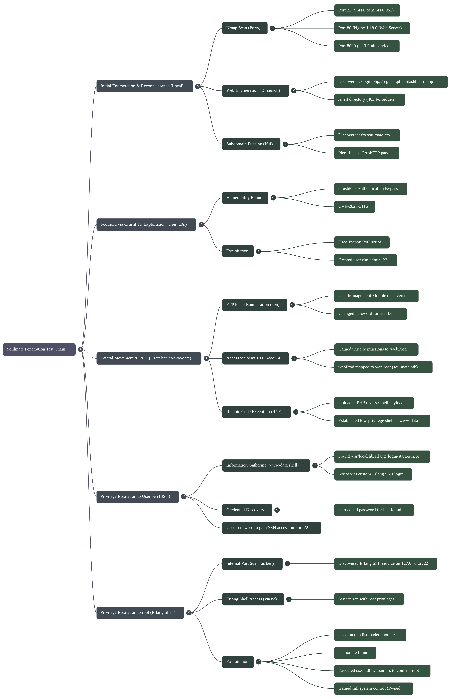

### Initial Enumeration 🕵️‍♂️

The reconnaissance phase began with an **Nmap** scan to identify the network services running on the target machine `soulmate.htb`.

```
(myenv)─(xpl0riz0n__XPl0RIz0n)-[~/ctf_OpenVPN] nmap soulmate.htb -A
PORT     STATE SERVICE   VERSION
22/tcp   open  ssh       OpenSSH 8.9p1 Ubuntu 3ubuntu0.13 (Ubuntu Linux; protocol 2.0)
80/tcp   open  http      nginx 1.18.0 (Ubuntu)
8000/tcp open  http-alt?
```

The results showed three open ports:

  * **Port 22:** Running **OpenSSH 8.9p1**, which indicated the possibility of remote shell access if valid credentials were found.
  * **Port 80:** Running **Nginx 1.18.0** for a web server, which served the main `soulmate.htb` website. The `http-title` was `Soulmate - Find Your Perfect Match`, suggesting a dating-themed web application.
  * **Port 8000:** Running an unknown `http-alt` service, possibly another web server or API. The OS details suggested it was a Linux kernel version between 4.15 and 5.19.

-----

### Web Enumeration & Subdomain Fuzzing 🌐

With the web server identified, the next step was to explore the directories and files on the main website using **Dirsearch**.

```
(myenv)─(xpl0riz0n__XPl0RIz0n)-[~/ctf_OpenVPN] dirsearch -u 'http://soulmate.htb'
[21:15:24] 301 -   178B - /assets  ->  http://soulmate.htb/assets/
[21:15:28] 302 -     0B - /dashboard.php  ->  /login
[21:15:33] 200 -   16KB - /index.php
[21:15:35] 200 -    8KB - /login.php
[21:15:35] 302 -     0B - /logout.php  ->  login.php
[21:15:40] 302 -     0B - /profile.php  ->  /login
[21:15:41] 200 -   11KB - /register.php
[21:15:42] 301 -   178B - /shell  ->  http://soulmate.htb/shell/
[21:15:42] 403 -   564B - /shell/
```

The scan returned several files and directories, including `/login.php`, `/register.php`, and `/dashboard.php`, which are typical for a web application requiring user authentication. The `/shell` directory was a notable find, but it returned a `403 Forbidden` status code, indicating it was protected from direct access.

Given the potential for a larger attack surface, a **subdomain fuzzing** attack was executed using `ffuf` to check for other hosted websites.

```
(myenv)─(xpl0riz0n__XPl0RIz0n)-[~/ctf_OpenVPN] ffuf -u 'http://soulmate.htb/' -H 'Host: FUZZ.soulmate.htb' -w /usr/share/fuzzDicts/subdomainDicts/main.txt -fw 4
ftp                     [Status: 302, Size: 0, Words: 1, Lines: 1, Duration: 209ms]
```

The subdomain `ftp.soulmate.htb` was discovered. A `302` redirect indicated that this subdomain was an alias or redirecting to another service. A manual visit to this subdomain showed a web-based FTP panel, which appeared to be a product called **CrushFTP**.


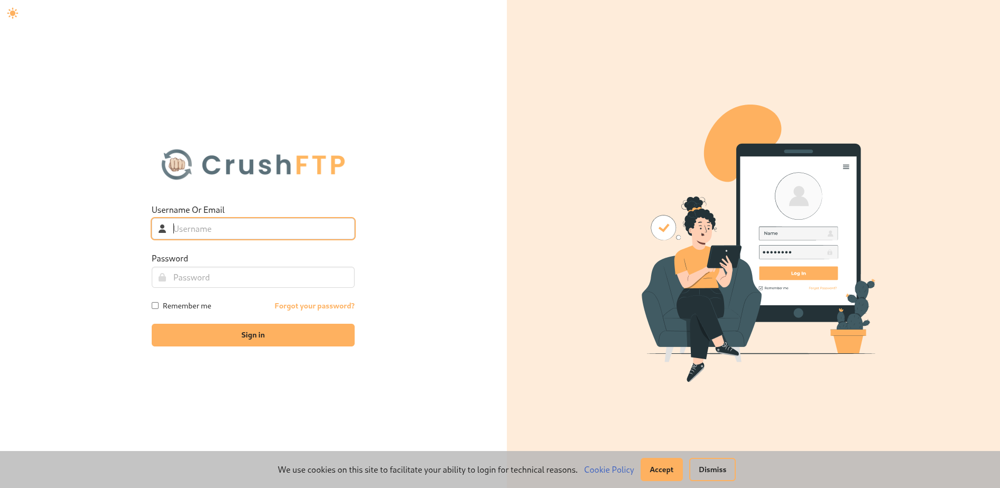


-----

### Exploiting CrushFTP to Gain a Foothold 💥

Searching for vulnerabilities in "CrushFTP" revealed a recent authentication bypass vulnerability, **CVE-2025-31161**, which allowed an attacker to create a new user account without proper authentication. A public proof-of-concept (PoC) script was available for this exploit.

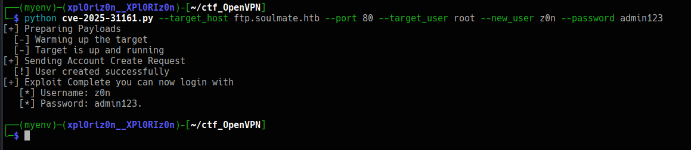

The Python PoC script was used to create a new user named `z0n` with the password `admin123`.

```
(myenv)─(xpl0riz0n__XPl0RIz0n)-[~/ctf_OpenVPN] python cve-2025-31161.py --target_host ftp.soulmate.htb --port 80 --target_user root --new_user z0n --password admin123
[+] Exploit Complete you can now login with
[*] Username: z0n
[*] Password: admin123
```


Successfully logging into the CrushFTP panel with the newly created credentials, a user management module was discovered. 


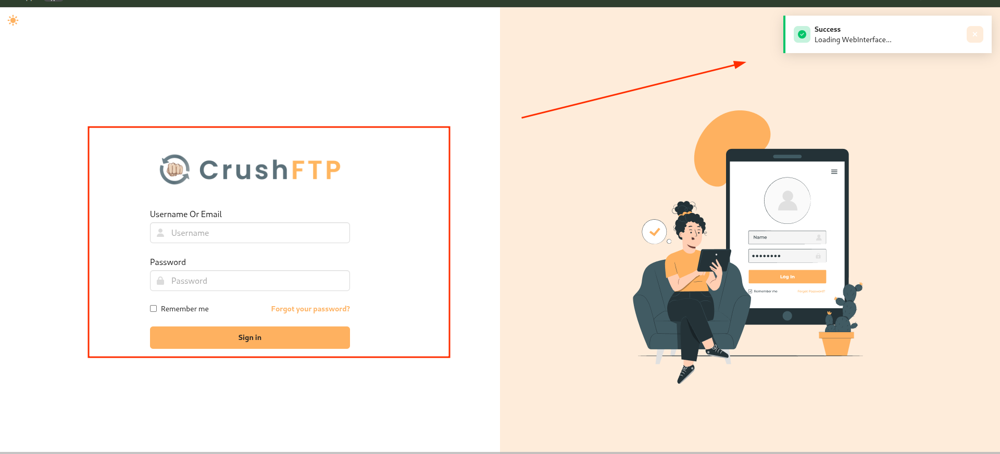


Although the `z0n` user had no permissions to access files,

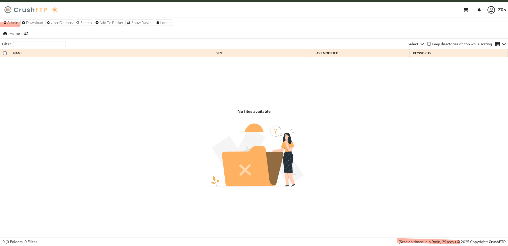 

the user management module allowed for modifying other users' passwords.

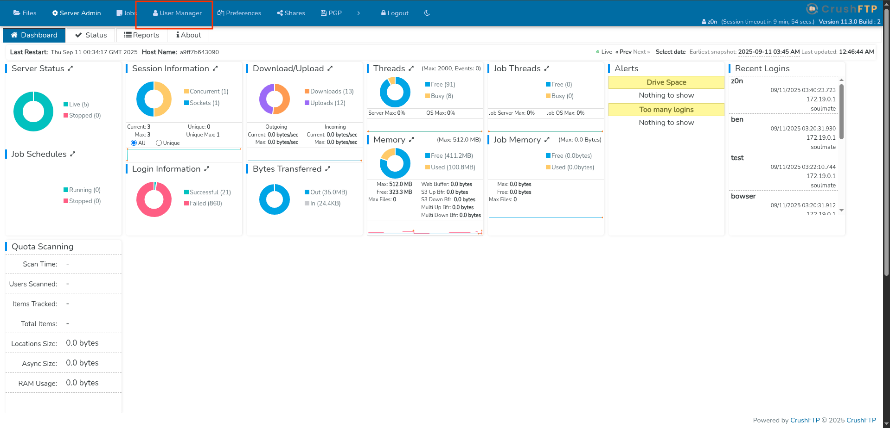 

The password for the user `ben` was changed.

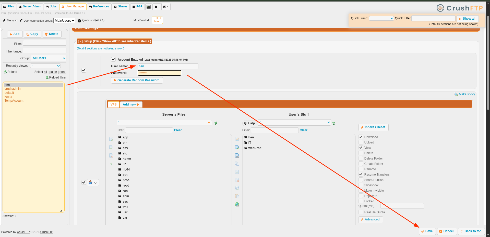


After changing the password, 

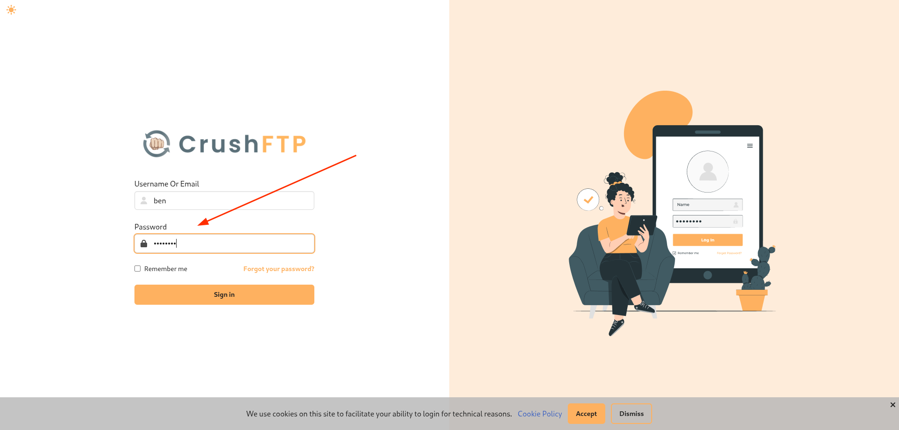

logging in as `ben` revealed access to the `webProd` directory, which was mapped to the web root of `soulmate.htb`. This was a critical finding as it allowed for a remote code execution (RCE) payload to be uploaded. A simple PHP reverse shell was uploaded to this directory.

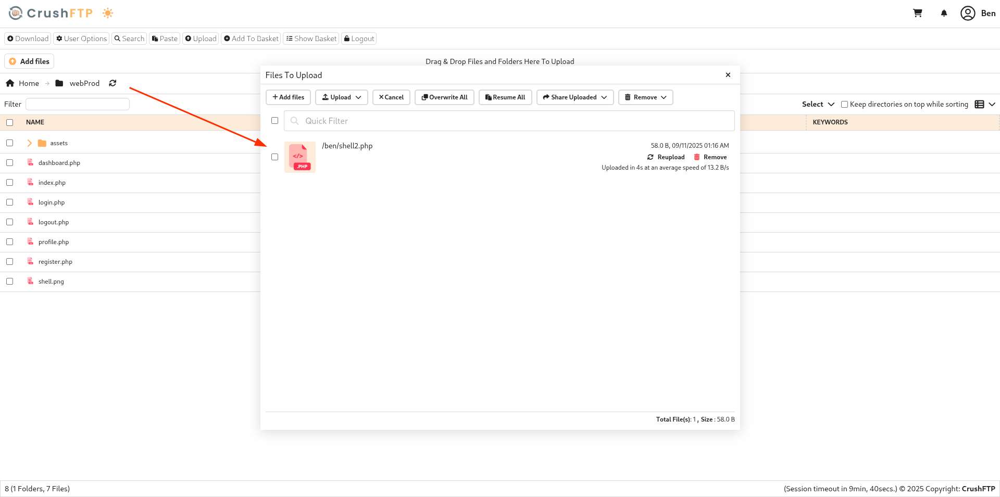

Navigating to the reverse shell's URL in a browser triggered the payload, and a low-privilege shell was established as the **`www-data`** user.


-----

### Privilege Escalation to `ben` 🚶‍♂️

Inside the `www-data` shell, the file system was explored. A particularly interesting file was found at `/usr/local/lib/erlang_login/start.escript`.

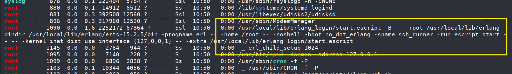

 This script appeared to be a custom SSH login script written in Erlang.

```bash
www-data@soulmate:/tmp$ cat /usr/local/lib/erlang_login/start.escript
...
{user_passwords, [{"ben", "HouXXXXXXXXXXXXX"}]},
...
```

The script contained a hardcoded password for the `ben` user: `HouXXXXXXXXXXXXX`. This password was then used to log into the main SSH service on port 22, successfully gaining a shell as the user `ben`.

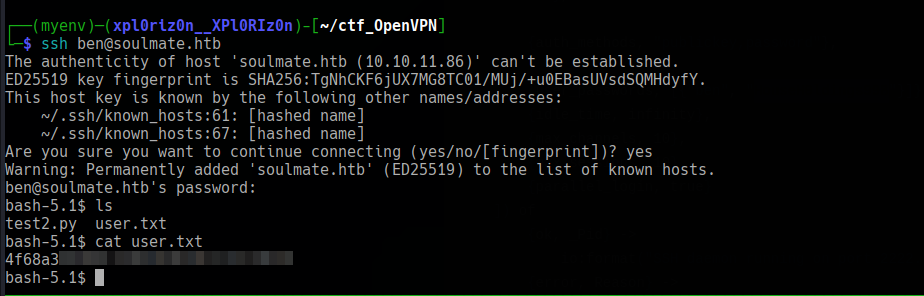

-----

### Privilege Escalation to `root` 👑

As the `ben` user, the `ss` command was used to check the listening network sockets to find any potential internal services.

```bash
ben@soulmate:~$ ss -tuln
...
tcp           LISTEN         0              5                          127.0.0.1:2222                       0.0.0.0:*
...
```

```bash
ben@soulmate:~$ ssh ben@127.0.0.1 -p 2222
...
```

The output showed an Erlang-based SSH service listening on port **2222**, but only on the loopback interface (`127.0.0.1`). This meant it could only be accessed from the machine itself.

A direct connection was attempted using `nc 127.0.0.1 2222`, which confirmed the service was active and responded with an Erlang shell prompt `(ssh_runner@soulmate)1>`.

Inside the Erlang shell, the `m().` command was executed to list all loaded modules. The **`os`** module was listed, a key finding as it is used for interacting with the operating system.

```erlang
(ssh_runner@soulmate)2> m().
Module                File
<skip>
os                    /usr/local/lib/erlang/lib/kernel-10.2.5/ebin/os.beam
<skip>
```

With the `os` module available, it was possible to execute arbitrary shell commands using the `os:cmd()` function. To check the current user's privileges, `whoami` was executed.

```erlang
(ssh_runner@soulmate)2> os:cmd("whoami").
"root\n"
```

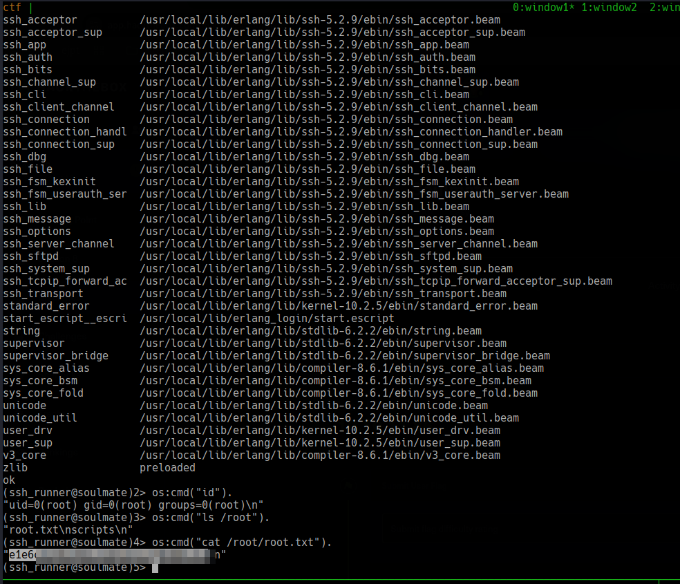

The output returned **`root`**, indicating that the Erlang SSH service was running with `root` privileges. This allowed for full control over the system as `root` and the capture of the final flag.

**Pwned! Soulmate**


-->