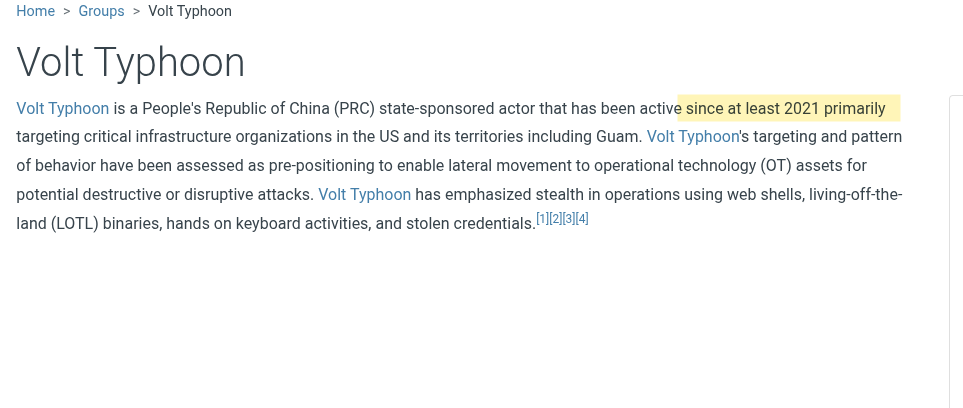
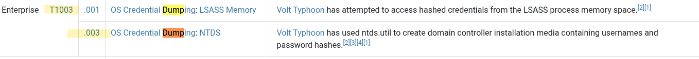
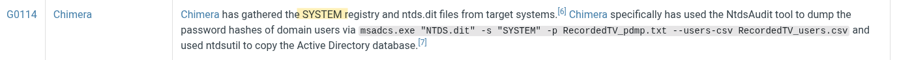
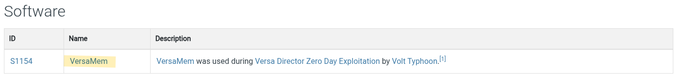
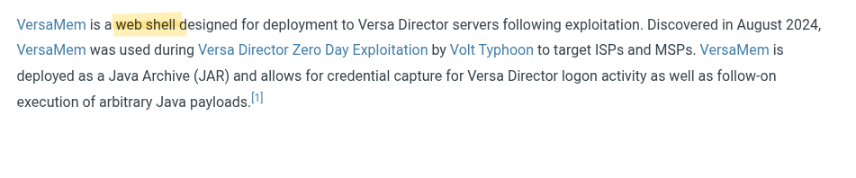
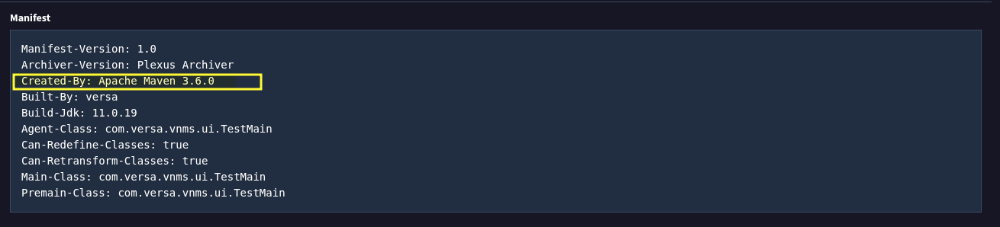
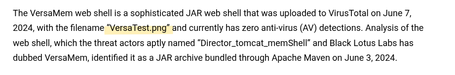
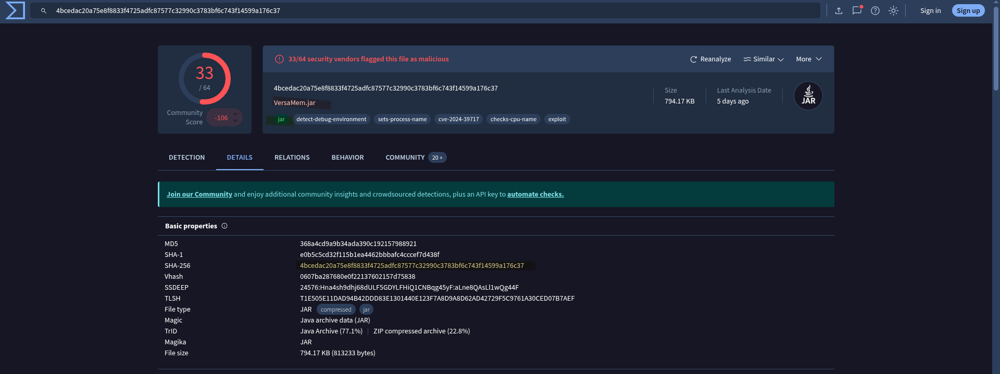
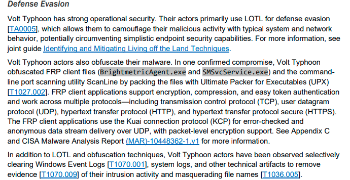
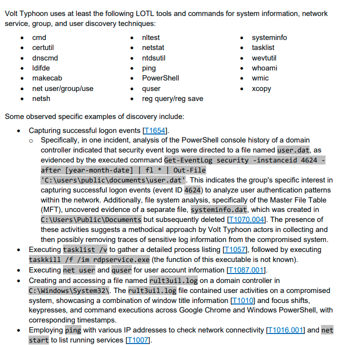

# ElectricBreeze-1

```
Difficulty: Very Easy
Research: Group  
Hints: True
```

#### Initial Discovery & Adversary Profile

Our journey begins with the MITRE ATT&CK framework, which identifies Volt Typhoon (G1017) as a state-sponsored threat actor from China. Active since at least **2021**, their primary target is U.S. critical infrastructure. This group is known for its patience and sophisticated techniques, often pre-positioning themselves for future, more disruptive attacks.




#### Credential Dumping: The Path to Deeper Access

A key technique used by Volt Typhoon is credential dumping. The attackers have two primary methods for this:

LSASS Memory Access (T1003.001): They attempt to access the lsass.exe process to retrieve hashed credentials stored in memory. This is a common but effective way to get a foothold.



NTDS Database Access (**T1003.003**): The second technique, with the Attack ID T1003.003, involves targeting the Active Directory database file, NTDS.dit. This file contains crucial information about user accounts, computers, and groups, including password hashes. To decrypt this database, the threat actor also needs to obtain the HKEY_LOCAL_MACHINE\SYSTEM registry hive.




#### The 2024 Campaign: A Zero-Day Exploit

In a recent campaign, specifically in June 2024, Volt Typhoon was observed exploiting a zero-day vulnerability in Versa Director servers. The attackers deployed a specialized piece of malware for this purpose: a web shell named VersaMem.





This web shell, disguised as a Java Archive (JAR) file, had the filename VersaTest.png and a SHA256 hash of **4bcedac20a75e8f8833f4725adfc87577c32990c3783bf6c743f14599a176c37**. An analysis of the file's manifest on VirusTotal revealed that it was created by **Apache Maven 3.6.3**.






Once executed, VersaMem attached to the primary Apache Tomcat process, where it would capture plaintext user credentials and store them locally at **/tmp/.temp.data**.


This vulnerability was later assigned the CVE identifier CVE-2024-39717, which is a crucial piece of information for organizations to patch their systems and prevent further exploitation.

#### Evasion Techniques: Blending In

According to a CISA document, Volt Typhoon's main strategy for defense evasion is Living Off the Land (**LOTL**). This technique involves using native system tools and processes, which makes their activities difficult to distinguish from legitimate system administration and helps them avoid detection.




The CISA document also provides a specific example of this. In one incident, analysis of a PowerShell command indicated that event logs of successful logon events (event ID 4624) were being directed to a file named user.dat, which was likely used to analyze user authentication patterns within the network.



**Thanks for the read !**